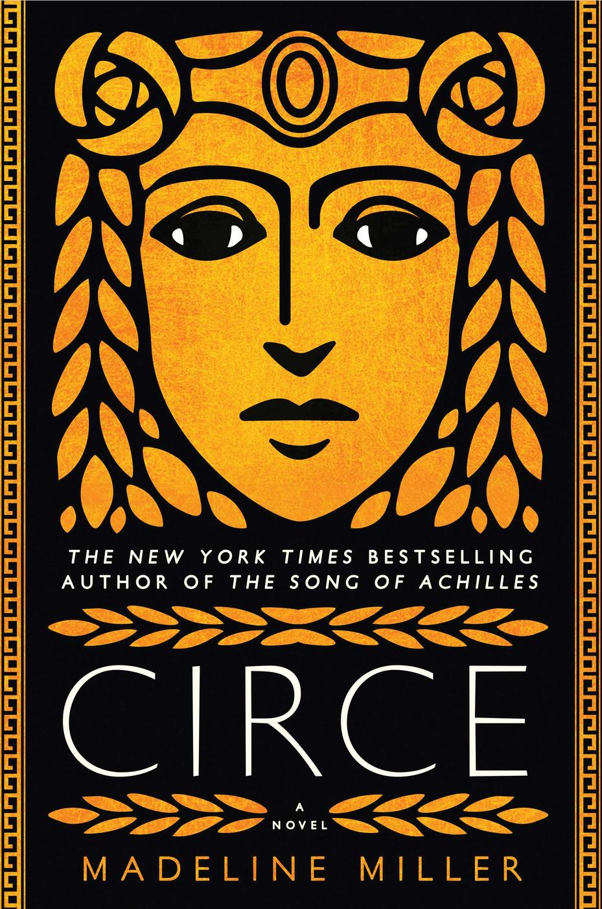
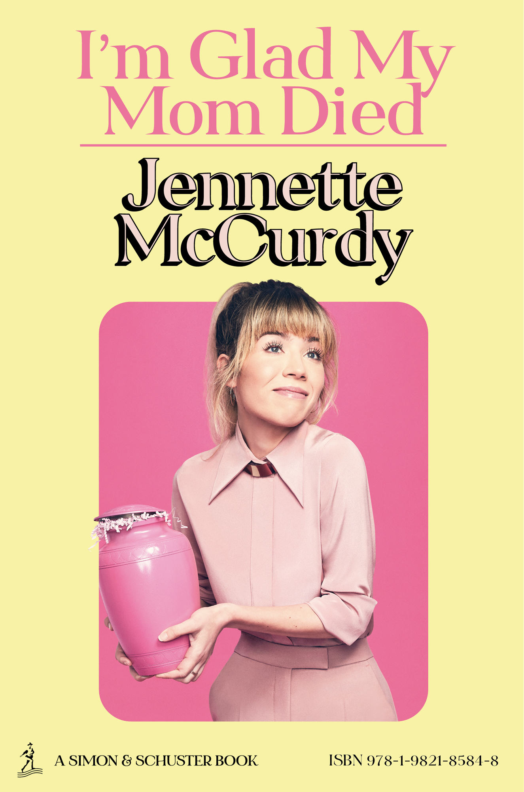

## BookTok

#### [A Court of Mist and Fury (A Court of Thorns and Roses, #2)](https://books.rob.me.uk/book/2151)

##### trauma · healing · romantasy
##### Sarah J. Maas
##### Fiction, 2016, 624 pages

Swapping the claustrophobic fairy-tale elements of its predecessor for a sprawling, emotionally rich exploration of PTSD and recovery, this installment completely redefines the series. It hits the perfect sweet spot for high-fantasy readers looking for intense slow-burn chemistry paired with expansive, glittering world-building.

Trapped in a suffocating bargain with the most feared High Lord in Prythian, Feyre must learn to weaponize her shattered spirit. War is looming on the horizon, and her only chance of survival means fully embracing the terrifying, intoxicating darkness of the Night Court.

#### [The Cruel Prince (The Folk of the Air, #1)](https://books.rob.me.uk/book/2152)

##### ruthless · fae · political
##### Holly Black
##### Fiction, 2018, 370 pages

Dripping with venom and dark folklore, this razor-sharp novel strips away the romantic veneer of the fae to expose a society built on cruelty and deception. It is practically custom-engineered for readers who crave morally grey protagonists and thrive on high-stakes, backstabbing court intrigue.

Forget everything you know about sparkling fairies. To survive among immortal monsters who despise her humanity, a mortal girl named Jude decides to become far more dangerous than the creatures tormenting her, launching a deadly campaign of espionage and betrayal.

#### [Six of Crows (Six of Crows, #1)](https://books.rob.me.uk/book/2153)

##### heist · gritty · syndicate
##### Leigh Bardugo
##### Fiction, 2015, 465 pages

Anchored by a brilliantly damaged ensemble cast, this dark fantasy caper perfectly balances fast-paced action with profound character studies of trauma and loyalty. Anyone fascinated by intricate puzzle-box plots and razor-sharp, cynical banter will find themselves absolutely addicted to the streets of Ketterdam.

Six dangerous outcasts. One impossible heist. A criminal prodigy is offered a fortune to break into an impenetrable military stronghold, but to pull it off, he has to keep his crew of thieves, spies, and killers from murdering each other first.

#### [A Court of Thorns and Roses (A Court of Thorns and Roses, #1)](https://books.rob.me.uk/book/2160)

##### curses · survival · retelling
##### Sarah J. Maas
##### Fiction, 2015, 416 pages

Grounded in a classic *Beauty and the Beast* framework, this immersive debut slowly peels back the layers of a magical, deeply prejudiced world. It serves as an incredibly accessible gateway drug for contemporary readers looking to transition into epic fantasy without sacrificing romance.

When a desperate nineteen-year-old huntress kills a wolf in the winter woods, a terrifying beast arrives to demand retribution. Dragged into a treacherous, magical land she only knows from whispered legends, she discovers her captor is hiding a lethal secret behind a jeweled mask.

#### Bright Burns the Flame (Bright Burns the Flame, #1)
##### elemental · oppressive · resistance
##### Angelina J. Steffort
##### Fiction, 2021, 384 pages

Operating with a clean, classic approach to chosen-one tropes, this story relies on immediate environmental tension and a clear dichotomy between an oppressive state and hidden magic. Fans of elemental power systems and slow-burn underground rebellions will sink right into its pacing.

In a kingdom where magic is an automatic death sentence, a young woman is forced to hide her growing powers in plain sight. As the ruling class tightens its violent grip, her desperate choices might just spark the revolution her people have been praying for.

#### Fourth Wing (The Empyrean, #1)
##### dragons · academy · brutal
##### Rebecca Yarros
##### Fiction, 2023, 528 pages

Merging the cutthroat military tension of a survival thriller with explosive romantic chemistry, this massive blockbuster simply refuses to let you catch your breath. It is the ultimate adrenaline rush for readers seeking lethal school settings and unapologetic, cinematic escapism.

Welcome to a war college where graduation is rare and the dragons are perfectly willing to incinerate cadets who show weakness. A frail scribe is forced into the elite rider quadrant, thrusting her into a vicious daily fight for her life against both beasts and classmates.

#### [Shatter Me (Shatter Me, #1)](https://books.rob.me.uk/book/2173)

##### psychological · dystopian · superpowers
##### Tahereh Mafi
##### Fiction, 2011, 338 pages

Written with an intense, fractured prose style utilizing crossed-out thoughts and frantic metaphors, this narrative vividly mirrors the isolation of its protagonist. It is an ideal pick for dystopian enthusiasts who prioritize deep emotional psychology over standard world-building.

Locked in a sterile cell for nearly a year, Juliette knows her touch is lethal, but she has no idea why. When the ruthless Reestablishment decides they want to use her as a living weapon, she must finally choose between submitting to a monster or fighting for her freedom.

#### [The Lightning Thief (Percy Jackson and the Olympians, #1)](https://books.rob.me.uk/book/1689)

##### mythology · humorous · quest
##### Rick Riordan
##### Fiction, 2005, 377 pages

Infusing ancient Greek lore with a deeply sarcastic, modern teenage voice, this foundational middle-grade adventure remains a masterclass in pacing and voice. Readers of absolutely any age will instantly connect with its brilliant blend of mythic monsters and chaotic highway road trips.

Twelve-year-old Percy Jackson is just trying to survive boarding school, but his math teacher just turned into a monster and tried to kill him. Now, accused of stealing Zeus's master lightning bolt, he has ten days to cross the United States, battle angry gods, and clear his name.

#### [A Court of Wings and Ruin (A Court of Thorns and Roses, #3)](https://books.rob.me.uk/book/2174)

##### warfare · alliances · culmination
##### Sarah J. Maas
##### Fiction, 2017, 705 pages

Transitioning the narrative from intimate court politics to continent-spanning military strategy, this sprawling epic delivers massive emotional payoffs and high-octane battle sequences. Fans of grand-scale fantasy wars and intricate diplomatic maneuvers will find this a deeply satisfying conclusion to the original arc.

With a devastating army marching toward their borders, Feyre returns to the treacherous Spring Court to play a lethal game of deception. If she fails to secure unlikely alliances and expose the king's weaknesses from the inside, her entire world will burn to ash.

#### [The Song of Achilles](https://books.rob.me.uk/book/2175)

##### poetic · tragedy · classical
##### Madeline Miller
##### Fiction, 2011, 378 pages

This luminous, literary retelling breathes profound psychological depth and haunting tenderness into the dusty armor of the Trojan War. It is essential, devastating reading for lovers of historical fiction who want a fiercely intimate romance anchored by the heavy weight of fate.

Exiled in disgrace, the awkward young prince Patroclus forms an unbreakable bond with Achilles, the golden son of a sea goddess. But as the drums of war call them to the shores of Troy, they are forced to confront a prophecy that demands the ultimate sacrifice for eternal glory.

#### [The Inheritance Games (The Inheritance Games, #1)](https://books.rob.me.uk/book/2290)

##### puzzles · billionaires · twisty
##### Jennifer Lynn Barnes
##### Fiction, 2020, 376 pages

Operating like a high-speed literary escape room, this sleek thriller thrives on intricate riddles, secret passageways, and constant misdirection. Armchair detectives and fans of complex, wealthy-family dysfunction will be absolutely riveted by the rapid-fire logic puzzles.

Avery Grambs was scraping by in high school until an eccentric billionaire she’s never met died and left her his entire fortune. To inherit the cash, she has to move into a sprawling, trap-filled mansion alongside the dangerous, newly disinherited family who wants her gone.

#### [A Good Girl's Guide to Murder (A Good Girl's Guide to Murder, #1)](https://books.rob.me.uk/book/2285)

##### true-crime · podcast · investigative
##### Holly Jackson
##### Fiction, 2019, 433 pages

Utilizing interview transcripts, digital maps, and police logs to break up the prose, this incredibly smart procedural feels as authentic as a top-tier podcast. It is a brilliant, highly engaging ride for readers who want to actively solve the case alongside the protagonist.

Five years ago, a tragic murder-suicide closed the book on a local high school tragedy—or so the police thought. Armed with a senior project prompt and a refusal to let sleeping dogs lie, a bright teenager begins asking questions that someone in town is desperate to keep quiet.

#### [The Seven Husbands of Evelyn Hugo](https://books.rob.me.uk/book/2291)

##### glamorous · hollywood · scandalous
##### Taylor Jenkins Reid
##### Fiction, 2017, 389 pages

This captivating historical drama dissects the ruthless machinery of the mid-century studio system, hiding a profoundly moving romance beneath layers of synthetic glamour. Readers craving morally complex heroines and behind-the-scenes celebrity exposés will devour this in a single sitting.

Aging, reclusive cinematic icon Evelyn Hugo is finally ready to reveal the unvarnished truth about her scandalous life and her seven high-profile marriages. Bypassing major publications, she selects a completely unknown reporter to write the definitive biography, a choice that hides a devastating final secret.

#### [Caraval (Caraval, #1)](https://books.rob.me.uk/book/2176)

##### immersive · illusion · whimsical
##### Stephanie Garber
##### Fiction, 2017, 407 pages

Drenched in sensory details and carnival aesthetics, this narrative operates like a gorgeous, unpredictable fever dream where logic is constantly subverted by magic. It is perfect for fantasy lovers who prioritize lush, atmospheric world-building over rigid magical rule systems.

Welcome to Caraval, a legendary, once-a-year performance where the audience participates in a deadly game of illusion. Scarlett finally receives an invitation, but when her sister is kidnapped by the show's mastermind, she realizes this year's game is a terrifying reality she must win to survive.

#### [From Blood and Ash (Blood and Ash, #1)](https://books.rob.me.uk/book/2154)

##### forbidden · duty · vampires
##### Jennifer L. Armentrout
##### Fiction, 2020, 622 pages

Blending traditional chosen-one fantasy tropes with explosive, tension-filled romantic dynamics, this thick volume lays the groundwork for a massive, lore-heavy universe. It caters perfectly to readers who want a fierce, isolated heroine breaking out of a deeply oppressive religious society.

Poppy’s entire existence as the Maiden is defined by strict isolation, waiting for a divine ascension that will supposedly save her realm. Her restricted world fractures completely when a sharp-witted new royal guard enters her life, making her question every rule she has ever been forced to obey.

#### [The Wicked King (The Folk of the Air, #2)](https://books.rob.me.uk/book/2292)

##### betrayal · underwater · machiavellian
##### Holly Black
##### Fiction, 2019, 336 pages

Doubling down on the psychological chess matches that made the debut so addictive, this sequel is a masterclass in ruthless political maneuvering and shifting alliances. It is an absolute triumph for readers who prefer their romance steeped in paranoia and calculated cruelty.

After pulling off a shocking coup, Jude finds that keeping power is infinitely harder than seizing it. Bound to the volatile King Cardan, she must navigate assassination attempts and an impending war from the deep sea, all while struggling to control her own treacherous heart.

#### House of Earth and Blood (Crescent City, #1)
##### urban · noir · mythology
##### Sarah J. Maas
##### Fiction, 2020, 803 pages

This colossal modern fantasy constructs a neon-lit, high-tech city populated by archangels, shifters, and demons, treating magical murders like a gritty police procedural. It is an immersive, detail-heavy powerhouse for readers who want epic mythological stakes anchored in a contemporary setting.

Bryce Quinlan’s glamorous city life shatters the night a demon slaughters her closest friends. Forced to team up with a stoic, enslaved fallen angel, she dives into a terrifying corporate conspiracy that threatens to tear the entire city of Lunathion apart from the inside.

#### The Queen of Nothing (The Folk of the Air, #3)
##### exile · crown · resolution
##### Holly Black
##### Fiction, 2019, 300 pages

Bringing the razor-sharp trilogy to a tight, focused close, this installment forces its characters out of the shadows and into direct, violent confrontation. It rewards invested readers with a deeply satisfying culmination of character growth, proving that power always comes with a bloody price tag.

Banished to the mortal realm, the exiled Queen of Faerie bides her time until a threat against her sister forces her back into the magical court. Stepping back into a web of dark politics, Jude discovers Elfhame is on the brink of war, and a terrifying curse has been unleashed.

#### [Powerless (The Powerless Trilogy, #1)](https://books.rob.me.uk/book/2208)

##### tournament · deception · survival
##### Lauren Roberts
##### Fiction, 2023, 532 pages

Revitalizing the classic survival-tournament structure, this high-energy debut leans heavily into electric, enemies-to-lovers banter while maintaining deadly stakes. If you love watching underpowered protagonists outsmart highly trained elite warriors, this gripping narrative hits every right note.

In a kingdom that actively executes the ordinary, Paedyn survives the slums by faking psychic abilities. Her ruse works perfectly until she accidentally saves a royal prince, thrusting her directly into a brutal, televised competition designed to weed out the weak with lethal force.

#### [Shadow and Bone (Shadow and Bone, #1)](https://books.rob.me.uk/book/2155)

##### grisha · fold · darkness
##### Leigh Bardugo
##### Fiction, 2012, 358 pages

Establishing a rich, Tsar-inspired aesthetic completely separate from traditional Western European fantasy, this novel lays the foundation for an expansive magical universe. It remains an excellent, fast-paced entry point for young adult readers seeking classic light-versus-dark power dynamics.

A terrifying swath of impenetrable darkness swarming with monsters splits the nation of Ravka in two. When a lowly mapmaker unleashes a dormant, legendary power to save her best friend, she is swept into the glamorous, dangerous world of the magical military elite.

#### [It Ends with Us (It Ends with Us, #1)](https://books.rob.me.uk/book/2156)

##### contemporary · emotional · boundaries
##### Colleen Hoover
##### Fiction, 2016, 385 pages

Handling complex cycles of domestic trauma with an unflinching, compassionate lens, this emotionally heavy novel subverts expected romance tropes to focus on personal autonomy. It is a powerful, tear-jerking read for anyone seeking a realistic portrait of the agonizing choices required to break generational patterns.

Lily Bloom worked hard to escape her difficult childhood, finally opening her own business and falling for a brilliant neurosurgeon. But as his behavior triggers haunting memories of her past, the sudden reappearance of her first love forces her into the hardest decision of her life.

#### [The Selection (The Selection, #1)](https://books.rob.me.uk/book/2157)

##### competition · castes · romance
##### Kiera Cass
##### Fiction, 2012, 336 pages

Offering a highly entertaining, glittering escape, this novel blends the social stratification of a dystopian society with the glamorous drama of a reality television show. Readers looking for a light, addictive binge-read full of ballgowns and romantic triangles will be thoroughly charmed.

For thirty-five girls, the Selection is the chance of a lifetime to escape their rigid caste and compete for the heart of a handsome prince. But for America Singer, being chosen is a nightmare that forces her to abandon her secret love and fight for a crown she doesn't want.

#### [Throne of Glass (Throne of Glass, #1)](https://books.rob.me.uk/book/2179)

##### assassin · tournament · epic
##### Sarah J. Maas
##### Fiction, 2012, 404 pages

Starting as a contained, castle-bound mystery before steadily expanding its scope, this inaugural novel introduces one of modern fantasy's most confident, lethal protagonists. It is perfect for readers who enjoy watching a highly competent character peel back the layers of a deeply corrupt royal court.

Dragged from a brutal slave camp, the continent's most notorious teenage assassin is offered a dangerous deal by the Crown Prince. If she can defeat twenty-three killers, thieves, and warriors in a lethal competition, she will serve as the King’s Champion and eventually earn her absolute freedom.

#### [Divergent (Divergent, #1)](https://books.rob.me.uk/book/1716)

##### factions · simulation · courage
##### Veronica Roth
##### Fiction, 2011, 487 pages

Driven by intense psychological tests and grueling physical training, this dystopian touchstone examines the dangers of extreme social conformity and systemic control. It continues to grip readers who want fast-paced, high-stakes science fiction where every choice carries a permanent consequence.

In a futuristic Chicago, society is strictly divided into five factions dedicated to specific virtues. When sixteen-year-old Tris takes her aptitude test, she discovers she possesses a rare, dangerous anomaly that the government considers a threat to their entire social order.

#### [A Court of Silver Flames (A Court of Thorns and Roses, #5)](https://books.rob.me.uk/book/2159)

##### redemption · training · intense
##### Sarah J. Maas
##### Fiction, 2021, 757 pages

Pivoting away from diplomatic war rooms to focus fiercely on physical empowerment and mental health recovery, this adult-leaning volume is unyielding in its emotional intensity. It is tailored for mature readers who appreciate gritty, rage-fueled character studies wrapped in searing, high-passion romance.

Nesta Archeron is drowning in trauma and burning bridges in the Night Court until she is given an ultimatum: train in the mountains or face exile. Forced into close quarters with a battle-hardened warrior who matches her fiery temper, she must learn to wield a blade to slay her internal demons.

#### [A Court of Frost and Starlight (A Court of Thorns and Roses, #4)](https://books.rob.me.uk/book/2160)

##### transitional · cozy · rebuilding
##### Sarah J. Maas
##### Fiction, 2018, 229 pages

Acting as a peaceful, character-driven bridge between massive narrative arcs, this novella steps away from battlefield stakes to focus on the quiet logistics of post-war recovery. Dedicated fans will deeply appreciate this warm, slice-of-life look at the Night Court healing its scars.

The war has ended, and the Winter Solstice is finally approaching, bringing a much-needed reprieve to the battered residents of Velaris. But beneath the festive celebrations, deep emotional wounds and shifting political responsibilities prove that peace is sometimes harder to navigate than conflict.

#### [Red Queen (Red Queen, #1)](https://books.rob.me.uk/book/2161)

##### class-divide · superhuman · betrayal
##### Victoria Aveyard
##### Fiction, 2015, 383 pages

Fusing X-Men style power mechanics with classic palace intrigue, this high-stakes thriller is a masterclass in tension and shifting loyalties. If you enjoy plots where absolute power corrupts absolutely and trusting anyone is a fatal mistake, this rebellion story is a perfect match.

Mare Barrow is a poor, red-blooded thief in a world ruled by a silver-blooded elite with god-like magical abilities. When she accidentally displays an impossible power of her own, the king forces her to masquerade as a lost noble princess to suppress an impending revolution.

#### [Better Than the Movies (Better Than the Movies, #1)](https://books.rob.me.uk/book/2203)

##### cinematic · rom-com · fake-dating
##### Lynn Painter
##### Fiction, 2021, 356 pages

Overflowing with nostalgic nods to classic romantic comedies, this bright, witty contemporary novel executes its tropes with absolute perfection. It is a delightfully comforting, laugh-out-loud read for anyone who has ever dreamed of their life having a perfectly curated movie soundtrack.

Liz Buxbaum has always viewed the world through the lens of a classic rom-com, and her childhood crush returning to town is her ultimate meet-cute. To get his attention, she teams up with her annoying, infuriatingly handsome next-door neighbor to orchestrate the perfect cinematic setup.

#### [Circe](https://books.rob.me.uk/book/1948)

##### mythological · feminist · exile
##### Madeline Miller
##### Fiction, 2018, 393 pages

Written in sweeping, lyrical prose, this literary masterpiece grants profound autonomy and psychological realism to a figure long sidelined as a mere villain in men's stories. It is a stunning, slow-burning triumph for readers who want to explore classical antiquity through a fiercely independent, feminist lens.

Born a strange, unpromising nymph, Circe discovers a dangerous affinity for witchcraft that threatens the very gods themselves. Banished by Zeus to a remote island, she hones her dark magic, crosses paths with legendary heroes, and ultimately chooses whether she belongs with the deities she was born to or the mortals she has grown to love.

#### Terms and Conditions Apply: Social Media Apps: Promises Vs Reality
##### non-fiction · technology · tracking
##### R. Suleman
##### Non-fiction, 2021, 250 pages

This sharp, analytical guide dissects the hidden architecture of modern digital platforms, exploring exactly how user attention is commodified. It is an essential, eye-opening read for anyone seeking to understand the psychological mechanisms and data-tracking algorithms running silently in the background of their phone.

Behind the seamless interface of your favorite social app lies a multi-billion dollar machine engineered to predict your habits and monetize your time. Step away from the screen and discover the sobering reality of what you are actually agreeing to when you click 'Accept'.

#### [Once Upon a Broken Heart (Once Upon a Broken Heart, #1)](https://books.rob.me.uk/book/2178)

##### whimsical · curses · dangerous
##### Stephanie Garber
##### Fiction, 2021, 408 pages

Drenched in vibrant, shifting aesthetics and unpredictable folklore, this narrative trades rigid magic systems for a beautifully chaotic, dream-like atmosphere. It targets readers who crave fast-moving, romantic fantasies where every interaction feels like a beautiful, painted trap.

Desperate to stop the love of her life from marrying someone else, Evangeline Fox strikes a terrible bargain with the charismatic, immortal Prince of Hearts. He demands three kisses at a time and place of his choosing, pulling her into a deadly game where happily ever after is never guaranteed.

#### [Kingdom of Ash (Throne of Glass, #7)](https://books.rob.me.uk/book/2179)

##### epic · culmination · sacrifice
##### Sarah J. Maas
##### Fiction, 2018, 984 pages

This colossal finale masterfully ties together dozens of character arcs across multiple continents, delivering relentless action and profound emotional devastation. It is the ultimate reward for dedicated readers who love grand-scale military strategies, ancient magic, and heroes pushed past their absolute breaking points.

Locked in an iron coffin and subjected to unimaginable torture, Aelin Galathynius relies entirely on her broken will to survive. Meanwhile, her scattered allies must launch a desperate, multi-front war to save a world that is rapidly being swallowed by darkness.

#### [The Book Thief](https://books.rob.me.uk/book/366)

##### historical · literacy · haunting
##### Markus Zusak
##### Fiction, 2005, 552 pages

Narrated by Death itself, this incredibly unique structural masterpiece uses the quiet power of literacy to offset the unimaginable horrors of World War II. It is an unforgettable, deeply moving experience for readers who appreciate poetic prose and stories focused on the resilience of ordinary citizens.

In the dark heart of Nazi Germany, a young foster girl named Liesel discovers a dangerous habit of stealing books to share with her neighbors. As the bombs begin to fall, the words she reads become the only thing tethering her family to their humanity.

#### [The Invisible Life of Addie LaRue](https://books.rob.me.uk/book/2180)

##### immortality · art · memory
##### V.E. Schwab
##### Fiction, 2020, 442 pages

This atmospheric, slow-burning historical fantasy reads like a haunting love letter to art, examining how an invisible presence can subtly alter the course of human history. Readers who value quiet, philosophical romances and deep reflections on the terror of absolute isolation will be completely captivated.

In 1714 France, a desperate young woman makes a Faustian bargain for eternal freedom, only to be cursed to be instantly forgotten by everyone she meets. Three hundred years later, she steps into a hidden bookstore in New York and meets a young man who remembers her name.

#### [Punk 57](https://books.rob.me.uk/book/2053)

##### contemporary · hidden-identity · high-school
##### Penelope Douglas
##### Fiction, 2016, 343 pages

Tackling severe peer pressure and the toxic realities of social conformity, this gritty New Adult romance is unapologetically intense and fraught with high-school friction. It is perfect for mature readers looking for an enemies-to-lovers dynamic driven by dark secrets and explosive, raw chemistry.

Misha and Ryen have been anonymous pen pals for seven years, operating under a strict rule to never meet in person or look each other up online. When a twist of fate throws them into the same high school, Misha realizes the girl he poured his soul out to is a cruel, superficial bully he absolutely despises.

#### [The Wrath and the Dawn (The Wrath and the Dawn, #1)](https://books.rob.me.uk/book/2181)

##### storytelling · vengeance · silk-road
##### Renée Ahdieh
##### Fiction, 2015, 416 pages

This lush, sensory-rich reimagining of *One Thousand and One Nights* wraps its central mystery in gorgeous, evocative prose and an intricately woven setting. It is an excellent recommendation for readers who appreciate historical aesthetics, slow-unraveling palace secrets, and the profound power of storytelling.

In a kingdom ruled by a murderous boy-king who takes a new bride every night and executes her at dawn, sixteen-year-old Shahrzad volunteers to be his next victim to exact revenge. To survive the sunrise, she spins a captivating tale, slowly realizing the monster she intended to kill is hiding a tragic, cursed truth.

#### City of Bones (The Mortal Instruments, #1)
##### shadowhunters · urban · demons
##### Cassandra Clare
##### Fiction, 2007, 485 pages

Serving as the foundational pillar for a massive, sprawling supernatural franchise, this fast-paced adventure established the blueprint for 2010s urban fantasy. It remains a highly entertaining, action-heavy ride for readers who want hidden magical societies operating right beneath the surface of modern cities.

When fifteen-year-old Clary Fray witnesses a murder in a New York nightclub committed by teenagers covered in bizarre tattoos, her ordinary life vanishes. Thrust into the invisible world of the Shadowhunters, she discovers she possesses her own angelic heritage and must hunt demons to find her missing mother.

#### [Heartless](https://books.rob.me.uk/book/2182)

##### wonderland · origin · baking
##### Marissa Meyer
##### Fiction, 2016, 453 pages

Operating as a brilliantly tragic architectural blueprint, this prequel shows exactly how an optimistic, creative dreamer is broken down into an iconic villain. It is an absolute must-read for fans of dark fairy tales who know a tragic ending is coming but cannot look away from the beautiful wreckage.

Long before she became the terror of Wonderland, Catherine was a talented young baker who just wanted to open her own pastry shop and fall in love. But when the eccentric King sets his sights on her, the strict demands of court life slowly push her toward a destiny soaked in blood and madness.

#### Crown of Midnight (Throne of Glass, #2)
##### espionage · underground · mystery
##### Sarah J. Maas
##### Fiction, 2013, 418 pages

Tightening its focus around structural castle espionage and hidden magical symbols, this sequel expertly transitions the protagonist from a self-serving killer into a reluctant leader. Readers who love watching highly competent characters execute double lives and decode ancient riddles will be thoroughly entertained.

Now officially serving as the King’s Champion, Celaena Sardothien is ordered to execute the very rebel leaders she sympathizes with. Faking their deaths to buy time, she dives into the dark, subterranean secrets of the glass castle, uncovering a monstrous truth that threatens the entire continent.

#### [A Kingdom of Flesh and Fire (Blood and Ash, #2)](https://books.rob.me.uk/book/2163)

##### expansion · alliance · betrayal
##### Jennifer L. Armentrout
##### Fiction, 2020, 626 pages

Slowing the immediate plot to heavily expand the mythological world-building and character dialogue, this thick continuation dives deep into complex religious histories. It is tailored specifically for readers who want to immerse themselves fully in political fallout and a high-friction, slow-burn romantic partnership.

Following a devastating betrayal, Poppy finds herself a captive of the very people she was raised to destroy, marching toward an unfamiliar, war-torn kingdom. Surrounded by enemies who view her as a dangerous weapon, she must forge an uneasy alliance with the man who shattered her trust.

#### [Verity](https://books.rob.me.uk/book/2184)

##### psychological · manuscript · disturbing
##### Colleen Hoover
##### Fiction, 2018, 314 pages

Stepping entirely away from traditional romance, this claustrophobic, pitch-black psychological thriller plays out quietly inside an isolated house. It is engineered to keep readers off-balance, perfect for anyone who loves unreliable narrators and mysteries that force you to constantly question the truth.

Hired to complete the remaining novels of a paralyzed, bestselling author, struggling writer Lowen Ashleigh moves into the author's home to sort through her notes. Hidden in the chaotic office, she discovers an un-submitted, deeply disturbing autobiography containing a confession that will shatter the family forever.

#### Divine Rivals (Letters of Enchantment, #1)
##### journalism · trench-war · historical-fantasy
##### Rebecca Ross
##### Fiction, 2023, 357 pages

Balancing the quiet, professional tension of a 1910s-style newsroom with the devastating reality of a magical trench war, this novel is profoundly melancholy and beautifully understated. It is a spectacular choice for readers who appreciate respectful, epistolary romances frameworked by a highly original, tragic mythology.

While rival journalists Iris and Roman compete fiercely for a promotion at the local paper, ancient gods wake up to wage a brutal war across the country. Unknown to Iris, the vulnerable letters she slips into her wardrobe are magically transported to Roman's typewriter, forming an intimate connection that alters both of their lives.

#### [The Prison Healer (The Prison Healer, #1)](https://books.rob.me.uk/book/2185)

##### triage · survival · trials
##### Lynette Noni
##### Fiction, 2021, 416 pages

Operating inside a highly restricted, claustrophobic death camp where every interaction is a matter of medical triage, this survival fantasy is incredibly tense. Plot-driven readers who love relentless pacing, high body counts, and massive end-of-book twists will devour this in a single day.

Seventeen-year-old Kiva has survived a decade in a brutal prison colony by working as the head healer, keeping her head down and her mouth shut. But when a dying rebel queen is dragged in, Kiva volunteers to take a series of lethal elemental trials in her place to keep the woman breathing.

#### A Touch of Darkness (Hades x Persephone, #1)
##### modern-myth · underworld · spicy
##### Scarlett St. Clair
##### Fiction, 2019, 438 pages

Reimagining ancient pantheons as modern media empires and glamorous nightclubs, this fast-paced romantasy injects urban aesthetics directly into classical mythology. It is a highly entertaining, spicy ride for readers looking for a fresh, contemporary spin on the iconic Hades and Persephone dynamic.

Persephone is the goddess of spring, but she hides her failing magic in New Athens by pretending to be an ordinary journalism student. Her quiet life explodes when she enters the most exclusive nightclub in the city and accidentally loses an impossible bet to the King of the Underworld.

#### [Legendborn (Legendborn #1)](https://books.rob.me.uk/book/2165)

##### arthurian · campus · root-magic
##### Tracy Deonn
##### Fiction, 2020, 501 pages

Grounding its magical society in the real, uncomfortable history of the American South, this brilliant urban fantasy completely revitalizes the chosen-one trope. It is a remarkably smart, contemporary read for anyone seeking an Arthurian retelling that confronts systemic racism and ancestral grief head-on.

Attempting to escape her mother's tragic death, sixteen-year-old Bree enrolls in an early-college program at UNC-Chapel Hill, only to witness a terrifying demon attack on her first night. Her search for the truth exposes a hidden campus society of students who trace their lineage directly back to King Arthur’s knights.

#### The City of Brass (The Daevabad Trilogy, #1)
##### islamic-folklore · cairo · tribal-politics
##### S.A. Chakraborty
##### Fiction, 2017, 533 pages

Discarding standard European tropes for a dense, brilliant exploration of Middle Eastern folklore, this historical fantasy builds a remarkably intricate magical society. Readers who crave complex, multigenerational political court dynamics driven by historical prejudice and resource scarcity will find this utterly captivating.

Nahri is a clever Cairo con-artist who doesn't believe in magic until she accidentally summons a battle-scarred, ancient djinn warrior during a fake ritual. Fleeing a terrifying supernatural threat, they cross the desert to Daevabad, a legendary hidden city where her arrival threatens to spark a devastating magical civil war.

#### [The Poppy War (The Poppy War, #1)](https://books.rob.me.uk/book/2188)

##### grimdark · academy · shamanic
##### R.F. Kuang
##### Fiction, 2018, 530 pages

Inspired by the brutal realities of the Second Sino-Japanese War, this uncompromising grimdark epic explores the heavy psychological toll of conflict and shamanic power. It is explicitly designed for mature readers seeking a deeply intellectual, devastating military fantasy that pulls absolutely no punches.

An impoverished war orphan shocks the nation by testing into Nikan’s most elite military academy, discovering she possesses an ancient, volatile connection to a fire god. As a devastating foreign invasion sweeps across the country, she must decide if the power to save her people is worth losing her humanity.

#### [Assistant to the Villain (Assistant to the Villain, #1)](https://books.rob.me.uk/book/2189)

##### cozy-villainy · workplace · humor
##### Hannah Nicole Maehrer
##### Fiction, 2023, 340 pages

Framing classic high-fantasy tropes through the hilarious, mundane lens of modern corporate office culture, this story is a delightfully chaotic workplace comedy. It serves as an excellent, cozy escape for readers who enjoy quirky henchmen, secret lairs, and lighthearted, slow-burn office romance.

Evie Sage desperately needs a job to support her family, so she accepts an administrative position running the daily logistics for the kingdom's most notorious criminal mastermind. Managing severed heads, deciphering evil plans, and keeping the dungeon organized is hard enough, but her growing crush on her boss makes things incredibly complicated.

#### To Kill a Kingdom (Hundred Kingdoms, #1)
##### sirens · pirates · anti-heroes
##### Alexandra Christo
##### Fiction, 2018, 342 pages

This standalone maritime fantasy offers a dark, hard-boiled reimagining of *The Little Mermaid*, trading singing crabs for blood-soaked ocean combat. It appeals directly to readers who enjoy snappy, sarcastic dialogue and stories centered entirely on two highly lethal protagonists trying to outsmart each other.

Princess Lira is a notorious siren who collects the hearts of princes, until her mother curses her into a fragile, human body. To reclaim her true form, she must deliver the heart of Prince Elian, a royal pirate hunter who roams the deadly seas tracking down creatures exactly like her.

#### [Serpent & Dove (Serpent & Dove, #1)](https://books.rob.me.uk/book/2301)

##### witch-hunter · marriage-of-convenience · magic
##### Shelby Mahurin
##### Fiction, 2019, 513 pages

Thriving on the intense proximity of a forced marriage between two absolute ideological opposites, this high-energy romantic fantasy is pure, addictive fun. It targets readers who want a fast-moving story filled with high-friction banter, street-thief aesthetics, and dangerous magical secrets hidden in plain sight.

Lou is an independent witch hiding in a city where her kind are hunted and burned by the church. When a public stunt goes wrong, she is forced into a legally binding marriage with Reid, the strict, devout captain of the witch-hunting order, forcing her to hide her magic right under his nose.

#### [The Night Circus](https://books.rob.me.uk/book/2166)

##### magical-realism · aesthetic · duel
##### Erin Morgenstern
##### Fiction, 2011, 387 pages

Prioritizing magnificent sensory imagery and historical atmosphere over fast-paced action, this breathtaking novel operates like a gorgeous, intricate clockwork puzzle. It is a perfect choice for readers who want a slow, dreamlike literary experience that feels like stepping into a monochromatic painting.

Opening only at night, *Le Cirque des Rêves* is a mysterious, awe-inspiring venue of black-and-white tents that appear without warning. Behind the scenes, the circus serves as a designated arena for a lifelong, deadly magical competition between two young illusionists who were bound to this duel since childhood.

#### [Crooked Kingdom (Six of Crows, #2)](https://books.rob.me.uk/book/2209)

##### defense · strategy · revenge
##### Leigh Bardugo
##### Fiction, 2016, 536 pages

Elevating the emotional stakes by diving deep into its characters' traumatic histories, this spectacular duology conclusion is a masterclass in urban defense tactics. It provides a deeply satisfying payoff for anyone who loves watching outmatched underdogs use brilliant, ruthless strategies to dismantle overwhelming corporate power.

Double-crossed and stripped of their fortune after a successful heist, Kaz Brekker and his crew are trapped in Ketterdam with enemies closing in from every side. With no allies and no resources, they must execute a multi-layered, desperate war against the city's most powerful merchants to survive.

#### [Legend (Legend, #1)](https://books.rob.me.uk/book/2167)

##### prodigy · criminal · sci-fi
##### Marie Lu
##### Fiction, 2011, 305 pages

Moving at the breakneck speed of a cinematic chase sequence, this fast-paced thriller utilizes alternating perspectives to highlight two drastically different sides of a flooded, future Los Angeles. It remains an excellent recommendation for science fiction readers who enjoy hacking tactics, military mysteries, and relentless action.

June is a fifteen-year-old military prodigy born into the elite ruling class of the Republic, while Day is the nation's most wanted teenage street criminal. Their worlds violently collide when June's brother is murdered, and Day becomes the prime suspect in a deadly, high-stakes game of cat and mouse.

#### [Empire of Storms (Throne of Glass, #5)](https://books.rob.me.uk/book/2168)

##### global-war · armadas · strategy
##### Sarah J. Maas
##### Fiction, 2016, 693 pages

Focusing heavily on global naval movements and expansive battle sequences, this installment pushes the characters toward a devastating historical turning point. It will reward dedicated readers who want to see separate subplots finally converge for a massive, continent-spanning fantasy war.

Aelin Galathynius continues her desperate journey to reclaim her stolen throne, navigating shifting oceans to rally scattered kingdoms and pirate lords to her cause. As ancient evils unlock their ultimate weapons, she must execute a series of high-stakes gambits that will test the limits of her terrifying magic.

#### [We Were Liars](https://books.rob.me.uk/book/2169)

##### amnesia · island · twist
##### E. Lockhart
##### Fiction, 2014, 242 pages

Relying on a highly stylized, poetic narrative structure and an unreliable first-person voice, this compact psychological mystery is deeply unsettling. It is a natural recommendation for readers who love high-society family secrets and massive, foundational plot twists that demand an immediate re-read.

Cadence Sinclair Eastman belongs to a wealthy, aristocratic family that spends every perfect summer on their private island off the Massachusetts coast. After a mysterious accident leaves her with severe amnesia, she returns to the island two years later to uncover the horrifying truth her family is desperately hiding.

#### Good Girl, Bad Blood (A Good Girl's Guide to Murder, #2)
##### digital-footprints · sequel · true-crime
##### Holly Jackson
##### Fiction, 2020, 413 pages

Accurately tracking the realities of modern digital investigations, this sequel utilizes social media archives, forum posts, and audio logs to unravel its central puzzle. It is custom-made for fans of modern procedural mysteries who want a realistic look at how internet virality impacts a live missing-persons case.

Having successfully launched a viral true-crime podcast about her last case, Pippa Fitz-Amobi promises she is officially done playing detective. Her plans dissolve when a close friend vanishes on the exact anniversary of the town's tragedy, forcing her to live-stream a brand new, dangerous search.

#### [As Good As Dead (A Good Girl's Guide to Murder, #3)](https://books.rob.me.uk/book/2207)

##### stalker · vigilante · dark
##### Holly Jackson
##### Fiction, 2021, 459 pages

Taking a remarkably sharp, dark turn, this series conclusion shifts from a classic high school whodunit into a gritty, morally complex psychological thriller. It targets readers who want an uncompromising look at the consequences of trauma and a protagonist who is pushed completely past her breaking point.

Post-traumatic stress is slowly suffocating Pippa as she prepares for university, but her paranoia turns out to be entirely justified. When she identifies an online stalker repeating a specific, terrifying pattern outside her house, she realizes the local police won't help, forcing her to take absolute, lethal control of her own safety.

#### Heir of Fire (Throne of Glass, #3)
##### expansion · fae-training · turning-point
##### Sarah J. Maas
##### Fiction, 2014, 565 pages

Serving as the structural pivot point for the entire saga, this book expands the lore significantly by introducing deep high-fantasy magic and non-human factions. It will delight readers who enjoy lengthy, intense mountain training sequences and world-building that breaks out of single-castle boundaries.

Celaena Sardothien travels to the mist-shrouded continent of Wendlyn to confront her ancestral roots and master her dormant, terrifying magic under the guidance of a ruthless Fae warrior. Back across the ocean, her allies must navigate a dangerous underground resistance network to survive the king's growing wrath.

#### We Hunt the Flame (Sands of Arawiya, #1)
##### arabian-myth · cursed-forest · quest
##### Hafsah Faizal
##### Fiction, 2019, 472 pages

Leaning heavily into ancient Arabian folklore and striking desert aesthetics, this beautifully descriptive fantasy offers a rich, immersive environment. It is an excellent choice for readers who want a classic epic quest structure driven by unique cultural myths, ancient ruins, and slow-burn romantic tension.

Zafira disguises herself as a man to hunt in a cursed, shifting forest to feed her people, while Nasir is a reluctant prince forced to assassinate anyone who defies his cruel father. Their paths violently intersect on a legendary island quest designed to restore magic to a dying, dangerous world.

#### Queen of Shadows (Throne of Glass, #4)
##### urban-combat · rescue · underworld
##### Sarah J. Maas
##### Fiction, 2015, 648 pages

Packed with high-velocity urban combat and satisfying revenge arcs, this installment focuses heavily on street-level execution and underground heist operations. It appeals directly to readers who want a fast-paced fantasy adventure centered on old debts, close-quarters combat, and dismantling corrupt criminal networks.

Returning to the capital city of Rifthold under a new identity, a lethal assassin prepares to rescue her captured cousin and destroy the brutal king who enslaved her. Navigating the city's sewers and slums, she must systematically tear down the magic-less court from the inside out.

#### Tower of Dawn (Throne of Glass, #6)
##### healing · southern-continent · research
##### Sarah J. Maas
##### Fiction, 2017, 660 pages

Running concurrently with the events of the fifth book, this parallel narrative offers a beautifully distinct setting focused on historical research, desert cultures, and physical rehabilitation. It is highly recommended for readers who value detailed archaeological discovery and a slow-burning relationship rooted in mutual healing.

Chaol Westfall arrives at the grand capital of the Southern Continent seeking medical treatment for his severe spinal injuries from the legendary healers of the Torre Cesme. As he attempts to broker a critical military treaty, his brilliant healer decodes ancient library records that reveal a terrifying truth about their enemy.

#### [Babel](https://books.rob.me.uk/book/1902)

##### linguistics · colonialism · dark-academia
##### R.F. Kuang
##### Fiction, 2022, 542 pages

This dense, brilliant historical dark academia novel functions as a deeply intellectual critique of institutional colonialism, wealth inequality, and the commodification of language. It targets readers who enjoy rigorous academic settings, etymological history, and stories about student revolutions that question deep-seated global systems.

In an alternative 1830s London, an orphan from Canton is trained in classical languages to enter Oxford’s elite Royal Institute of Translation. There, he uncovers the secret mechanics of silver-working—a magic system powered by the lost meaning of translated words—and must decide whether to serve the British Empire or destroy it.

#### [Binding 13 (Boys of Tommen, #1)](https://books.rob.me.uk/book/2295)

##### rugby · protective · trauma
##### Chloe Walsh
##### Fiction, 2018, 600 pages

Dealing with heavy, realistic domestic struggles and the intense social pressures of small-town athletics, this massive contemporary romance is an absolute emotional powerhouse. It is tailored for readers who prefer extra-lengthy, character-driven studies that focus on trauma recovery, family protection, and absolute loyalty.

Johnny Kavanagh is a popular high school rugby star with a glittering athletic future, while Shannon Lynch is a vulnerable new student trying to survive severe bullying and a violent home life. An accidental collision on the sports field sparks an intense, fiercely protective bond that will change both of their trajectories forever.

#### [The Silent Patient](https://books.rob.me.uk/book/2204)

##### psychological · asylum · puzzle
##### Alex Michaelides
##### Fiction, 2019, 336 pages

Frameworked around classical Greek tragedy elements and modern psychiatric procedures, this tightly wound psychological thriller is engineered for maximum suspense. It is a perfect choice for fans of linear plot lines who enjoy analyzing therapeutic diaries, decoding hidden motivations, and uncovering dark childhood origins.

Alicia Berenson’s glamorous life as a famous painter shatters the night she shoots her fashion-photographer husband five times in the face and never speaks another word. Locked away in a secure psychiatric facility, her prolonged silence becomes an obsession for an ambitious criminal psychotherapist desperate to uncover her motive.

#### [Belladonna (Belladonna, #1)](https://books.rob.me.uk/book/2294)

##### gothic · poison · death
##### Adalyn Grace
##### Fiction, 2022, 416 pages

Balancing historical etiquette with supernatural romance elements, this lush gothic mystery is dripping with eerie, atmospheric dread. It is an ideal fit for readers who want a tightly wound story filled with grand balls, hidden passageways, Victorian poison lore, and a highly unique take on afterlife entities.

Orphaned Signa Farrow has survived a string of greedy guardians, discovering she is completely immune to deadly toxins and can communicate directly with Death himself. Sent to live at the sprawling, isolated Foxglove Manor, she must use her supernatural connection to solve a murder puzzle that is actively targeting her new family.

#### [The Reappearance of Rachel Price](https://books.rob.me.uk/book/2067)

##### documentary · tracking-errors · true-crime
##### Holly Jackson
##### Fiction, 2024, 448 pages

Targeting modern media culture, this sharp contemporary mystery examines how online true-crime communities can manipulate family dynamics and legal investigations. It will thoroughly entertain readers who love tracking timeline discrepancies, scanning legal records, and unraveling complex family structures that hide deliberate data errors.

Eighteen-year-old Bel has lived her entire life under the shadow of her mother's mysterious disappearance, a high-profile case currently being adapted into a true-crime documentary. Production grinds to a halt when her mother unexpectedly walks back into their lives with an unbelievable survival story that Bel simply refuses to trust.

#### [The Priory of the Orange Tree (The Priory of the Orange Tree, #1)](https://books.rob.me.uk/book/2190)

##### high-fantasy · dragons · queens
##### Samantha Shannon
##### Fiction, 2019, 848 pages

Providing an exceptionally rich, non-European world layout populated by distinct cultural systems and opposing dragon designs, this standalone epic is a monumental achievement. It is a spectacular choice for readers who want to get completely lost inside detailed political structures, ancient prophecies, and sprawling multi-perspective fantasy.

An unwed queen must protect her realm from an ancient, fire-breathing threat while hiding an underground network of mages within her own court. Across a deeply divided world, a young dragon rider trains in an eastern empire, while a secret order of warrior women operates in the shadows to prevent the apocalypse.

#### The Stolen Heir (The Stolen Heir Duology, #1)
##### wilderness · changeling · manipulation
##### Holly Black
##### Fiction, 2023, 368 pages

Featuring a gritty, high-friction road trip through dangerous wilderness areas populated by forgotten monsters, this return to Elfhame is deliciously dark. It targets readers who enjoy complex psychological manipulation, sharp-tongued protagonists, and familiar fantasy worlds viewed from an entirely different, feral perspective.

A runaway changeling queen named Suren hides in the human woods, desperate to forget the horrific tortures of the Court of Teeth. Her isolation shatters when Prince Oak, a clever warrior from her past, tracks her down to request her assistance on a dangerous, deceptive quest into the icy northern territories.

#### [Emily Wilde’s Encyclopaedia of Faeries (Emily Wilde #1)](https://books.rob.me.uk/book/2297)

##### academic · folklore · cozy
##### Heather Fawcett
##### Fiction, 2023, 336 pages

Written completely in an epistolary journal format, this cozy fantasy balances dry academic footnotes with dangerous, traditional folklore elements. It is a fantastic recommendation for readers who love slow-paced, atmospheric stories filled with snowy village dynamics, eccentric fairy rules, and incredibly clever narrators.

Emily Wilde is a genius Cambridge professor who excels at studying dark faerie folklore but struggles to communicate with her human colleagues. Traveling to a remote Nordic island to draft the world’s first definitive encyclopaedia, her meticulous research is constantly disrupted by her charismatic rival, who arrives to effortlessly charm the locals.

#### Cinder (The Lunar Chronicles, #1)
##### cyborg · sci-fi · fairytale
##### Marissa Meyer
##### Fiction, 2012, 390 pages

Offering a highly creative science fiction update to classic fairytales, this fast-moving narrative blends cyborg enhancements, corporate space travel, and futuristic plagues. It is an excellent fit for readers who want an entertaining crossover that combines familiar story frameworks with high-stakes intergalactic politics.

In the bustling futuristic metropolis of New Beijing, a highly skilled teenage cyborg mechanic is despised by her stepmother and blamed for her sister's sudden illness. Her quiet workshop life changes instantly when Prince Kai arrives in disguise, asking her to repair a broken royal android that holds a dangerous secret.

#### [Behind Closed Doors](https://books.rob.me.uk/book/2293)

##### domestic-suspense · facade · terrifying
##### B.A. Paris
##### Fiction, 2016, 293 pages

Staying hyper-focused on a single house, this compact domestic suspense novel builds intense psychological dread without relying on flashy action sequences. It is custom-made for readers who want a fast, anxiety-inducing thriller that explores the terrifying, hidden realities behind perfect social media facades.

To the outside world, Jack and Grace are the perfect couple—he is a successful attorney and she is a glamorous homemaker who keeps a flawless house. But as the front door closes, a dark, psychological prison is revealed, forcing Grace to calculate her every move to protect her younger sister.

#### [Five Survive](https://books.rob.me.uk/book/2298)

##### claustrophobic · sniper · real-time
##### Holly Jackson
##### Fiction, 2022, 400 pages

Taking place entirely inside a single vehicle over the course of eight high-tension hours, this relentless thriller moves in close to real-time. It targets readers who want a claustrophobic, fast-paced puzzle where shifting alliances, panic responses, and personal confessions determine who survives the night.

Eighteen-year-old Red and her five friends are driving a massive RV on a cross-country spring break road trip when the vehicle breaks down in a dead-zone area of the highway. As they investigate a blown tire, a hidden roadside sniper reveals himself, declaring that one of them is harboring a secret he is willing to kill for.

#### [The Bridge Kingdom (The Bridge Kingdom, #1)](https://books.rob.me.uk/book/2302)

##### strategy · spy · enemies-to-lovers
##### Danielle L. Jensen
##### Fiction, 2018, 354 pages

Leaning heavily into geopolitical strategy, naval architecture, and defensive island infrastructure, this high-stakes romantic fantasy is highly addictive. It appeals directly to readers who love highly trained, competent protagonists and military maneuvering set in tropical, storm-swept coastal settings.

Lara has spent her entire life training in an isolated desert compound to become a lethal spy, prepared to infiltrate the Bridge Kingdom under the guise of an arranged marriage. Tasked with gathering military intelligence to dismantle their global trade monopoly, she arrives to find the king is completely different from the monster her father described.

#### [Crier's War (Crier's War, #1)](https://books.rob.me.uk/book/2296)

##### androids · resistance · slow-burn
##### Nina Varela
##### Fiction, 2019, 435 pages

Featuring a highly structured look at institutional class rifts and bodily autonomy, this sci-fi fantasy crossover is both intellectually and emotionally engaging. It will reward readers looking for a slow-burning, respectful LGBTQ+ romance frameworked by complex political philosophy and underground resistance operations.

Following a historical war, humanity is relegated to a lower class of servants ruled by Automa—lifelike, manufactured beings who possess superior strength and logic. A young human rebel secures a position as a lady's maid to the sovereign's daughter, secretly planning an assassination that will avenge her family.

#### [Good Omens](https://books.rob.me.uk/book/515)

##### apocalypse · satirical · angelic
##### Terry Pratchett
##### Fiction, 1990, 412 pages

Combining the distinct styles of two legendary authors, this comedic masterpiece delivers a fast-paced, highly satirical subversion of classic biblical prophecies. It is an essential recommendation for readers who love dry British humor, extensive witty footnotes, and clever ensembles that mock celestial bureaucracies.

Aziraphale is a fastidious angel who collects old books, and Crowley is a fast-living demon who enjoys modern luxury, both having lived comfortably on Earth for centuries. When the literal apocalypse is scheduled for next Saturday, the unlikely duo realizes they have misplaced the Antichrist, forcing them to team up to save the world.

#### [The Starless Sea](https://books.rob.me.uk/book/2202)

##### underground · lyrical · library
##### Erin Morgenstern
##### Fiction, 2019, 498 pages

Mimicking a shifting, poetic maze, this narrative weaves short fables, historical journal entries, and dreamlike metaphors into a single, breathtaking tapestry. It is an excellent match for readers who prefer beautiful, artistic prose and dream-like atmospheres over straightforward, linear plot resolution.

While sorting through his university library archives, a graduate student stumbles upon an old, leather-bound book that details a bizarre incident from his own childhood. His search for the book's origin exposes a hidden network of subterranean portals leading to an ancient, magical library of forgotten stories.

#### [King of Scars (King of Scars, #1)](https://books.rob.me.uk/book/2300)

##### rebuilding · curse · politics
##### Leigh Bardugo
##### Fiction, 2019, 527 pages

Moving away from simple academy rules to explore complex postwar logistics and international border treaties, this multi-perspective expansion deepens the Grishaverse significantly. It targets dedicated fans of the original trilogy who want to see familiar side characters step into heavy, complex leadership roles.

Nikolai Lantsov is a charismatic young king struggling to rebuild his war-torn nation of Ravka while hiding a terrifying demonic curse that physically transforms him at night. Accompanied by a powerful Grisha general, he must travel into ancient holy sites to purge the darkness before his political enemies uncover his secret.

#### The Iron King (The Iron Fey, #1)
##### tech-magic · courts · quest
##### Julie Kagawa
##### Fiction, 2010, 363 pages

Offering an original update to old folklore by introducing monsters powered by modern industrial waste, this classic urban fantasy adventure remains highly engaging. It is a fantastic option for readers who enjoy fast pacing, nostalgic fairytale quests, and sharp-witted creature companions.

On her sixteenth birthday, Meghan Chase discovers her ordinary rural life is an illusion when her brother is replaced by a dangerous changeling creature. To rescue him, she enters a hidden realm where traditional magical courts are being systematically destroyed by a new faction of iron-bound, technological monsters.

#### [House of Salt and Sorrows](https://books.rob.me.uk/book/2171)

##### coastal-gothic · horror · curse
##### Erin A. Craig
##### Fiction, 2019, 403 pages

Delivering an exceptionally dark, atmospheric gothic retelling of *The Twelve Dancing Princesses*, this novel crosses over into genuine psychological horror. It suits readers who crave coastal aesthetics, heavy atmospheric dread, haunted manor houses, and mysteries that completely blur the line between reality and madness.

Annaleigh lives inside a grand, isolated manor by the sea alongside her twelve sisters, four of whom have died mysteriously, leading the villagers to whisper about a family curse. When her sisters begin sneaking out at night to attend glamorous, ghostly balls, Annaleigh must investigate if the visions she sees are real or a sign of insanity.

#### [Furyborn (Empirium, #1)](https://books.rob.me.uk/book/2304)

##### dual-timeline · cosmic · trials
##### Claire Legrand
##### Fiction, 2018, 501 pages

Utilizing two dual timelines set centuries apart, this high-fantasy epic tracks the intersecting destinies of two extraordinary, powerful young women. It targets readers who enjoy lengthy, complex magical architectures, gladiatorial trial performances, and stories where historical legends are dismantled in real-time.

Rielle is a queen who must undergo seven brutal elemental trials to prove she is the prophesied savior rather than a destructive monster. Centuries later, a bounty hunter named Eliana navigates a corrupt empire built on Rielle's devastating legacy, uncovering a cosmic truth that binds them together.

#### [You've Reached Sam](https://books.rob.me.uk/book/2196)

##### grief · magical-realism · tearjerker
##### Dustin Thao
##### Fiction, 2021, 296 pages

Handling themes of sudden adolescent loss and terminal grief through a gentle lens of magical realism, this contemporary novel is profoundly moving. It will validate readers looking for an emotional, high-impact tearjerker that accurately explores how difficult it is to let go of shared future plans.

Seventeen-year-old Julie has her entire future planned out with her boyfriend Sam, until he passes away unexpectedly right before graduation. Desperate to hear his voice one last time, she calls his old mobile phone just to listen to his voicemail, only for Sam to miraculously answer the call from the other side.

#### [Twisted Lies (Twisted, #4)](https://books.rob.me.uk/book/2197)

##### fake-dating · tech-security · stalker
##### Ana Huang
##### Fiction, 2022, 578 pages

Combining high-tech surveillance logistics with standard high-society fashion dynamics, this contemporary New Adult romance is undeniably addictive. It caters directly to readers who enjoy dominant, morally grey protagonists, fake-dating arrangements, and high-drama urban plotlines.

Stella Alonso is a quiet fashion blogger whose safety is threatened by an online stalker, forcing her to accept a protective living arrangement with a dangerous security tech CEO. To navigate a high-society media event, they agree to enter a fake contract relationship that quickly challenges all of their personal boundaries.

#### [I'm Glad My Mom Died](https://books.rob.me.uk/book/1904)

##### memoir · industry-survival · dark-comedy
##### Jennette McCurdy
##### Non-fiction, 2022, 320 pages

Written with sharp, uncompromising comedic timing, this autobiography transforms profound personal trauma into an incredibly empowering narrative. It is highly recommended for readers looking for a direct, honest look at child stardom, eating disorder recovery, and the difficult, necessary process of setting personal boundaries.

Former Nickelodeon child star Jennette McCurdy outlines her traumatic upbringing under an overbearing mother who strictly controlled her career, relationships, and eating habits. Following her mother’s passing, she begins the long, agonizing process of entering therapy to unpack industry exploitation and finally reclaim her individual autonomy.

#### [Twisted Love (Twisted, #1)](https://books.rob.me.uk/book/2305)

##### grumpy-sunshine · protective · secrets
##### Ana Huang
##### Fiction, 2021, 354 pages

Leaning heavily into a classic grumpy-and-sunshine character dynamic, this standalone romance kicks off a massively popular contemporary series. It fits readers who enjoy high-intensity, protective relationship dynamics frameworked by corporate environments and dramatic family secrets.

Alex Volkov is a cold, brilliant financial genius driven by a dark childhood memory, forced to look after his best friend's free-spirited sister. Ava Chen chooses to see the beauty in the world despite her own family traumas, creating an immediate, explosive friction between them that cannot be ignored.

#### The Shadows Between Us
##### anti-hero · calculation · assassination
##### Tricia Levenseller
##### Fiction, 2020, 326 pages

Standing out by casting a completely unrepentant, fashion-obsessed anti-heroine as the protagonist, this standalone fantasy romance is wickedly fun. It is an exceptionally entertaining choice for readers who are tired of virtuous chosen-one journeys and want to watch two highly calculating characters trade court strategies.

Alessandra is tired of being overlooked and hatches a calculated plan to conquer the kingdom: woo the elusive Shadow King, marry him, and then assassinate him to claim the crown for herself. Her flawless plan hits a massive obstacle when she realizes someone else is actively trying to kill the king, forcing her to keep him alive.

#### [Cinderella Is Dead](https://books.rob.me.uk/book/2193)

##### queer-revolution · subversion · patriarchy
##### Kalynn Bayron
##### Fiction, 2020, 389 pages

Completely tearing down classic romantic myths, this fast-paced fairytale subversion replaces glass slippers with a fierce, queer revolution focused on female solidarity. It appeals to readers who want a sharp, action-oriented fantasy that actively targets institutional patriarchy and historical document manipulation.

Two hundred years after Cinderella found her prince, the kingdom has transformed her story into a tyrannical legal decree, forcing young girls to attend an annual royal ball to be selected like property. Fleeing the ball, sixteen-year-old Sophia hides in Cinderella’s old tomb and teams up with a rebel descendant to overthrow the king.

#### [Red Rising (Red Rising Saga, #1)](https://books.rob.me.uk/book/2194)

##### infiltration · caste-system · survival
##### Pierce Brown
##### Fiction, 2014, 382 pages

Perfectly matching the strategic depth of a survival tournament with the vast scale of a space opera, this high-octane epic is relentlessly brutal. It is a phenomenal match for readers who enjoy complex military rank structures and stories centered around a complete revolution against a rigid societal caste system.

Darrow is a low-caste Red miner drilling deep beneath the surface of Mars, believing his agonizing labor is preparing the planet for human colonization. When he discovers the elite Gold class has been living in planetary luxury for centuries, he undergoes a dangerous physical modification to infiltrate their elite military academy and tear it down.

#### [Bone Crier's Moon](https://books.rob.me.uk/book/2306)
##### bone-magic · sacrifice · rituals
##### Kathryn Purdie
##### Fiction, 2020, 466 pages

Featuring an original, dark magic system based on animal bones and celestial timelines, this atmospheric narrative is set in an old European coastal landscape. It will please readers who want a high-stakes, fast-moving fantasy romance driven by dangerous rituals, sea voyages, and high-friction relationships.

Ailesse belongs to a secret order of women who ferry the dead to the afterlife, a ritual that requires them to sacrifice the love of their life to the moon god. Her initialization ritual goes violently wrong when she is captured by Sabine, a young man seeking vengeance for his father's death.

#### [Six Crimson Cranes](https://books.rob.me.uk/book/2198)

##### east-asian · curses · paper-birds
##### Elizabeth Lim
##### Fiction, 2021, 454 pages

Deeply rooted in East Asian mythology, this highly creative fairytale retelling features a sensory world filled with shapeshifting dragons and magical origami. It is an excellent choice for readers who value beautiful, comforting prose, strong family bonds, and puzzle quests that require intense environmental resourcefulness.

Princess Shiori accidentally exposes her forbidden magical power, catching the attention of her stepmother, a dark sorceress who transforms her six brothers into cranes. Cursed to remain completely silent, Shiori is warned that for every word she speaks, one of her brothers will instantly perish.

#### [Dance of Thieves](https://books.rob.me.uk/book/2081)

##### border-diplomacy · outlaws · cat-and-mouse
##### Mary E. Pearson
##### Fiction, 2018, 505 pages

Expanding the world layout of its predecessor, this spin-off fantasy romance focuses heavily on raider fortresses and frontier survival tactics. It targets readers who love lengthy cat-and-mouse dynamics, highly competent street-smart leads, and detailed frontier histories.

Jase Ballenger is the newly crowned leader of an outlaw frontier clan, while Jace is a reformed street thief dispatched as an elite soldier to investigate crimes on the border. When a sudden ambush leaves them chained together in the wilderness, they must fake a temporary truce to survive the elements.

#### [The Reckoning (The Unadjusteds, #3)](https://books.rob.me.uk/book/2199)

##### cybernetic · resistance · hacking
##### Marisa Noelle
##### Fiction, 2020, 300 pages

Wrapping up a high-concept dystopian trilogy, this fast-moving science fiction conclusion maintains a heavy focus on quick action sequences and hacking logistics. It will satisfy readers who want a straightforward conclusion that directly addresses modern anxieties regarding biometric data tracking and mandatory corporate enhancements.

The final battle for humanity's baseline genetic code reaches a boiling point as Silver and her un-enhanced allies launch a desperate attack against a cybernetic corporate capital. Faced with advanced surveillance tracking and biomechanical weaponry, they must find a way to balance technological dependency against human survival.

#### 악역의 엔딩은 죽음뿐 1 (Villains are Destined to Die, Vol. 1)
##### isekai · otome-game · survival
##### Suol
##### Fiction, 2020, 250 pages

This gorgeously illustrated printed manhwa offers a brilliant, highly addictive look at survival strategy inside a rigidly simulated world. It is custom-made for video game enthusiasts who want to watch a highly calculating protagonist use game mechanics and metrics to actively prevent her own execution.

An ordinary college student wakes up inside a cutthroat video game as Penelope Eckart, the despised fake daughter of a noble house. To prevent an immediate game-over, she must navigate a floating menu system and increase the affection percentages of five dangerous male leads who currently view her with absolute hatred.

#### [Smile](https://books.rob.me.uk/book/2200)

##### graphic-memoir · dental-trauma · coming-of-age
##### Raina Telgemeier
##### Graphic Novel, 2010, 214 pages

Handling everyday adolescent struggles with incredible warmth and clear-eyed perspective, this beautifully illustrated graphic novel is remarkably sincere. It is a fantastic, comforting recommendation for anyone looking for a validating story about physical self-image, medical resilience, and finding your true friend group.

Following a traumatic fall that severely damages her front teeth, a middle-schooler begins a multi-year process of painful dental surgeries, braces, and uncomfortable headgear. Framed around this physical hurdle, she must navigate the ordinary social anxieties of changing friendships, first crushes, and surviving early adolescence.

#### Sisters
##### autobiography · sibling-rivalry · road-trip
##### Raina Telgemeier
##### Graphic Novel, 2014, 208 pages

Perfectly capturing the quiet, everyday micro-aggressions and hidden bonds of sibling dynamics, this companion graphic novel is deeply relatable. It appeals to readers who enjoy slice-of-life non-fiction that explores family communication, household budgeting stresses, and the realistic growth of childhood relationships.

Shifting between childhood memories and a lengthy family road trip from California to Colorado, Raina focuses on her complex, high-friction relationship with her younger sister Amara. Packed into a tight family vehicle for days on end, the two sisters are forced to confront their absolute differences and find common ground.

#### [Today Tonight Tomorrow](https://books.rob.me.uk/book/2329)
##### scavenger-hunt · academic-rivals · seattle
##### Rachel Lynn Solomon
##### Fiction, 2020, 364 pages

Unfolding entirely within a tight twenty-four-hour timeline, this contemporary YA rom-com captures the exact, bittersweet anxiety of high school completion. It is a delightful read for anyone who enjoys fast pacing, detailed city settings, and enemies-to-lovers chemistry driven by shared intellectual ambitions.

Rowan and Neil have been fierce academic rivals throughout their entire high school career, competing for every grade, test score, and leadership position. On the final day of senior year, they are forced to form an unexpected alliance to win a city-wide scavenger hunt across Seattle, drastically shifting their perspective on each other.

#### [Who Was William Shakespeare?](https://books.rob.me.uk/book/2313)

##### biography · elizabethan · accessible
##### Celeste Davidson Mannis
##### Non-fiction, 2006, 106 pages

Using a clean, highly scannable layout packed with historical timelines and cultural context boxes, this concise biography is perfectly paced. It serves as a great, accessible reference tool for students or anyone looking to understand the administrative mechanics behind classical literature production.

Trace the historical trajectory of the world's most famous playwright, mapping his journey from rural Stratford-upon-Avon to the cutthroat theater subcultures of Elizabethan London. Uncover exactly how his theatrical company navigated global plagues, royal court patronage, and the physical construction of the legendary Globe Theatre.

#### [The Silent Sister](https://books.rob.me.uk/book/2201)

##### family-archives · domestic-mystery · secrets
##### Diane Chamberlain
##### Fiction, 2014, 345 pages

Operating as a slow-burning domestic drama, this contemporary mystery focuses heavily on hidden family archives, property records, and generational secrets. It is tailored for readers who prefer complex family structures, heavy emotional pacing, and puzzles where characters must literally decode their own history.

Tasked with cleaning out a massive archive of family documents following her father’s passing, Riley MacPherson returns to her childhood home in North Carolina. Her sorting process uncovers a shocking legal record that reveals her older sister, who supposedly died by suicide decades ago, is actually alive and living under an assumed identity.

#### [Check & Mate](https://books.rob.me.uk/book/2307)

##### competitive-chess · banter · sports-romance
##### Ali Hazelwood
##### Fiction, 2023, 352 pages

Seamlessly matching the high-stress mechanics of international tournament clocks with breezy, witty workplace humor, this contemporary romance is a total delight. It targets fans of sports rom-coms who want a fast, entertaining look at competitive logistics, family support duties, and sharp enemies-to-lovers banter.

Mallory Greenleaf swore off chess after the game destroyed her family, focusing entirely on a low-wage garage job to support her sisters. Her plans are upended when she accidentally enters a local charity tournament and effortlessly defeats the arrogant world champion, instantly drawing the intense scrutiny of the international chess circuit.

#### [The Ballad of Never After (Once Upon a Broken Heart, #2)](https://books.rob.me.uk/book/2206)

##### reluctant-alliance · curses · tension
##### Stephanie Garber
##### Fiction, 2022, 403 pages

Accelerating the pacing dramatically, this sequel delivers high atmospheric tension and complex emotional manipulation. It will reward dedicated readers who want a dark, whimsical fairytale expansion that challenges relationship boundaries and sets up devastating, high-stakes cliffhangers.

Evangeline Fox is forced into a high-friction, reluctant alliance with the Prince of Hearts to locate a series of magical stones before a devastating curse destroys the northern kingdom. As the rules of the fairytale constantly shift around them, she discovers a hidden historical record that changes everything she thought she knew.

#### The Crown of Gilded Bones (Blood and Ash, #3)
##### bloodlines · mythology · warfare
##### Jennifer L. Armentrout
##### Fiction, 2021, 645 pages

Focusing heavily on global mythology, ancestral bloodlines, and extensive magical explanations, this expansive high-fantasy installment broadens the universe significantly. It appeals directly to dedicated fans who want to watch the setting transform from a local espionage story into a grand, world-scale war between ancient pantheons.

Following a massive battlefield confrontation, Poppy is forced to accept her true inheritance as a primordial god, stepping onto a throne to lead a multi-front war against a corrupt religious empire. To protect her husband and secure her kingdom, she must navigate ancient bloodlines, subterranean vaults, and divine warfare rules.