## Goodreads best for Teens

Goodreads has a list of the best books for teens and young adults, voted for by readers.

#### [The Lightning Thief](https://books.rob.me.uk/book/1689)
[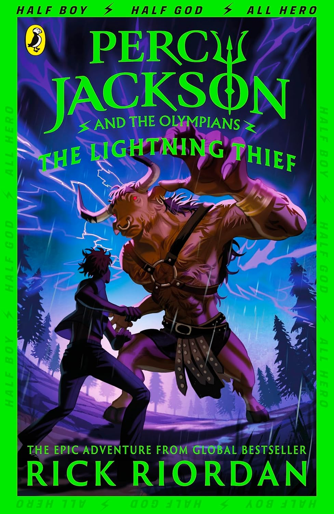](https://books.rob.me.uk/book/1689)
##### mythical · fast-paced · humorous
##### Rick Riordan
##### Fantasy, 2005, 377 pages

Mythology crashes headlong into modern Americana. Riordan treats adolescent angst as a literal battlefield, delivering a narrative that never takes its foot off the gas while demanding readers care about its profoundly relatable cast.

Dyslexia and ADHD aren't learning disabilities for Percy Jackson—they are hardwired combat instincts. Finding out his father is an Olympian god is just the start of his bad week, kicking off a desperate cross-country road trip to track down Zeus's stolen master bolt before the world burns.

#### [City of Bones](https://books.rob.me.uk/book/1690)
[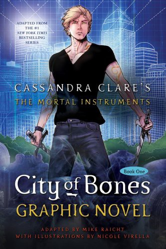](https://books.rob.me.uk/book/1690)
##### urban · gritty · supernatural
##### Cassandra Clare
##### Fantasy, 2007, 485 pages

Shadows hide claws, and glamour masks fangs. Clare constructs an intricate, gritty urban underworld layered directly beneath the streets of New York, demanding attention through sheer atmospheric weight and razor-sharp ensemble banter.

Welcome to the Pandemonium Club, where a casual murder goes unnoticed by everyone except Clary Fray. Suddenly thrust into the path of tattooed, lethal warriors dedicated to exterminating demons, Clary must unlock her own wiped memories to save her mother from an ancient enemy.

#### [Eclipse](https://books.rob.me.uk/book/300)
[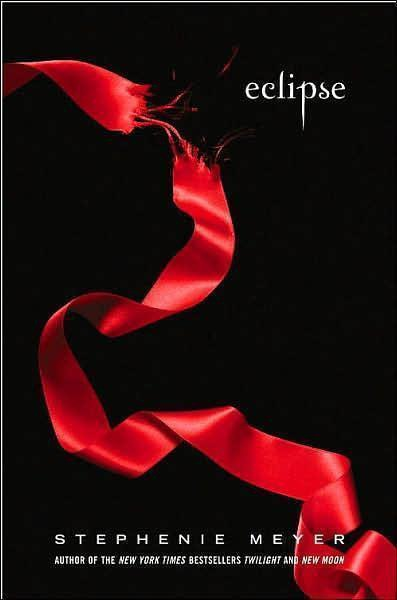](https://books.rob.me.uk/book/300)
##### brooding · romantic · tense
##### Stephenie Meyer
##### Romance, 2007, 629 pages

Tension builds like a tightening wire. Meyer shifts away from quiet melancholy into the high-stakes arena of shifting alliances and cold-blooded vendettas, anchoring the claustrophobic emotional triangulation with impending violence.

Seattle bleeds under a string of unsolved, savage killings orchestrated by a newborn vampire army. Survival demands the unthinkable, forcing sworn enemies—Edward's coven and Jacob's werewolf pack—to fight shoulder-to-shoulder, even as Bella's heart threatens to tear their fragile truce apart.

#### Eragon
##### epic · traditional · heroic
##### Christopher Paolini
##### Fantasy, 2003, 509 pages

High fantasy in its purest, most unabashed form. Paolini honors the genre's grandest traditions, mapping out a sprawling continent rich with invented languages, ancient grudges, and the majestic bond forged between boy and beast.

It was supposed to be just a blue stone, a lucky find in the Spine mountains that could pay for winter provisions. Then it hatched. Overnight, a simple farm boy becomes the first Dragon Rider in a generation, hunted by an empire run by a mad, immortal king.

#### [Catching Fire](https://books.rob.me.uk/book/849)
[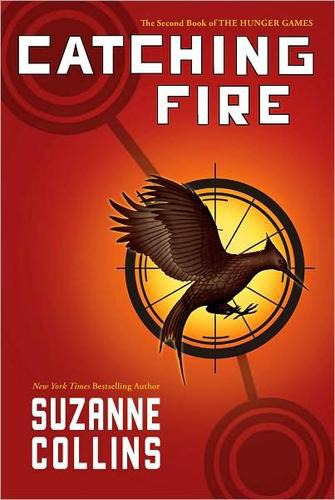](https://books.rob.me.uk/book/849)
##### dystopian · defiant · brutal
##### Suzanne Collins
##### Sci-Fi, 2009, 391 pages

Dread saturates every page. This is not merely a survival narrative, but a surgical dismantling of totalitarian propaganda and the trauma of televised violence, refusing to let its protagonist—or the audience—rest.

The Capitol is watching, and President Snow is furious. Katniss Everdeen's desperate act with the nightlock berries ignited a spark across the districts, and now the rules of the 75th Hunger Games are being viciously rewritten to ensure the girl on fire burns to ash.

#### [The Elephant Tree](https://books.rob.me.uk/book/1692)
[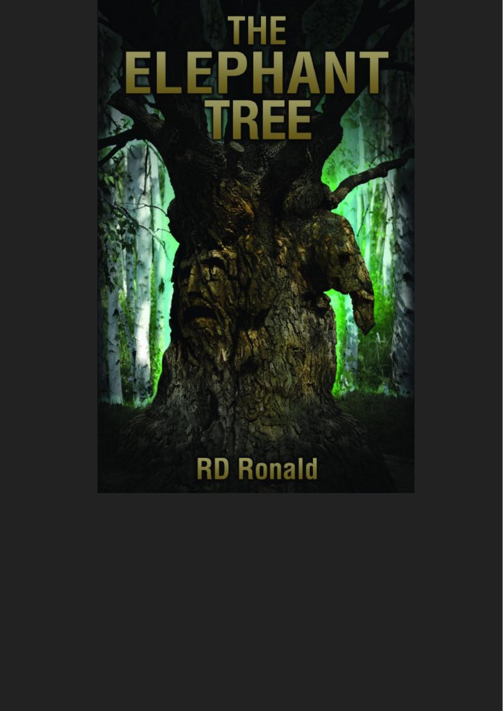](https://books.rob.me.uk/book/1692)
##### gritty · psychological · bleak
##### R.D. Ronald
##### Thriller, 2010, 320 pages

Unforgiving and brutally precise. Ronald strips away any romanticized veneer from the criminal underworld, exposing a raw nerve of desperation and moral decay that actively defies redemption.

Plunge into the suffocating grip of an illicit drug syndicate. Scott and Angela are drowning, and their desperate bid to carve out an independent operation might be the very thing that buries them under a mountain of paranoia and betrayal.

#### [Uglies](https://books.rob.me.uk/book/1693)

##### satirical · thought-provoking · fast
##### Scott Westerfeld
##### Sci-Fi, 2005, 425 pages

Conformity is carved with a scalpel. Westerfeld delivers a biting lens on cultural vanity and the weaponization of beauty standards, moving at a relentless pace to dissect the terrifying concept of engineered complacency.

Ugly is a temporary condition. At sixteen, your bone structure is corrected, and you are unleashed into the dizzying paradise of New Pretty Town—until Tally’s best friend goes rogue, leaving Tally to infiltrate a rebel camp or remain hideous forever.

#### [Breaking Dawn](https://books.rob.me.uk/book/251)
[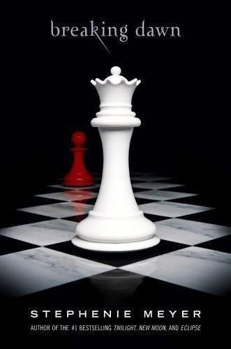](https://books.rob.me.uk/book/251)
##### climactic · controversial · dramatic
##### Stephenie Meyer
##### Romance, 2008, 756 pages

The scale expands into the apocalyptic. Leaving behind familiar high school corridors, this finale lunges into biological horror, sprawling battlefields, and the absolute limits of immortal endurance. 

A honeymoon, a horrifyingly accelerated pregnancy, and a death sentence. Word of Bella’s forbidden immortal child has reached the ruling Volturi, sparking a desperate, worldwide rally of vampires to stand against the impending slaughter in Forks.

#### [New Moon](https://books.rob.me.uk/book/114)
[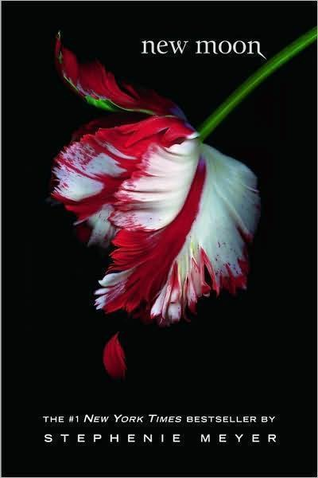](https://books.rob.me.uk/book/114)
##### melancholic · agonizing · quiet
##### Stephenie Meyer
##### Romance, 2006, 563 pages

Grief operates as a physical wound. The atmosphere shifts into heavy, rainy isolation, prioritizing internal devastation over external action and capturing the jagged reality of sudden loss.

One paper cut ruins everything. Edward vanishes, leaving Bella in a catatonic spiral where reckless adrenaline becomes her only tether to his memory, eventually pushing her into the orbit of Jacob Black—whose own body hides a feral, teeth-baring secret.

#### [The Chronicles of Narnia](https://books.rob.me.uk/book/868)
##### allegorical · wondrous · timeless
##### C.S. Lewis
##### Fantasy, 1950, 767 pages

Allegory meets timeless whimsy. Lewis balances deep theological reflections with the innocent thrill of discovery, contrasting mundane, wartime Britain against frozen magic.

Step backward through the fur coats and leave the Blitz behind. A snow-covered lamppost marks the threshold to Narnia, a land enslaved in perpetual winter where four displaced siblings must rally behind a legendary, untamed lion to break the ice.

#### [Being a Witch, and Other Things I Didn't Ask For](https://books.rob.me.uk/book/2076)
[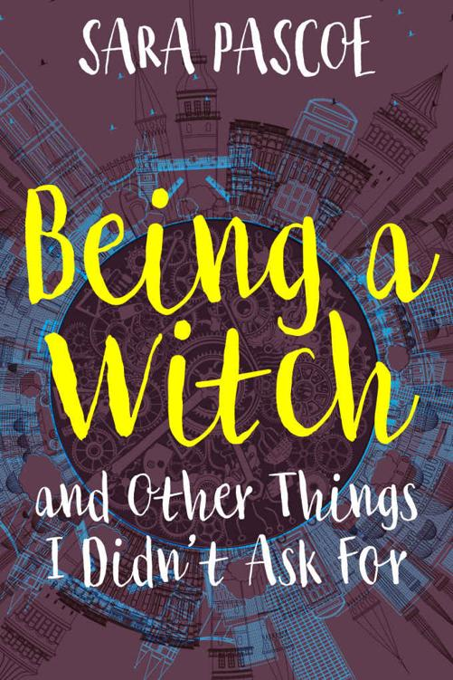](https://books.rob.me.uk/book/2076)
##### quirky · humorous · grounded
##### Sara Pascoe
##### Fiction, 2014, 250 pages

Accidental magic violently clashes with mundane reality. The tone leans heavily into irony and awkwardness, perfectly capturing the chaotic lifestyle of a reluctant spellcaster who prefers dodging bad dates over battling dark lords.

Glamour is a myth. For this newly awakened witch, ancient powers are mostly just a massive inconvenience disrupting her career and social life, forcing her to figure out how to hex her problems away before they completely ruin her week.

#### [Ender’s Game](https://books.rob.me.uk/book/847)
[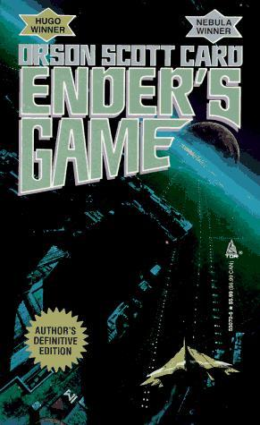](https://books.rob.me.uk/book/847)
##### cerebral · intense · philosophical
##### Orson Scott Card
##### Sci-Fi, 1985, 324 pages

Morality dissolves in zero gravity. Card offers a psychologically taxing masterpiece examining the burden of leadership and the brutal exploitation of youth during times of absolute war.

Earth is prepping for a devastating alien invasion, relying entirely on breeding military geniuses. Drafted at six years old, Ender Wiggin is subjected to relentless, mind-breaking tactical games in Battle School designed to forge him into a savior—or completely shatter his sanity.

#### [Local Woman Missing](https://books.rob.me.uk/book/1694)
[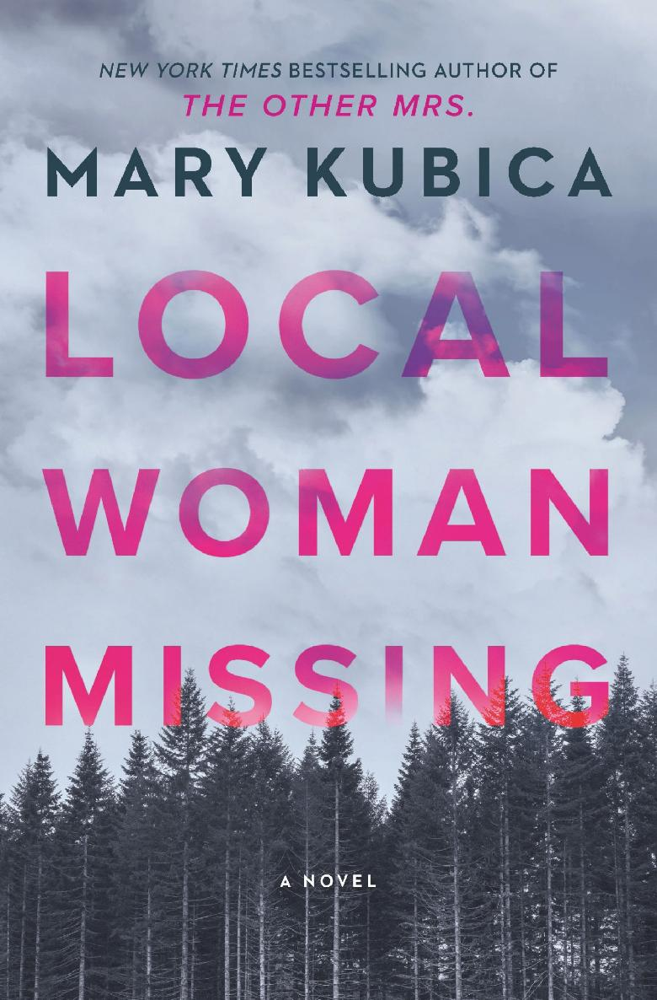](https://books.rob.me.uk/book/1694)
##### twisty · claustrophobic · shocking
##### Mary Kubica
##### Thriller, 2021, 352 pages

Suburban paranoia bleeds through multiple timelines. Kubica calibrates her pacing to keep readers perpetually off-balance, unraveling dark neighborhood secrets leading to a jaw-dropping final confrontation.

Fear paralyzed a peaceful community eleven years ago when two women and a little girl vanished without a trace. Now, the missing child has miraculously escaped captivity, and her horrifying testimony is about to blow the cold case wide open.

#### [Holes](https://books.rob.me.uk/book/1695)
[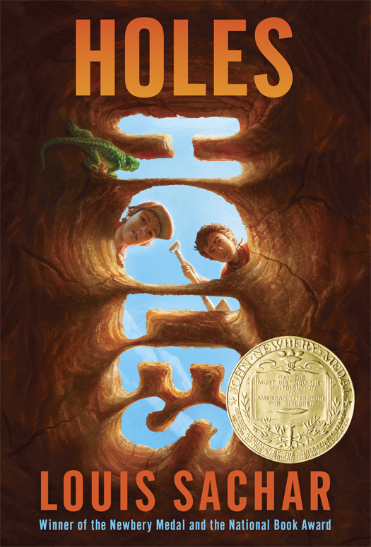](https://books.rob.me.uk/book/1695)
##### clever · interwoven · tragicomic
##### Louis Sachar
##### Fiction, 1998, 233 pages

Cursed histories and seemingly unrelated generations collide in the blistering Texas desert. The dry, darkly funny prose constructs a brilliant puzzle-box narrative where every single detail matters.

Stanley Yelnats blames his no-good-dirty-rotten-pig-stealing-great-great-grandfather for the curse that landed him in a juvenile detention camp. Forced to dig holes in the desert heat to "build character," Stanley soon realizes the warden is actually hunting for a century-old buried secret.

#### [City of Glass](https://books.rob.me.uk/book/1696)
[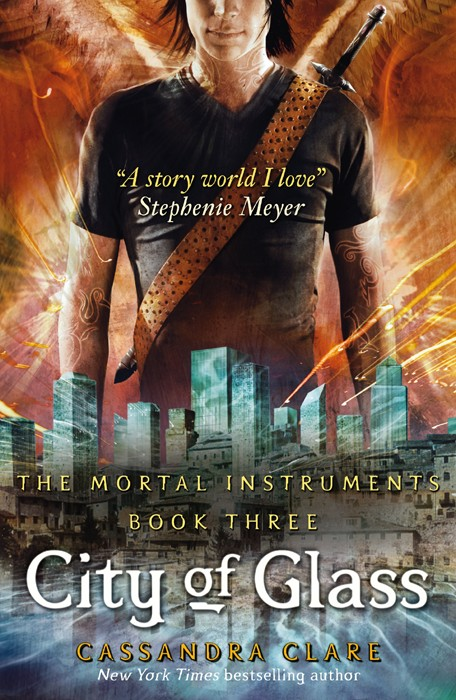](https://books.rob.me.uk/book/1696)
##### explosive · definitive · magical
##### Cassandra Clare
##### Fantasy, 2009, 541 pages

The urban landscape trades places with an ancestral homeland. This lore-heavy apex dramatically expands the supernatural politics and mythical payoffs for a deeply satisfying, action-packed climax.

Defying the law of the Shadowhunters, Clary smuggles herself into the shimmering, glass-towered city of Alicante to save her mother’s life. With Valentine’s demonic army amassing at the borders, rival factions must forge an impossible alliance or face total annihilation.

#### [The Giver](https://books.rob.me.uk/book/1697)
[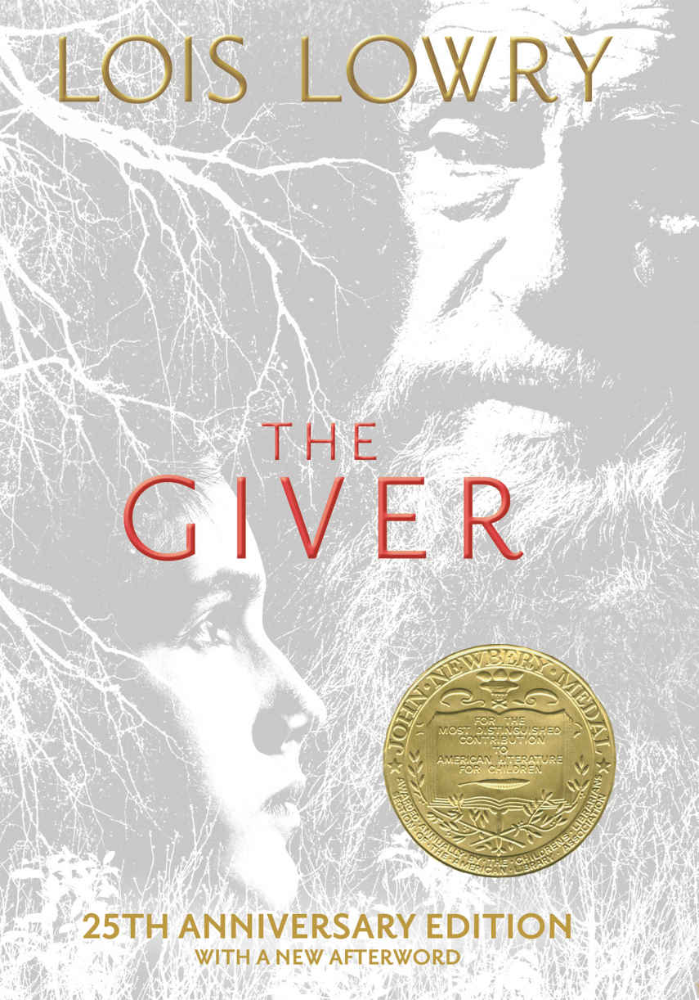](https://books.rob.me.uk/book/1697)
##### quiet · profound · chilling
##### Lois Lowry
##### Sci-Fi, 1993, 240 pages

Utopia demands a horrifying cost. The sparse, clinical prose perfectly mirrors the sterile society it depicts, dissecting the value of human emotion and the danger of true equality.

Jonas lives in a community devoid of war, pain, or choices, bathed entirely in emotional "Sameness." Selected to inherit the memories of humanity’s past, he is suddenly flooded with colors and agonizing suffering, forcing him to realize his perfect society is a living nightmare.

#### [The Sea of Monsters](https://books.rob.me.uk/book/1698)
[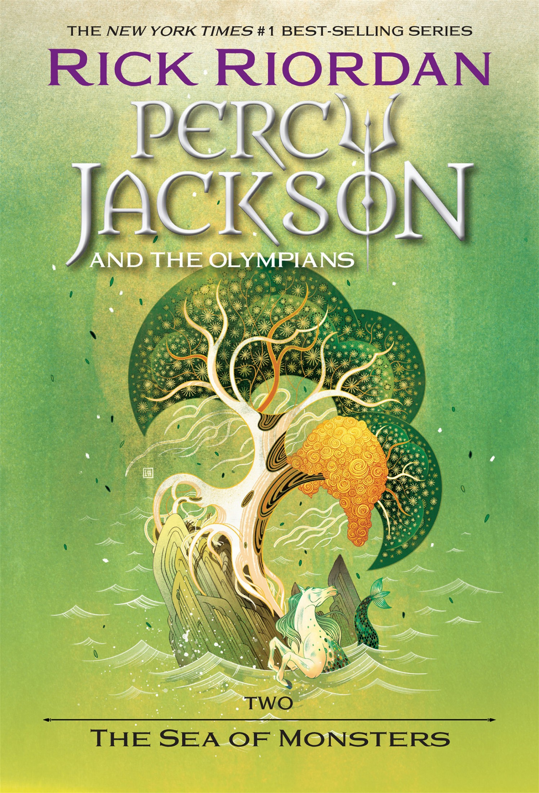](https://books.rob.me.uk/book/1698)
##### perilous · aquatic · humorous
##### Rick Riordan
##### Fantasy, 2006, 279 pages

Homeric monsters get a snarky, modern overhaul. The pacing stays relentless as the mythos expands into the ocean, delivering a high-stakes mythological road trip packed with lethal encounters.

Camp Half-Blood is dying. The magical borders are failing, and Percy Jackson must navigate the treacherous, monster-infested waters of the Bermuda Triangle to locate the legendary Golden Fleece before his only safe haven is wiped off the map.

#### [The Host](https://books.rob.me.uk/book/834)
[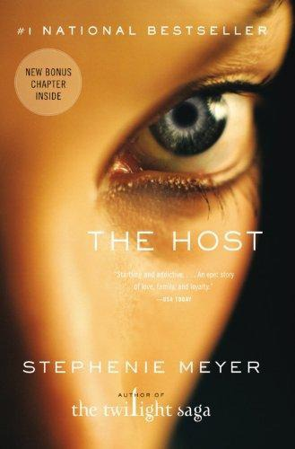](https://books.rob.me.uk/book/834)
##### introspective · alien · compassionate
##### Stephenie Meyer
##### Sci-Fi, 2008, 619 pages

Invasion is quiet and surgical. Focusing on empathy and shared humanity rather than laser battles, the intimate narrative asks profound questions about identity, love, and the right to exist.

Earth has been conquered by a parasitic species that erases human minds while leaving their bodies intact. Implanted into the body of a fierce rebel named Melanie, an alien named Wanderer finds herself fighting for control as the host refuses to fade away.

#### [City of Ashes](https://books.rob.me.uk/book/1699)
[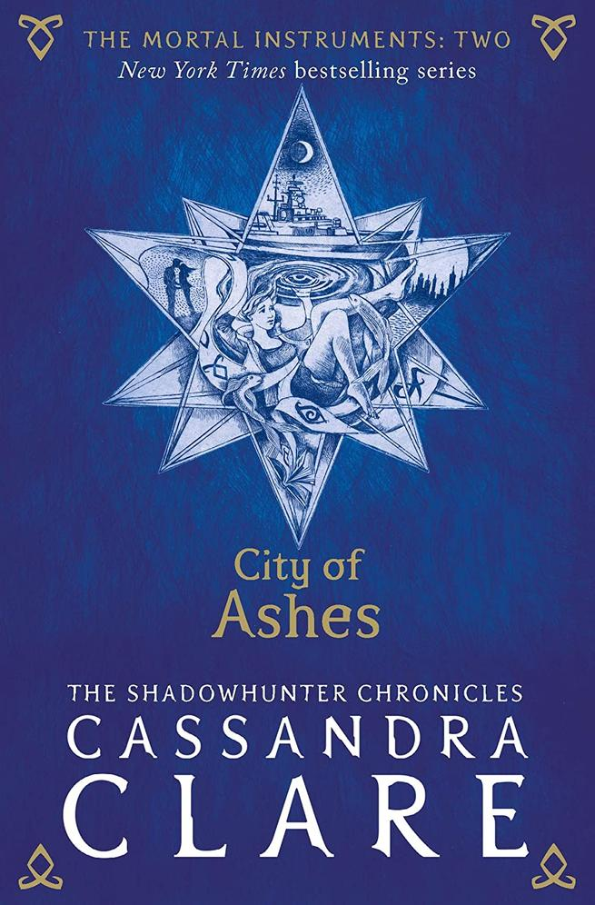](https://books.rob.me.uk/book/1699)
##### darker · fast-paced · vengeful
##### Cassandra Clare
##### Fantasy, 2008, 453 pages

Moral ambiguity deepens the dangers of the Downworld. Stepping into significantly darker territory, this sophomore installment accelerates the brutal supernatural warfare and tortured interpersonal dynamics.

Clary Fray’s mother is in a magically induced coma, and her newfound brother is a terrifying shadow-warrior. Dragged back into the lethal underworld by a string of gruesome murders, Clary must stop her megalomaniacal father from acquiring the deadly Mortal Instruments.

#### [The Girl Who Was Taken](https://books.rob.me.uk/book/1700)
[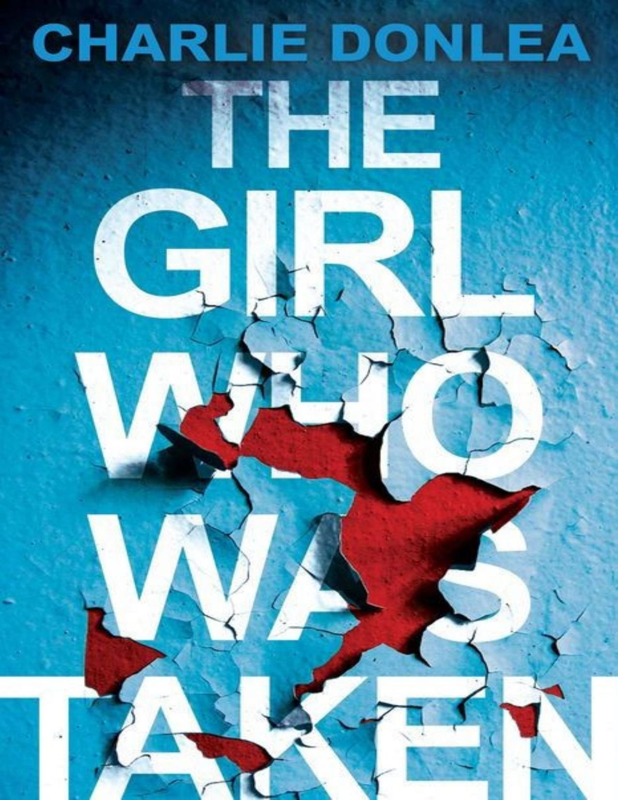](https://books.rob.me.uk/book/1700)
##### chilling · procedural · twisted
##### Charlie Donlea
##### Thriller, 2017, 304 pages

Forensic precision meets psychological terror. Bouncing between a harrowing past trauma and a desperate present-day investigation, the cinematic writing refuses to let dead secrets stay buried.

Two high school seniors vanished from a beach town; weeks later, only one escaped. Now, a forensic pathologist is digging into the survivor's fractured memories, uncovering a labyrinth of lies that points straight to a monster hiding in plain sight.

#### [The Last Olympian](https://books.rob.me.uk/book/1701)
[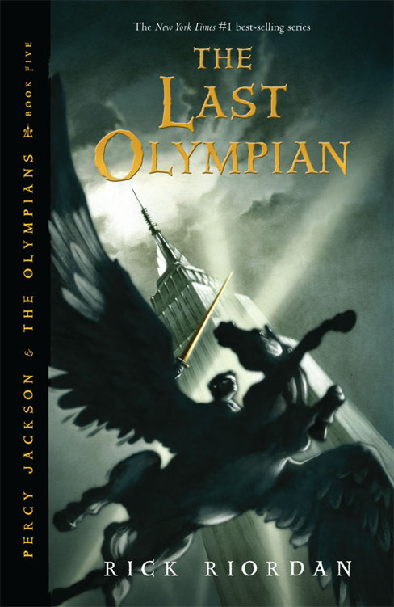](https://books.rob.me.uk/book/1701)
##### epic · apocalyptic · heroic
##### Rick Riordan
##### Fantasy, 2009, 381 pages

Urban warfare rocks Manhattan. The stakes are relentlessly high in this battle-heavy climax, delivering profound emotional payoffs and staggering casualties as the gods' games finally reach their end.

The gods are tied down fighting a monstrous typhoon in the west, leaving Mount Olympus completely undefended. It falls to sixteen-year-old Percy Jackson and a ragged band of teenage demigods to hold the city against Kronos’s marching army of monsters.

#### [The Titan’s Curse](https://books.rob.me.uk/book/1702)
[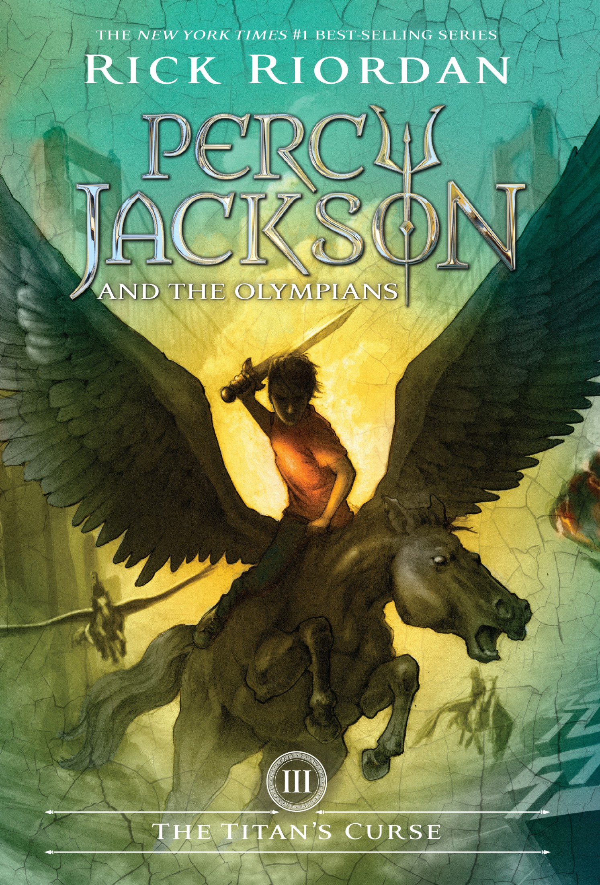](https://books.rob.me.uk/book/1702)
##### tragic · snowy · action-packed
##### Rick Riordan
##### Fantasy, 2007, 312 pages

The lethal consequences of the godly world are fully realized. Introducing new immortal factions and devastating sacrifices, the atmosphere grows noticeably colder and far more perilous.

The goddess Artemis is missing. Hunted by a terrifying new general in the Titan army, Percy Jackson and a team of hunters must embark on a desperate rescue mission before the winter solstice, knowing a prophecy guarantees not all of them will survive.

#### [The Battle of the Labyrinth](https://books.rob.me.uk/book/1702)

##### subterranean · eerie · complex
##### Rick Riordan
##### Fantasy, 2008, 361 pages

Claustrophobia and madness dominate the underground. Shifting alliances and a uniquely oppressive maze setting draw readers into a complex web of high-octane puzzle-solving.

Luke’s demonic army is searching for a subterranean invasion route into Camp Half-Blood. Percy and his friends must descend into the legendary, madness-inducing Labyrinth of Daedalus, navigating a dark world of traps and forgotten monsters to find the ancient inventor first.

#### [Those Empty Eyes](https://books.rob.me.uk/book/1704)
[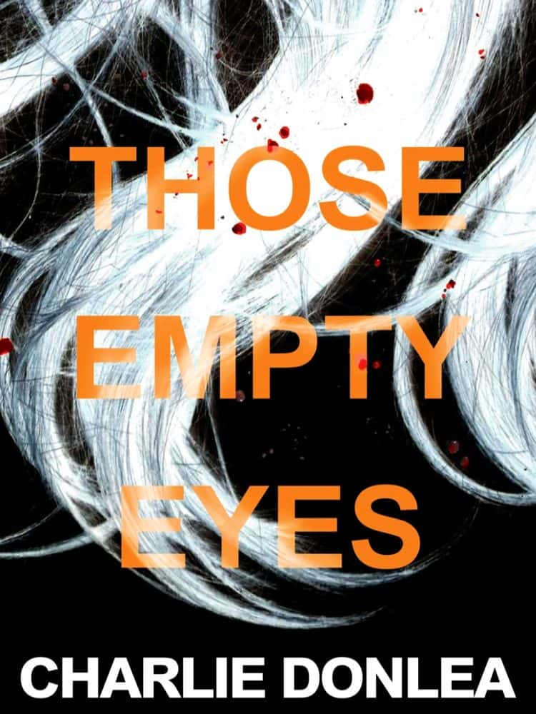](https://books.rob.me.uk/book/1704)
##### suspenseful · legal · gripping
##### Charlie Donlea
##### Thriller, 2023, 352 pages

Legal procedural mechanics blend flawlessly with psychological suspense. Centered on a hyper-competent, deeply scarred protagonist, the narrative untangles decades-old conspiracies with fierce, justice-driven momentum.

Falsely accused of murdering her family as a teenager, Alex Armstrong now uses her dark past to exonerate the innocent as a legal investigator. But her latest high-profile case puts her directly on a collision course with the real killer who destroyed her life.

#### [Ask for Andrea](https://books.rob.me.uk/book/1705)
[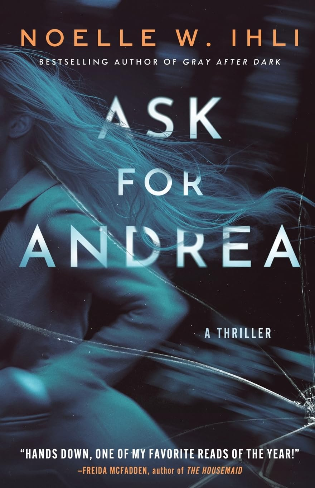](https://books.rob.me.uk/book/1705)
##### supernatural · vengeful · gripping
##### Noelle W. Ihli
##### Thriller, 2022, 280 pages

Revenge is exacted from beyond the grave. Told entirely from the perspective of the victims, this feminist thriller drips with vindicating tension and flips the serial killer trope on its head.

Three women were lured to their deaths by the same calculating predator on a dating app. Tethered to him as ghosts, they realize the police have no leads, leaving them with only one option: haunt him until they force a deadly, supernatural reckoning.

#### [Graceling](https://books.rob.me.uk/book/1706)
[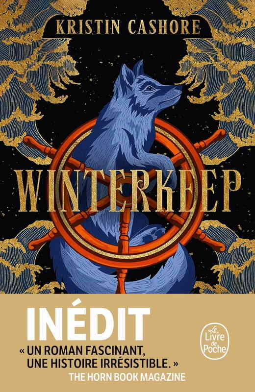](https://books.rob.me.uk/book/1706)
##### fierce · feminist · deadly
##### Kristin Cashore
##### Fantasy, 2008, 471 pages

Autonomy and power clash in a sword-swinging high fantasy. Unflinching prose dissects the weaponization of youth, championing a heroine as lethal as she is emotionally guarded.

Katsa’s Graceling power of killing has forced her to serve as the king's personal assassin since childhood. Defying her uncle to uncover a mysterious kidnapping, she collides with a prince whose own deadly Grace might be the only thing capable of stopping a kingdom-swallowing conspiracy.

#### [Think Twice](https://books.rob.me.uk/book/2094)
[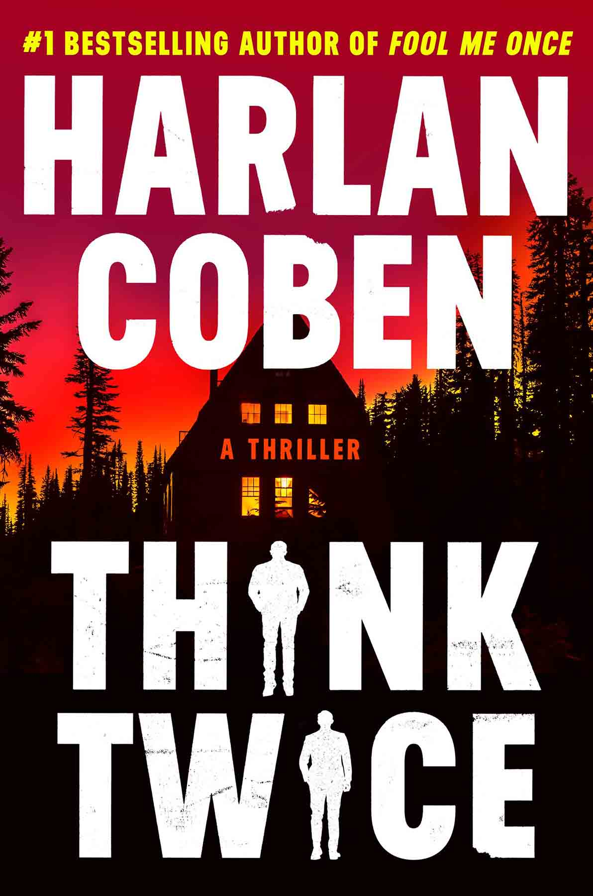](https://books.rob.me.uk/book/2094)
##### gripping · twisty · relentless
##### Harlan Coben
##### Thriller, 2024, 352 pages

The past is weaponized against the present. Coiled incredibly tight, this adrenaline rush of a domestic thriller thrives on rug-pulling reveals and impossible dilemmas.

How can a man dead for three years be the prime suspect in a brutal new murder? Sports agent Myron Bolitar is dragged into a lethal labyrinth of secrets when his allegedly deceased client is spotted fleeing a fresh crime scene.

#### [What Lies in the Woods](https://books.rob.me.uk/book/1710)
[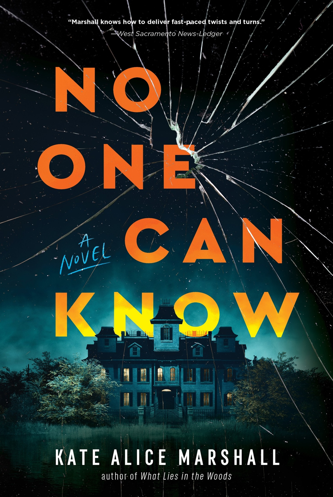](https://books.rob.me.uk/book/1710)
##### chilling · nostalgic · deceptive
##### Kate Alice Marshall
##### Thriller, 2023, 336 pages

Childhood memory rots into shared trauma. Thick with dread and sinister woodland aesthetics, the novel thrives on unreliable narrators tangled in decades of suffocating lies.

They survived a terrifying attack in the forest at eleven years old, their testimony sending a killer to prison. Decades later, the man they put away has died, forcing Naomi to return to her hometown and confront the horrifying truth she and her friends have been hiding.

#### [Gray After Dark](https://books.rob.me.uk/book/1709)
[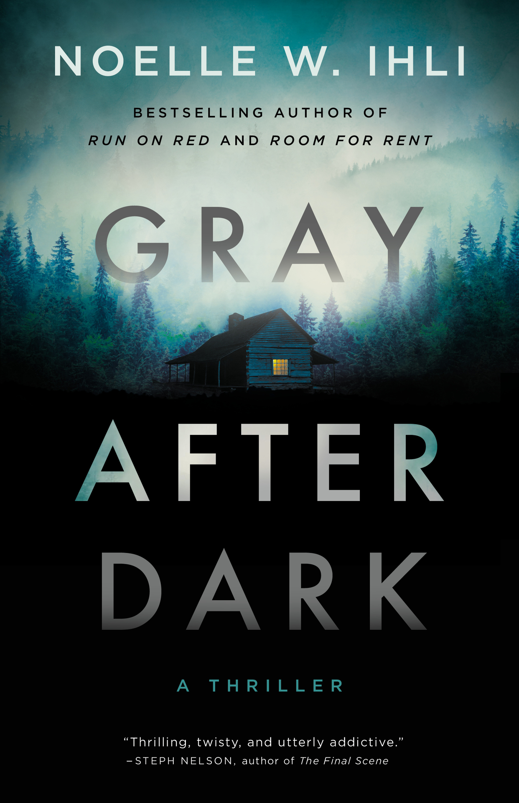](https://books.rob.me.uk/book/1709)
##### survival · isolated · harrowing
##### Noelle W. Ihli
##### Thriller, 2023, 320 pages

The wilderness offers no mercy. Stranding its characters in an unforgiving landscape, the brutal pacing captures the raw terror of isolation and elemental danger.

A romantic getaway to a remote Idaho cabin spirals into a waking nightmare when a young couple realizes they are not alone. Hunted by a predator who knows the treacherous terrain, their desperate bid for survival becomes a bloody test of endurance.

#### [No One Can Know](https://books.rob.me.uk/book/1710)

##### secretive · claustrophobic · paranoid
##### Kate Alice Marshall
##### Thriller, 2024, 336 pages

Toxic family dynamics slowly poison the narrative. A razor-sharp domestic mystery that peels back the rotting layers of bloodlines cursed by unpunished crimes.

Emma has spent her life running from the night her parents were slaughtered—a crime everyone believes her sisters committed. Financial ruin forces her back into the murder house, where her fragile reality shatters upon realizing the real killer never left.

#### [The Club](https://books.rob.me.uk/book/2090)
[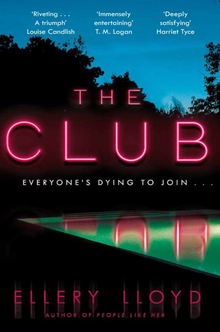](https://books.rob.me.uk/book/2090)
##### exclusive · glittering · lethal
##### Ellery Lloyd
##### Thriller, 2022, 320 pages

Grotesque wealth meets devastating vanity. Dripping with cynicism and glamour, this satirical locked-room thriller revels in watching the elite tear each other to shreds.

Welcome to Home, the planet's most exclusive celebrity club. But during a glittering launch party on a private island, the veneer of luxury violently cracks, leaving dead bodies in the water and a guest list packed entirely with ruthless suspects.

#### [Look Closer](https://books.rob.me.uk/book/2088)
[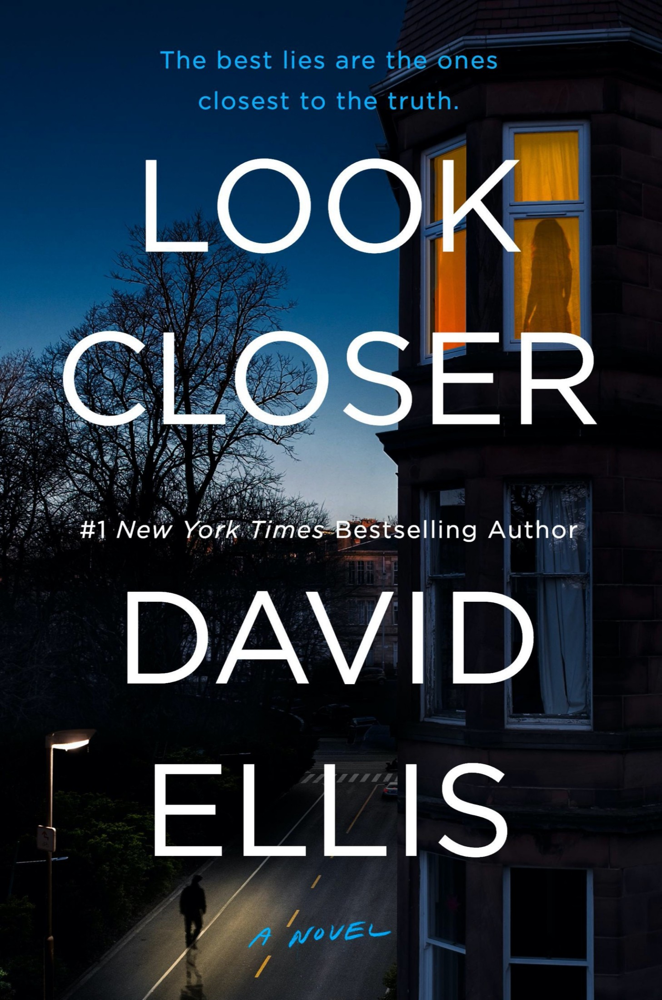](https://books.rob.me.uk/book/2088)
##### dizzying · deceptive · brilliant
##### David Ellis
##### Thriller, 2022, 432 pages

Mutually assured destruction is the name of the game. Dizzying, meticulously plotted perspectives constantly pull the rug out from under the reader, demanding attention to every lie.

Simon and Vicky are locked in a vicious marriage of deceit. As affairs are exposed and a dead body turns up hanging in the woods, both spouses play three steps ahead in a deadly con where absolutely no one is who they seem.

#### [The Roommate](https://books.rob.me.uk/book/2077)
[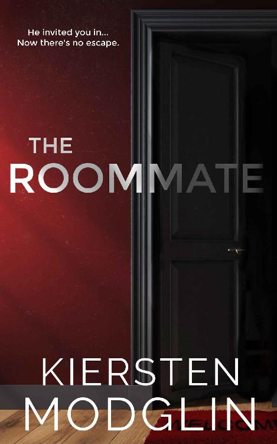](https://books.rob.me.uk/book/2077)
##### creepy · domestic · escalating
##### Kiersten Modglin
##### Thriller, 2021, 260 pages

The vulnerability of shared living spaces is entirely weaponized. Escalating from eccentric to terrifying, the tension captures a visceral, fast-paced psychological anxiety.

Ignoring the red flags, Wesley jumps at the chance to rent a room in a beautiful house. But as his new roommate’s behavior shifts into downright terror, Wesley realizes he hasn't just moved into a bad living situation—he’s walked straight into a trap.

#### [Hidden Pictures](https://books.rob.me.uk/book/1713)
[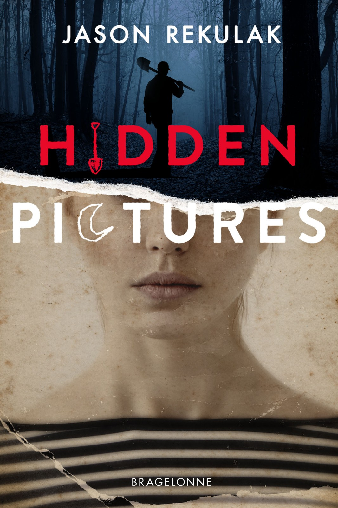](https://books.rob.me.uk/book/1713)
##### eerie · visual · shocking
##### Jason Rekulak
##### Thriller, 2022, 384 pages

Creeping dread bleeds through the artwork. Blending prose with deeply unsettling illustrations, this multimedia haunted house story layers supernatural ambiguity over profound psychological trauma.

Fresh out of rehab, Mallory accepts a nanny job for a wealthy family. But five-year-old Teddy’s innocent stick-figure drawings rapidly evolve into hyper-realistic, horrifying sketches of a gruesome murder, leading Mallory to believe a vengeful ghost is speaking through the child.

#### [The Shards](https://books.rob.me.uk/book/1714)
[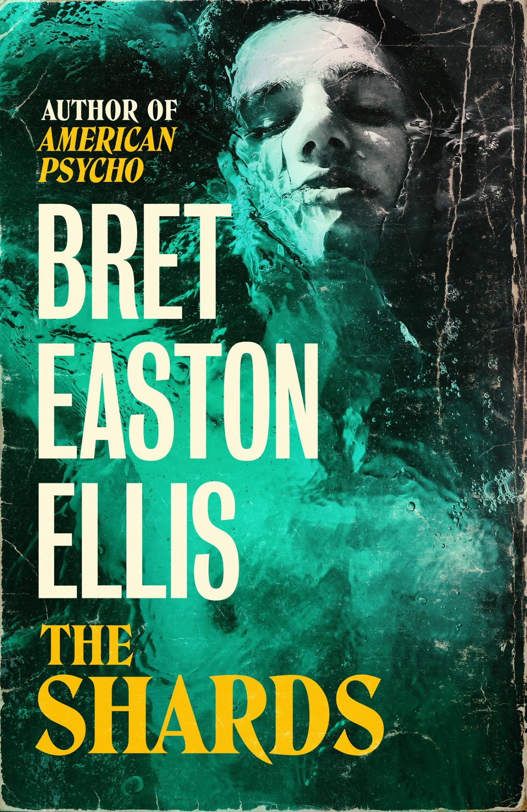](https://books.rob.me.uk/book/1714)
##### hypnotic · nostalgic · disturbing
##### Bret Easton Ellis
##### Fiction, 2023, 608 pages

Autofiction descends into a slasher-movie nightmare. Lush, repetitive prose pulls the reader into the manic, drug-fueled paranoia of privileged 1980s Los Angeles youth.

A serial killer known as the Trawler is butchering teenagers across the San Fernando Valley. As young Bret becomes dangerously obsessed with a charismatic new student, the glittering facade of LA prep school society dissolves into blood-soaked violence.

#### [Head Like a Hole](https://books.rob.me.uk/book/2049)
[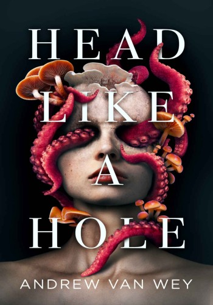](https://books.rob.me.uk/book/2049)
##### grotesque · nostalgic · terrifying
##### Andrew Van Wey
##### Horror, 2021, 350 pages

Grunge aesthetics marry terrifying bodily metamorphosis. Sticky, grim prose targets the suffocating guilt of the past and the visceral horror of the flesh.

Two decades ago, Megan survived a terrifying summer that swallowed her best friend alive. Now, something is waking up in the waters of her hometown, forcing her to confront a grotesque entity that promises to peel back her deepest regrets.

#### [A Wrinkle in Time](https://books.rob.me.uk/book/70)
[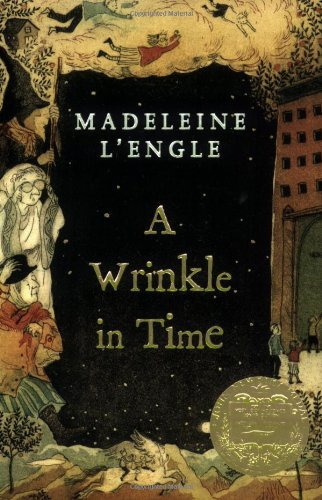](https://books.rob.me.uk/book/70)
##### cosmic · bizarre · enduring
##### Madeleine L'Engle
##### Sci-Fi, 1962, 256 pages

Quantum physics collides with boundless love. Deeply earnest and wildly imaginative, this speculative classic tackles theology and science through the eyes of a fiercely determined child.

Meg Murry's scientist father has vanished into the fabric of space and time. Guided by three eccentric celestial beings, Meg must tesseract across the galaxy, confronting a dark, suffocating evil to bring her family back together.

#### [Not Forever, But For Now](https://books.rob.me.uk/book/2078)
[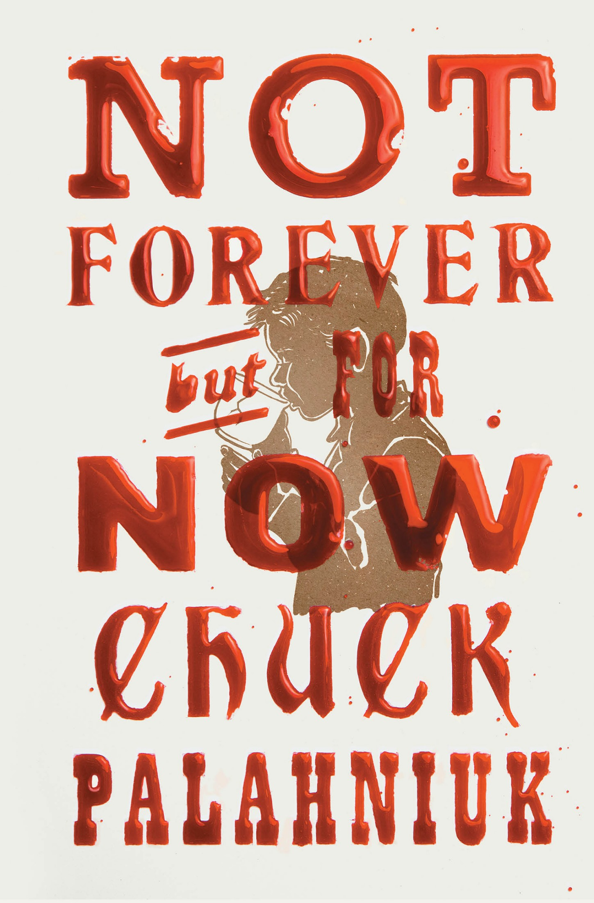](https://books.rob.me.uk/book/2078)
##### transgressive · sharp · absurd
##### Chuck Palahniuk
##### Fiction, 2023, 256 pages

Wealth and privilege are skewered on a pitch-black comedic spit. Jagged, unapologetic prose tests the limits of taste in this aggressive, boundary-pushing satire of elite sociopathy.

Otto and Cecil are obscenely wealthy brothers passing the time by casually murdering the household staff. When their grandfather steps in to mold them into proper heirs, their secluded playground of violence expands into a sprawling, blood-soaked education.

#### [Divergent](https://books.rob.me.uk/book/1716)
[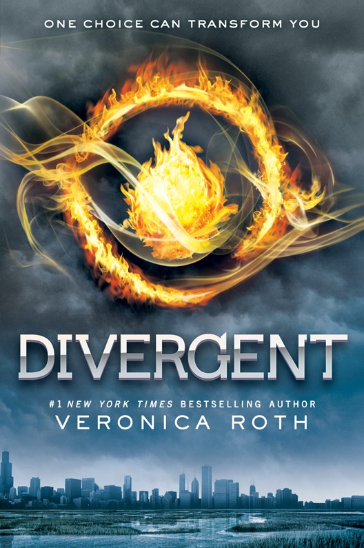](https://books.rob.me.uk/book/1716)
##### adrenaline-fueled · rebellious · stark
##### Veronica Roth
##### Sci-Fi, 2011, 487 pages

Ideological factions meet high-octane physical trials. Blistering and cinematic, the narrative thrives on brutal initiation rites and the terrifying burden of nonconformity.

Sixteen-year-old Tris Prior harbors a deadly secret in a walled Chicago divided by personality traits: her mind doesn't fit into just one category. Hunted for being "Divergent," she must survive a warrior faction's brutal training while uncovering a plot to tear society apart.

#### [Marked](https://books.rob.me.uk/book/1717)
[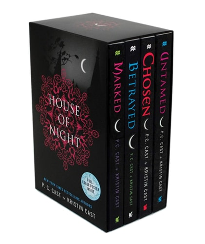](https://books.rob.me.uk/book/1717)
##### gothic · dramatic · immersive
##### P.C. Cast
##### Fantasy, 2007, 306 pages

Ancient rituals amplify teen angst. Dripping with vampyric lore and intense social hierarchies, the atmospheric boarding-school setting provides dark, dramatic escapism.

A mystical crescent moon on Zoey Redbird's forehead marks her as a fledgling vampyre. Whisked away to the House of Night academy, she must survive bloodlust, vicious cliques, and the terrifying realization that she possesses unprecedented, highly dangerous powers.

#### [Ella Enchanted](https://books.rob.me.uk/book/2087)
[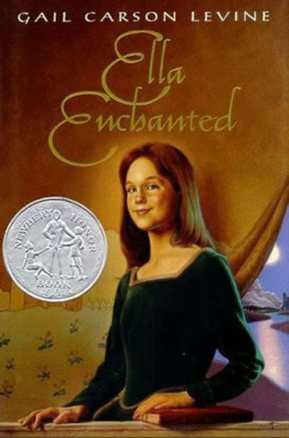](https://books.rob.me.uk/book/2087)
##### whimsical · clever · subverted
##### Gail Carson Levine
##### Fantasy, 1997, 232 pages

The Cinderella mythos is intelligently dismantled. Bright, defiant prose champions free will over passive destiny, delivering a heroine who refuses to wait for a rescuer.

Cursed at birth to obey every direct order she is given, Ella of Frell refuses to be a pawn. She sets out on a dangerous quest across a kingdom of ogres and elves to track down the foolish fairy who cursed her and reclaim her own mind.

#### [Hush, Hush](https://books.rob.me.uk/book/1719)
[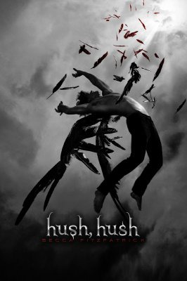](https://books.rob.me.uk/book/1719)
##### seductive · dangerous · angelic
##### Becca Fitzpatrick
##### Romance, 2009, 391 pages

Celestial warfare replaces the vampire craze. Crackling with specific, undeniable danger, the shadowy romance leans entirely into forbidden attraction and lethal secrets.

Nora Grey never wanted anything to do with the brooding new boy in biology class. But as a terrifying series of accidents plagues her life, she realizes Patch is a fallen angel, and she is the centerpiece in a centuries-old immortal battle.

#### [Shiver](https://books.rob.me.uk/book/1720)
[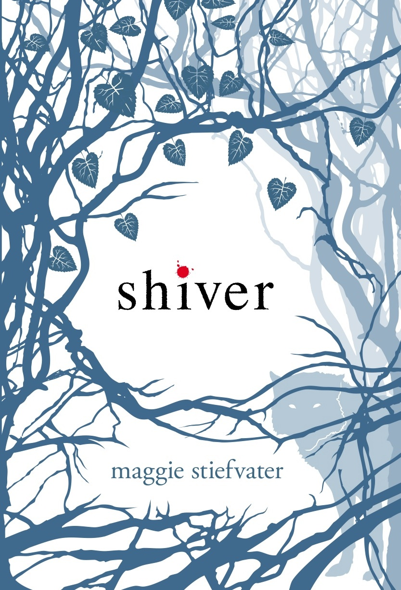](https://books.rob.me.uk/book/1720)
##### poetic · freezing · intimate
##### Maggie Stiefvater
##### Romance, 2009, 392 pages

Atmospheric longing freezes over into lycanthropic romance. Sensory details and impending loss take precedence over action, crafting a deeply melancholic, wintery tragedy.

Grace has always been drawn to the yellow-eyed wolf behind her house. But as the temperature drops, the beast sheds his skin to become Sam—a boy running out of time, desperate to hold onto his humanity before the cold turns him back forever.

#### [The Perks of Being a Wallflower](https://books.rob.me.uk/book/1721)
[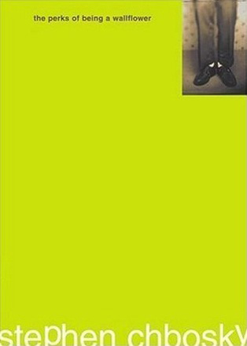](https://books.rob.me.uk/book/1721)
##### raw · epistolary · defining
##### Stephen Chbosky
##### Fiction, 1999, 213 pages

The devastating highs and lows of the teenage experience are laid bare. Deeply conversational and empathetic, the anonymous letters capture the profound isolation of watching life from the sidelines.

Fifteen-year-old Charlie navigates the turbulent waters of high school, trauma, and first love. Taken under the wing of two magnetic seniors, he fights to actively participate in his own life before repressed memories completely destroy him.

#### [Looking for Alaska](https://books.rob.me.uk/book/216)
[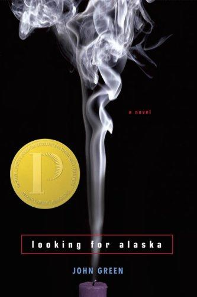](https://books.rob.me.uk/book/216)
##### tragic · philosophical · searching
##### John Green
##### Fiction, 2005, 221 pages

Grief demands an agonizing search for meaning. Hyper-articulate and darkly funny, the narrative dissects sudden loss and the danger of turning flawed people into mysteries.

Miles Halter seeks "the Great Perhaps" at a sweltering Alabama boarding school, pulled instantly into the chaotic orbit of Alaska Young. She steals his heart, upends his worldview, and leaves him grappling with an unsolvable void when tragedy suddenly strikes.

#### [The Golden Compass](https://books.rob.me.uk/book/233)
[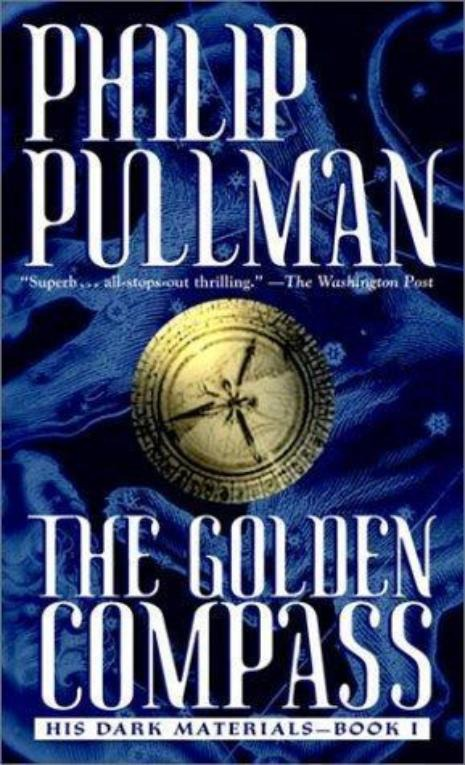](https://books.rob.me.uk/book/233)
##### masterful · subversive · arctic
##### Philip Pullman
##### Fantasy, 1995, 399 pages

Steampunk aesthetics fuse with fierce anti-authoritarian philosophy. Staggering, original world-building challenges readers with profound intellectual depth and breathtaking magical peril.

In a world where human souls walk beside them as animal companions, fierce young Lyra Belacqua discovers a terrifying conspiracy involving kidnapped children. Traveling to the frozen North, she aligns with armored polar bears to tear down the ultimate ruling authority.

#### [From Manchester to the Arctic](https://books.rob.me.uk/book/1722)
[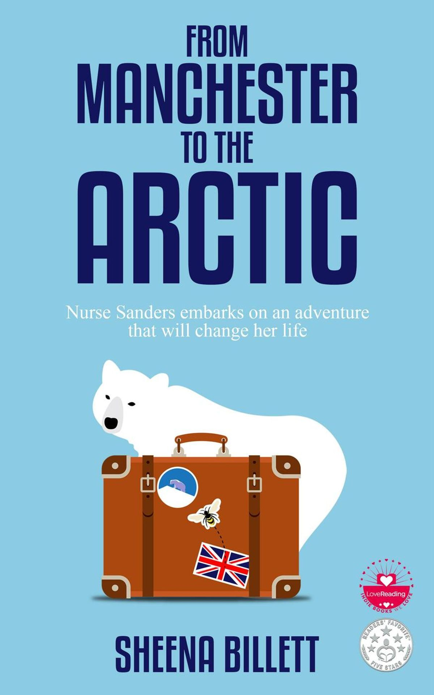](https://books.rob.me.uk/book/1722)
##### biographical · historical · intrepid
##### Sheena Billett
##### Non-Fiction, 2022, 310 pages

Grueling realities of 19th-century polar exploration are vividly reconstructed. Meticulous historical documentation balances factual rigor with the palpable, desperate endurance of maritime history.

Leave the smog of industrial Manchester behind and set sail into the unforgiving ice. Charting an ill-fated Arctic expedition, this deep dive resurrects the forgotten diaries of men who pushed the absolute boundaries of survival in search of glory.

#### [The Fault in Our Stars](https://books.rob.me.uk/book/374)
[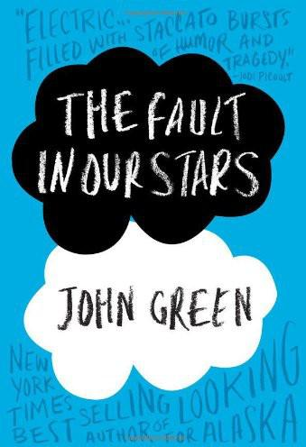](https://books.rob.me.uk/book/374)
##### heartbreaking · witty · existential
##### John Green
##### Romance, 2012, 313 pages

The void of terminal illness is met with sharp, morbid wit. Philosophical banter masks deep existential terror, inviting readers to be emotionally destroyed by a fiercely bright romance.

Hazel Grace Lancaster is merely buying time attached to an oxygen tank. But when she crosses paths with devastatingly charming amputee Augustus Waters at a support group, her tragically short life is violently rewritten into a grand, unforgettable adventure.

#### [Artemis Fowl](https://books.rob.me.uk/book/167)
[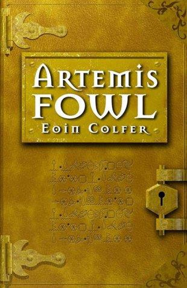](https://books.rob.me.uk/book/167)
##### slick · inventive · antiheroic
##### Eoin Colfer
##### Fantasy, 2001, 280 pages

High-tech espionage collides with underground folklore. Snarky and hyper-kinetic, the narrative gleefully follows a brilliant, amoral protagonist systematically dismantling heavily armed fairies.

Twelve-year-old Artemis Fowl is a millionaire, a genius, and a ruthless criminal mastermind. Kidnapping a fully armed fairy law enforcement officer to restore his family's fortune, he accidentally declares war on a technologically advanced civilization ready to fight back.

#### [Eldest](https://books.rob.me.uk/book/2086)
[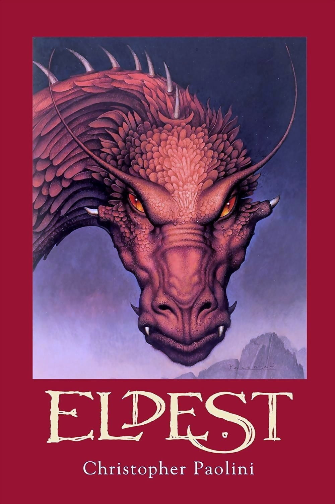](https://books.rob.me.uk/book/2086)
##### sprawling · magical · training
##### Christopher Paolini
##### Fantasy, 2005, 681 pages

The magical systems and mythology of Alagaësia deepen significantly. Deliberate pacing focuses heavily on rigorous training and political maneuvering within the elven realm.

Eragon and his dragon Saphira travel to Ellesméra to further their magical education. As the dark king Galbatorix marshals his forces, Eragon finds himself tangled in ancient betrayals, realizing the fate of the entire empire rests on his young shoulders.

#### [The Goose Girl](https://books.rob.me.uk/book/2093)

##### lush · folkloric · empowering
##### Shannon Hale
##### Fantasy, 2003, 383 pages

A classic Grimm fairy tale breathes deep, political life. Lyrical, measured prose captures a journey of reclaiming identity and mastering rare, elemental magic.

Betrayed by her lady-in-waiting and left for dead, Crown Princess Ani must adopt the life of a lowly goose girl to survive. Stripped of her title, she learns to wield the wind to expose the usurper before a catastrophic war destroys two kingdoms.

#### [The Outsiders](https://books.rob.me.uk/book/841)
[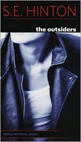](https://books.rob.me.uk/book/841)
##### gritty · defining · brotherhood
##### S.E. Hinton
##### Fiction, 1967, 192 pages

Class warfare distills into visceral, street-level brawls. Unpolished and achingly sincere, the narrative voice strikes a raw chord regarding loyalty, poverty, and fractured innocence.

You're either a wealthy Soc with a Mustang or a switchblade-carrying Greaser with nothing to lose. When a brutal late-night confrontation leaves a rival dead, Ponyboy and Johnny go on the run, accelerating their collision with an unavoidable, tragic destiny.

#### [Pretties](https://books.rob.me.uk/book/1724)
[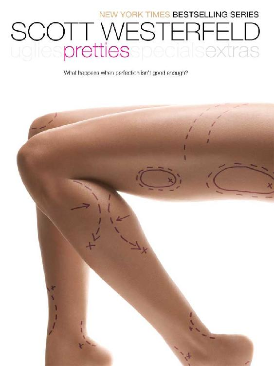](https://books.rob.me.uk/book/1724)
##### dizzying · superficial · rebellious
##### Scott Westerfeld
##### Sci-Fi, 2005, 370 pages

The dystopian script flips into a medically induced haze of vapid happiness. Sharp psychological edges explore the terrifying, suffocating grip of systemic brainwashing.

Tally finally has the perfect face, clothes, and endless parties in New Pretty Town. But beneath the glittering surface, a haunting memory is clawing its way out, forcing her to choose between beautiful ignorance and a dangerous rebellion.

#### [Specials](https://books.rob.me.uk/book/1725)
[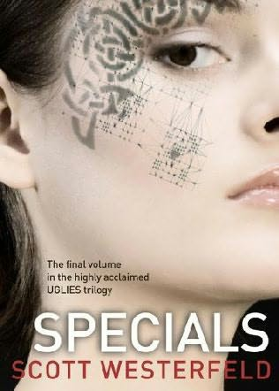](https://books.rob.me.uk/book/1725)
##### clinical · lethal · hyper-fast
##### Scott Westerfeld
##### Sci-Fi, 2006, 372 pages

Physical and psychological augmentation accelerates to terrifying extremes. Cold, predatory, and brutally efficient, the climax zeroes in on the absolute limits of human conditioning.

Forged into a surgically enhanced, terrifyingly fast enforcer, Tally is designed to crush rebellion without a second thought. Tasked with hunting down the New Smoke, her elite programming clashes violently with the remnants of her humanity.

#### [Brisingr](https://books.rob.me.uk/book/2085)
[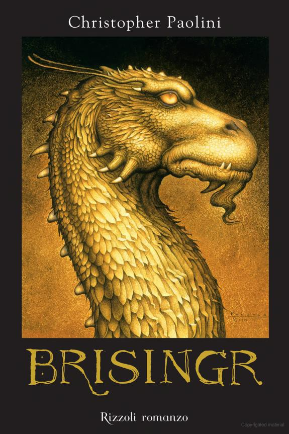](https://books.rob.me.uk/book/2085)
##### intricate · forged · desperate
##### Christopher Paolini
##### Fantasy, 2008, 748 pages

The brutal logistics of war overshadow the magic. Meticulous lore and dwarven politics bog down the hero in a politically charged web of conflicting alliances and broken oaths.

Bound by too many promises to the Varden, the elves, and the dwarves, Eragon navigates treacherous political landscapes. Amidst the chaos of organizing a rebellion, the Dragon Rider must forge a new weapon powerful enough to strike down a god.

#### [One Moment in Time](https://books.rob.me.uk/book/2079)
[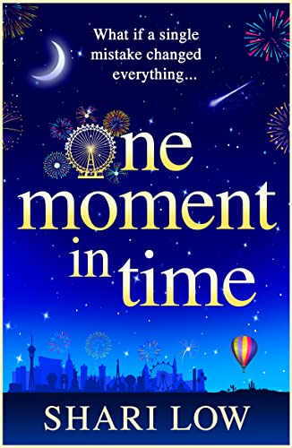](https://books.rob.me.uk/book/2079)
##### emotional · interwoven · poignant
##### Shari Low
##### Fiction, 2021, 350 pages

Intersecting destinies play out over a single, fateful day. Deeply humane and romantic, the multi-perspective narrative explores the fragility of time and the weight of past regrets.

One flight from London to Glasgow will alter the trajectory of several strangers' lives. As secrets unravel at 30,000 feet, an unexpected crisis forces every passenger to confront the defining moments that brought them exactly to this point.

#### [The House of the Scorpion](https://books.rob.me.uk/book/2092)
[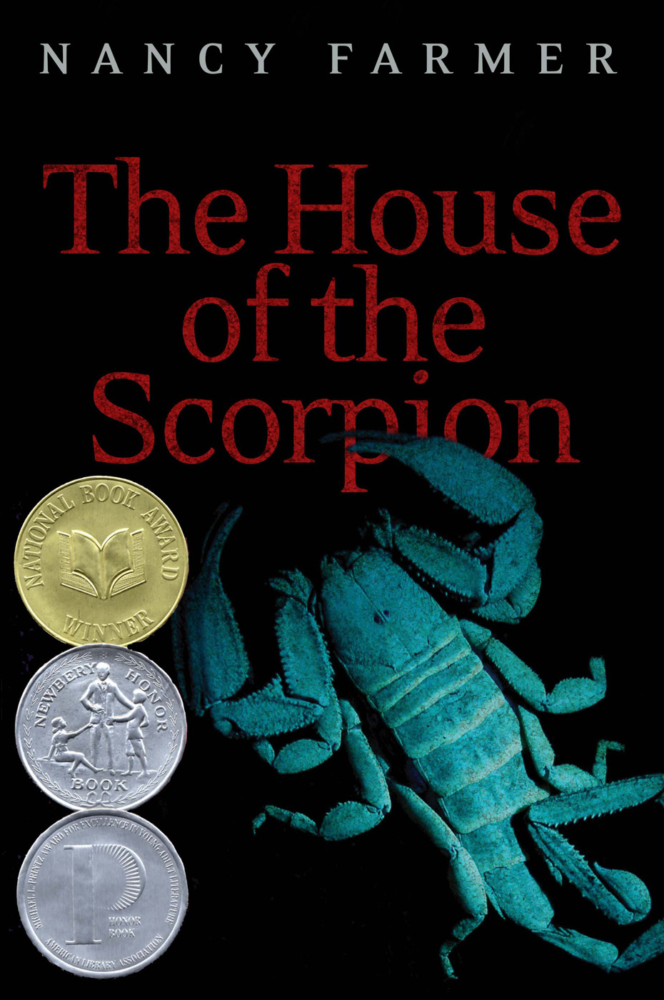](https://books.rob.me.uk/book/2092)
##### ethical · startling · cartel
##### Nancy Farmer
##### Sci-Fi, 2002, 380 pages

Cloning and human harvesting meet drug cartel brutality. Intensely vivid and disturbing, this philosophical thriller interrogates what exactly defines a human soul.

Matteo Alacrán is the exact genetic duplicate of El Patrón, a 140-year-old, ruthlessly powerful drug lord. Cultivated purely as a spare parts bank to ensure his creator's immortality, Matt must escape his gilded cage before his body is inevitably harvested.

#### [The Book Thief](https://books.rob.me.uk/book/366)
[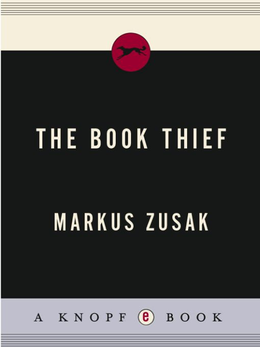](https://books.rob.me.uk/book/366)
##### narrated · haunting · profound
##### Markus Zusak
##### Historical Fiction, 2005, 584 pages

The horrors of WWII are uniquely filtered through the weary perspective of Death. Breathtakingly poetic prose elevates a devastatingly beautiful tribute to the undeniable power of words.

In 1939 Nazi Germany, nine-year-old Liesel Meminger survives by stealing books. As bombs fall and her foster family hides a Jewish fist-fighter from the Gestapo, Liesel’s stolen words become the only fragile light in a world descending into absolute darkness.

#### [Demon Copperhead](https://books.rob.me.uk/book/1727)
[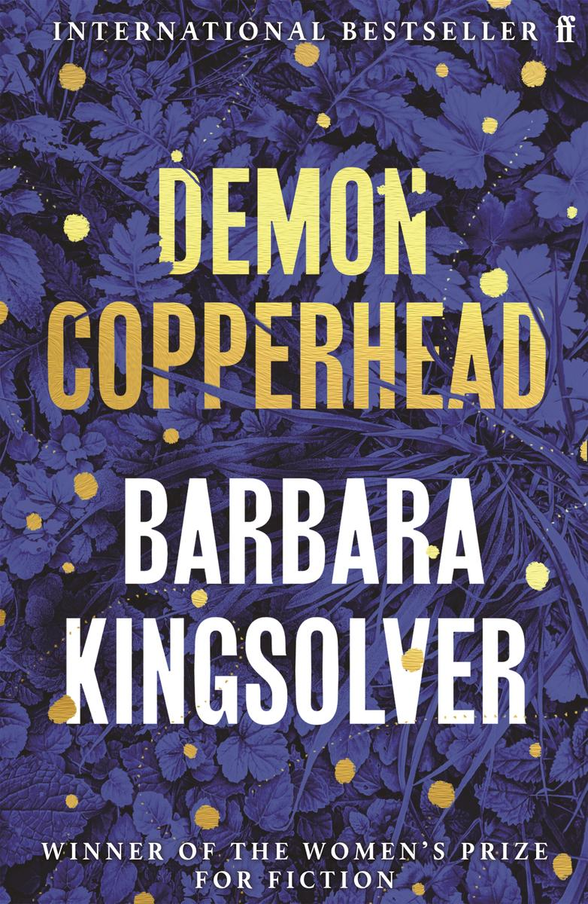](https://books.rob.me.uk/book/1727)
##### blistering · resilient · modern
##### Barbara Kingsolver
##### Fiction, 2022, 546 pages

Dickens is violently transposed onto the opiate-ravaged landscape of modern Appalachia. Robust and defiant, the epic narrative is carried entirely by its unforgettable, battered protagonist.

Born in a single-wide trailer, Demon fights an immediate uphill battle against poverty, institutional failure, and the opioid crisis. Armed with sharp wit and artistic talent, he navigates a brutal coming-of-age journey exposing the invisible heartbreaks of rural America.

#### [The Zombie Room](https://books.rob.me.uk/book/2080)
[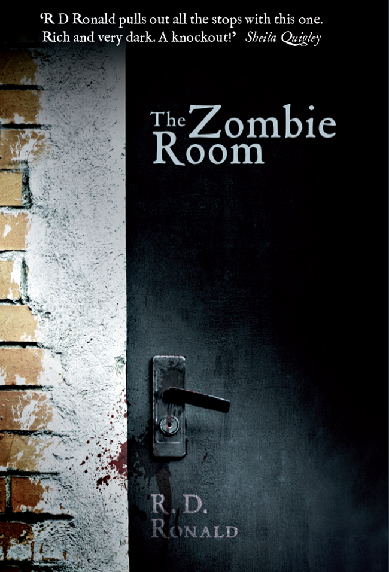](https://books.rob.me.uk/book/2080)
##### gritty · underworld · bleak
##### R.D. Ronald
##### Thriller, 2013, 310 pages

The merciless mechanics of human trafficking take center stage. Relentless and unapologetically grim, the hardboiled narrative thrives in a cynical neo-noir reality devoid of happy endings.

A nightclub bouncer gets violently pulled into a high-stakes, subterranean operation run by a ruthless syndicate. Navigating illegal immigrants and corrupt officials, he learns that surviving the "zombie room" requires abandoning every moral code he ever possessed.

#### [A Great and Terrible Beauty](https://books.rob.me.uk/book/1728)
[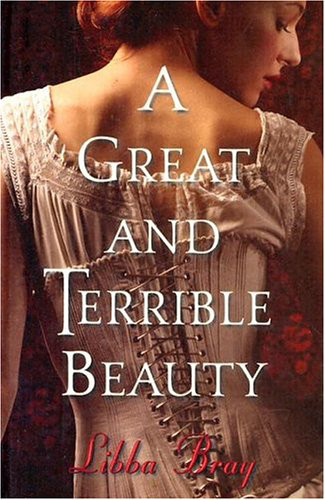](https://books.rob.me.uk/book/1728)
##### gothic · secretive · enchanting
##### Libba Bray
##### Fantasy, 2003, 403 pages

Suffocating Victorian etiquette masks terrifying, intoxicating magic. Corset-laced rebellion meets dark historical fiction in a realm packed with supernatural mysteries and deadly illusions.

Shipped off to the dreary Spence Academy in London, sixteen-year-old Gemma Doyle is plagued by terrifying visions. She discovers a hidden gateway to a dangerous realm that grants her intoxicating power—and threatens to unravel her sanity entirely.

#### [Princess Academy](https://books.rob.me.uk/book/1729)
[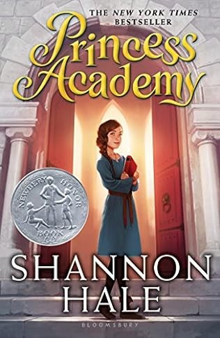](https://books.rob.me.uk/book/1729)
##### charming · mountain · diplomatic
##### Shannon Hale
##### Fantasy, 2005, 314 pages

Commerce and rural empowerment disguise themselves as a fairy tale. Grounded and character-driven, the narrative focuses on the transformative power of education and community over combat.

When the prince’s future bride must be chosen from an impoverished mountain village, young Miri is forced to attend a rigorous academy. Instead of merely learning to curtsy, she discovers the power of reading, eventually leading a rebellion to save her home.

#### [The Tower of Nero](https://books.rob.me.uk/book/1703)
[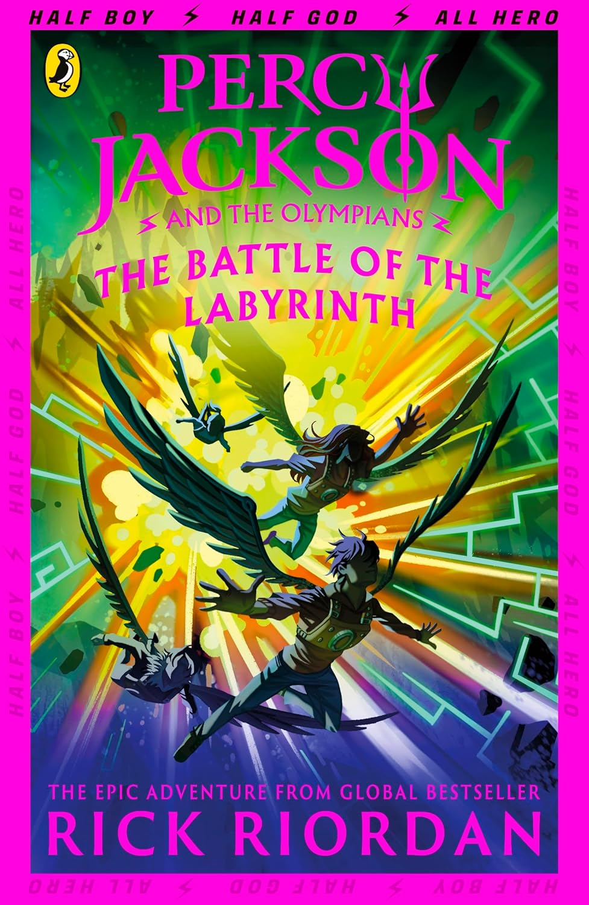](https://books.rob.me.uk/book/1703)
##### hilarious · desperate · final
##### Rick Riordan
##### Fantasy, 2020, 410 pages

Slapstick humor masks genuinely devastating sacrifices. Reaching its emotional zenith, the fallen god's arc concludes in a deeply satisfying, explosive triumph for the mythological universe.

Lester Papadopoulos—formerly the glorious sun god Apollo—must storm the heavily fortified Tower of Nero in Manhattan. Stripped of his immortality and relying on a motley crew of demigods, he faces his ancient nemesis to reclaim his throne or die a mortal.

#### [Punk 57](https://books.rob.me.uk/book/2053)
[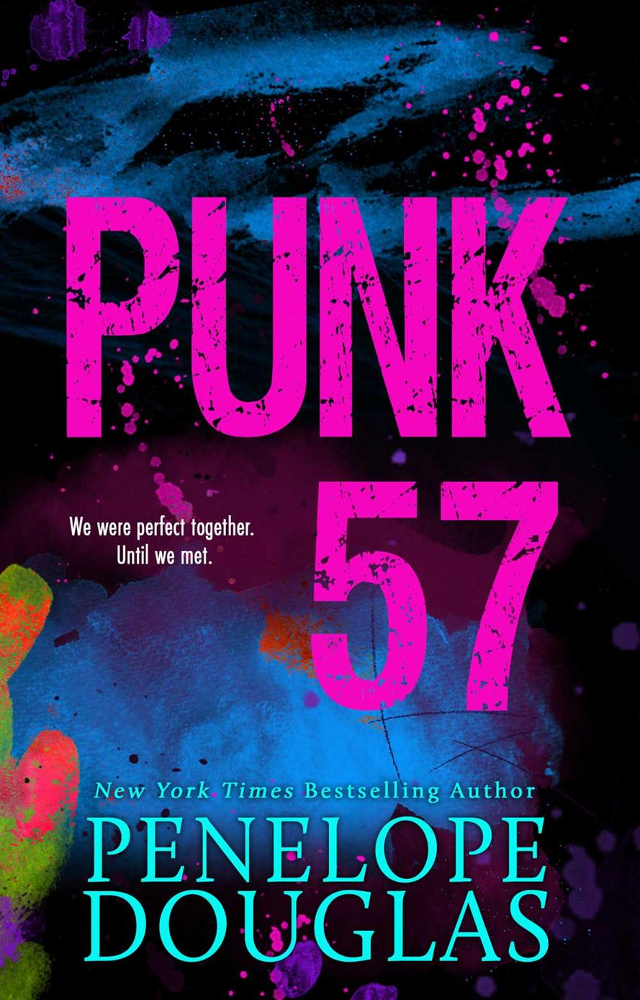](https://books.rob.me.uk/book/2053)
##### angsty · explosive · deceptive
##### Penelope Douglas
##### Romance, 2016, 343 pages

Hidden identities combust against public personas. Toxic, volatile high-school chemistry fuels an enemies-to-lovers dynamic built entirely on a foundation of betrayal and letters.

Misha and Ryen have been anonymous pen pals since fifth grade. But when a chance encounter exposes the truth, Misha realizes the poetic girl he fell for is actually the meanest cheerleader in school—and he intends to make her pay for the deception.

#### [Ghosts](https://books.rob.me.uk/book/2046)
[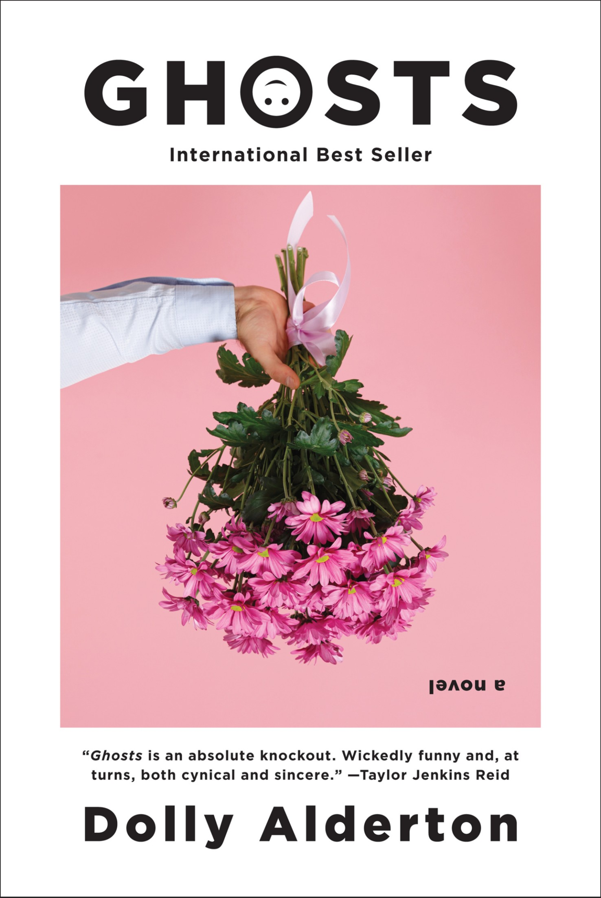](https://books.rob.me.uk/book/2046)
##### relatable · modern · witty
##### Dolly Alderton
##### Fiction, 2020, 352 pages

Modern dating and shifting friendships collide with the terror of aging parents. Observational humor cuts deep, hitting the chaotic, unpredictable terrain of early-thirties anxiety.

Food writer Nina Dean's life derails the moment she downloads a dating app and her perfect match vanishes into thin air. Suddenly, she must navigate the absurdities of modern ghosting while everyone around her seemingly moves on without her.

#### [Things I Wanted to Say, But Never Did](https://books.rob.me.uk/book/2055)
[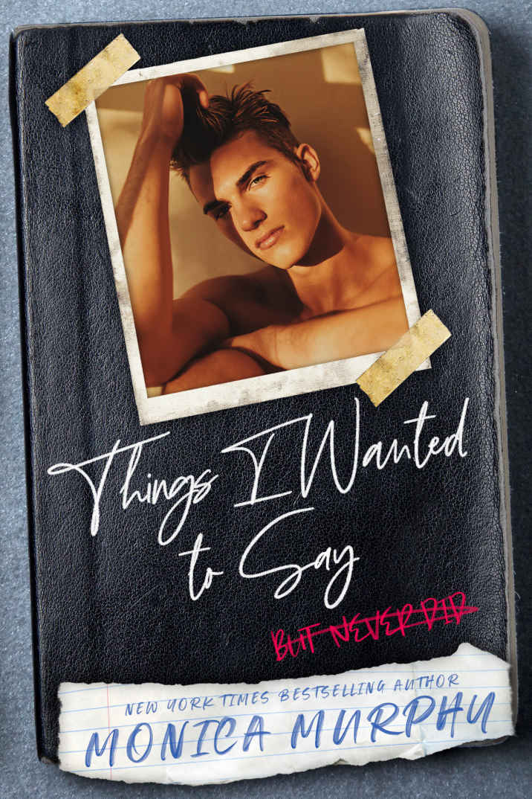](https://books.rob.me.uk/book/2055)
##### emotional · turbulent · intense
##### Monica Murphy
##### Romance, 2021, 380 pages

Miscommunication fuels intense, dark infatuation. Heavy, lingering tension dominates this high school drama, thriving on the friction between misunderstood bad boys and stolen secrets.

Whit Lancaster is the arrogant, dangerous king of his elite prep school. When a stolen diary exposes Summer's unfiltered thoughts to him, she finds herself trapped in a devastating game of manipulation that threatens to burn both their lives to the ground.

#### [Picking Daisies on Sundays](https://books.rob.me.uk/book/2056)
[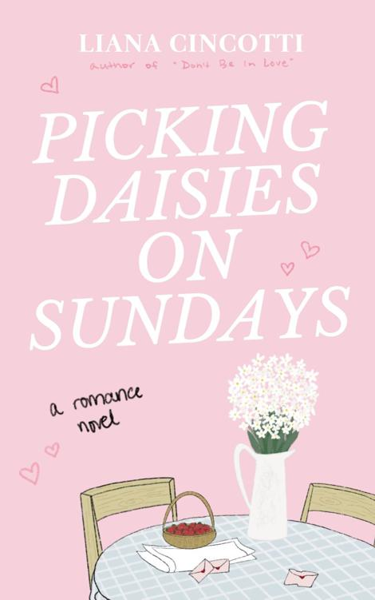](https://books.rob.me.uk/book/2056)
##### tender · nostalgic · healing
##### Liana Cincotti
##### Fiction, 2023, 290 pages

The non-linear process of grieving is beautifully observed. Deeply empathetic and quiet, the restorative narrative untangles emotional resilience amidst overgrown gardens and forgotten letters.

Fleeing a shattered career, a young woman retreats to her grandmother's dilapidated countryside cottage. Untangling a decades-old family secret, she is finally forced to face her paralyzing fears of the future and rebuild her life from the ground up.

#### [Woke Up Like This](https://books.rob.me.uk/book/2057)
[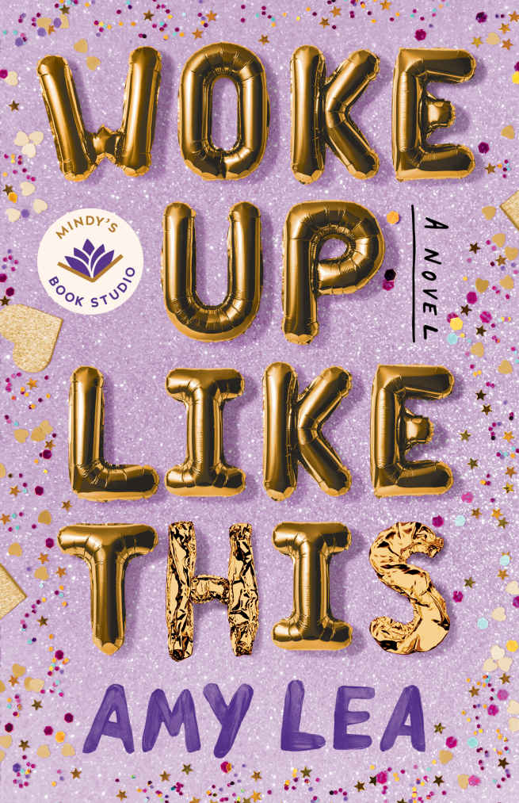](https://books.rob.me.uk/book/2057)
##### cinematic · hilarious · nostalgic
##### Amy Lea
##### Romance, 2023, 336 pages

Millennial nostalgia fuels a classic body-swap comedy. Sharp humor and delightfully awkward romantic tension create a buoyant, wildly entertaining homage to early-2000s cinema.

Determined to have the perfect prom, high school senior Charlotte wakes up trapped in the body of her thirty-year-old self. Engaged to her sworn teenage nemesis, she must navigate a bizarre adult reality while desperately searching for a way back to 2003.

#### [The Stars Don't Lie](https://books.rob.me.uk/book/2058)
[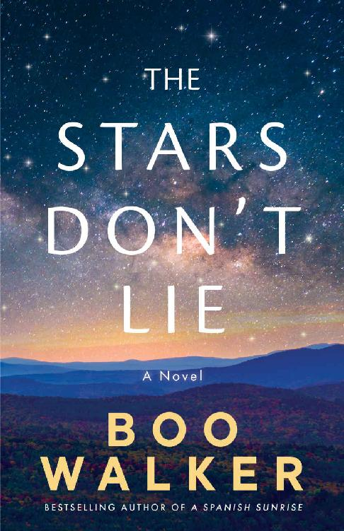](https://books.rob.me.uk/book/2058)
##### wistful · coastal · reflective
##### Boo Walker
##### Fiction, 2022, 350 pages

The magnetic pull of home forces a reckoning with regret. Grounded entirely by its foggy coastal setting, the emotional drama explores the painful necessity of second chances.

Celebrated veterinarian Dr. Carver hides a lifetime of guilt behind his career. A desperate phone call forces him back to the isolated town he abandoned, demanding he confront the woman he left behind and the tragic accident that shattered them both.

#### [Howl's Moving Castle](https://books.rob.me.uk/book/2059)
[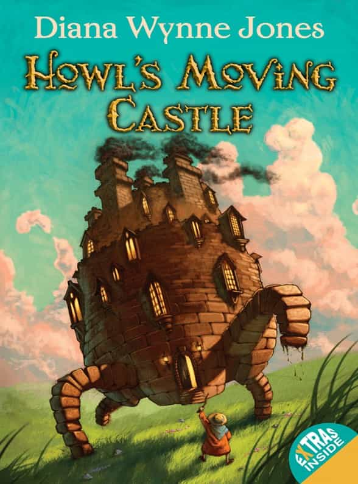](https://books.rob.me.uk/book/2059)
##### enchanting · chaotic · brilliant
##### Diana Wynne Jones
##### Fantasy, 1986, 329 pages

Misdirection and cranky wizards rule a highly logical magic system. Delightfully dry humor secures this wildly inventive fairy tale as an absolute masterpiece of whimsical fantasy.

Cursed into the body of an old woman, Sophie Hatter seeks refuge in the mechanical castle of the infamous Wizard Howl. Striking a dangerous bargain with a fire demon, she must unravel the chaotic mysteries of Howl's life to break her own spell.

#### [West with Giraffes](https://books.rob.me.uk/book/2060)
[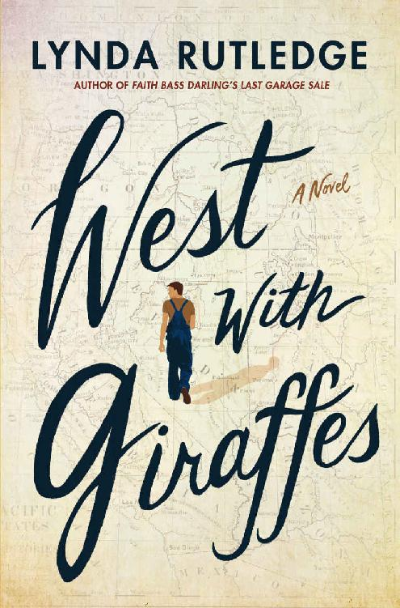](https://books.rob.me.uk/book/2060)
##### historical · adventurous · heartwarming
##### Lynda Rutledge
##### Historical Fiction, 2021, 371 pages

A cross-country animal transport becomes a soaring emotional road trip. Evocative prose captures the dust-choked desperation of 1930s America and the profound bond between man and beast.

It's 1938, and a hurricane has dumped two African giraffes on the New York docks. An orphaned teenager and an old zookeeper embark on a treacherous twelve-day drive to deliver the animals to San Diego before ruthless circus owners steal them.

#### [Sunday Morning](https://books.rob.me.uk/book/2061)
[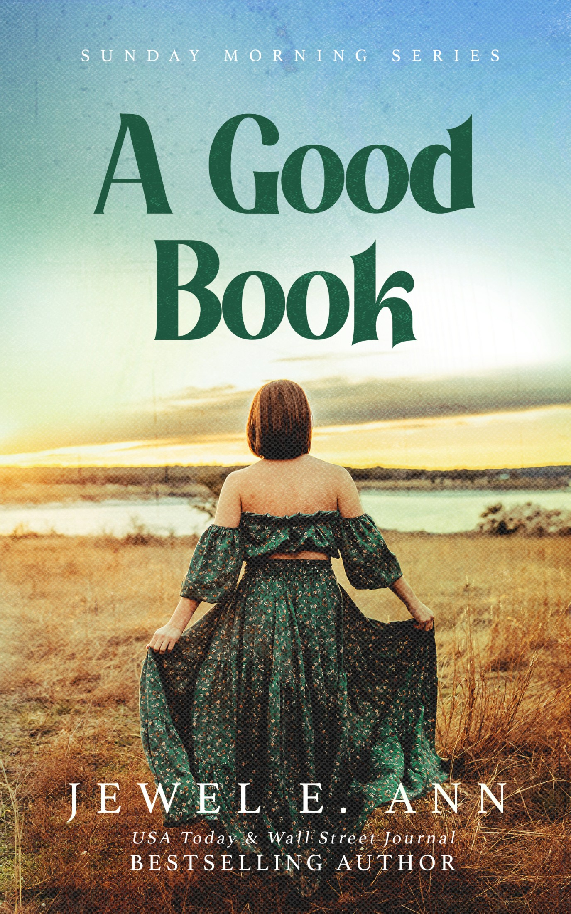](https://books.rob.me.uk/book/2061)
##### angsty · complicated · emotional
##### Jewel E. Ann
##### Romance, 2023, 340 pages

The messy realities of timing and sacrifice refuse to be ignored. Heavy and emotionally complex, the narrative embraces the significant real-world friction of starting over.

Caught between a tragic past and a new future, an overwhelmed single father struggles to keep his family afloat. When a fiercely independent woman barrels into his structured life, their undeniable connection threatens to unravel everything he’s worked so hard to protect.

#### [Wicked Lovely](https://books.rob.me.uk/book/2062)
[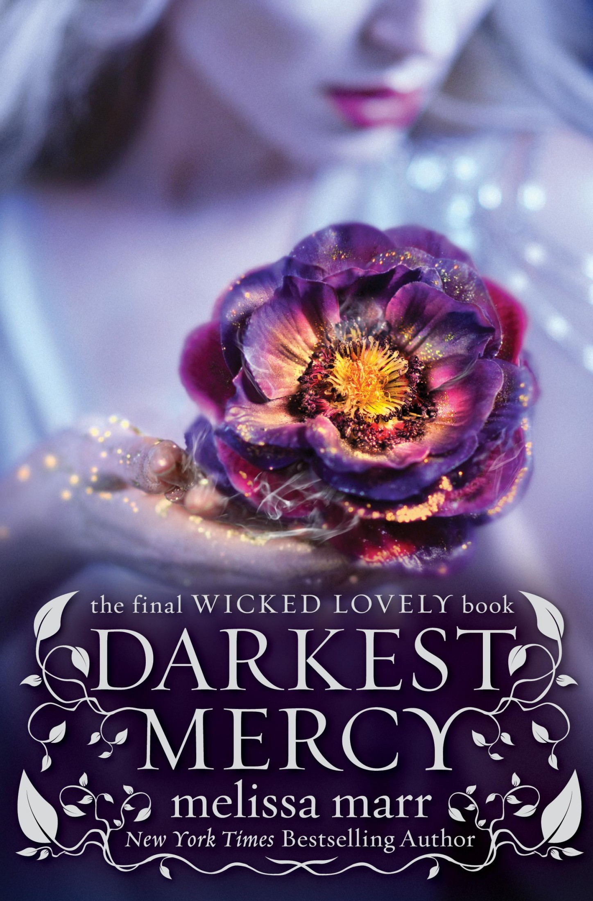](https://books.rob.me.uk/book/2062)
##### dark · fae · chilling
##### Melissa Marr
##### Fantasy, 2007, 328 pages

Terrifying, manipulative immortals hide in plain sight. Suffocating and dangerous, this pioneer of urban fae folklore thrives on lethal court politics and broken rules.

Seventeen-year-old Aislinn survives by ignoring the invisible faeries roaming her city. But the Summer King has found her, and he intends to make her his queen—whether the transition kills her mortal body or not.

#### [Gallant](https://books.rob.me.uk/book/2063)
[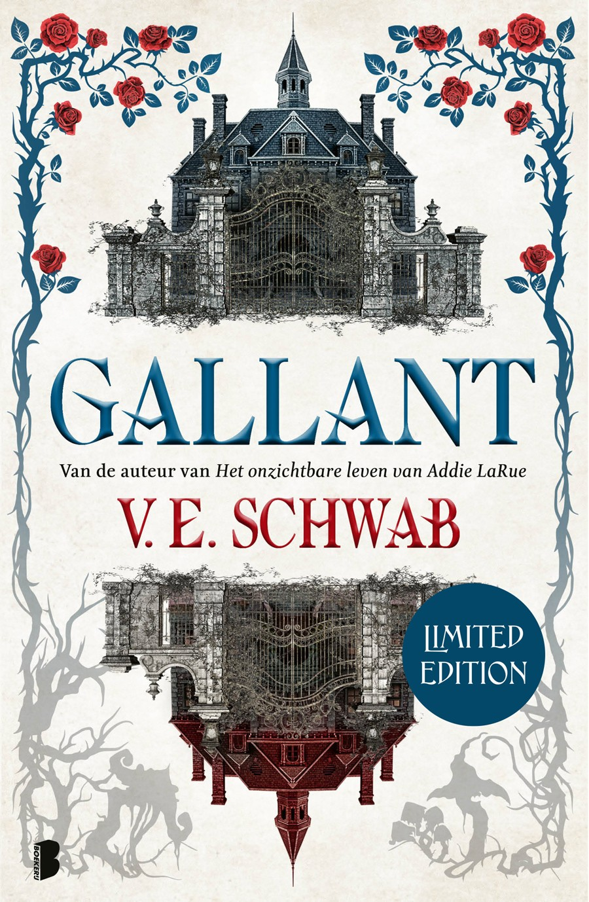](https://books.rob.me.uk/book/2063)
##### gothic · haunting · silent
##### V.E. Schwab
##### Fantasy, 2022, 352 pages

The line between the living and the dead blurs into a gothic puzzle-box. Heavily visual and steeped in shadow, the unsettling isolation grips the reader immediately.

Mute and alone, Olivia Prior receives an invitation to Gallant, an ancestral estate she never knew. There, a ruined wall separates her world from a terrifying, shadow-drenched reflection of the manor, where the master of the house waits for her.

#### [Vow of Thieves](https://books.rob.me.uk/book/2081)
[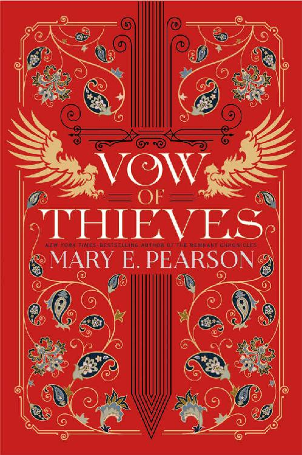](https://books.rob.me.uk/book/2081)
##### political · strategic · intense
##### Mary E. Pearson
##### Fantasy, 2019, 480 pages

Intricate warfare and brutal betrayals replace traditional magic. Massive stakes provide a strategic, deeply satisfying thrill ride fueled by court intrigue and battle-hardened resilience.

Kazi and Jase secured their kingdom only to ride into a horrifying ambush at their own borders. Stripped of their titles and thrown into a treacherous rebel game, they must use every manipulative trick to reclaim their throne from the inside.

#### [Paper Towns](https://books.rob.me.uk/book/374)

##### mysterious · elusive · humorous
##### John Green
##### Fiction, 2008, 305 pages

The "Manic Pixie Dream Girl" trope is sharply deconstructed. Snappy, philosophical dialogue drives a teenage road-trip mystery that forces its protagonist to face reality.

Quentin Jacobsen loves the enigmatic Margo Roth Spiegelman from afar. After an all-night revenge spree, she vanishes, leaving behind obscure clues that Quentin must decipher—only to discover the girl he idolizes doesn't want to be found.

#### [Fablehaven](https://books.rob.me.uk/book/2065)
[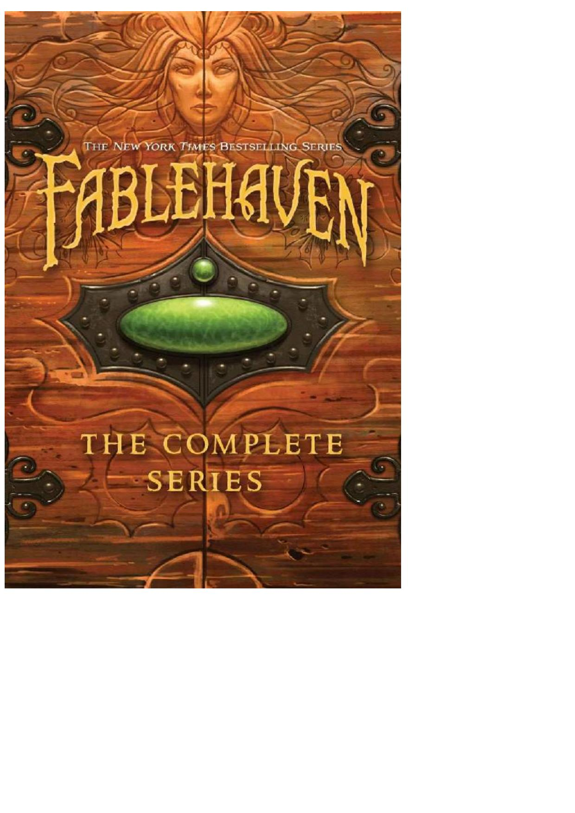](https://books.rob.me.uk/book/2065)
##### wondrous · dangerous · secretive
##### Brandon Mull
##### Fantasy, 2006, 351 pages

Magical sanctuaries are highly volatile and incredibly lethal. Scaling rapidly from innocent discovery to terrifying survival, the spectacular world-building unleashes absolute mythological peril.

Kendra and Seth discover their grandfather’s estate is Fablehaven—a secret preserve for mythical creatures. When Seth breaks a fundamental rule, he unleashes a dark, ancient evil, forcing the siblings to fight for their lives against fairies, trolls, and demons.

#### [Vampire Academy Collection](https://books.rob.me.uk/book/2066)
[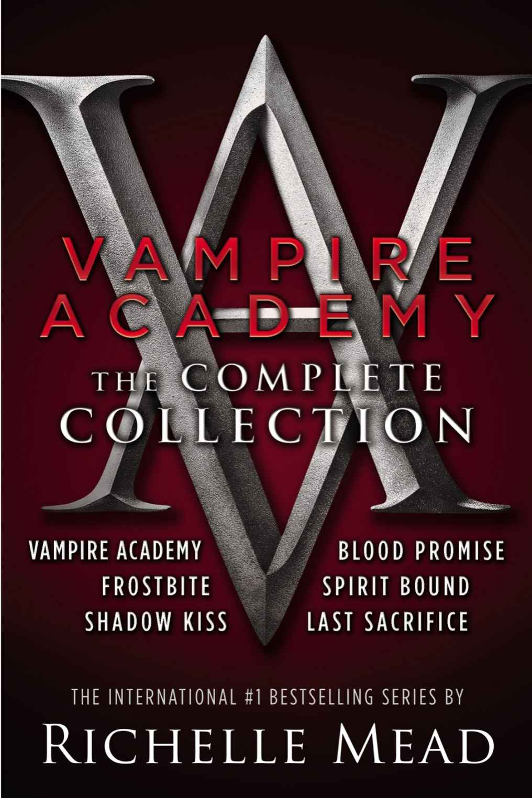](https://books.rob.me.uk/book/2066)
##### fierce · political · dramatic
##### Richelle Mead
##### Fantasy, 2013, 1600 pages

Supernatural court politics clash with intense bodyguard training. Legendary character dynamics anchor this massive, high-stakes epic of forbidden romance and fierce loyalty.

Rose Hathaway is a half-vampire bodyguard sworn to protect mortal princess Lissa from the bloodthirsty Strigoi. Dragged back to St. Vladimir's Academy, Rose navigates deadly conspiracies, lethal training, and an illicit attraction to her disciplined instructor.

#### [The Reappearance of Rachel Price](https://books.rob.me.uk/book/2067)
[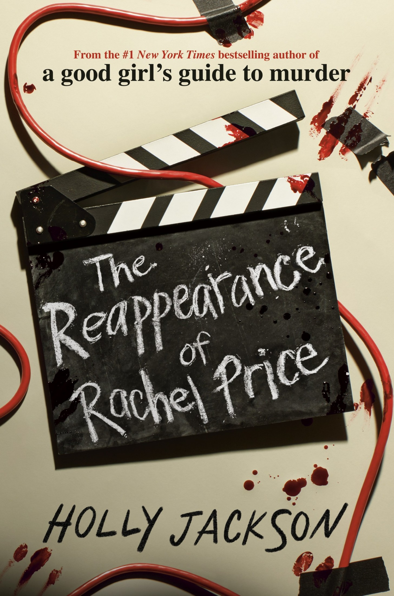](https://books.rob.me.uk/book/2067)
##### twisty · claustrophobic · shocking
##### Holly Jackson
##### Thriller, 2024, 400 pages

A true-crime documentary warps into a living nightmare. Relentless and deeply paranoid, the structure expertly forces the reader to doubt the motives of every single character.

Sixteen years after vanishing, Rachel Price miraculously walks out of the woods right in the middle of a documentary about her disappearance. But her daughter, Bel, is completely convinced her long-lost mother is lying about where she’s been.

#### The Judgment Of Biestia
##### dark · mythic · vengeful
##### Christopher Bernard
##### Fantasy, 2015, 320 pages

Forgotten folklore demands a monstrous reckoning. Drenched in dread, the slow-burn horror narrative punishes the ruling class for centuries of arrogant neglect.

An ancient, dormant god awakens beneath a fractured kingdom, demanding an impossible toll. As monstrous forces slaughter the elite, a disgraced knight navigates dark magic and buried betrayals to stop a judgment that threatens humanity's total erasure.

#### [The Alchemyst](https://books.rob.me.uk/book/2082)
[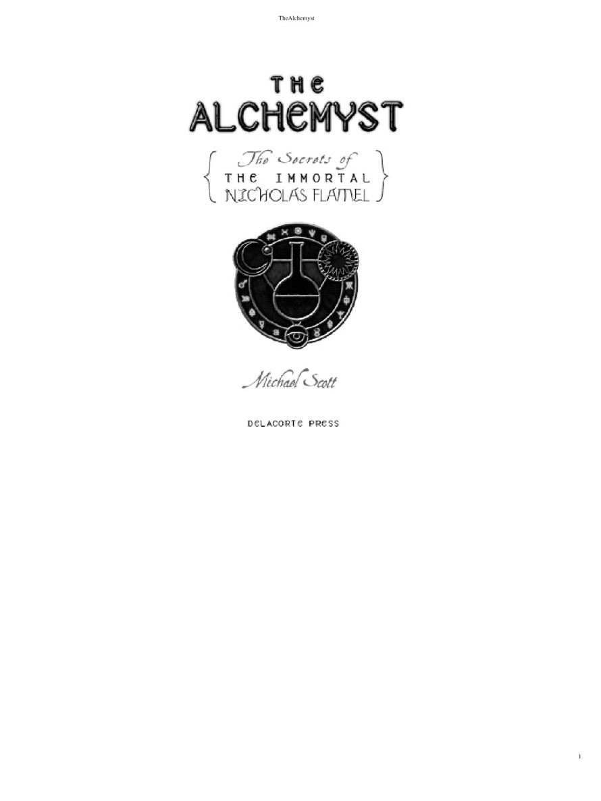](https://books.rob.me.uk/book/2082)
##### mythic · fast-paced · historical
##### Michael Scott
##### Fantasy, 2007, 375 pages

Historical figures are thrust into a blistering modern magical war. Explosive action and colliding mythologies transform San Francisco into a spectacular, high-stakes urban battlefield.

Ordinary summer jobs turn lethal when Sophie and Josh Newman discover their boss is the immortal alchemist Nicholas Flamel. The teenage twins are dragged into a terrifying ancient battle to protect the Book of Abraham from Dr. John Dee.

#### Nothing Better Than You
##### sweet · hilarious · competitive
##### Lynn Painter
##### Romance, 2023, 320 pages

Rivalry provides the perfect architecture for undeniable chemistry. Snapping with quick wit, the banter-heavy rom-com delivers pure, joy-inducing friction for enemies-to-lovers fans.

Two fiercely competitive high school debaters are forced to team up for a state championship. As late-night research sessions blur into reluctant friendship, they realize winning the tournament might actually mean losing their hearts to each other.

#### [Daughter of the Moon Goddess](https://books.rob.me.uk/book/1903)
[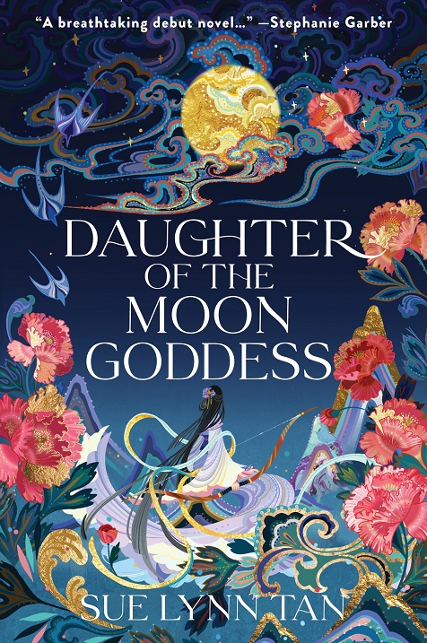](https://books.rob.me.uk/book/1903)
##### lush · celestial · sweeping
##### Sue Lynn Tan
##### Fantasy, 2022, 512 pages

Chinese mythology anchors a breathtakingly beautiful celestial war. Lavish world-building and lyrical prose elevate a deeply emotional journey of honorable sacrifice and fierce devotion.

Discovered by the ruthless Celestial Emperor, Xingyin flees her home on the moon. Disguised in the treacherous Immortal Realm, she masters archery and magic, vowing to win a dangerous tournament and earn her mother's freedom.

#### [Catch the Sun](https://books.rob.me.uk/book/2069)
[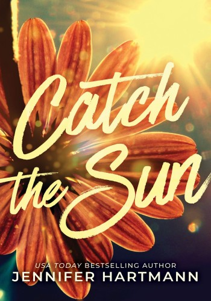](https://books.rob.me.uk/book/2069)
##### gritty · emotional · turbulent
##### Jennifer Hartmann
##### Romance, 2023, 400 pages

Grief is explored at its absolute deepest depths. Punishing emotional stakes guarantee a profoundly hard-won romance that fights tooth and nail back to the light.

Max buries his trauma in isolation, running from the shadow of his father's horrific crimes. When blinding optimism crashes into his life via a woman who refuses to give up, he must confront his demons or destroy his only salvation.

#### [The Half King](https://books.rob.me.uk/book/2091)
[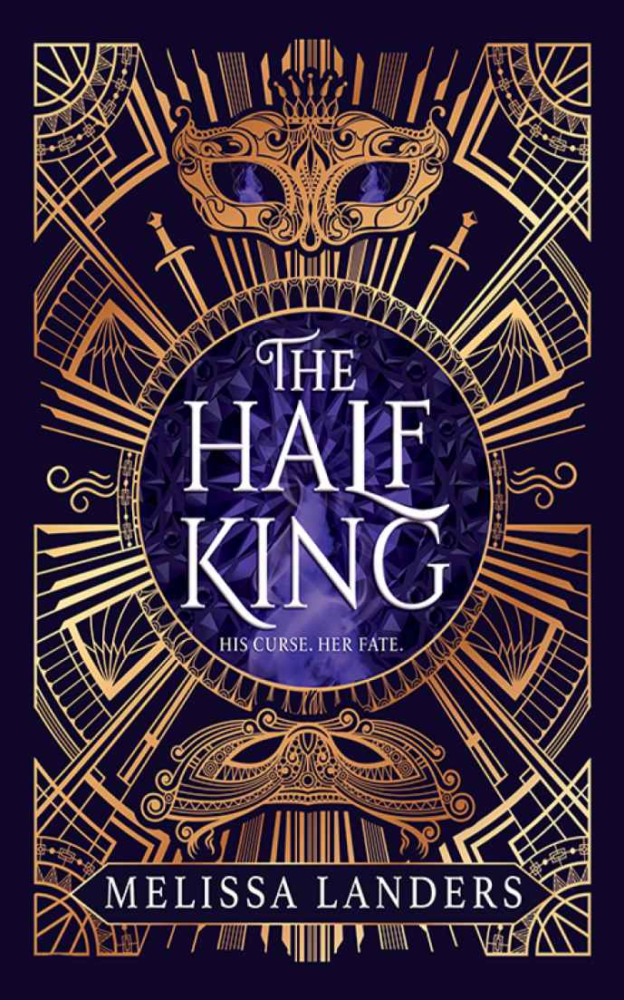](https://books.rob.me.uk/book/2091)
##### brutal · calculating · vengeful
##### Melissa Landers
##### Fantasy, 2022, 380 pages

Cutthroat kingdom politics demand bloody survival. Ruthlessly pragmatic, the narrative offers an unapologetically dark perspective driven by meticulous, calculated vengeance rather than noble heroics.

Prince Yarvi never expected to rule his warrior society. But when his father is murdered and Yarvi is betrayed and sold into slavery, he sparks a decades-long campaign to reclaim his throne and annihilate his enemies.

#### [Credence](https://books.rob.me.uk/book/2070)
[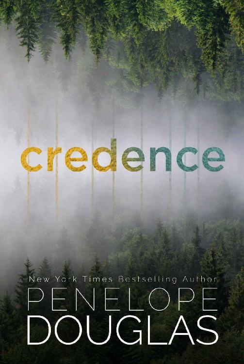](https://books.rob.me.uk/book/2070)
##### taboo · isolated · intense
##### Penelope Douglas
##### Romance, 2020, 485 pages

Claustrophobic tension thrives in a freezing, isolated landscape. Divisive and boundary-pushing, the psychological thriller blurs morality with transgressive, highly controversial romantic dynamics.

Orphaned Tiernan is sent to live with her estranged step-uncle and his two sons in a remote, snowed-in cabin. Cut off from the world, the four engage in an emotionally twisted dynamic that challenges every societal rule.

#### [Tom Lake](https://books.rob.me.uk/book/2071)
[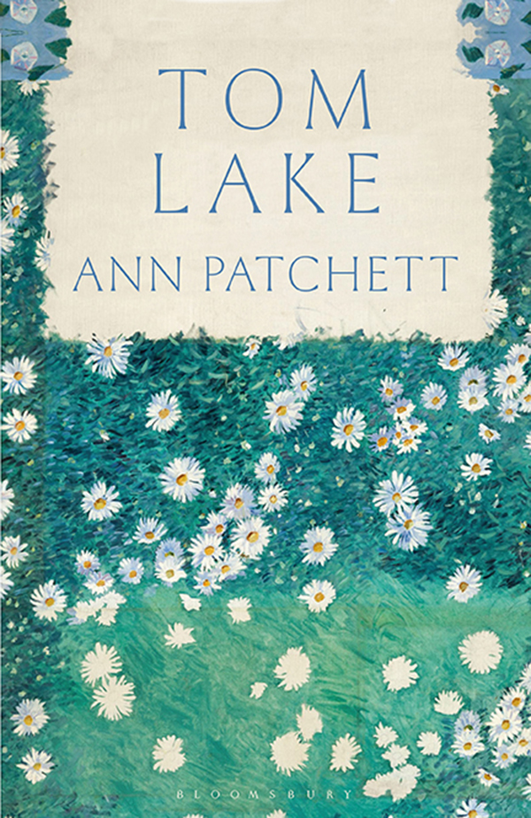](https://books.rob.me.uk/book/2071)
##### wistful · maternal · theatrical
##### Ann Patchett
##### Fiction, 2023, 309 pages

The chaotic allure of fame is weighed against a quiet, steady life. Warm, reflective prose delivers a masterclass in gentle, deeply comforting intergenerational storytelling.

During lockdown, three daughters beg their mother to recount the summer she dated a famous actor in the 1980s. Unspooling the glamorous truth, her children are forced to completely reconsider everything they know about their mother's past.

#### [Lessons In Faking](https://books.rob.me.uk/book/2072)
[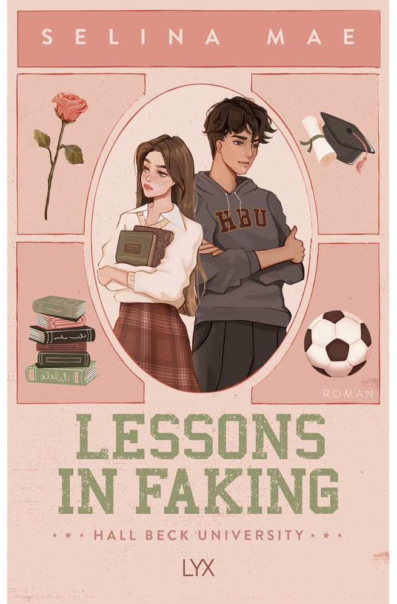](https://books.rob.me.uk/book/2072)
##### breezy · fake-dating · fun
##### Selina Mae
##### Romance, 2022, 280 pages

The fake-dating trope is executed with bubbly, predictable charm. Swift pacing and deeply entertaining setups deliver exactly the lighthearted escapism contemporary romance readers crave.

Desperate to appease her family, an ambitious woman hires a chaotic actor to play her boyfriend at a wedding. The strict rules of their arrangement dissolve immediately, leading to disastrous encounters and a massive blurring of lines.

---