## Guardian Summer Reads

The Guardian picks Summer Reads each year.
There's a link to the original pieces too.

### Summer Reads 2026

<a href="https://www.theguardian.com/books/ng-interactive/2026/jun/13/70-brilliant-books-for-the-summer" target="_blank">Original Guardian piece here</a>

#### [Transcription](https://books.rob.me.uk/book/2020)
[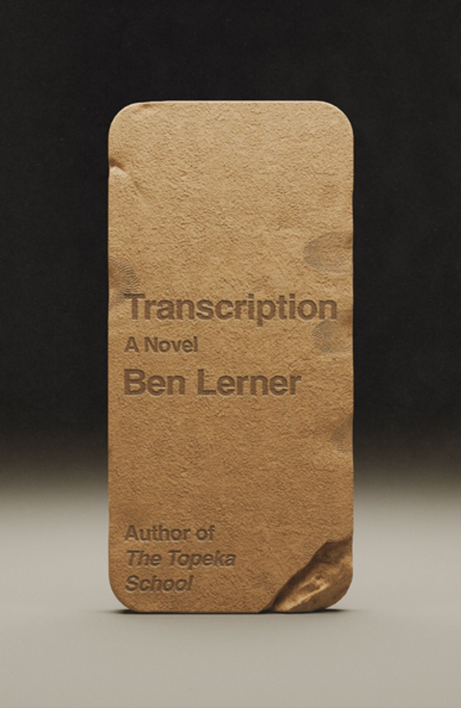](https://books.rob.me.uk/book/2020)
##### cerebral · existential · modern
##### Ben Lerner
##### Fiction, 2024, 256 pages

> The Guardian says: "A middle-aged writer returns to his college town to record the final interview with his 90-year-old intellectual mentor. But he’s broken his phone, and doesn’t seem able to confess that it’s not recording … this anxiety dream of a beginning leads us into a series of sharp insights into family, memory, inheritance and storytelling – all that it means to be human, and how smartphones are changing our sense of the world at every level."

Lerner’s distinctively hyperspecific prose style perfectly captures the dizzying paralysis of contemporary life, appealing directly to fans of deeply introspective auto-fiction. 

A broken screen spirals into a profound crisis of memory and mortality. Dive into the brilliant, neurotic mind of an artist desperately trying to hit record on his own legacy before time runs out.

#### Land
##### evocative · sweeping · roots
##### Maggie O’Farrell
##### Fiction, 2024, 384 pages

> The Guardian says: "Following Hamnet and The Marriage Portrait, O’Farrell’s latest historical novel has a personal connection. Inspired by an Irish ancestor who drew up maps for the English in the aftermath of the great famine, it builds into a multigenerational tale of folklore, migration and the meaning of home."

O'Farrell weaves a rich, lyrical tapestry of historical world-building, cementing her reputation as a master of sensory, atmospheric prose that will captivate lovers of literary genealogy.

Maps don't just divide earth; they sever bloodlines. Follow a brilliant cartographer through the devastating aftermath of the famine in a saga where every drawn line carries the weight of a stolen homeland.

#### [Yesteryear](https://books.rob.me.uk/book/1189)
[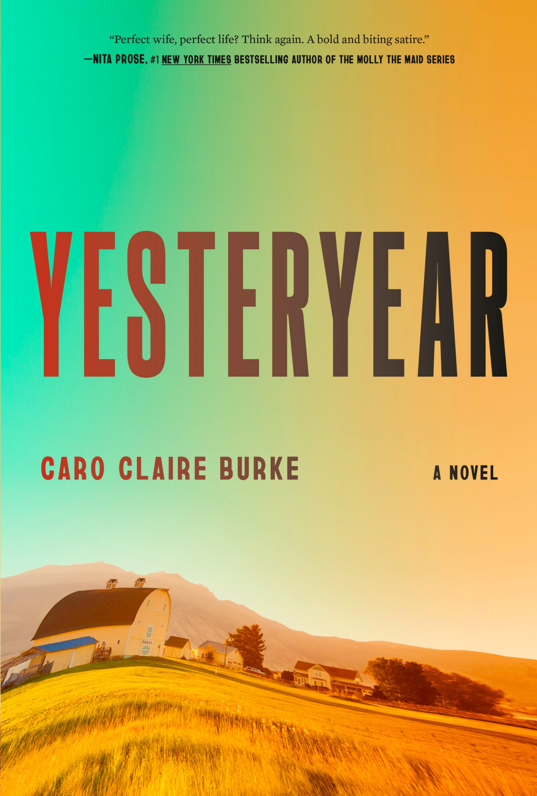](https://books.rob.me.uk/book/1189)
##### satirical · high-concept · gritty
##### Caro Claire Burke
##### Fiction, 2024, 320 pages

> The Guardian says: "A social media influencer pushing a confected olden-days lifestyle of babies, baking and prairie dresses wakes up in the actual olden days – to dirt, poverty and domestic abuse. Critics have argued about a lack of political depth in this buzzy tradwife debut, but there’s no denying the power of the high-concept hook – or the furious energy of the voice."

Burke wields a razor-sharp, furious narrative voice, deploying biting satire to dismantle romanticized aesthetics with visceral, grounding details that will thrill fans of dark, speculative contemporary fiction.

Forget the pastel filters of the modern tradwife. Plunged into the brutal, unwashed reality of the actual past, one influencer is about to discover that surviving history takes more than sourdough starter and a prairie dress.

#### John of John
##### tender · insular · lyrical
##### Douglas Stuart
##### Fiction, 2024, 400 pages

> The Guardian says: "In the much-anticipated new novel from the Booker-winning Shuggie Bain author, young Cal returns from art school to his childhood home on the Hebridean island of Harris, and his fervently religious father, John. Both men are keeping secrets in a heartfelt and gorgeously wrought tapestry of faith, isolation, community and gay love."

Stuart builds an impeccably textured atmosphere of remote Scottish isolation, utilizing empathetic, gorgeously wrought prose to explore the devastating intersections of faith and sexuality.

Two deeply estranged men are thrown into an emotional crucible on the wind-battered Hebridean coast. In this haunting exploration of fatherhood and forbidden love, the loudest secrets are the ones hidden in plain sight.

#### [The Palm House](https://books.rob.me.uk/book/2022)

##### wry · domestic · sharp
##### Gwendoline Riley
##### Fiction, 2024, 224 pages

> The Guardian says: "Riley excels at dysfunctional family relationships, but is on gentler form here with the story of a long friendship between two prickly souls: Putnam, ageing out of relevance, and Laura, making her precarious way through midlife. It’s a wry take on the comforts of comradeship and the frustrations of other people, with the prose – as ever – sharp as a knife."

Riley executes a masterclass in understated character study, leveraging painfully sharp dialogue and keen psychological realism to attract readers who savor quiet, devastating literary fiction.

Friendship is rarely simple, and getting older certainly isn't. Watch two spectacularly prickly souls navigate the indignities of midlife in a brilliantly observed comedy of manners that stings as much as it soothes.

#### [The Infamous Gilberts](https://books.rob.me.uk/book/2023)
[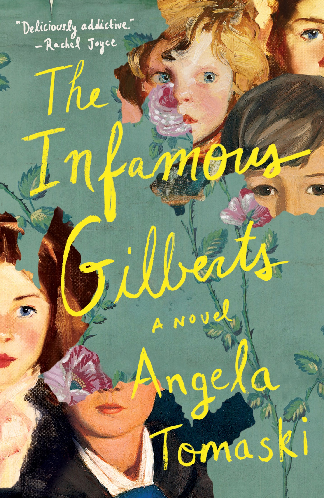](https://books.rob.me.uk/book/2023)
##### eccentric · cozy · nostalgic
##### Angela Tomaski
##### Fiction, 2024, 350 pages

> The Guardian says: "An irresistible old-fashioned comfort read about the slow demise of an eccentric family trapped in a crumbling stately home, as seen through their possessions and mementoes when the house is sold off, ready to be turned into a hotel. Romantic misadventures, dastardly characters, lost boys and lashings of atmosphere: it’s all here."

Tomaski crafts an immersive, antique tone that balances lighthearted mischief with melancholic decay, offering an irresistible retreat for readers seeking character-driven, classic estate dramas.

Every crumbling manor has its ghosts, but this one is selling them to the highest bidder. Unpack the scandalous heirlooms of a destitute dynasty in a charmingly chaotic romp through high-society ruin.

#### Honey
##### provocative · feminist · blood-soaked
##### Imani Thompson
##### Fiction, 2024, 310 pages

> The Guardian says: "Thompson’s buzzy debut follows Yrsa, a Black PhD student who embarks on a series of killings targeting men, each murder reminiscent of the violence more typically inflicted on women. A serial-killer thriller with a side of feminist theory, Thompson’s alchemical fusion of racial politics and “weird girl” fiction feels genuinely fresh."

Thompson engineers a ruthless, pulse-pounding pacing intertwined with fierce ideological critique, forging a wholly original crossover that will grip both thriller junkies and literary feminists.

Vengeance has a brand new syllabus. Follow a brilliant, deadly PhD student as she turns the horrifying statistics of gendered violence back on the perpetrators in a slasher that’s as intellectually rigorous as it is terrifying.

#### The Children
##### slippery · traumatic · dark
##### Melissa Albert
##### Fiction, 2024, 336 pages

> The Guardian says: "A bestselling children’s author writes her own kids into her much-loved fantasy series – then dies in mysterious circumstances. As adults, Guin and Ennis must reconcile to confront their traumatic legacy. Set between an isolated house in the woods in 1990s Vermont and present-day New York, this slippery investigation into the price of creativity is a dark fairytale."

Albert channels a deeply unsettling, gothic tone to interrogate the ethics of art, masterfully blending dual timelines to ensnare readers of sophisticated, psychological dark fantasy.

What happens when your mother’s legendary fairy tales ruin your actual life? Two siblings must venture back into the haunted woods of their childhood to untangle the deadly secrets behind the world's favorite bedtime stories.

#### Villa Coco
##### sun-drenched · joyful · eccentric
##### Andrew Sean Greer
##### Fiction, 2024, 288 pages

> The Guardian says: "A sunny holiday read about a young American falling for the delights of Italy when he takes a job as assistant to a 92-year-old aristocrat at the eponymous mansion in the Tuscan hills. Full of eccentric characters, it’s a love letter to friendship and discovery."

Greer orchestrates a buoyant, effervescent prose style that bathes the reader in sensory delight, crafting the ultimate escapist fiction for fans of warm, character-rich travelogues.

Trade the grind for the Tuscan sun. Step inside a rambling Italian estate where a lost American and a ninety-two-year-old aristocrat discover that the best adventures often begin well past the expiration date.

#### A Bad, Bad Place
##### grim · authentic · slow-burn
##### Frances Crawford
##### Fiction, 2024, 368 pages

> The Guardian says: "This slow-burn crime debut set in 1979 Glasgow begins when 12-year-old Janey, walking her dog Sid Vicious, comes across a body. Told in alternating chapters from Janey and her Nana, it’s a pitch-perfect depiction of time and place."

Crawford meticulously constructs a suffocating, authentic historical atmosphere, using brilliant dual perspectives to anchor a procedural that will resonate powerfully with fans of gritty Scottish noir.

In the grey, hopeless sprawl of 1979 Glasgow, a little girl and her dog stumble upon a corpse. Uncover the terrifying truths of a broken city through the eyes of a child who sees far more than the adults want to admit.

#### Prestige Drama
##### sparkling · tragicomic · ensemble
##### Seamus O’Reilly
##### Fiction, 2024, 304 pages

> The Guardian says: "A major new TV series about the Troubles is to be filmed in Derry – but its Hollywood star has gone missing. The first novel from the author of the tragicomic memoir Did Ye Hear Mammy Died? is a sparkling ensemble portrait of a city still dealing with its difficult past."

O’Reilly delivers a masterfully tuned tragicomic voice, balancing razor-sharp banter with profound historical sensitivity in a way that will enchant lovers of intelligent, community-focused satire.

Hollywood has descended on Derry, and it's an unmitigated disaster. When an A-list actor vanishes into the chaotic streets of a recovering city, the locals must navigate the absurd collision of traumatic history and shallow show business.

#### Nonesuch
##### magical · romantic · thrilling
##### Francis Spufford
##### Fiction, 2024, 416 pages

> The Guardian says: "In a London on the brink of the second world war, an ambitious young woman working in the City stumbles into a magical realm of angels, time travel, possible worlds – and a fascist conspiracy to assassinate Winston Churchill and usher in a Nazi future for Britain. Packed with adventure and romance, this delightful fantasy has teeth – a very grown-up pleasure."

Spufford brilliantly marries historical tension with expansive, sophisticated fantasy mechanics, offering a luscious, high-stakes romp perfectly tailored for readers of erudite, adult speculative fiction.

History hangs by a thread of magic. Join a fearless young woman on a dimension-hopping race against time to thwart a fascist conspiracy and save Winston Churchill in a dizzying blend of espionage and the occult.

#### [Black Bag](https://books.rob.me.uk/book/2024)
[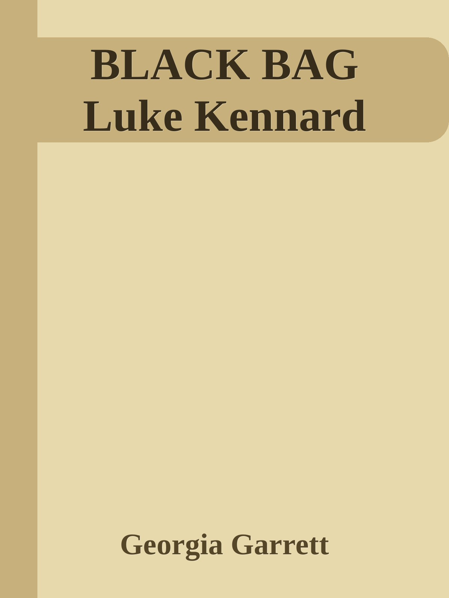](https://books.rob.me.uk/book/2024)
##### absurd · comical · theatrical
##### Luke Kennard
##### Fiction, 2024, 240 pages

> The Guardian says: "As part of a psychology experiment, a struggling actor agrees to appear in university lectures zipped into a large black leather bag with only his feet sticking out, and see how the students react. From this premise, Kennard spins a charming and comical discourse on the absurdity of modern life, riffing on everything from the perilous state of the arts to masculinity and the disappearing horizon of adulthood."

Kennard deploys a brilliantly deadpan, theatrical prose style to dissect contemporary masculinity, resulting in a surreal, philosophically rich comedy that will charm fans of experimental campus novels.

An actor, a leather bag, and the crushing weight of modern existence. What starts as a bizarre university stunt morphs into a hilarious, poignant interrogation of art, survival, and what it actually means to be seen.

#### The Daffodil Days
##### lyrical · ambitious · luminous
##### Helen Bain
##### Fiction, 2024, 380 pages

> The Guardian says: "A lyrical, impeccably researched reimagining of the final year in the marriage of Sylvia Plath and Ted Hughes, as seen by their friends and neighbours in the small Dartmoor town they escape to from London. With multiple narrators and a reverse chronology, it’s an ambitious and impressively achieved debut, and a luminous portrait of the effect literature’s most famous couple had on the people around them."

Bain executes a complex reverse-chronological structure with stunning poetic grace, constructing a voyeuristic yet deeply empathetic historical landscape for devotees of literary biography and tragic romance.

Look past the myth of literature's most doomed marriage. Witness the final, devastating year of Plath and Hughes through the captivated, horrified eyes of the ordinary neighbors who watched their genius and their destruction unfold.

#### [Good People](https://books.rob.me.uk/book/2025)
[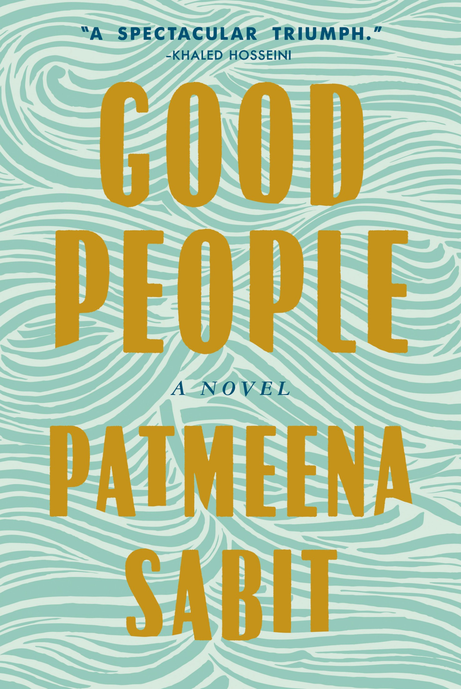](https://books.rob.me.uk/book/2025)
##### kaleidoscopic · investigative · complex
##### Patmeena Sabit
##### Fiction, 2024, 352 pages

> The Guardian says: "A family saga, a whodunnit and an investigation into assimilation in the US: this kaleidoscopic debut about the community response after an Afghan-American teenager is found drowned in a canal at the wheel of the family car keeps the reader guessing, with gossip, prejudice and contradictory accounts pulling in all directions."

Sabit masterfully controls a chaotic, multi-vocal narrative tone, weaving a tense web of cultural friction and suburban paranoia that demands the attention of literary mystery enthusiasts.

A submerged car, a drowned teenager, and a neighborhood built on lies. Sift through a labyrinth of gossip and prejudice to uncover the truth behind a tragedy that threatens to tear an immigrant community apart.

#### Cast Away
##### gripping · psychological · maritime
##### Francesca de Tores
##### Fiction, 2024, 400 pages

> The Guardian says: "Alexander Selkirk, 18th-century privateer and the real-life inspiration for Robinson Crusoe, is marooned on an island in the South Pacific with only a Bible and a cask of booze for company. What follows is a fantastically fresh, gripping adventure story and psychological journey combined, as over the years he develops his survival skills and faces up to his isolation."

De Tores renders a visceral, hyper-realistic survivalist atmosphere, leveraging sparse, urgent prose to chart the profound mental unravelling and resilience of a man trapped at the edge of the world.

Strip away civilization, and what is left of a man? Experience the brutal, astonishing true story of the privateer who inspired Robinson Crusoe as he wages a decades-long war against madness, starvation, and absolute solitude.

#### [Lost Lambs](https://books.rob.me.uk/book/2031)
[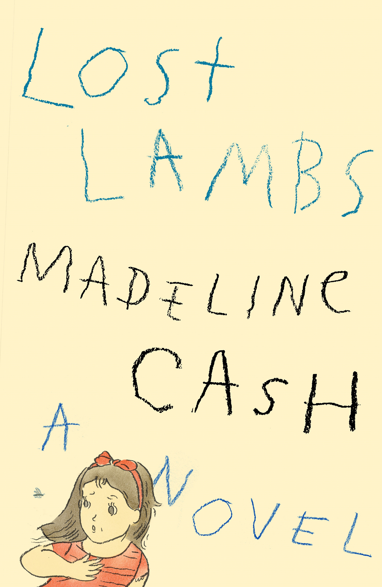](https://books.rob.me.uk/book/2031)
##### exuberant · absurd · feel-good
##### Madeline Cash
##### Fiction, 2024, 320 pages

> The Guardian says: "This exuberant comic saga about a dysfunctional American family features childish parents, precocious daughters, church shenanigans, conspiracy theories and a nefarious local billionaire. With snappy dialogue, absurd flights of fancy and a heartwarming centre, it’s a feelgood treat for fans of The Bee Sting."

Cash crafts a frenetic, dialogue-heavy comedic rhythm, balancing sharp cultural satire with immense heart to capture the chaotic charm that will hook fans of sprawling, modern family epics.

Conspiracy theorists, local billionaires, and the world's most exhausting parents. Strap in for a wildly entertaining joyride through the heartland of American dysfunction where surviving your family is the ultimate extreme sport.

#### I Want You to Be Happy
##### deadpan · mediated · millennial
##### Jem Calder
##### Fiction, 2024, 275 pages

> The Guardian says: "A romance for the doomscroll era, Calder’s debut follows a poet-barista and a wannabe author, stumbling towards an intimacy that’s almost wholly mediated by the digital world. All the textures of modern London life – expensive flatshares, overpriced coffees, emotional avoidance – are rendered with deadpan precision."

Calder perfectly captures the sterile, alienated tone of hyper-connected urbanity, employing surgical, hyper-contemporary prose to speak directly to readers exhausted by the modern dating landscape.

Love in the time of the endless doomscroll. Watch two hopelessly modern Londoners dodge actual intimacy through screens, filters, and overpriced coffee in a hilarious, agonizing portrait of digital-age romance.

#### The Things We Never Say
##### wise · tender · observational
##### Elizabeth Strout
##### Fiction, 2024, 288 pages

> The Guardian says: "The author who brought us Lucy Barton and Olive Kitteridge introduces us to Artie Dam, a fifty­something teacher struggling to make sense of his troubled marriage and a changing United States, in her wise and tender 11th novel."

Strout delivers her trademark quiet realism, using sparse, deeply intuitive characterizations to build a profound, melancholy resonance perfect for aficionados of character-driven Americana.

America is changing, and Artie Dam is being left behind. Step into the quiet, devastatingly relatable life of a teacher trying to salvage his marriage and his mind in a world that no longer makes sense.

#### Wimmy Road Boyz
##### kinetic · slangy · volatile
##### Sufiyaan Salam
##### Fiction, 2024, 250 pages

> The Guardian says: "Set over one chaotic night on Manchester’s Curry Mile, Salam’s debut is a turbo-charged coming-of-age novel following three young British-Pakistani men hurtling towards trouble in a white BMW. Written in slangy, rhythmic prose that feels somewhere between Trainspotting, hip-hop and Shakespeare, it is volatile and completely alive – an adrenalised portrait of gen-Z masculinity."

Salam electrifies the page with a raw, propulsive vernacular rhythm, capturing the volatile energy of urban youth culture in a tour-de-force that redefines contemporary British street literature.

One night, one white BMW, and zero brakes. Ride shotgun through Manchester's Curry Mile in a blistering, high-octane collision of Gen-Z bravado, brotherhood, and impending disaster.

#### Glyph
##### profound · playful · resistant
##### Ali Smith
##### Fiction, 2024, 300 pages

> The Guardian says: "Against a backdrop of political breakdown, Smith is an ever more essential voice: wise, playful, profound. This story of two estranged sisters finding their way back to each other explores childhood, family and our relationship to history, whether that’s the first world war or contemporary Gaza, setting a spirit of resistance and the ways we comfort each other against apathy and state repression."

Smith masterfully interweaves sweeping political consciousness with deeply intimate family dynamics, employing an inventive, boundary-pushing prose style aimed at intellectually ravenous literary readers.

When the world fractures, who do you reach for? Two estranged sisters must traverse the minefields of their own childhood and the bleeding edges of global history in a defiant, breathtaking fight against political apathy.

#### [Jean](https://books.rob.me.uk/book/2032)
[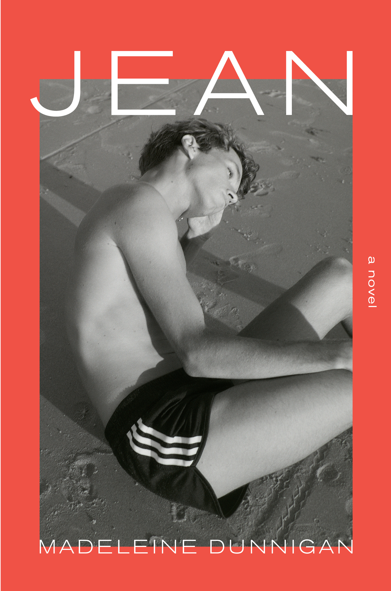](https://books.rob.me.uk/book/2032)
##### charged · excavated · sweltering
##### Madeleine Dunnigan
##### Fiction, 2024, 260 pages

> The Guardian says: "In the long hot summer of 1976, a troubled teenager at a progressive boarding school for boys begins a dangerous affair. This charged and unusual debut is a powerful excavation of shame, desire and pent-up emotion."

Dunnigan cultivates a stifling, intensely psychological atmosphere, utilizing sensory-rich descriptions to lay bare the devastating mechanics of adolescent transgression and institutional power.

The long, blistering summer of 1976 is about to ignite. Enter the claustrophobic halls of a progressive boarding school where one teenager's dangerous secret affair threatens to burn an entire world to the ground.

#### Natural Disaster
##### frazzled · hilarious · relatable
##### Lisa Owens
##### Fiction, 2024, 310 pages

> The Guardian says: "A frazzled mother of two little boys is determined that her last day of maternity leave with them will be fun, spontaneous, perfect - but things don’t go to plan in this sharply observed and deeply relatable comedy of life with small children. Bring snacks."

Owens perfects the comedic pacing of domestic chaos, utilizing a highly relatable, frenetic narrative voice that will instantly win over anyone who has ever attempted to parent small children.

The quest for the perfect final day of maternity leave turns into a spectacular suburban nightmare. Brace yourself for a brutally funny, terrifyingly accurate plunge into the beautiful disaster of raising toddlers.

#### [The Ten Year Affair](https://books.rob.me.uk/book/2033)
[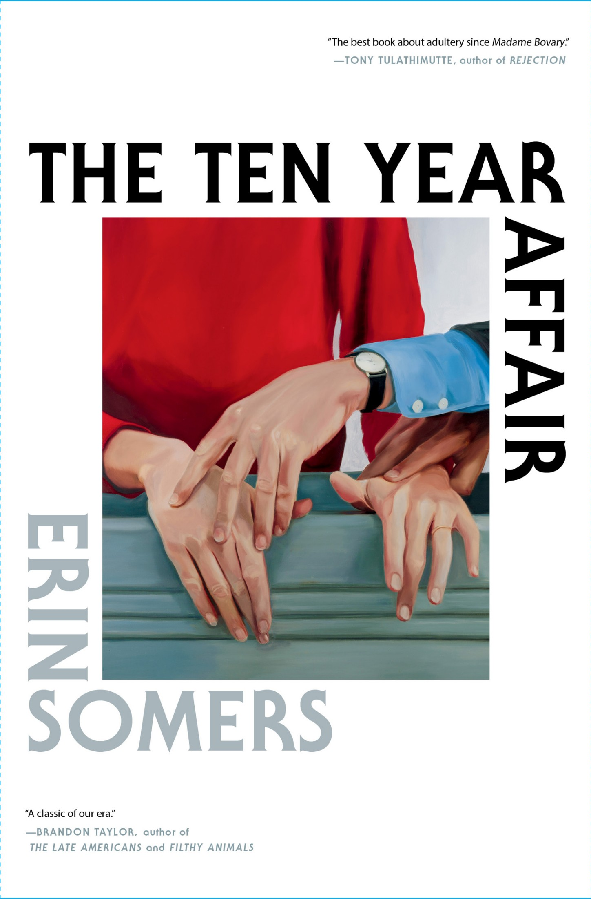](https://books.rob.me.uk/book/2033)
##### razor-sharp · cerebral · hipster-satire
##### Erin Somers
##### Fiction, 2024, 280 pages

> The Guardian says: "An adultery novel for millennials. Which is to say that the cheating occurs almost entirely inside the head of our heroine, Cora, a young mother who has fled New York with her husband Eliot for the Hudson Valley where, at a local playgroup, she meets the object of her lustful fantasies: fellow Brooklyn transplant Sam. A razor-sharp study of modern motherhood and marriage that skewers its cast of high-minded, downwardly mobile hipsters as they navigate middle age."

Somers executes a brilliant, hyper-internalized narrative strategy, wielding dry wit to dissect the unspoken resentments of privileged, downwardly-mobile creatives with surgical precision.

Infidelity has never been so deeply psychological. Follow a bored, displaced Brooklyn mother as she orchestrates a spectacularly complicated, entirely imaginary affair in this biting takedown of modern marital malaise.

#### Kin
##### resonant · historical · found-family
##### Tayari Jones
##### Fiction, 2024, 340 pages

> The Guardian says: "Set in the American south during the civil rights era, the new novel from the author of An American Marriage follows two motherless girls as they set out to find their way in the world. A richly imagined tale of female friendship and found families."

Jones grounds her narrative in a deeply evocative historical setting, using rich, empathetic prose to explore the complex architecture of sisterhood and survival for fans of immersive American historical fiction.

Against the turbulent backdrop of the civil rights era, two orphaned girls forge an unbreakable bond. Discover a sweeping, heart-wrenching epic of survival, chosen family, and the unstoppable power of female solidarity.

#### [The Correspondent](https://books.rob.me.uk/book/2034)
[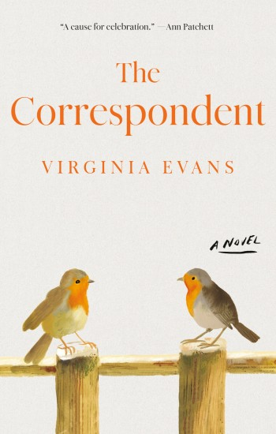](https://books.rob.me.uk/book/2034)
##### epistolary · spiky · moving
##### Virginia Evans
##### Fiction paperbacks, 2024, 220 pages

> The Guardian says: "This much-loved novel is made up of letters sent and received by Sybil Van Antwerp, a seventysomething retired lawyer living in Maryland, USA, whose spiky, often funny correspondence adds up to a moving, compelling reflection on a life."

Evans revitalizes the epistolary form with crackling wit and poignant reflection, creating an intimate, deeply appealing character study tailored for readers who appreciate subtle emotional arcs.

A lifetime of secrets, delivered one letter at a time. Unlock the fiery, funny, and devastatingly honest correspondence of a retired lawyer who is finally ready to tell the whole truth about her past.

#### [Seascraper](https://books.rob.me.uk/book/2026)
[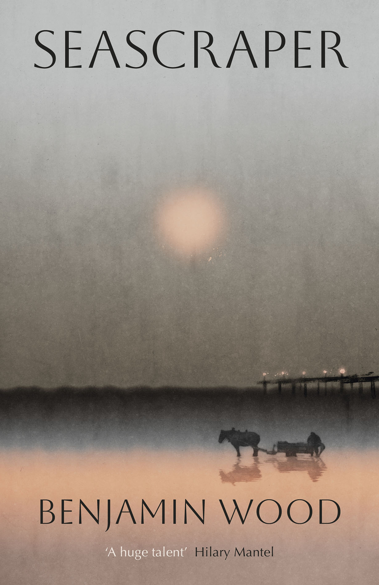](https://books.rob.me.uk/book/2026)
##### transcendent · atmospheric · profound
##### Benjamin Wood
##### Fiction paperbacks, 2024, 200 pages

> The Guardian says: "Longlisted for the Booker prize, this short, profound novel tells the story of Thomas, who trawls the seashore for shrimp with a horse and cart and dreams of more. A mysterious American could make his dreams a reality – but is the future he’s offering too good to be true? An atmospheric dive into inner worlds and the transcendent possibilities of creativity."

Wood constructs a breathtaking, brine-soaked setting, utilizing lush, contemplative language to probe the intoxicating, often dangerous allure of artistic ambition and external validation.

A lowly shrimp trawler is handed the keys to his wildest creative dreams. But in this haunting fable of ambition and deception, the price of escaping your reality might just cost you your soul.

#### [The Director](https://books.rob.me.uk/book/2027)
[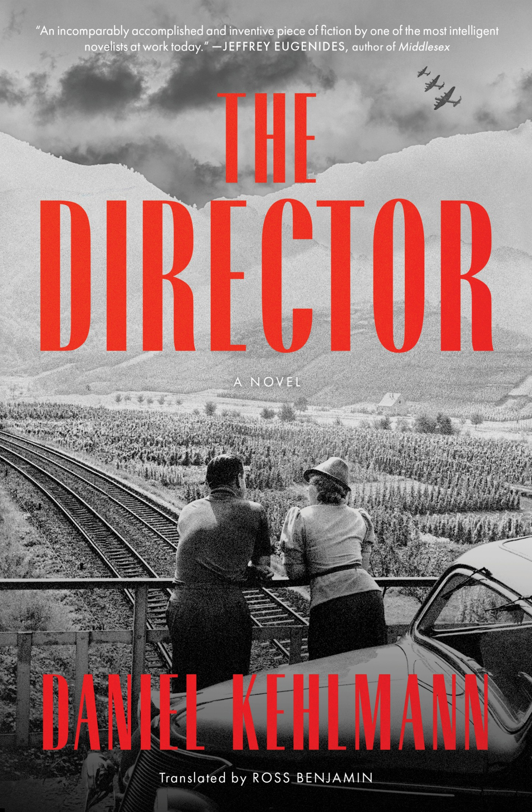](https://books.rob.me.uk/book/2027)
##### dark · historical · complicit
##### Daniel Kehlmann
##### Fiction paperbacks, 2024, 320 pages

> The Guardian says: "Kehlmann uses a fictionalised account of the life of 20th-century film director GW Pabst to explore questions of vanity, complicity and moral collapse in this brilliantly dark page-turner which was shortlisted for the International Booker. Returning from Hollywood to Austria to see his ailing mother, can the man who made Pandora’s Box continue to make art under the Nazis, and at what cost?"

Kehlmann crafts a suffocating atmosphere of moral compromise, expertly employing a taut, thriller-like pace to force readers into the uncomfortable space between artistic vanity and political survival.

Art is never truly neutral. Follow a legendary filmmaker back into the terrifying heart of Nazi-occupied Austria, where the desperate need to create collides head-on with the ultimate moral collapse.

#### [Heart the Lover](https://books.rob.me.uk/book/2028)
[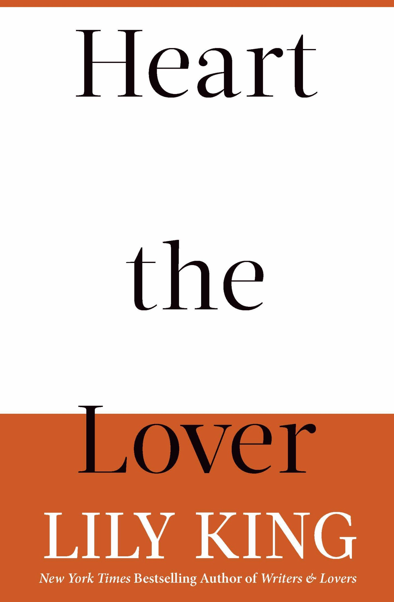](https://books.rob.me.uk/book/2028)
##### poignant · nostalgic · tear-jerking
##### Lily King
##### Fiction paperbacks, 2024, 290 pages

> The Guardian says: "A 1980s campus love triangle deepens into a poignant story of friendship and loss in King’s tear-jerking follow-up to Writers and Lovers."

King perfectly balances lush, emotionally resonant prose with the nostalgic haze of 1980s academia, delivering a devastating emotional payload that will shatter fans of character-driven contemporary drama.

Three students, one campus, and a love triangle destined for disaster. Step back into the intense, intoxicating world of 1980s youth where passion and tragedy are separated by the thinnest of lines.

#### [Dominion](https://books.rob.me.uk/book/2029)
[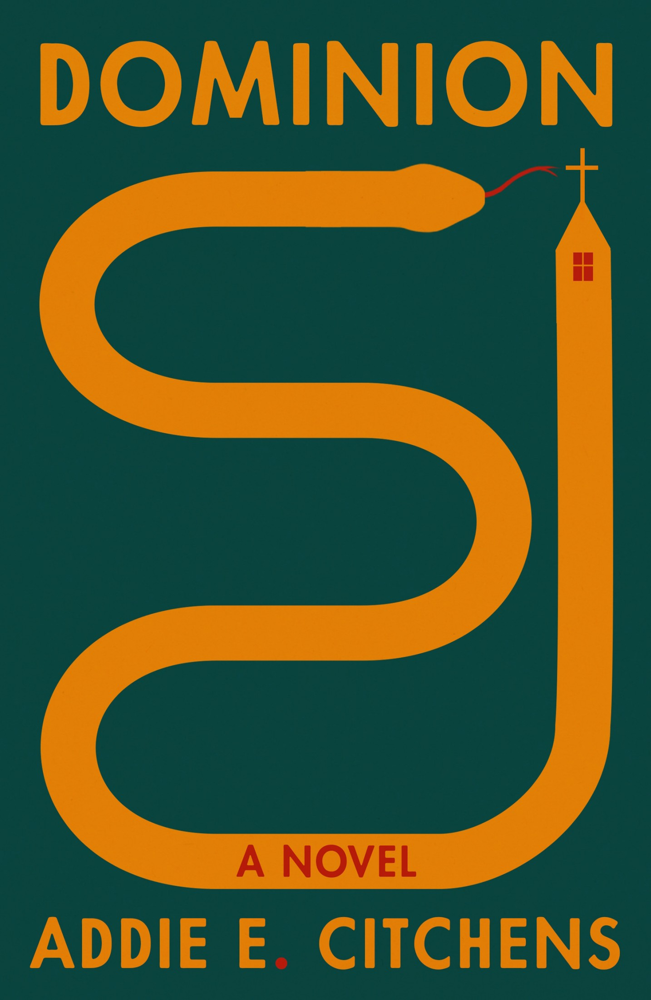](https://books.rob.me.uk/book/2029)
##### gothic · repressive · simmering
##### Addie E Citchens
##### Fiction paperbacks, 2024, 360 pages

> The Guardian says: "In the fictional Mississippi town of Dominion, a charismatic preacher and his golden-boy son preside over a community thick with repression and simmering violence. Told from the perspectives of the long-suffering women around them, it’s a rich, southern gothic exploring the excesses of unchecked male entitlement."

Citchens masters the claustrophobic, humid tone of the southern gothic tradition, giving vital, furious voice to marginalized perspectives in a structurally brilliant critique of religious and patriarchal abuse.

A holy empire built on unholy secrets. Venture into the suffocating, violent heart of a Mississippi parish where the women who have suffered in silence are finally ready to bring the temple crashing down.

#### Famesick
##### compulsive · bare · cautionary
##### Lena Dunham
##### Nonfiction, 2024, 300 pages

> The Guardian says: "The creator of Girls reflects on her sudden fame after being hailed as the voice of a generation, and what happened next – namely chronic illness, addiction and heartbreak. The dark side of celebrity is laid bare in this compulsively readable memoir."

Dunham employs an unflinching, starkly confessional tone, stripping away the glamorous veneer of public life to deliver a raw, deeply relatable examination of identity under extreme public pressure.

Being the voice of a generation nearly killed her. Plunge into a brutally honest, compulsively readable autopsy of overnight celebrity, chronic illness, and the terrifying cost of getting exactly what you asked for.

#### [The Art Cure](https://books.rob.me.uk/book/2030)
[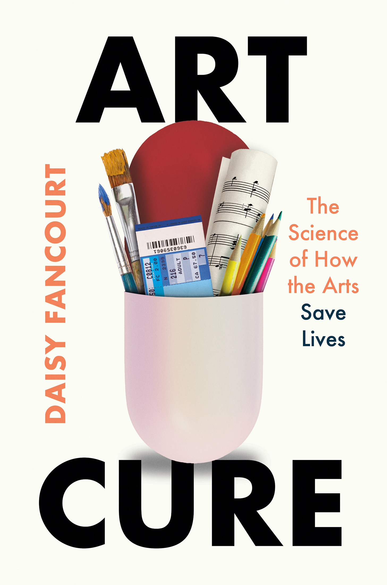](https://books.rob.me.uk/book/2030)
##### inspiring · physiological · aesthetic
##### Daisy Fancourt
##### Nonfiction, 2024, 275 pages

> The Guardian says: "Can Gauguin treat gout and Beethoven lower your blood pressure? Psychobiologist Fancourt sets out the very real physiological effects of art and culture in this inspiring call for us to lean into aesthetic experiences as a form of medicine."

Fancourt translates complex psychobiological data into an accessible, uplifting narrative, bridging the gap between clinical science and the humanities for readers eager to optimize their well-being.

Your next prescription should be a trip to the museum. Discover the startling, scientifically proven ways that great art, classical music, and cultural beauty can literally rewrite the chemistry of your body.

#### This Dark Night
##### grounded · painstaking · revelatory
##### Deborah Lutz
##### Nonfiction, 2024, 340 pages

> The Guardian says: "Emerald Fennell’s hallucinatory adaptation of Wuthering Heights invited us to consider Emily Brontë in one light; Lutz’s painstaking account shows her in quite another. Far from the eccentric, isolated genius, Lutz’s Brontë is grounded in her material reality, from everyday household tasks to illness and grief."

Lutz meticulously dismantles long-held literary myths with rigorous archival evidence, offering a deeply tactile, immersive biography that redefines the gothic icon for modern scholars and fans.

Forget the myth of the mad genius on the moors. Uncover the real, brutally grounded life of Emily Brontë in a revelatory biography that proves everyday grief is far more haunting than any fictional ghost.

#### Enough Said
##### inimitable · reflective · witty
##### Alan Bennett
##### Nonfiction, 2024, 400 pages

> The Guardian says: "The latest instalment of the inimitable critic and playwright’s diaries runs from 2016 to 2024, hardly a period of rest and relaxation. But ordinary life goes on as Bennett, now 92, reflects on Brexit, the pandemic and the distant past."

Bennett maintains his signature curmudgeonly grace, utilizing wry observations and an intimate, conversational tone to map global crises onto the quiet routines of domestic life.

The world is ending, but someone still has to put the kettle on. Join a legendary 92-year-old playwright as he tackles Brexit, pandemics, and the indignities of aging with unparalleled wit and profound grace.

#### [Super Nintendo](https://books.rob.me.uk/book/2012)
[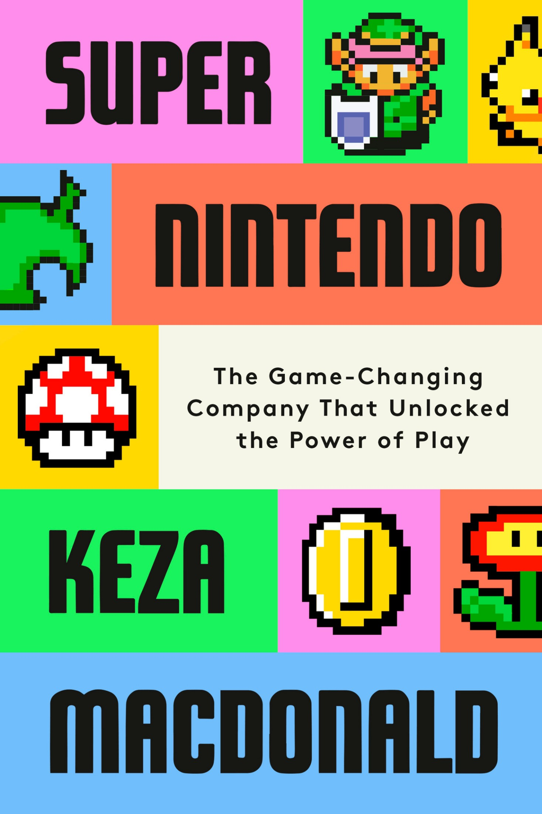](https://books.rob.me.uk/book/2012)
##### affectionate · researched · playful
##### Keza MacDonald
##### Nonfiction, 2024, 320 pages

> The Guardian says: "An affectionate portrait of the people who bought us Super Mario and Animal Crossing combines deep research, extensive interviews and serious fun. MacDonald, the Guardian’s video games editor, positions the Japanese company as a “toymaker” with very different priorities from the tech giants that dominate the rest of our digital lives."

MacDonald blends rigorous journalistic investigation with vibrant, accessible storytelling, creating an essential, nostalgia-infused cultural history that will delight both hardcore gamers and business enthusiasts alike.

How did a quirky Japanese toymaker conquer the digital globe without losing its soul? Unlock the closely guarded secrets behind Mario and Zelda in a fascinating deep-dive into the company that redefined modern play.

#### A World Appears
##### mind-boggling · investigative · expansive
##### Michael Pollan
##### Nonfiction, 2024, 350 pages

> The Guardian says: "After feeding our heads with a bestselling book about psychedelics, author and journalist Pollan returns with an exploration of consciousness itself. He asks who has it (plants? AI?), how it feels and what it actually consists of. He may not come up with definitive answers, but delivers mind-boggling insights along the way."

Pollan commands an awe-inspiring, intellectually rigorous tone, expertly synthesizing philosophy, biology, and technology into a deeply engaging narrative aimed at curious, open-minded nonfiction readers.

Is your houseplant self-aware? Embark on a spectacular, reality-bending journey to the very limits of human understanding as we hunt for the true origins and boundaries of consciousness itself.

#### On Morrison
##### archival · analytical · rich
##### Namwali Serpell
##### Nonfiction, 2024, 250 pages

> The Guardian says: "Novelist and critic Serpell zooms in on the Beloved author’s craft in this series of 12 essays, rich with material from the archives. Edits, hesitations and revisions tease out the humour and fallibility of one of the greatest American writers of the 20th century."

Serpell exercises brilliant close-reading techniques, stripping away the pedestal to examine the raw, mechanical craft of a literary giant in a way that will invigorate writers and academics.

Witness genius in the drafting phase. Step inside the private archives of Toni Morrison to see the erased lines, the hesitations, and the spectacular revisions that birthed America's greatest modern literature.

#### Ancient
##### beguiling · sylvan · historical
##### Luke Barley
##### Nonfiction, 2024, 280 pages

> The Guardian says: "Forester and ranger Barley tells the beguiling story of Britain’s mature woodlands – now reduced to fragments, but still more than capable of enchanting us – and how living alongside them shaped our culture and language."

Barley fuses ecological expertise with poetic reverence, cultivating a rich, earthy atmosphere that traces the deep linguistic roots connecting human culture to the natural landscape.

The trees are holding our oldest secrets. Walk into the shadowed fragments of Britain's ancient woodlands to discover how centuries of timber and soil have silently dictated our history, language, and survival.

#### A Hymn to Life
##### riveting · courageous · shattered
##### Gisèle Pelicot
##### Nonfiction, 2024, 310 pages

> The Guardian says: "Pelicot became an icon of courage and resilience during the trial of 51 men, including her husband, accused of extraordinary sexual crimes against her. This painful but riveting memoir tells the story of how her life as she knew it was shattered, and what it took to start building a new one."

Pelicot utilizes a devastatingly straightforward, unflinching narrative style to document unimaginable trauma, creating a testament of survival that demands the absolute attention of true crime and feminist readers.

Out of an unspeakable nightmare comes an unbreakable will. Read the harrowing, triumphant true story of the woman who faced down 51 monsters in court and chose to build a magnificent new life from the ashes.

#### The Last Kings of Hollywood
##### documentary · golden-era · definitive
##### Paul Fischer
##### Nonfiction, 2024, 400 pages

> The Guardian says: "The golden era of late-20th century film-making is evoked in documentary detail by screenwriter and author Fischer as he tells the story of how three relative outsiders – Francis Ford Coppola, George Lucas and Steven Spielberg – came to dominate cinema as we know it."

Fischer curates a massive, meticulously detailed cultural history, adopting a kinetic, cinematic pacing that captures the wild ambition and towering egos of the New Hollywood revolution.

Three nerdy outsiders hijacked the studio system and changed entertainment forever. Step behind the camera with Coppola, Lucas, and Spielberg during the chaotic, wildly lucrative dawn of the modern blockbuster.

#### The Dog’s Gaze
##### illustrated · canonical · canine
##### Thomas W Laqueur
##### Nonfiction, 2024, 260 pages

> The Guardian says: "Can you spot the pooch in a Picasso? The canine in a Canaletto? In this deeply researched and beautifully illustrated book, art historian Laqueur argues that the presence of dogs in a series of canonical western paintings is no mere afterthought."

Laqueur pairs stunning visual curation with sharp, persuasive academic analysis, reframing art history through an accessible, highly engaging lens that will charm both historians and animal lovers.

The good boys of western art are finally getting their due. Uncover the hidden, profound meanings behind the dogs lurking in the corners of history's greatest masterpieces in this gorgeously illustrated revelation.

#### Monsters in the Archives
##### obsessive · pedantic · revealing
##### Caroline Bicks
##### Nonfiction, 2024, 330 pages

> The Guardian says: "Granted exclusive access to Stephen King’s personal archive, literary academic Bicks sifts through annotated drafts, scrutinising revisions, comments and disagreements with editors. Her close reading reveals the master of horror’s obsessions, his pedantry – and alternative versions of some of his most loved stories."

Bicks channels a relentless, investigative energy to decode the marginalia of a pop-culture titan, providing an unprecedented, granular look at the mechanics of commercial horror writing.

The real terror is in the red ink. Crack open the private, heavily annotated drafts of Stephen King to witness the obsessive edits, editorial brawls, and lost alternate endings of your favorite nightmares.

#### The Savage Landscape
##### visceral · wild · intellectual
##### Cal Flyn
##### Nonfiction, 2024, 300 pages

> The Guardian says: "The author of Islands of Abandonment returns with a vivid and visceral tour of Earth’s wildest places, from the bottom of the ocean floor to lava-filled calderas. But this is an exploration of an intellectual territory too – namely, our idea of “wilderness”, and the often destructive role that has played."

Flyn marries breathtaking, sensory travel writing with rigorous philosophical inquiry, challenging the reader's fundamental assumptions about nature and human interference.

We have entirely misunderstood the wild. Journey from crushing ocean trenches to boiling calderas in a staggering exploration of untouched earth that will permanently shatter your romantic illusions about nature.

#### Backtalker
##### formative · trailblazing · intersectional
##### Kimberlé Crenshaw
##### Nonfiction, 2024, 320 pages

> The Guardian says: "The legal trailblazer who developed the concept of intersectionality – the notion that discrimination on the basis of race, class and gender can intersect and compound – recounts her formative years in Ohio and subsequent career fighting injustice."

Crenshaw blends urgent, precise legal theory with warm, compelling personal reflection, delivering an essential historical document for anyone invested in modern civil rights and social justice.

Meet the brilliant mind that redefined how we fight inequality. Follow the phenomenal journey of a legal titan from a childhood in Ohio to the supreme battlegrounds of justice where she forged the weapon of intersectionality.

#### London Falling
##### terrifying · gilded · investigative
##### Patrick Radden Keefe
##### Nonfiction, 2024, 380 pages

> The Guardian says: "Asked by grieving parents to investigate their vulnerable son’s death, New Yorker journalist Radden Keefe uncovers a world of terrifying criminality and extraordinary police incompetence – or worse – lurking beneath London’s gilded surface. A tour de force of contemporary storytelling."

Keefe executes a masterclass in narrative journalism, building unbearable tension and moral outrage as he exposes the rot beneath extreme wealth in a true-crime masterpiece.

London's glittering facade hides a labyrinth of blood and bribes. Plunge into a heart-stopping investigation of murder, unimaginable wealth, and a deeply compromised police force that will leave you absolutely breathless.

#### Stephen Sondheim
##### gossipy · definitive · theatrical
##### Daniel Okrent
##### Nonfiction, 2024, 450 pages

> The Guardian says: "He may have transformed American musicals, but he didn’t always have the easiest relationship with the people around him – or himself. From Oscar Hammerstein to Barbra Streisand and Lin‑Manuel Miranda, Sondheim mentored, collaborated and fell out spectacularly with all sorts of people, as Okrent shows in this definitive, gossipy biography."

Okrent captures the electric, tempestuous rhythm of Broadway, utilizing a dishy yet exhaustively researched tone to paint a complex portrait of a fiercely difficult genius.

Genius comes with a spectacular body count of burned bridges. Take a front-row seat to the dazzling, dramatic, and brutally honest life of the man who dragged the American musical kicking and screaming into the modern era.

#### Said the Dead
##### extraordinary · formal · ethical
##### Doireann Ní Ghríofa
##### Nonfiction, 2024, 240 pages

> The Guardian says: "The acclaimed author of A Ghost in the Throat used the archives of Our Lady’s Hospital, Cork – and her vivid imagination – to bring the experiences of long-forgotten psychiatric patients to life. The result is a book of “extraordinary formal and ethical force”, according to our reviewer."

Ní Ghríofa employs a hauntingly beautiful, genre-defying hybrid of history and imagination, restoring dignity to silenced voices through prose that is as ethically rigorous as it is poetic.

The forgotten ghosts of Cork's psychiatric wards are finally speaking. Through a breathtaking feat of archival empathy and vivid imagination, the lost lives of institutionalized patients are resurrected in brilliant, heartbreaking detail.

#### Crossing the Wine-Dark Sea
##### unfussy · philosophical · surprising
##### Emily Wilson
##### Nonfiction, 2024, 270 pages

> The Guardian says: "The translator of the Odyssey and Iliad, whose unfussy, sometimes surprising choices have inspired both acclaim and disapproval, sets out her philosophy of translation in a series of fascinating essays."

Wilson adopts a lucid, highly accessible critical voice, demystifying the complex mechanics of classical translation for modern readers eager to peer behind the curtain of literary history.

Every translated word is a dangerous choice. Join the controversial, celebrated translator of Homer as she defends her boldest decisions and reveals the hidden warfare of bringing ancient epics into the modern world.

#### Tonight the Music Seems So Loud
##### contradictory · obsessive · pop-history
##### Sathnam Sanghera
##### Nonfiction, 2024, 310 pages

> The Guardian says: "What made one of the greatest pop stars of his generation tick? George Michael superfan Sanghera, best known for his books on the British empire, tries to get to the bottom of a man of contradictions: a supreme musical perfectionist who fired 12 saxophonists before he found the perfect rendition of the solo in Careless Whisper, Michael’s personal life was anything but carefully orchestrated."

Sanghera balances the fawning passion of a superfan with sharp, objective cultural critique, providing a vibrant, rhythmic biography that maps the chaotic brilliance of a musical icon.

Twelve saxophonists fired for a single solo. Dive into the manic perfectionism, the spectacular scandals, and the untouchable genius of George Michael in a biography that moves as fast as a chart-topping hit.

#### Leaving Home
##### unearthed · absurd · poignant
##### Mark Haddon
##### Nonfiction, 2024, 280 pages

> The Guardian says: "The Curious Incident … author revisits his childhood and adolescence in Northampton. This work of personal archaeology unearths “a near-total absence of love or affection”, and exposes the roots of his ongoing anxiety and self-harm. The extraordinary illustrations keep the reader alive to the absurdity and poignancy of it all."

Haddon merges stark emotional vulnerability with grim, self-effacing humor, utilizing distinct visual illustrations to anchor a deeply moving memoir of childhood neglect and mental health survival.

Surviving childhood requires a very dark sense of humor. Follow an acclaimed author as he excavates the loveless ruins of his Northampton youth, fighting back against crushing anxiety with art, absurdity, and absolute honesty.

#### Lady C
##### reverberating · cultural · scandalous
##### Guy Cuthbertson
##### Nonfiction, 2024, 320 pages

> The Guardian says: "In the autumn of 1960, a sensational trial provided ample material for both newspaper columns and what we might now call water-cooler conversations. Cuthbertson’s book focuses less on the scandalising content of Lady Chatterley’s Lover, and more on the case’s reverberations across the wider culture – from comedy to music."

Cuthbertson employs a sweeping, highly contextualized historical lens, tracing the seismic cultural shockwaves of a singular legal event with an engaging, thoroughly researched sociological focus.

One dirty book put all of Britain on trial. Step back into the sensational 1960 courtroom battle over Lady Chatterley's Lover and discover how a single obscenity case accidentally revolutionized comedy, music, and modern freedom.

#### Iran and the Revolution
##### thoroughgoing · clear · historical
##### Homa Katouzian
##### Nonfiction, 2024, 380 pages

> The Guardian says: "The Islamic Republic and its politics can be hard for outsiders to parse, but an understanding of how the regime came into being is essential for anyone hoping to understand the current conflict. In the thoroughgoing history, Iranian historian Katouzian offers a much needed guide, “clear and free of preconceptions”, according to our review."

Katouzian delivers a masterfully objective, densely informative historical framework, slicing through geopolitical bias to offer an indispensable resource for students of Middle Eastern politics.

To understand tomorrow's headlines, you must decode yesterday's revolution. Unravel the complex, bloody genesis of the Islamic Republic in a brilliantly clear history that cuts straight through decades of western propaganda.

#### [Strangers: A Memoir of Marriage](https://books.rob.me.uk/book/2035)
[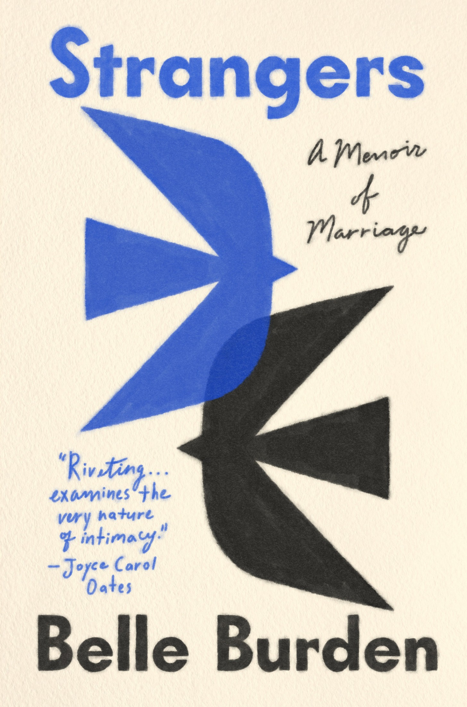](https://books.rob.me.uk/book/2035)
##### furore · complicated · bestseller
##### Belle Burden
##### Nonfiction, 2024, 300 pages

> The Guardian says: "This story of betrayal by an unfaithful husband and the subsequent destruction of a marriage was an instant bestseller when it was published in January. But the plot has thickened after reporting by the New Yorker suggested a more complicated emotional and financial picture. Burden says “I stand by everything I wrote,” and so far the furore seems only to have added to the appeal of her can’t-look-away book."

Burden crafts a dangerously compelling, hyper-emotional narrative voice, leveraging sheer vulnerability and scandalous pacing to create the ultimate, hotly debated commercial memoir.

Is she a victim, a mastermind, or an unreliable narrator? Plunge into the explosive, intensely contested memoir of marital destruction that has divided the literary world and dominated the bestseller lists.

#### Why Populists Are Winning
##### rigorous · original · conventional
##### Liam Byrne
##### Nonfiction, 2024, 290 pages

> The Guardian says: "What can a thoroughly conventional politician – a former New Labour minister, no less – tell us about how to defeat the insurgents promising radical change? Byrne, who remains an MP in a constituency where Reform is in the ascendant, manages to approach the subject with “rigour and originality”, writes our reviewer."

Byrne adopts a sharp, analytical, and highly pragmatic tone, stripping away partisan panic to deliver a cool, structurally sound playbook for political survival in an age of extremes.

The insurgents are at the gates, and the old guard is terrified. A seasoned political insider dissects the unstoppable rise of radical populism and outlines the only plausible strategy to win the furious voters back.

#### [David Bowie and the Search for Life, Death and God](https://books.rob.me.uk/book/2036)
[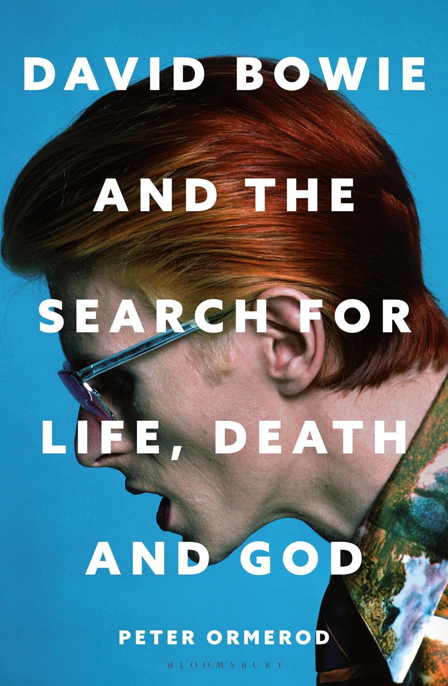](https://books.rob.me.uk/book/2036)
##### spiritual · devoted · survey
##### Peter Ormerod
##### Nonfiction, 2024, 310 pages

> The Guardian says: "Is listening to David Bowie a religious experience? That might explain the devotion he inspired among generations of fans. In this survey of how spirituality influenced the rock god’s oeuvre, Ormerod argues that we’ve been missing a key part of his appeal."

Ormerod fuses rigorous theological critique with passionate music journalism, exploring the esoteric, transcendent dimensions of pop culture in a way that will fascinate devout music historians.

Starman or savior? Decode the hidden spiritual architecture behind David Bowie's greatest anthems in a bold new survey that proves his music was never just pop—it was a modern religion.

#### A Mind of My Own
##### palpable · invigorating · joyous
##### Kathy Burke
##### Nonfiction paperbacks, 2024, 250 pages

> The Guardian says: "Actor and comedian Burke tells the story of her childhood, teenage years and the prejudice and kindnesses she experienced as she met with increasing acclaim. As our reviewer put it, this memoir “has its painful moments, but the joy radiating from it is palpable and invigorating”."

Burke commands an irresistibly warm, radically authentic comedic voice, balancing stories of deep prejudice with an infectious optimism that will utterly charm fans of celebrity memoirs.

Fame couldn't fix her past, but humor saved her life. Journey alongside a beloved comedian as she battles systemic prejudice and personal pain with a radiant, absolutely undeniable joy.

#### [The Age of Diagnosis](https://books.rob.me.uk/book/2037)
[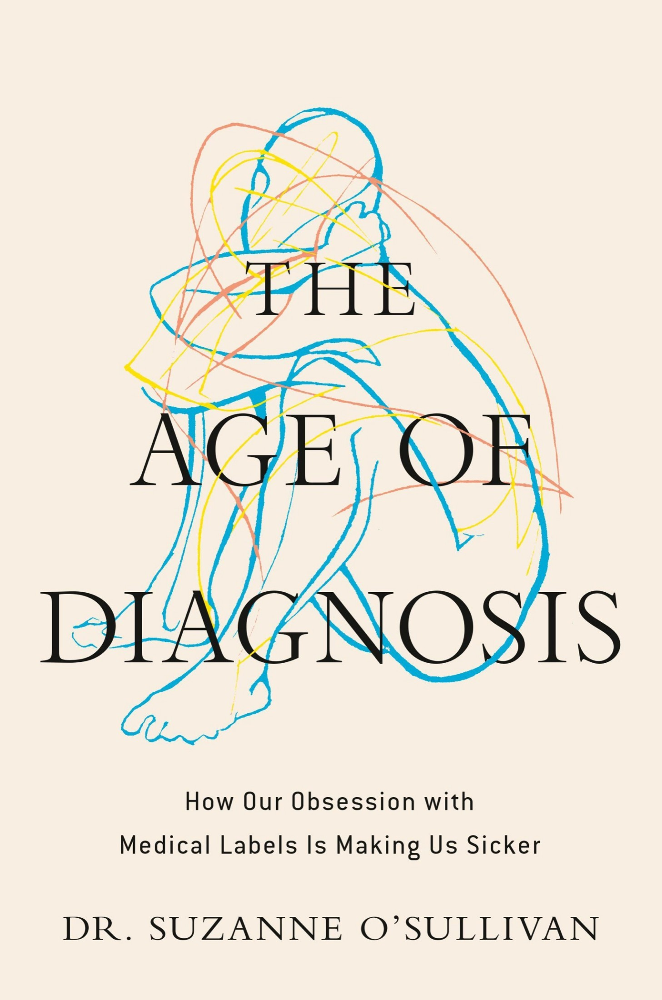](https://books.rob.me.uk/book/2037)
##### humane · well-informed · complex
##### Suzanne O’Sullivan
##### Nonfiction paperbacks, 2024, 280 pages

> The Guardian says: "Can diagnoses – from ADHD to chronic Lyme disease – sometimes do more harm than good? In this humane, well-informed book, neurologist O’Sullivan seeks not to dismiss suffering, but to understand the trade-offs that come when a medical label is applied to complex, distressing experiences."

O’Sullivan maintains an incredibly empathetic, scientifically grounded perspective, navigating a fiercely controversial medical debate with a nuance that will captivate readers of sociological medicine.

What if the cure is just another cage? A renowned neurologist tackles the modern explosion of medical labels, asking the terrifying question of whether our desperate need for a diagnosis is actually making us sicker.

#### [Careless People](https://books.rob.me.uk/book/1523)
[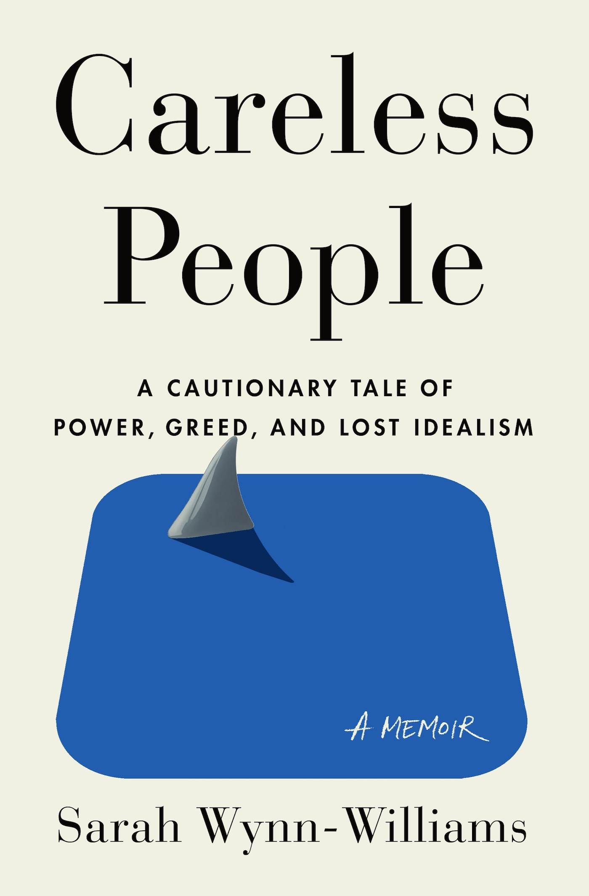](https://books.rob.me.uk/book/1523)
##### banned · catalyst · ringside
##### Sarah Wynn-William
##### Nonfiction paperbacks, 2024, 320 pages

> The Guardian says: "The book Meta were so keen you didn’t read that they banned its author from doing any promotion. Wynn-Williams – a former senior adviser at Facebook – had a ringside seat during its transformation from a way to catch up with friends into a catalyst for revolutions, riots and political upheaval."

Wynn-Williams utilizes an urgent, whistleblowing narrative style, pulling back the curtain on Silicon Valley's moral vacuum to deliver a terrifying, high-stakes tech thriller grounded in absolute reality.

This is the book the algorithm desperately wants to hide. Step inside the boardroom where a simple networking site was weaponized into a global catalyst for riots, revolution, and the death of truth.

#### [Proto](https://books.rob.me.uk/book/2038)
[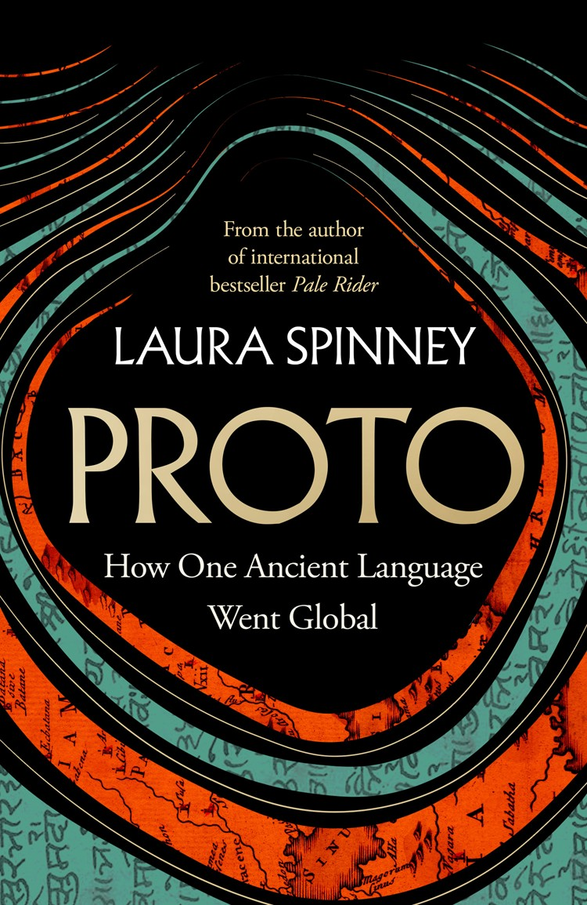](https://books.rob.me.uk/book/2038)
##### remarkable · reconstructed · sweeping
##### Laura Spinney
##### Nonfiction paperbacks, 2024, 340 pages

> The Guardian says: "One tongue to rule them all? Not quite, but proto-Indo-European, the common ancestor of English, Hindi, Irish and Greek, is the most extensively reconstructed language for which there are no written records. Spinney travels to its birthplace on the Asian steppe to tell a remarkable story of trade, migration and conquest."

Spinney combines immersive, on-the-ground travelogue elements with sweeping linguistic history, crafting an epic, continent-spanning detective story for lovers of deep anthropology.

Every word you speak is the ghost of a forgotten empire. Travel deep into the Asian steppe to unearth the phantom mother tongue that violently conquered the globe long before the first letter was ever written.

#### [Mother Mary Comes to Me](https://books.rob.me.uk/book/2039)
[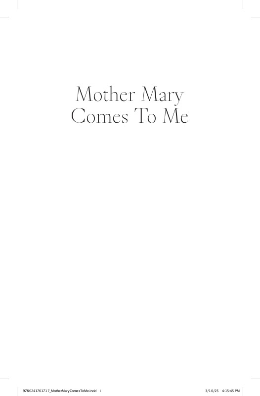](https://books.rob.me.uk/book/2039)
##### unsparing · dualistic · storm
##### Arundhati Roy
##### Nonfiction paperbacks, 2024, 290 pages

> The Guardian says: "The Booker prize-winning author’s mother, Mary Roy, was famous long before her daughter was – as a women’s rights activist and educational reformer. But there was a dark side to her, as told in this unsparing memoir of a relationship with someone the author describes as both “shelter and storm”."

Roy unleashes her formidable literary power on her own origin story, using lush, brutally honest prose to dissect the terrifying, beautiful complexity of matrilineal inheritance and fierce maternal love.

How do you survive a mother who is both a saint and a hurricane? A literary titan finally turns the pen on her own extraordinary upbringing, exposing the dark, tempestuous reality behind a celebrated feminist icon.

#### We Were a Two
##### joyous · riotous · free-range
##### Eoin McLaughlin and Emma Chichester Clark
##### Children’s and YA, 2024, 32 pages

> The Guardian says: "Eoin and his Nana spend every summer in their caravan by the sea, having wild adventures as a family of two. This joyous, riotous picture book celebrates intergenerational bonds and free-range seaside exploration."

The authors synthesize vibrant visual storytelling with a warm, energetic cadence, creating a perfectly paced read-aloud experience that honors the simplicity of childhood joy and family connection.

Pack your bags for the wildest summer ever. Join a boy and his fearless Nana in a sun-soaked, chaotic seaside adventure that proves the very best families only need a membership of two.

#### Bone Head: Guardian of the Underworld
##### anarchic · misadventures · underworld
##### Jamie Gregory
##### Children’s and YA, 2024, 160 pages

> The Guardian says: "Demise, AKA Bone Head, thinks he’s the best skeleton guard in Hades’ kingdom, even when he’s demoted to taking care of Cerberus, the three-headed dog with a taste for bones … An anarchic diary-format series of misadventures for 7+, ideal for Loki fans."

Gregory deploys a highly visual, frenetically paced diary format, wielding gross-out humor and hilarious mythological subversion to instantly hook reluctant middle-grade readers.

Babysitting a giant, three-headed demon dog is bad enough, but it’s worse when you are made entirely of bones. Descend into the hilarious, chaotic underworld diary of the worst skeleton guard in mythological history.

#### Korobá: The Case of the Missing Kolo
##### engaging · intricate · summery
##### Àlàbá Ònájìn
##### Children’s and YA, 2024, 128 pages

> The Guardian says: "Korobá is looking forward to the festival, when children break open their kolo piggy banks – until her best friend’s kolo is stolen, and Korobá must turn detective to track it down. Set in a small Nigerian fishing community, this instantly engaging, Tintinesque graphic novel for 7+ is full of summery colour, intricate detail and compelling characters."

Ònájìn excels in vibrant, highly detailed sequential art, establishing a rich cultural setting and a fast-paced investigative rhythm that will enrapture young fans of international mystery comics.

A ruined festival, a missing piggy bank, and a thief on the loose! Grab your magnifying glass and hit the sun-drenched streets of a Nigerian fishing village in a spectacular, colorful race to crack the case.

#### The Children of Wolf Rock
##### glorious · immersive · secrets
##### Natasha Farrant
##### Children’s and YA, 2024, 256 pages

> The Guardian says: "The students at Stormy Loch Academy revel in their freedom to explore the natural world – but when Minna, Kass and Tom stumble upon an older girl hiding out in a deserted bothy, they find themselves on a dangerous journey to discover the secrets of her past in this glorious, immersive 8+ adventure."

Farrant builds a rugged, deeply atmospheric natural world, using a classic adventure framework and strong interpersonal dynamics to grip readers craving high-stakes outdoor escapades.

The wilderness holds more than just weather and wildlife. When three free-roaming students discover a desperate fugitive hiding in a ruined bothy, they are thrust into a deadly race to uncover a forgotten past.

#### Crow: Thief of Magic
##### absorbing · inventive · thrilling
##### Fiona Dixon
##### Children’s and YA, 2024, 304 pages

> The Guardian says: "An unexpected encounter, a heist gone wrong, and Crow, a 12-year-old thief, finds himself flung into a spectacular new life as a Dreamcatcher’s apprentice – but is his magical master Viktor as benevolent as he seems? Absorbing, inventive and thrilling, this 9+ fantasy debut will delight Greenwild fans."

Dixon controls a brilliantly inventive magic system, pairing a breathless, heist-driven plot with sharp moral ambiguity to create a standout middle-grade fantasy that never talks down to its audience.

A botched robbery just landed a street thief the most dangerous job in the magical world. Step into a dazzling realm of stolen dreams where a young apprentice must figure out if his powerful new master is a savior or a monster.

#### Like a Brother
##### laugh-out-loud · gross-out · self-discovery
##### Nathanael Lessore
##### Children’s and YA, 2024, 288 pages

> The Guardian says: "Happy-go-lucky Londoner Owais enjoys his carefree life until his cousin Abass suddenly arrives, loud and unpredictable with a hair-trigger temper (and worst of all, he’s a Tottenham fan). The cousins’ antipathy gradually gives way to sympathy and understanding in this laugh-out-loud, sometimes gross-out story of teenage self-discovery."

Lessore utilizes a highly energetic, contemporary comedic voice, perfectly balancing gross-out humor with genuine emotional maturation to resonate with teenagers navigating complex family dynamics.

Your worst nightmare just moved into your bedroom, and he supports the wrong football team. Brace yourself for a hilarious, painfully awkward, and surprisingly touching battle of wills between two cousins forced to survive under the same roof.

#### The Victors
##### witty · subverted · post-war
##### Wren James
##### Children’s and YA, 2024, 240 pages

> The Guardian says: "Four years after defeating the Demon Overlord, youthful hero Dirk Earnest, now a second-year student at his war-damaged university, is horrified to meet his new roommate: Medusa de la Tempête, notorious war criminal and Dirk’s former nemesis. This witty, stylishly drawn enemies-to-friends YA graphic novel elegantly subverts the “chosen one” trope, asking pointed questions about what happens after the final battle."

James sharply deconstructs classic fantasy tropes through crisp, stylish sequential art, leveraging a brilliant enemies-to-roommates dynamic to explore the messy psychology of post-conflict trauma.

You saved the world from darkness, but you still have to pass chemistry. Find out what happens after the credits roll when a legendary teen hero gets stuck dorming with his worst, most notorious enemy in this brilliant graphic novel.

#### Breakout
##### sweltering · atmospheric · collaborative
##### Dhonielle Clayton, Angie Thomas and others
##### Children’s and YA, 2024, 350 pages

> The Guardian says: "The bestselling Blackout crew return with a sweltering, atmospheric thriller, featuring six affluent teenagers trapped in a private island resort by a tropical storm. As the body count rises, each of them must face up to the secrets of their past in this page-turning six-author YA collaboration."

This powerhouse collective of authors seamlessly merges multiple tense, claustrophobic viewpoints, driving an inescapable, high-octane thriller pace perfectly calibrated for fans of locked-room mysteries.

A luxury island, a raging storm, and a rising body count. Six privileged teenagers with terrifying secrets are trapped in paradise, and if they don't confess the truth, none of them will make it off the island alive.

#### Tell Your Friends
##### enthralling · toxic · steely
##### Lauren Wilson
##### Children’s and YA, 2024, 310 pages

> The Guardian says: "Trapped by the fame of her influencer parents, first-year student Crystal Shaw needs help to shatter her mother’s perfect image and win her freedom – but she’s unaware that Alyssa, her chosen confidante, is heavily invested in “At Home With the Shaws”, seeing them as the ideal surrogate family. An enthralling YA cat-and-mouse thriller with a toxic female friendship and a steely twist."

Wilson masterfully tightens the psychological screws, using dual motivations to build a paranoid, media-savvy suspense narrative that dissects the terrifying realities of parasocial obsession.

Burn down the perfect family aesthetic. A desperate daughter enlists her new best friend to destroy her influencer mother's empire, unaware that her accomplice is secretly obsessed with keeping the fantasy alive at any cost.

#### To Steal a Throne
##### gripping · seductive · ambitious
##### Gabi Burton
##### Children’s and YA, 2024, 368 pages

> The Guardian says: "After helping her half-brother Luc take the throne of Virdei, Mira uses her secret lie-powered magic to keep him secure, blackmailing and intimidating any possible challengers – until upstart Kaidren Vale appears, his own magical gift threatening Mira with exposure. When Mira begins to warm to Kaidren, her ambition wars with her softer feelings in this gripping YA fantasy of intrigue, seduction and betrayal."

Burton establishes a complex, morally grey political landscape powered by an incredibly unique magic system, delivering a lush, tension-filled romantic fantasy that will fiercely grip YA readers.

Her magic feeds on lies, and she's built an empire on them. Step into a deadly, seductive court where an assassin must decide whether to destroy the handsome rival threatening her brother's throne or risk everything by falling in love.

## Summer Reads 2025

<a href="https://www.theguardian.com/books/ng-interactive/2025/jun/21/summer-reading-the-50-hottest-books-to-read-now" target="_blank">Original Guardian piece here</a>

#### Dream Count
##### magisterial · feminist · global
##### Chimamanda Ngozi Adichie
##### Fiction, 2025, 416 pages

> The Guardian says: "A rich exploration of female experience, Adichie's first novel in 10 years charts the lives and loves of four women in Nigeria and the US, from a “dream count” of ex-boyfriends to a section inspired by Dominique Strauss-Kahn's alleged rape of a Guinean hotel worker in 2011. Magisterial, wide-ranging and delicately done."

Chimamanda Ngozi Adichie’s highly anticipated return to the novel form delivers a sweeping, emotionally resonant, and fiercely intelligent look at contemporary womanhood across continents. The narrative tone is sophisticated and vibrant, capturing the modern anxieties of the African diaspora alongside deeply intimate reflections on desire and independence. It possesses an immense crossover appeal for readers who love broad canvas social realism, sharp cultural commentary, and fiction that treats the complex inner lives of women with profound dignity.

Four brilliant, fiercely independent women are about to collide with the messy realities of romance, careerism, and institutional power in both Nigeria and America. From hilarious, witty autopsies of modern dating culture to dark, high-stakes encounters with systemic sexual violence, Adichie orchestrates a breathless international drama. It is a stunning, unputdownable exploration of how global socio-political events ripple through the most private, intimate spaces of our lives.

#### [Flesh](https://books.rob.me.uk/book/1496)
[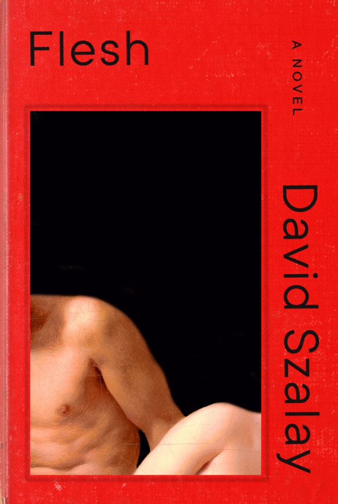](https://books.rob.me.uk/book/1496)
##### gritty · minimalist · psychological
##### David Szalay
##### Fiction, 2025, 288 pages

> The Guardian says: "This spare account of the rise and fall of a contemporary everyman, from small-town Hungary to London's elite, and back again, gains an extraordinary power through what is left unsaid: buried emotion, the silent depths of trauma, the ultimate unknowability of the self and others. A propulsive investigation into sex, power, class and masculinity."

This striking 2025 Booker Prize-winning novel creates a cold, hyper-focused, and deeply alienating atmosphere that captures the harsh realities of late-capitalist displacement. David Szalay writes with a trademark clinical detachment, utilizing a stripped-back, laconic prose style where the spaces between sentences carry an immense emotional weight. It offers an incredible crossover appeal for enthusiasts of contemporary European psychological fiction, cinematic character studies, and unsparing dissections of modern masculine identity.

Trace the shocking, decades-spanning odyssey of a contemporary everyman tumbling from a quiet Hungarian housing block straight into the hyper-wealthy, morally bankrupt underworld of London private security. Stripped of sentimentality and propelled by massive chronological leaps, the narrative mimics the terrifying numbness of a life tossed around by ruthless socioeconomic forces. Szalay crafts an astonishing, pulse-pounding portrait of a man completely out of touch with his own emotional reality.

#### [Slags](https://books.rob.me.uk/book/1476)
[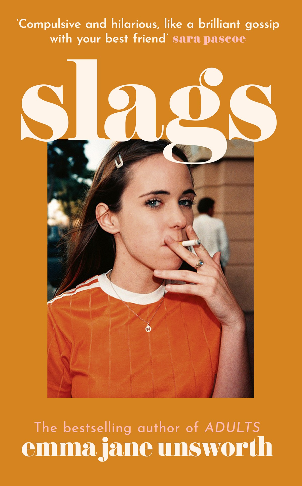](https://books.rob.me.uk/book/1476)
##### riotous · chaotic · sisterhood
##### Emma Jane Unsworth
##### Fiction, 2025, 320 pages

> The Guardian says: "Not so much a beach read as a caravan comedy. Fortysomething Sarah takes her younger sister on an ill-advised holiday through the Highlands of Scotland: drink is taken, food is cobbled together, there is bad weather and worse parking as unsuitable men and unresolved teenage trauma intrude. This exuberantly funny road trip is also a love letter to the fractious bond between siblings."

Emma Jane Unsworth delivers a fiercely funny, muddy, and wonderfully unhinged British comedy that functions as the perfect antidote to traditional, sun-drenched holiday reads. The atmosphere is rain-soaked, alcohol-fueled, and thick with the distinct, claustrophobic intimacy of a low-budget caravan trip. It holds massive crossover appeal for fans of sharp, dark comedies of manners, chaotic road-trip picaresques, and fiction that explores the toxic but unbreakable bonds of sisterly love.

Buckle up for the worst road trip of your life. When fortysomething Sarah drags her younger sister on an ill-advised, rain-drenched caravan holiday through the Scottish Highlands, the close quarters quickly ignite a powder keg of unresolved childhood trauma. Amidst terrible parking disasters, highly questionable men, and an alarming amount of alcohol, Unsworth unleashes a laugh-out-loud, wildly unpredictable journey that proves the ghosts of our teenage years never really stay in the rearview mirror.

#### Dream State
##### immersive · melancholic · family saga
##### Eric Puchner
##### Fiction, 2025, 480 pages

> The Guardian says: "In this big, bittersweet American family saga, golden couple Cece and Charlie are preparing to marry – and then she meets his difficult, unhappy best friend … Mistakes are made and decades sweep by in an immersive panorama of friendship and rivalry, marriages and children, tragedy and love. Meanwhile, the climate crisis bites, and the sands of time are only running in one direction. A book to lose yourself in, but one that doesn't duck the big issues."

This sweeping, deeply immersive American epic captures the bittersweet passage of time, the fragility of youthful ideals, and the weight of early mistakes. Eric Puchner creates an expansive, atmospheric landscape where the bright, golden optimism of youth gradually shifts into the more complicated, weathered realities of middle age. It appeals immensely to lovers of large-scale multi-generational family sagas, domestic dramas, and stories that ground intimate human choices within shifting global realities.

Golden couple Cece and Charlie have the perfect future mapped out—until Cece crosses paths with Charlie's intensely difficult, unhappy best friend. What starts as a single, catastrophic romantic transgression spirals into a decades-long web of shifting allegiances, bitter betrayals, and fragile reconciliations. Set against the looming, terrifying backdrop of the modern climate crisis, Puchner weaves a spellbinding, heartbreaking tapestry of a family trying to survive the consequences of their own desires.

#### [The Names](https://books.rob.me.uk/book/1477)
[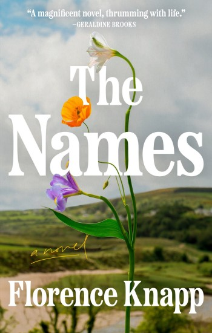](https://books.rob.me.uk/book/1477)
##### clever · poignant · parallel universes
##### Florence Knapp
##### Fiction, 2025, 384 pages

> The Guardian says: "This year's buzziest debut lives up to the hype. It's a sliding doors story where the narrative splits into three paths after a mother registers her baby. We follow the lifelong implications of choosing three different names: Gordon, as her abusive husband (also Gordon) demands; the solid and confident Julian; or the wild yet cuddly Bear. The high concept is carried off with flair, in a tender, clear-eyed portrayal of the horrors of domestic violence and joys of family life."

Florence Knapp’s breakout debut is a brilliantly original, deeply moving literary experiment that transforms a high-concept premise into a profound study of destiny and domestic survival. The atmosphere shifts dynamically between the chilling, suffocating dread of a coercive marriage and the warm, chaotic joy of unexpected family configurations. It possesses a massive crossover appeal for fans of speculative fiction, multi-perspective family dramas, and narrative puzzles that examine the monumental impact of life's smallest pivots.

How much of your child's destiny is sealed the moment you sign their birth certificate? In a dazzling *Sliding Doors* narrative, a mother makes a split-second decision at the registry office that fractures reality into three wildly different lifetimes. Whether he is named Gordon, Julian, or Bear, we follow the explosive ripple effects of a single choice as it alters the mother's courage and the child's ultimate survival. It is an unforgettable, fiercely gripping triumph that lays bare the hidden horrors of domestic abuse and the radical power of maternal love.

#### [The Land in Winter](https://books.rob.me.uk/book/1551)
[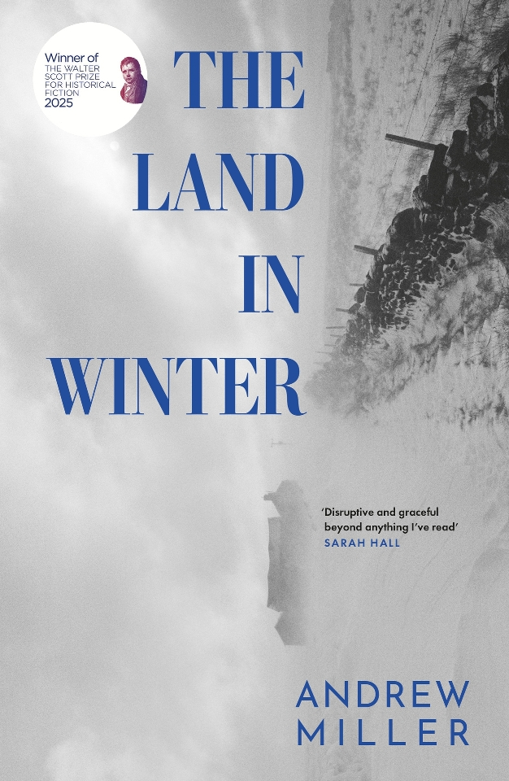](https://books.rob.me.uk/book/1551)
##### atmospheric · uncanny · historical fiction
##### Andrew Miller
##### Fiction, 2025, 336 pages

> The Guardian says: "Unseasonal reading, but Miller's tale of two young couples in the West Country who get snowed in during the big freeze of 1962-63 has an uncanny beauty and depth. The legacy of the second world war reaches into a present on the brink of seismic change, in a novel that travels into the darkest places of history and the strangest corners of the human mind."

This exquisitely crafted, chillingly atmospheric historical novel transforms a real-world meteorological event into a haunting, gothic space of psychological reckoning. Andrew Miller conjures a world of deep snow drifts, frozen pipes, and whiteout isolation, creating an uncanny, dreamlike environment where normal social rules begin to dissolve. It holds exceptional appeal for readers who appreciate slow-burning historical fiction, psychological suspense, and stories that explore the heavy, unexploded remnants of wartime trauma.

Trapped by the brutal, suffocating freeze of 1962, two young couples find themselves entirely cut off from the outside world in the remote West Country. As the physical temperature plummets, the psychological heat inside their isolated sanctuary skyrockets, forcing long-buried marital resentments and the lingering, jagged scars of the Second World War to the surface. Prepare for a tense, claustrophobic masterclass in suspense that digs into the darkest, most terrifying corners of the human mind.

#### [The Pretender](https://books.rob.me.uk/book/1588)
[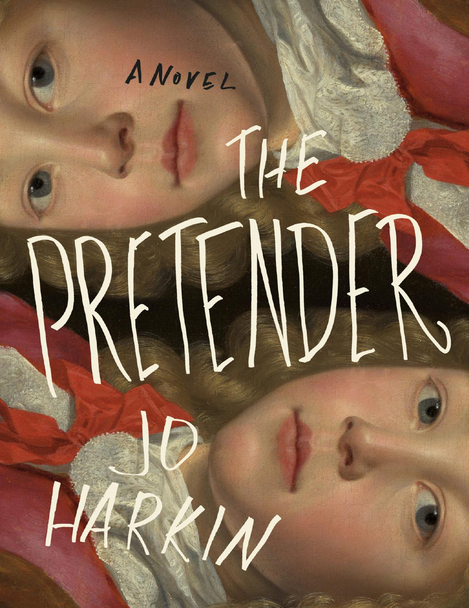](https://books.rob.me.uk/book/1588)
##### picaresque · immersive · historical fiction
##### Jo Harkin
##### Fiction, 2025, 432 pages

> The Guardian says: "Billed as “Demon Copperhead meets Wolf Hall”, this historical rollercoaster has a charm all of its own. In the chaotic wake of the Wars of the Roses, a farm boy is plucked from obscurity and groomed as the rightful heir to the throne. From Burgundy to Ireland to the paranoid court of Henry VII, Lambert Simnel's coming-of-age journey is wild indeed – but who is he really? A brainy, heartfelt delight."

Jo Harkin delivers a magnificent, hyper-cinematic historical adventure that breathes fresh, energetic life into the murky margins of the early Tudor era. The narrative tone is wonderfully kinetic, witty, and rich with sensory detail, avoiding the dry dust of standard historical epics in favor of a vibrant, street-level view of Renaissance Europe. It holds tremendous crossover appeal for fans of sweeping coming-of-age picaresques, political court intrigues, and stories that explore the fragile, performative nature of identity and class.

Plucked from the obscurity of a squalid English kitchen, young Lambert Simnel is violently thrust into the center of a high-stakes, international geopolitical conspiracy. Groomed to impersonate the rightful heir to the throne, his breathless journey catapults him from the opulent courts of Burgundy to the muddy, blood-soaked battlefields of Ireland, straight into the paranoid crosshairs of Henry VII. It’s a wildly addictive, razor-sharp thrill ride that transforms a historical footnote into a dazzling tale of survival, deception, and royal treason.

#### The Emperor of Gladness
##### poetic · tender · working-class
##### Ocean Vuong
##### Fiction, 2025, 256 pages

> The Guardian says: "The follow-up to On Earth We're Briefly Gorgeous is a lushly written panorama of unexpected connections and second chances, set in the struggling blue-collar town of East Gladness, Connecticut. Young Hai forges an unlikely friendship with elderly widow Grazina in a tale of precarity, endurance and small joys."

Ocean Vuong’s highly anticipated second novel is a radiant, deeply empathetic masterpiece that shines a luminous, poetic light on the margins of modern blue-collar America. The narrative atmosphere is heavy with the weight of economic precarity and systemic exhaustion, yet it is continuously illuminated by moments of breathtaking lyricism and radical kindness. It appeals profoundly to readers who love stylistically elevated prose, tender intergenerational character studies, and stories that find immense spiritual value within ordinary, struggling lives.

In the decaying, forgotten town of East Gladness, a lost young man named Hai crosses paths with an elderly widow named Grazina, sparking an unexpectedly profound connection. Stripped of cheap melodrama, their relationship is forged through the quiet, daily grind of survival against the crushing machinery of societal abandonment. Vuong delivers a quiet, emotionally shattering testament to endurance, proving that the most radical acts of love often happen in the shadows of a broken world.

#### [Gunk](https://books.rob.me.uk/book/1515)
[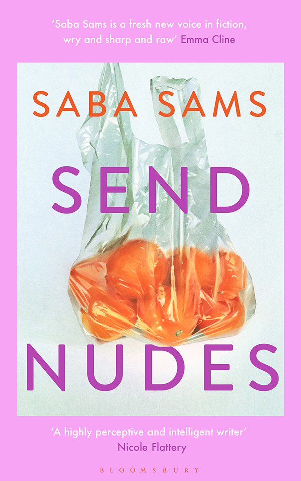](https://books.rob.me.uk/book/1515)
##### raw · alternative · contemporary
##### Saba Sams
##### Fiction, 2025, 304 pages

> The Guardian says: "Sams made a name with her spiky stories, Send Nudes; her first novel is an equally fresh and funny portrait of unexpected motherhood and alternative families, as thirtysomething Jules, the manager of a grimy Brighton club, finds herself in a not-quite-love triangle with her useless ex-husband and an unconventional young woman called Nim. Raw, tender and unusual."

Saba Sams transitions brilliantly to the novel form with this spiky, raw, and delightfully unconventional portrait of contemporary kinship and urban chaos. The atmosphere is distinctively grubby, neon-lit, and thoroughly modern, capturing the sticky floors of late-night Brighton music clubs alongside the messy reality of accidental domesticity. It holds exceptional appeal for readers seeking fresh, unfiltered queer fiction, alternative family narratives, and stories that reject traditional, sanitized milestones of adulthood.

Jules is barely keeping her head above water managing a grimy Brighton club when unexpected motherhood hits her like a freight train. Suddenly, she finds herself locked in a deeply weird, utterly chaotic love triangle with her useless ex-husband and a magnetic, rule-breaking young woman named Nim. Throw out everything you thought you knew about parenting and romance; Sams delivers a punchy, fiercely hilarious, and radically tender story about building a family out of the messiest parts of life.

#### [The Proof of My Innocence](https://books.rob.me.uk/book/1589)
[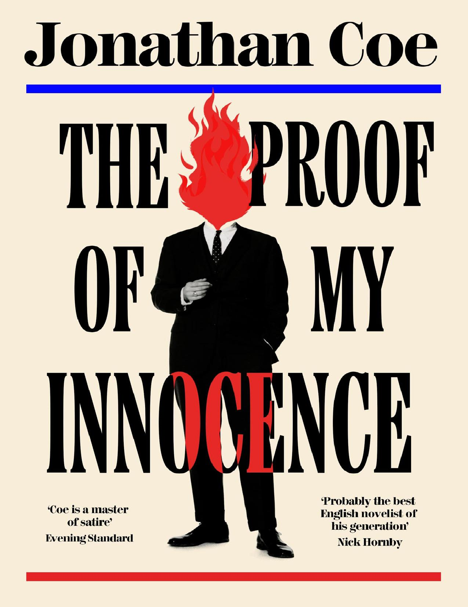](https://books.rob.me.uk/book/1589)
##### satirical · nostalgic · cozy mystery
##### Jonathan Coe
##### Fiction, 2024, 352 pages

> The Guardian says: "Coe has enormous fun with a cosy crime spoof set against the strange days of Liz Truss's time as PM. The mysteries – about a sinister rightwing thinktank, and a cult novelist – extend back to the 80s, in a book fuelled with bittersweet nostalgia as well as righteous contemporary anger."

Jonathan Coe delivers a delightfully witty, multi-layered literary puzzle that merges a classic British cozy mystery spoof with a blistering critique of modern political absurdity. The narrative atmosphere is wonderfully double-edged, blending the comforting, dusty tropes of a country-house whodunit with the chaotic, hyper-modern farce of Westminster politics. It holds fantastic crossover appeal for mystery enthusiasts and fans of sharp political satire who appreciate stories that connect the ideological roots of the 1980s to modern state dysfunction.

Set against the blink-and-you'll-miss-it chaos of Liz Truss's premiership, a daughter embarks on a desperate, twist-filled hunt to uncover the truth behind her father's bizarre murder. Her investigation drags her headfirst into a shadowy, high-stakes labyrinth of sinister right-wing think tanks and forgotten 1980s cult novelists. Coe serves up a brilliant, hall-of-mirrors puzzle that perfectly balances the addictive thrills of a classic whodunit with righteous, laugh-out-loud political fury.

#### [The Benefactors](https://books.rob.me.uk/book/1555)
[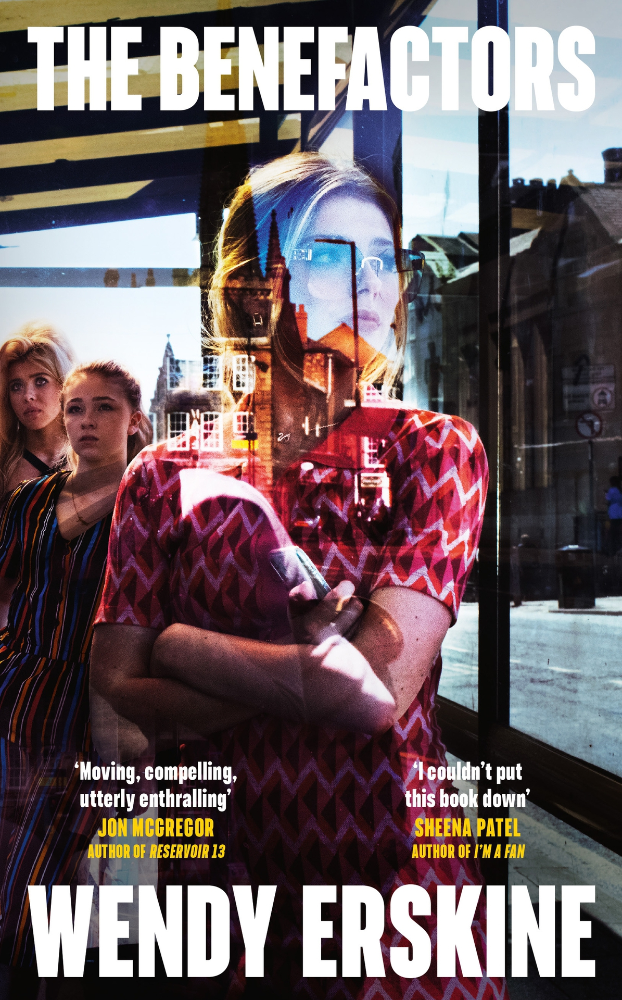](https://books.rob.me.uk/book/1555)
##### polyphonic · brutal · domestic
##### Wendy Erskine
##### Fiction, 2025, 320 pages

> The Guardian says: "This polyphonic portrait of class, power and social exclusion in Northern Ireland – the debut novel from an award-winning short story writer – is centred on the assault of a teenage girl, and the reactions of the boys' parents. Erskine is a nimble, prodigiously talented author: funny and brutal by turns, with an extraordinary immediacy."

Wendy Erskine’s debut novel is a phenomenal, hyper-realistic, and deeply uncomfortable dissection of class guilt, institutional protection, and community fractures in modern Northern Ireland. The narrative tone possesses an extraordinary, unvarnished immediacy that shifts seamlessly between dark, pitch-black humor and sudden, visceral brutality. It appeals intensely to readers who appreciate complex, multi-perspective social realism, sharp class critiques, and literature that refuses to offer easy moral closure in the wake of trauma.

A shocking assault on a teenage girl by a group of privileged boys threatens to tear a comfortable Northern Irish community apart—but the real horror lies in what happens next. As the perpetrators' parents scramble to protect their social standing, a chorus of defensive justifications, vicious lies, and moral collapses takes center stage. Erskine pulls zero punches, delivering a gripping, ferociously fast-paced expose of the rot lurking just beneath the veneer of middle-class respectability.

#### [Our Evenings](https://books.rob.me.uk/book/2040)
[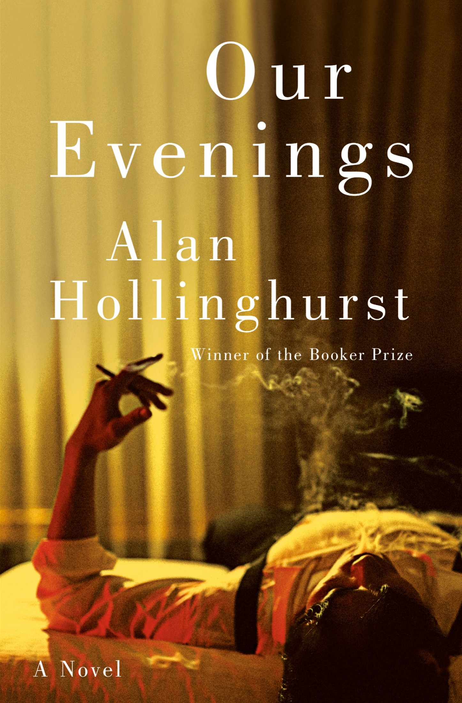](https://books.rob.me.uk/book/2040)
##### opulent · reflective · historical fiction
##### Alan Hollinghurst
##### Fiction, 2024, 448 pages

> The Guardian says: "Sweeping yet intimate, Hollinghurst's seventh novel becomes a bravura history of English gay life from the 60s through to the pandemic, as it follows Dave Win from his schooldays, an outsider in a world of privilege, through an acting career and into late-life contentment."

Alan Hollinghurst delivers a magnificent, slow-burning, and deeply moving epic that functions as a definitive alternative history of modern English society. The prose is typically opulent, sensory, and highly observant, treating the shifting landscapes of post-war Britain with a masterly architectural eye. It holds massive crossover appeal for lovers of grand historical fiction, queer literature, and deep, lifelong character studies that chart how individual identities survive the changing tides of political and cultural change.

Follow the extraordinary, sweeping life of Dave Win, an outsider thrust into the elite, unforgiving world of a 1960s English boarding school. Through the glittering, cutthroat lens of a decades-long theatrical career, Dave must constantly perform to navigate a society entrenched in rigid class and racial prejudices. From early, vulnerable days to the strange quiet of the global pandemic, Hollinghurst crafts an immersive, breathtaking odyssey of ambition, survival, and the hard-won peace of late-life contentment.

#### [Intermezzo](https://books.rob.me.uk/book/1534)
[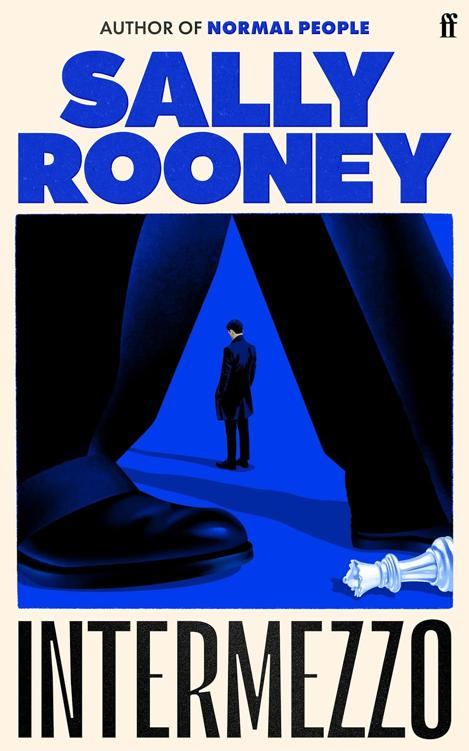](https://books.rob.me.uk/book/1534)
##### intimate · cerebral · family saga
##### Sally Rooney
##### Fiction, 2024, 448 pages

> The Guardian says: "Rooney's fourth novel takes us inside the minds of two very different brothers, a worldly-wise lawyer and a shy young chess prodigy, as they navigate bereavement and romance. A tender, thoughtful page-turner about the meaning of life."

Sally Rooney’s phenomenal bestseller delivers an exceptionally intimate, stylistically evolved, and emotionally mature exploration of grief and sibling friction. The atmosphere is distinctively contemporary and intellectual, steeped in the interior rhythms of Dublin life, quiet offices, and hyper-focused chess tournaments. It holds an immense, global crossover appeal, cementing Rooney’s status as a definitive generational chronicler while expanding her narrative scope into the deep, messy mechanics of fraternal love and bereavement.

Two deeply estranged brothers—a successful, chronically anxious lawyer and a brilliant but socially paralyzed chess prodigy—are thrown into emotional free-fall following the death of their father. Desperate to numb the pain, both men plunge headlong into complicated, highly taboo romantic entanglements that threaten to upend their carefully constructed lives entirely. It is a razor-sharp, devastatingly beautiful page-turner that dissects the fragile boundaries of love, grief, and family loyalty with clinical precision.

#### [James](https://books.rob.me.uk/book/1535)
[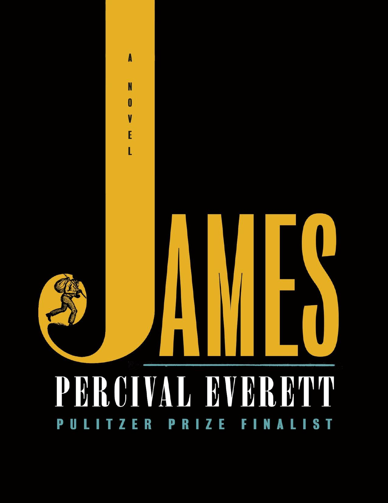](https://books.rob.me.uk/book/1535)
##### satirical · urgent · adventurous
##### Percival Everett
##### Fiction, 2024, 320 pages

> The Guardian says: "Everett retells the Adventures of Huckleberry Finn from the point of view of the enslaved character Jim, exploring the silences and erasures of Mark Twain's problematic classic in a rollicking adventure that combines philosophical profundity with bitter black comedy."

This literary masterpiece and Booker-shortlisted phenomenon delivers a brilliant, revolutionary, and deeply subversive rewriting of an American classic. Percival Everett crafts an atmosphere that is simultaneously a high-stakes, thrilling river adventure and a blistering, hyper-intellectual deconstruction of racial language and power. It has massive, universal crossover appeal, reading with a propulsive, page-turning speed that balances laugh-out-loud satirical wit against a profound, heartbreaking moral urgency.

When the enslaved Jim discovers he is about to be sold and separated from his family, he flees to Jackson's Island, setting the stage for a breathtaking, high-stakes odyssey down the Mississippi. But Everett flips the script entirely: Jim is fiercely intelligent, secretly literate, and manipulating the world around him with absolute tactical genius to survive. It’s a blistering, wildly entertaining ride that balances pitch-black comedy with pulse-pounding suspense, completely transforming a classic into an unputdownable modern triumph.

#### [All Fours](https://books.rob.me.uk/book/2042)
[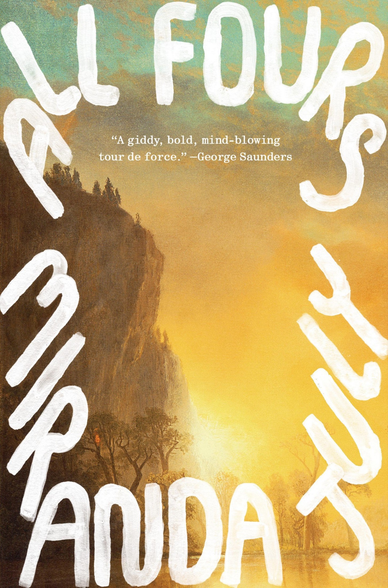](https://books.rob.me.uk/book/2042)
##### provocative · surreal · contemporary
##### Miranda July
##### Fiction, 2024, 336 pages

> The Guardian says: "This playful, no-holds-barred account of one woman wrestling with – and newly energised by – the life-upending changes of menopause has become a phenomenon. It's provocative, mind-expanding and always surprising."

Miranda July’s cultural phenomenon is a dazzlingly original, transgressive, and wildly funny exploration of midlife rebirth and domestic escape. The atmosphere is uniquely July—eccentric, hyper-sensory, and laced with a brilliant deadpan absurdity that challenges every traditional script regarding motherhood, marriage, and aging. It possesses an immense crossover appeal for readers seeking fearless feminist literature, body-positive narratives, and stories that use the surreal to capture the profound internal crises of adulthood.

Just twenty miles into a meticulously planned cross-country road trip, a 45-year-old artist abruptly ditches her itinerary, pulls into a nondescript California motel, and decides to completely blow up her life. What follows is a wild, intensely erotic, and spectacularly funny detour into the uncharted, chaotic territory of midlife rebellion. Tearing up the rulebook on marriage and the physical realities of menopause, July hands readers a provocative, breathless joyride that redefines what it means to start over.

#### [You Are Here](https://books.rob.me.uk/book/1539)
[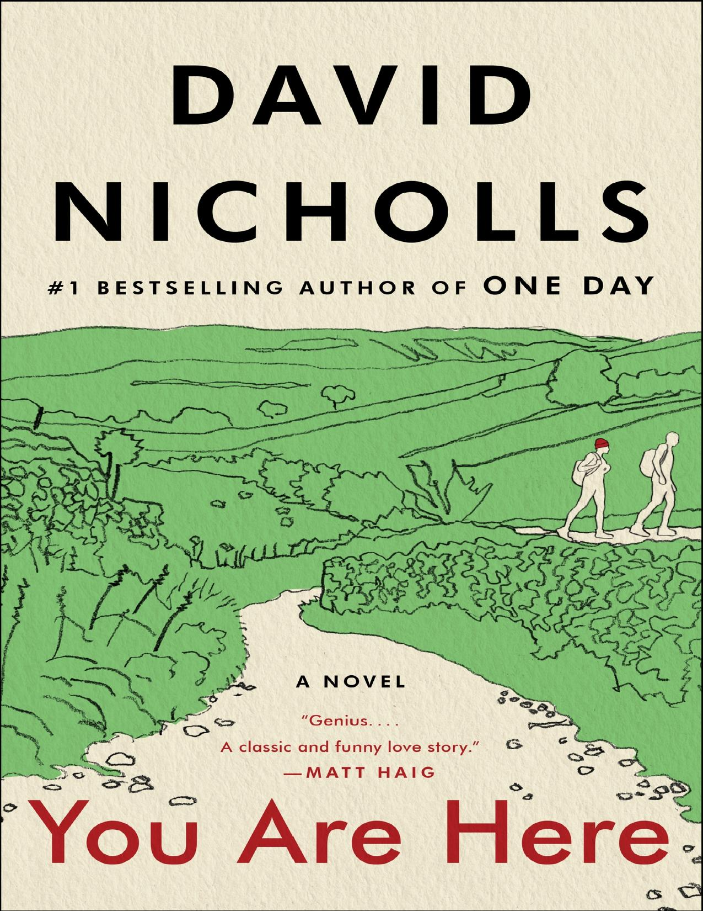](https://books.rob.me.uk/book/1539)
##### relatable · romantic · witty
##### David Nicholls
##### Fiction, 2024, 352 pages

> The Guardian says: "Two mismatched, disappointed midlifers; a hike across the Lake District; a tentative romance that is warmly hilarious but never sentimental. Pure pleasure in a paperback."

David Nicholls delivers a beautifully written, comforting, and deeply intelligent romantic comedy that serves as a definitive love letter to modern midlife resilience. The narrative tone is exceptionally warm and witty, balancing the physical realities of blistered feet and English rain against the sharp, conversational sparring of two lonely adults. It holds a massive, global appeal for readers who crave honest, mature romances that avoid saccharine clichés in favor of genuine emotional connection and psychological realism.

Meet Marnie and Michael: two bruised, deeply cynical mid-lifers who would rather be anywhere else than trekking through the relentless rain and mud of the English Lake District. But as the miles roll by, their prickly, defensive banter begins to crack open, making way for a tentative, utterly charming connection. From the maestro of modern romance, this is a funny, achingly real, and totally irresistible story about finding the courage to take a terrifying leap into a second chance at love.

#### [The Safekeep](https://books.rob.me.uk/book/1600)
[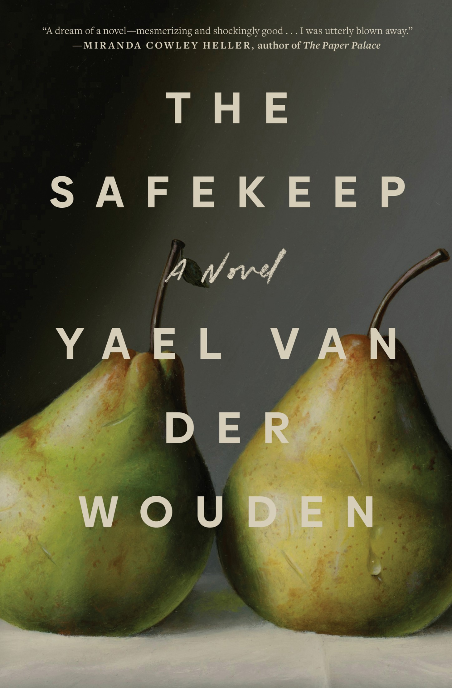](https://books.rob.me.uk/book/1600)
##### gothic · intense · queer love story
##### Yael van der Wouden
##### Fiction, 2024, 272 pages

> The Guardian says: "In the wake of the second world war, in the quiet Dutch countryside, repressed Isabel finds her beliefs and desires turned inside out. Shortlisted for the Booker and winner of the Women's prize, this striking debut is a measured excavation of 20th-century horrors as well as a subtle family saga and intense queer love story."

Awarded the Women's Prize and shortlisted for the Booker, this striking debut novel delivers a dense, highly charged, and deeply atmospheric exploration of post-war guilt and forbidden passion. Yael van der Wouden conjures a world of rigid domestic routines and heavy provincial silence in the remote Dutch countryside, slowly transforming a quiet house into a space of intense psychological warfare. It appeals powerfully to lovers of historical gothic fiction, taut queer romances, and stories that unearth the dark, unacknowledged crimes of historical collaboration.

Isabel leads a fiercely ordered, fiercely isolated life in her rural Dutch country estate—until her reckless brother dumps his glamorous, chaotic new girlfriend, Eva, on her doorstep for the summer. Soon, objects in the house start mysteriously vanishing, and simmering hostility violently erupts into an intoxicating, dangerous sexual obsession. Packed with electric tension and building toward a jaw-dropping historical twist, this seductive, slow-burn thriller will leave you utterly breathless.

## Summer Reads 2024

[Link to the original Guardian piece here](https://www.theguardian.com/books/article/2024/jun/22/summer-reading-50-new-books-to-dive-into)

<a href="https://www.theguardian.com/books/article/2024/jun/22/summer-reading-50-new-books-to-dive-into" target="_blank">Original Guardian piece here</a>

#### [James](https://books.rob.me.uk/book/1535)

##### satirical · urgent · adventurous
##### Percival Everett
##### Fiction, 2024, 320 pages

> The Guardian says: "In this retelling of Mark Twain's 1884 Huckleberry Finn, narrated by escaped slave Jim, the reader is pulled along on a journey of picaresque adventures as helplessly as the two runaways on the Mississippi River – and for them it's a matter of life and death. “My name is James,” the protagonist writes with a stub of stolen pencil. “I wrote myself into being.” This angry, exhilarating, entertaining novel has been hailed as a masterpiece to equal the original."

This monumental, critically acclaimed masterpiece delivers a revolutionary, fiercely urgent reimagining of an American classic. Centering on the Mississippi River journey, Percival Everett infuses the landscape with a profound moral weight and sharp, satirical bite. It offers an incredible crossover appeal for lovers of classic literature revisions, high-stakes historical survival stories, and narratives that explore the reclamation of language and human agency.

When the enslaved Jim discovers he is about to be sold and separated from his family, he flees to Jackson's Island, setting the stage for a breathtaking, high-stakes odyssey down the Mississippi. But Everett flips the script: Jim is fiercely intelligent, secretly literate, and manipulating the world around him to survive. It’s a blistering, wildly entertaining ride that balances pitch-black comedy with pulse-pounding suspense, completely transforming a classic into a modern masterpiece you won't be able to put down.

#### [The Ministry of Time](https://books.rob.me.uk/book/1631)
[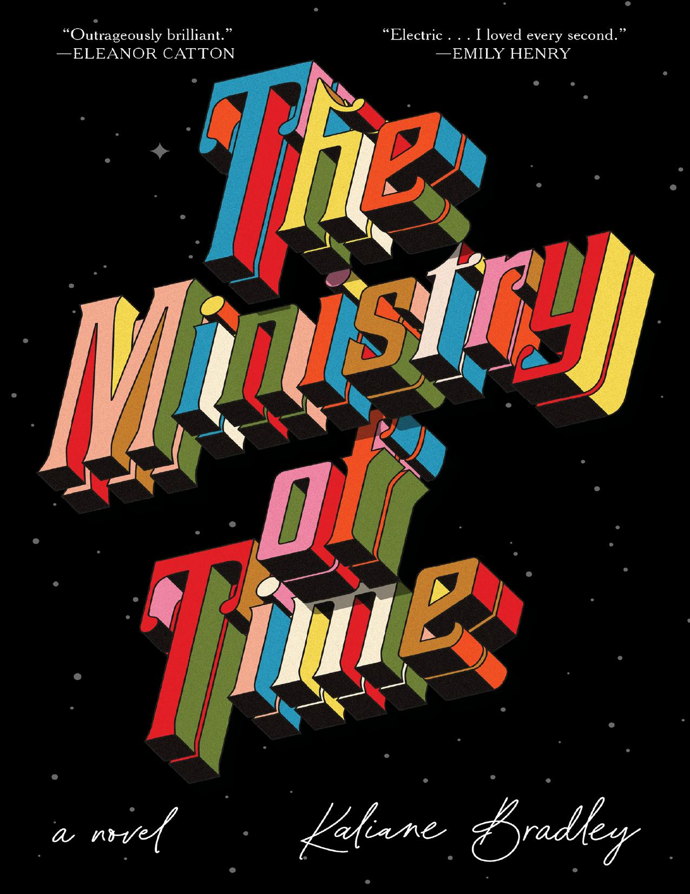](https://books.rob.me.uk/book/1631)
##### conceptual · romantic · bureaucratic
##### Kaliane Bradley
##### Fiction, 2024, 352 pages

> The Guardian says: "Bradley's debut is a time-travel romance between 19th-century polar explorer Graham Gore and a Cambodian-British young woman in 21st-century London. Fizzing with sharp one-liners about everything from Tinder to e-scooters, the novel is also a thoughtful meditation on imperialism and immigration."

Kaliane Bradley’s phenomenal debut crafts a sparkling, genre-bending, and highly inventive atmosphere that merges modern office farce with historical displacement. The narrative tone is distinctively witty, hyper-contemporary, and laced with sharp social commentary regarding modern British lifestyle and historical legacy. It holds immense crossover appeal for readers who love high-concept time-travel romance, smart romantic comedies, and stories that unpack the hidden weight of empire.

Imagine being assigned to a secretive government HR department, only to discover your new "expat" colleague is a resurrected Victorian polar explorer who has just been plucked from the ice and dropped into 21st-century London. As our razor-sharp narrator guides Commander Graham Gore through the modern perils of Spotify, washing machines, and dating, a shadowy conspiracy threatens to tear them apart. Sizzling with chemistry and laugh-out-loud observations, this is a brilliant time-travel caper that completely reinvents the summer romcom.

#### Long Island
##### domestic · melancholic · sequel
##### Colm Tóibín
##### Fiction, 2024, 304 pages

> The Guardian says: "Anyone who wept at the end of Tóibín's much-loved 2009 novel Brooklyn will rejoice at the news of a sequel. In Long Island, Eilis is now in her 40s, settled with Italian-American Tony and their two children, until a knock on the door one day changes everything. The novel returns to Enniscorthy, the small coastal Irish town of many of Tóibín's novels, and the possibility of rekindling the romance with local landlord Jim Farrell. The will-they-won't-they love story will have you entranced all over again."

This long-awaited, deeply moving sequel delivers an exceptionally intimate, slow-burning, and emotionally mature look at middle-aged compromise and displacement. Colm Tóibín conjures an atmosphere thick with quiet tension, unuttered desires, and the heavy nostalgia of a return to provincial Irish life. It appeals profoundly to lovers of classic domestic realism, rich character-driven sequels, and stories that examine how long-buried secrets can instantly shatter an established life.

Eilis Lacey thought she had finally left the ghosts of Enniscorthy behind for the bustling, predictable safety of 1970s Long Island. But when an Irish stranger arrives on her doorstep with a shocking revelation about her husband, her carefully constructed American life is instantly shattered. Fleeing back across the Atlantic, she finds herself dangerously close to the man she left behind twenty years ago. Tóibín delivers an absolute masterclass in simmering tension, plunging readers into a gripping drama of forbidden second chances.

#### [You Are Here](https://books.rob.me.uk/book/1539)

##### relatable · romantic · witty
##### David Nicholls
##### Fiction, 2024, 352 pages

> The Guardian says: "Hot on the heels of the hit TV series of Nicholls's twentysomething romance One Day comes You Are Here, a Gore-Tex-clad romcom joining mid-lifers Marnie and Michael as they walk the costal path through the Lake District and the Pennines. Always on the cusp of laughter and tears, the reader is with them every step of the way. Make sure it's in your backpack."

David Nicholls delivers a beautifully written, comforting, and deeply intelligent romantic comedy that serves as a definitive love letter to modern midlife resilience. The narrative tone is exceptionally warm and witty, balancing the physical realities of blistered feet and English rain against the sharp, conversational sparring of two lonely adults. It holds a massive, global appeal for readers who crave honest, mature romances that avoid saccharine clichés in favor of genuine emotional connection and psychological realism.

Meet Marnie and Michael: two bruised, deeply cynical mid-lifers who would rather be anywhere else than trekking through the relentless rain of the English Lake District. But as the miles of mud and mist roll by, their prickly, defensive banter begins to crack open, revealing a tentative, utterly charming connection. From the maestro of modern romance, this is a funny, achingly real, and totally irresistible story about finding the courage to take a chance on love when you least expect it.

#### [Long Island Compromise](https://books.rob.me.uk/book/1633)
[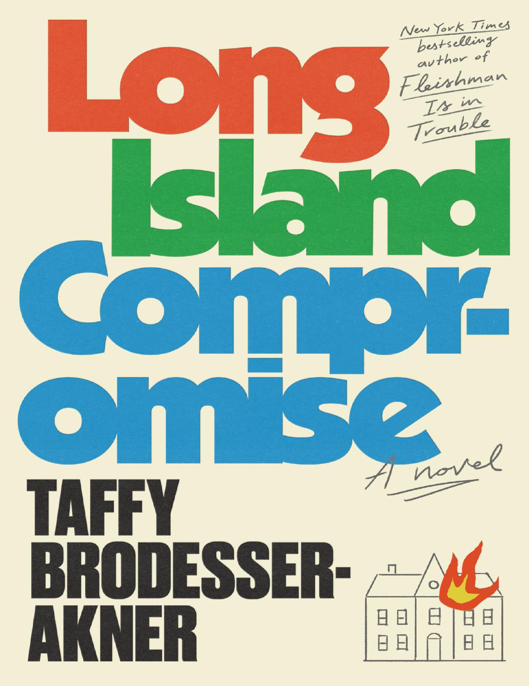](https://books.rob.me.uk/book/1633)
##### saturnine · satirical · wealth
##### Taffy Brodesser-Akner
##### Fiction, 2024, 464 pages

> The Guardian says: "After polystyrene factory owner Carl Fletcher is kidnapped in a well-heeled Long Island suburb, life for the wealthy Fletcher family will never be the same. A follow-up to one of the most riotously enjoyable novels of recent years, Fleishman Is in Trouble, this family epic is a page-turning foray into the American dream, inherited trauma and, most importantly, the effects of money. Out in early July, it's written with the same comic brio and Botox needle-sharp observations that made Fleishman such a blast."

This sprawling, riotously funny, and deeply cynical American epic delivers an unsparing look at generational trauma, wealth protection, and the hollow core of high-society success. Taffy Brodesser-Akner crafts an atmosphere that is hyper-verbal, high-anxiety, and thick with the distinct claustrophobia of suburban privilege. It holds incredible crossover appeal for fans of sharp social satires, dysfunctional multi-generational family sagas, and stories that expose the corrosive psychological impacts of immense wealth.

Forty years after wealthy factory owner Carl Fletcher is snatched from his driveway and held for ransom, his deeply damaged family is still paying the price. His three kids are spectacular disasters: an anxiety-ridden screenwriter, a status-obsessed Hollywood agent, and a chronically broke bohemian. As their inherited trauma collides with their dwindling trust funds, Brodesser-Akner unleashes a gloriously chaotic, laugh-out-loud takedown of American wealth that reads like a blockbuster thriller wrapped in a wicked social satire.

#### [Enlightenment](https://books.rob.me.uk/book/1634)
[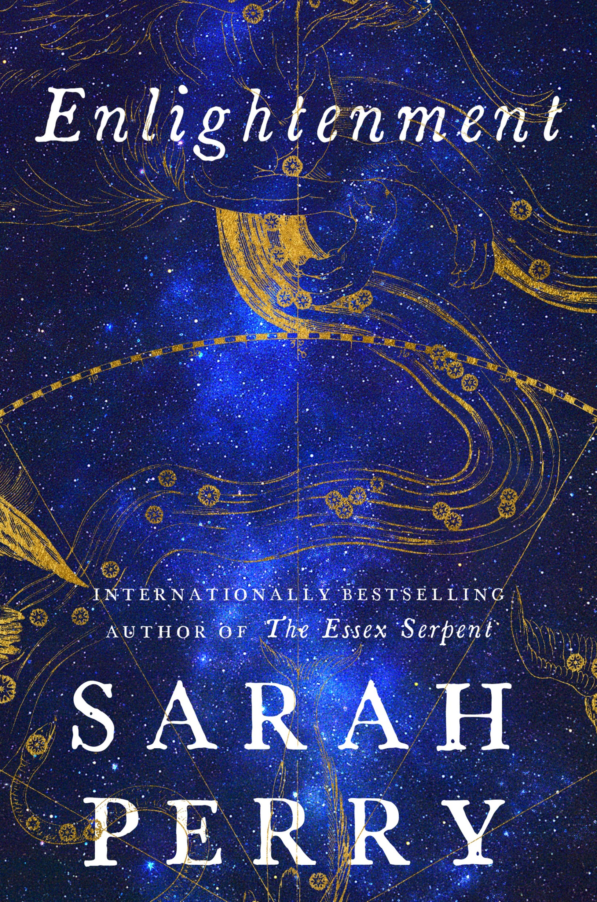](https://books.rob.me.uk/book/1634)
##### celestial · gothic · faith
##### Sarah Perry
##### Fiction, 2024, 384 pages

> The Guardian says: "Fans of Perry's bestselling 2016 novel The Essex Serpent will be delighted to see her return to home territory in Enlightenment. Set in the fictional riverside town of Aldleigh, a version of Chelmsford in Essex, where Perry grew up, and drawing on her strict Baptist upbringing, the novel brings together astronomy, religion and ghosts in a tale of unrequited love spanning decades."

Sarah Perry returns brilliantly to the haunted marshes of Essex, creating an exceptionally luminous, atmospheric, and deeply philosophical study of faith, science, and devotion. The prose style is characteristically rich, gothic, and sensory, wrapping the reader in an environment where astronomical wonders and religious structures intertwine. It possesses a profound appeal for enthusiasts of slow-burning historical fiction, intellectual mysteries, and narratives that explore the quiet, enduring ache of unrequited love across lifetimes.

In the eerie, fog-drenched town of Aldleigh, two unlikely friends—a local journalist and a troubled minister—are bound together by a shared obsession with the cosmos and a legendary, vanished 19th-century astronomer. As they chase the ghosts of the past through dusty local archives and dazzling meteor showers, a haunting, decades-long mystery begins to unravel. Perry weaves a spellbinding, deeply romantic gothic puzzle that will leave you starstruck and turning pages long into the night.

#### [Wild Houses](https://books.rob.me.uk/book/1636)
[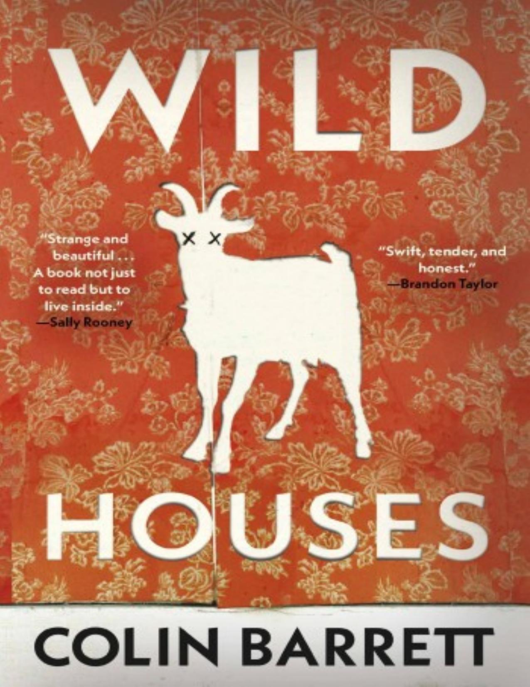](https://books.rob.me.uk/book/1636)
##### claustrophobic · visceral · fatalistic
##### Colin Barrett
##### Fiction, 2024, 272 pages

> The Guardian says: "Set over a single weekend in the author's native County Mayo, Wild Houses marries a thriller-ish plot about a kidnapping with the excellent prose for which he has become known. Barrett's first novel is set amid the territory of his acclaimed short stories – small-time crooks, violence and fatalism – as we root for Nicky to escape the claustrophobia of a town where everyone knows everything about you."

Colin Barrett makes a phenomenal transition to the novel form with this hyper-localized, gritty, and intensely atmospheric Irish thriller. The narrative environment is damp, suffocating, and thick with the quiet dread of small-town criminality, capturing the desperate maneuvers of marginalized figures with razor-sharp precision. It holds exceptional crossover appeal for fans of taut, slow-burning psychological suspense, unvarnished rural realism, and fiction that dissects the weight of small-town gossip and historical fatalism.

One chaotic weekend in a claustrophobic County Mayo town is about to go spectacularly wrong. When two small-time, violently unpredictable drug dealers kidnap a local teenager to settle a score, they drag an entire cast of desperate misfits into their catastrophic orbit. Barrett cranks the tension to the absolute maximum, delivering a gritty, darkly hilarious, and pulse-pounding rural thriller that grips you by the throat from the very first page and refuses to let go.

#### [All Fours](https://books.rob.me.uk/book/2042)

##### provocative · surreal · contemporary
##### Miranda July
##### Fiction, 2024, 336 pages

> The Guardian says: "Possibly one not to read on public transport, All Fours follows its 45-year-old protagonist as she leaves her child and husband behind for a road trip from her home in LA to New York. Barely 20 miles in, she catches sight of a hot young guy on a garage forecourt and books into a shabby roadside motel, where she embarks on a very different kind of journey. Like much of July's often strongly autobiographical work as a writer, film-maker and performance artist, All Fours is outrageous, erotic, witty and moving."

Miranda July’s cultural phenomenon is a dazzlingly original, transgressive, and wildly funny exploration of midlife rebirth and domestic escape. The atmosphere is uniquely July—eccentric, hyper-sensory, and laced with a brilliant deadpan absurdity that challenges every traditional script regarding motherhood, marriage, and aging. It possesses an immense crossover appeal for readers seeking fearless feminist literature, body-positive narratives, and stories that use the surreal to capture the profound internal crises of adulthood.

Just twenty miles into a meticulously planned cross-country road trip, a 45-year-old artist abruptly ditches her itinerary, pulls into a nondescript California motel, and decides to completely reinvent her life. What follows is a wild, erotic, and spectacularly funny detour into the uncharted territory of midlife rebellion. July rips up the rulebook on marriage and aging, handing readers a provocative, breathless, and totally unpredictable joyride that is guaranteed to be the most talked-about book of the year.

#### The Lodgers
##### lyrical · domestic · isolated
##### Holly Pester
##### Fiction, 2024, 240 pages

> The Guardian says: "Following an unnamed narrator as she moves into a shared flat and remembers, or imagines, an alternative living arrangement with a single mother and her child, poet Pester's debut novel explores the dislocation and loneliness of the housing crisis with sharply comic prose."

Acclaimed poet Holly Pester transitions effortlessly to fiction with this deeply inventive, lyrical, and sharply funny dissection of modern urban precarity and housing anxiety. The atmosphere is distinctively transient, dusty, and psychologically fragmented, capturing the specific emotional exhaustion of navigating temporary living arrangements. It appeals intensely to readers who love stylistically adventurous prose, sharp comedies of manners, and stories that unearth the profound isolation underlying the modern housing crisis.

Desperate for shelter and adrift in the city, our sharp-witted narrator moves into a precarious sublet and immediately becomes obsessed with the ghosts of the flat's previous tenants. Was it a struggling single mother? A chaotic artist? Blurring the lines between grim reality and wild imagination, Pester crafts a brilliantly quirky, laugh-out-loud exploration of the modern rental nightmare. It’s a fresh, electric, and deeply relatable portrait of what it means to search for a place to call home.

#### [The Safekeep](https://books.rob.me.uk/book/1600)

##### gothic · intense · queer love story
##### Yael van der Wouden
##### Fiction, 2024, 272 pages

> The Guardian says: "In a 1960s Netherlands still haunted by the second world war, buttoned-up Isabel and tempestuous, vibrant Eva are thrown together one summer in a provincial house. Part love story, part mystery, this sensuous, tautly paced novel explores repression and desire, suspicion and complicity as it builds towards its emotionally devastating twist."

This striking debut novel delivers a dense, highly charged, and deeply atmospheric exploration of post-war guilt and forbidden passion. Yael van der Wouden conjures a world of rigid domestic routines and heavy provincial silence in the remote Dutch countryside, slowly transforming a quiet house into a space of intense psychological warfare. It appeals powerfully to lovers of historical gothic fiction, taut queer romances, and stories that unearth the dark, unacknowledged crimes of historical collaboration.

Isabel leads a fiercely ordered, fiercely isolated life in her rural Dutch country estate—until her reckless brother dumps his glamorous, chaotic new girlfriend, Eva, on her doorstep for the summer. Soon, objects in the house start going missing, and simmering hostility explodes into an intoxicating, dangerous obsession. Packed with electric sexual tension and a jaw-dropping historical twist, this is a seductive, slow-burn thriller that will leave you utterly breathless.

#### [Private Rites](https://books.rob.me.uk/book/1648)
[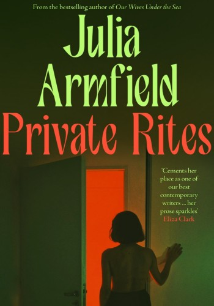](https://books.rob.me.uk/book/1648)
##### dystopian · evocative · sisterhood
##### Julia Armfield
##### Fiction, 2024, 320 pages

> The Guardian says: "The rain never stops. Ferries sail where trains once ran and anyone with money has retreated to higher ground. Faced with the “final stages” of climate collapse, sisters Isla, Irene and Agnes are also preoccupied with all the usual stuff: annoying commutes, crap relationships and toxic sibling rivalry. After the death of their famous father – a visionary but cruel architect – they come together in his imposing glass house, where his malign influence seems to live on. An evocative mystery set at the end of the world by the author of Our Wives Under the Sea."

Julia Armfield follows her acclaimed debut with a hauntingly beautiful, fluid, and deeply claustrophobic dystopian mystery that transforms environmental catastrophe into a domestic space of reckoning. The narrative atmosphere is heavy with the relentless sound of falling water, damp interiors, and the quiet despair of a city facing its final stages of climate collapse. It holds exceptional crossover appeal for fans of speculative fiction, dark psychological mysteries, and intense, sharp investigations into toxic family dynamics and sibling rivalry.

The world is literally drowning, but the three estranged sisters trapped in their late father's sprawling glass mansion have more immediate problems: toxic rivalries, terrible exes, and a mountain of family secrets. As the endless rain hammers against the windows and the city sinks beneath the floodwaters, the ghosts of their cruel, visionary father begin to surface. Armfield delivers a slick, eerie, and ferociously entertaining apocalyptic mystery that hits like a tidal wave.

#### [Green Dot](https://books.rob.me.uk/book/1649)
[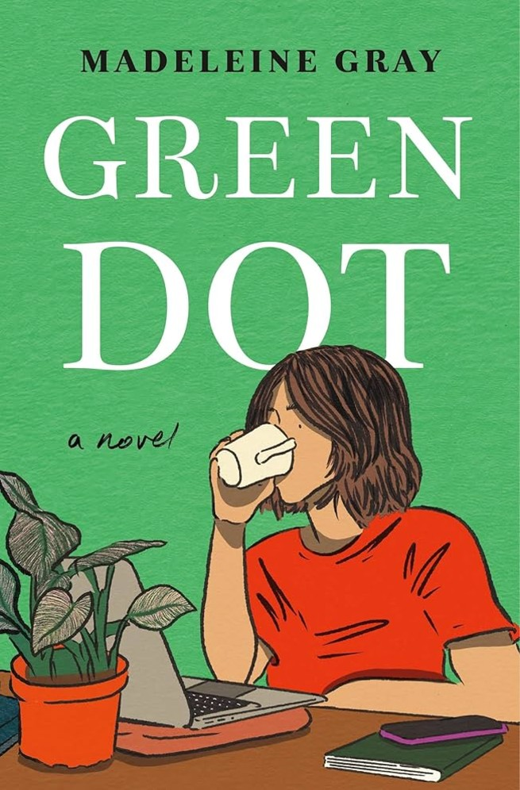](https://books.rob.me.uk/book/1649)
##### droll · destructive · office drudgery
##### Madeleine Gray
##### Fiction, 2024, 320 pages

> The Guardian says: "Peppered with pop cultural references to The Wire, Rupi Kaur and Buffy the Vampire Slayer, this razor-sharp novel recounts the destructive affair between a disaffected millennial and her older married boss. It's narrated by droll 24-year-old Hera who, after several arts degrees, has finally succumbed to corporate drudgery, working as an online community moderator in a large, cold office she fears she will never leave. It's here that she meets Arthur, who quickly becomes the object of her obsession."

Madeleine Gray delivers a phenomenal, razor-sharp, and brilliantly witty critique of corporate exhaustion and modern romantic self-destruction. The atmosphere is distinctively mundane and fluorescent-lit, capturing the quiet madness of a large, cold corporate office alongside the chaotic energy of a secret workplace obsession. It holds tremendous crossover appeal for readers seeking fresh, unfiltered millennial fiction, workplace satires, and stories that examine the dangerous allure of a toxic romantic affair as an escape from existential boredom.

Twenty-four-year-old Hera is drowning in arts-degree debt and suffocating in a soulless corporate cubicle—until she locks eyes with Arthur, her older, married, and devastatingly charming colleague. What starts as a cynical office flirtation rapidly spirals into a messy, all-consuming, and entirely destructive obsession. Armed with a killer wit and zero impulse control, Gray delivers a scorching, hilarious, and brutally honest portrait of millennial burnout and the intoxicating thrill of making terrible decisions.