### Nobel Prize-winning Authors

### Nobel Winners 2020s

#### [Septology](https://books.rob.me.uk/book/2322)

##### Jon Fosse        
#####            hypnotic · meditative · identity

Hailed as a towering achievement of contemporary Scandinavian literature, Fosse's magnum opus invites readers into a profound, rhythmic meditation on art, God, and addiction. Its cultural weight lies in its daring rejection of traditional punctuation, acting less like a standard novel and more like a hypnotic incantation that captures the very breath of human consciousness. 

You follow Asle, an aging painter, as he drives through the freezing Norwegian fjords to rescue his alcoholic doppelgänger from a snowbank. If you enjoy atmospheric, slow-burn character studies, this unbroken stream of memory offers a mesmerizing and deeply moving look at grief and the alternate paths our lives can take.

##### Fiction, 2019, 800 pages

#### Melancholy
##### Jon Fosse
##### artistic · hallucination · madness

Plunging into the tortured psyche of nineteenth-century Norwegian painter Lars Hertervig, Fosse’s novel is a brilliant, unsettling portrait of artistic genius and mental collapse. It holds immense appeal for readers interested in the intersection of creativity, romantic obsession, and psychological isolation.

Relying on a hypnotic, highly repetitive prose style, the book physically simulates the protagonist's spiraling panic attacks and sexual obsessions. You will witness his devastating expulsion from an art academy in Germany, tracking a tragic transformation from a hopeful student to a forgotten outcast obsessed with light.

##### Fiction, 1995, 210 pages

#### [Human Acts](https://books.rob.me.uk/book/2117)

##### Han Kang
##### collective · trauma · resistance

Serving as a vital monument to the 1980 Gwangju uprising, Kang’s heartbreaking chronicle gives voice to the victims of state-sanctioned violence. The book has cemented its place in global literature by refusing to look away from historical atrocities, offering a deeply empathetic tribute to the resilience of the South Korean democratic spirit.

Starting with a boy searching for his best friend's corpse, the story branches out to capture the voices of grieving mothers, tortured students, and even wandering souls. It's a devastating, polyphonic masterpiece perfect for anyone wanting to understand how communities survive, resist, and remember unthinkable trauma.

##### Fiction, 2014, 224 pages

#### [The Vegetarian](https://books.rob.me.uk/book/1782)
[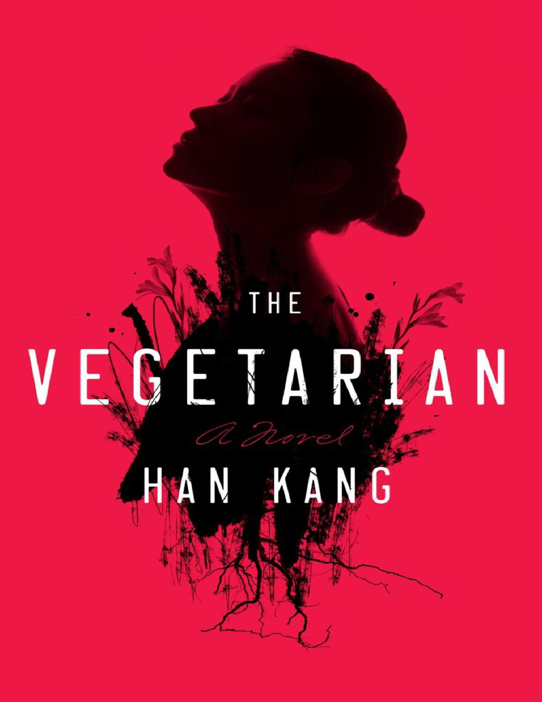](https://books.rob.me.uk/book/1782)
##### Han Kang
##### surreal · visceral · rebellion

Exploding onto the international stage with its Man Booker International win, this surreal and terrifying novel explores the violent consequences of a woman's refusal to consume meat. It operates as a fierce, subversive critique of patriarchal control and societal conformity, resonating deeply with modern audiences navigating bodily autonomy.

Witness Yeong-hye’s psychological descent through the biased, increasingly disturbed perspectives of her husband, brother-in-law, and sister. As she sheds her language, clothing, and humanity in a desperate bid to become purely botanical, you are pulled into a dark, gripping thriller about the true cost of complete rebellion.

##### Fiction, 2007, 188 pages

#### [Averno](https://books.rob.me.uk/book/2314)

##### Louise Glück
##### mythic · fragmented · decay

Reimagining the myth of Persephone, Glück’s acclaimed collection maps the desolate terrain of aging, depression, and the fraught bonds between mothers and daughters. It stands as a stark, uncompromising work of contemporary poetry, praised for its chilling clarity and refusal to offer easy consolations.

These verses read like a fractured, modern dialogue between the earthly realm and the underworld. If you are drawn to poetry that strips away sentimentality to expose the raw, isolating fear of winter and physical decline, this collection offers a hauntingly beautiful emotional resonance.

##### Poetry, 2006, 80 pages

#### [The Wild Iris](https://books.rob.me.uk/book/2319)

##### Louise Glück
##### luminous · spiritual · transformation

Winning the Pulitzer Prize, this astonishing collection uses the voices of garden flowers to explore profound themes of death, resurrection, and the silence of God. It remains a foundational text of modern American poetry, revered for its intense lyricism and spiritual depth.

Meticulously following the cycle of a single summer, the verses alternate between the perspectives of the earth, a human gardener, and an omniscient creator. Using the physical struggle of a bulb breaking through frozen dirt as a central metaphor, the book maps a painful, triumphant journey of surviving emotional trauma.

##### Poetry, 1992, 80 pages

#### [By the Sea](https://books.rob.me.uk/book/2321)

##### Abdulrazak Gurnah
##### immigration · memory · betrayal

A profound exploration of exile and historical erasure, Gurnah’s evocative novel sheds light on the complex legacy of British colonialism in East Africa. It has earned significant acclaim for its dignified, nuanced portrayal of asylum seekers navigating the cold bureaucracies of modern Europe.

Two elderly refugees cross paths in a quiet English seaside town, only to realize their pasts are fatally intertwined by an old family feud in Zanzibar. Moving entirely through their shared storytelling, they slowly unravel decades of betrayal and colonial theft in a tale that is as much a mystery as it is a historical reckoning.

##### Fiction, 2001, 280 pages

#### [Paradise](https://books.rob.me.uk/book/2315)

##### Abdulrazak Gurnah
##### historical · colonial · coming-of-age

Shortlisted for the Booker Prize, Gurnah’s lush, atmospheric epic offers a profound reimagining of East Africa on the brink of World War I. It counters traditional European colonial narratives by centering the complex, interconnected networks of Arab, Indian, and African trade that defined the region before the German invasion.

Sold into indentured servitude to pay his father's debts, a young boy embarks on a dangerous trading expedition into the deep, wild interior. Exposing the brutal realities of the local slave trade, his coming-of-age journey culminates in a sudden, dramatic confrontation with modern imperial armies.

##### Fiction, 1994, 250 pages

#### [Happening](https://books.rob.me.uk/book/2116)

##### Annie Ernaux
##### clinical · dangerous · liberation

A fierce, uncompromising account of a young woman's desperate search for an illegal abortion in 1960s France. Ernaux's clinical, unsentimental prose turns a deeply private trauma into a monumental political statement, securing its status as a foundational text of modern feminist literature.

Driven by the looming deadline of university exams and the protagonist's expanding body, the book moves with the ticking-clock tension of a thriller. It is a stark, essential read that highlights the lethal, clandestine choices forced upon young women by hypocritical medical and social establishments.

##### Non-fiction, 2000, 96 pages

### Nobel Winners 2010s

#### [The Books of Jacob](https://books.rob.me.uk/book/2118)

##### Olga Tokarczuk
##### epic · heretical · historical

A sprawling, panoramic triumph, Tokarczuk’s Nobel-winning epic resurrects the forgotten eighteenth-century world of Jacob Frank, a charismatic and polarizing mystic. It stands as a monumental feat of historical reclamation, blending intense theological debate with the muddy, vibrant realities of a borderless Eastern Europe. 

Expect to be fully immersed in a dizzying web of religious subversion and absolute devotion. Because we only ever see the enigmatic Frank through the awed or terrified eyes of his disciples and enemies, the book reads like a massive, thrilling puzzle for history buffs and lovers of ambitious, world-building fiction.

##### Fiction, 2014, 900 pages

#### [Flights](https://books.rob.me.uk/book/2109)

##### Olga Tokarczuk
##### fragmented · travel · constellation

Embracing the chaos of modern mobility, this inventive "constellation novel" perfectly captures the restless psychology of the twenty-first-century traveler. Tokarczuk blends anatomical science, historical anecdotes, and airport observations into a mesmerizing tapestry that challenges our fundamental understanding of borders and bodies.

Rather than tracing a linear journey, you'll leap from Chopin's smuggled heart in the 19th century to a modern man frantically searching for his vanished family on a Croatian island. It's an intellectually exhilarating ride designed for readers who love assembling thematic fragments into a beautiful, overarching philosophy of motion.

##### Fiction, 2007, 400 pages

#### [Dear Life](https://books.rob.me.uk/book/2107)

##### Alice Munro
##### intimate · memory · transition

Widely regarded as the crowning jewel of her illustrious career, Munro's final collection captures the subtle, devastating turning points of ordinary lives in rural Canada. It serves as a masterclass in the short story form, securing her legacy as a writer who could distill entire lifetimes of regret and revelation into a few quiet pages.

Dive into stories where a missed train, a sudden sexual awakening, or a casual conversation alters a character's destiny forever. Finishing with four purely autobiographical sketches that strip away all fictional artifice, this is an essential read for anyone who appreciates quiet, razor-sharp insights into the human heart.

##### Fiction, 2012, 336 pages

#### [The Moons of Jupiter](https://books.rob.me.uk/book/2111)

##### Alice Munro
##### relationships · insight · domestic

Consolidating Munro’s reputation as a peerless architect of the short story, this collection brilliantly maps the shifting emotional landscapes of middle-aged women in Canada. It holds lasting appeal for its sharp, unsentimental examination of aging parents, fading marriages, and the complex pursuit of independent identities.

Hinging on quiet, internal pivots rather than dramatic external action, each tale builds toward a moment of profound psychological clarity. Domestic interruptions—a hospital visit, an old lover's return—force the protagonists to suddenly reevaluate their past compromises and accept the fundamental isolation of human existence.

##### Fiction, 1982, 240 pages

#### [Never Let Me Go](https://books.rob.me.uk/book/219)
[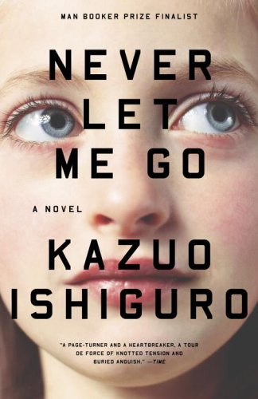](https://books.rob.me.uk/book/219)
##### Kazuo Ishiguro
##### dystopian · melancholy · dynamic

Quietly devastating, Ishiguro’s speculative masterpiece disguises a horrifying bio-ethical dystopia within the polite, nostalgic confines of an English boarding school. It has become a modern classic, praised for its heart-wrenching exploration of how humans accept their own mortality and the cruelties of the systems they inhabit.

Follow Kathy, Tommy, and Ruth as they navigate the complex jealousies of childhood, only to slowly realize they are clones raised exclusively to donate their vital organs. It's a profound, tear-jerking story about love, memory, and our desperate attempts to prove we have souls before our time runs out.

##### Fiction, 2005, 288 pages

#### [The Remains of the Day](https://books.rob.me.uk/book/1237)
[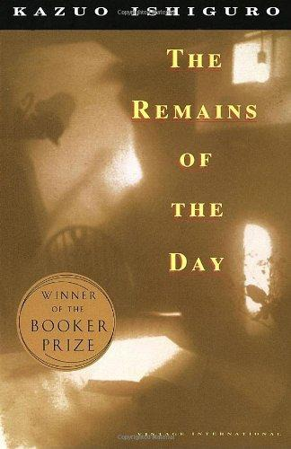](https://books.rob.me.uk/book/1237)
##### Kazuo Ishiguro
##### restraint · regret · loyalty

A masterclass in unreliable narration and emotional restraint, Ishiguro’s Booker-winning novel perfectly captures the fading illusions of the British class system. It remains a beloved cultural touchstone, renowned for its heartbreaking exploration of a life wasted in the pursuit of absolute professional dignity.

Unfolding during a post-war motoring trip, an aging butler’s polished, polite recollections slowly betray his deep, unacknowledged grief. Realizing too late that his blind loyalty was given to a Nazi sympathizer, he must confront the agonizing truth that he abandoned his only chance at romance for the sake of duty.

##### Fiction, 1989, 245 pages

#### [The Great Enigma](https://books.rob.me.uk/book/2340)

##### Tomas Tranströmer
##### minimalist · luminescent · clarity

Composed after a stroke severely limited his ability to speak, Tranströmer's late-career collection is a testament to the endurance of the creative spirit. These minimalist, haiku-like verses hold immense cultural reverence in Sweden, distilling vast spiritual and natural mysteries into crystal-clear imagery.

Stripping away all unnecessary rhetoric, the poet presents stark, luminous contrasts between the busy modern world and ancient, silent landscapes. Finding limitless freedom within the confines of a rigid seventeen-syllable format, this book is perfect for anyone seeking brief moments of profound, meditative peace.

##### Poetry, 2004, 80 pages

#### [The Half-Finished Heaven](https://books.rob.me.uk/book/2338)

##### Tomas Tranströmer
##### dreamlike · observant · mystery

Showcasing the brilliance of his mid-career work, this collection solidifies Tranströmer's reputation as a master of the surreal and the everyday. His poetry invites readers to look closely at the world, suggesting that ordinary moments are constantly brimming with hidden, divine architecture.

Expect to be transported from mundane settings—like a moving train or a quiet forest road—straight into expansive, cosmic revelations. If you appreciate writing that bridges the gap between everyday human anxiety and the vast, beautiful indifference of nature, these dreamlike verses will leave you spellbound.

##### Poetry, 2001, 110 pages

#### Chronicles
##### Bob Dylan
##### bohemian · musical · heritage

Defying the conventions of standard celebrity autobiography, Dylan’s memoir offers a brilliantly evocative look at the 1960s Greenwich Village folk scene. It is a vital historical artifact of American music, written with the same elusive, poetic cadence that defines his greatest songwriting.

Jumping sporadically between crucial, isolated eras of his early career and later recording sessions, Dylan gives a rare, intimate view into his obsessive artistic process. Fans of music history will absolutely devour his tales of how obscure library books, cold New York apartments, and forgotten blues records shaped a legend.

##### Non-fiction, 2004, 300 pages

#### Tarantula
##### Bob Dylan
##### surreal · avant-garde · erratic

A wild, uncontainable explosion of 1960s counter-culture, Dylan’s only work of experimental fiction reads like a fever dream of beat poetry and rock-and-roll excess. It stands as a fascinating historical artifact, capturing the restless, boundary-pushing energy of an artist refusing to be categorized.

Discarding traditional plot, punctuation, and character arcs entirely, the text unleashes rapid-fire, surrealist prose poems and bizarre fictional letters. Relying purely on rhythm and associative imagery, it launches a chaotic, satirical assault on consumerism, political hypocrisy, and fame.

##### Poetry, 1971, 140 pages

#### [The Feast of the Goat](https://books.rob.me.uk/book/2325)

##### Mario Vargas Llosa
##### political · dynamic · terror

Widely considered one of the greatest political novels of Latin America, Vargas Llosa’s gripping epic reconstructs the final days of Rafael Trujillo’s brutal Dominican dictatorship. It is a terrifying, masterful dissection of absolute power, complicity, and the psychological scars left on a traumatized nation.

You will jump between the dictator's decaying final hours, the tense roadside wait of his assassins, and the modern return of an exiled daughter confronting her father's collaboration. It’s a relentless, sweat-inducing read that exposes how state terror infects both grand political institutions and intimate family dynamics.

##### Fiction, 2000, 400 pages

#### [The Time of the Hero](https://books.rob.me.uk/book/2327)

##### Mario Vargas Llosa
##### military · violence · hierarchy

A spectacular, explosive debut that ignited the Latin American Boom, Vargas Llosa’s novel exposes the brutal, toxic machismo embedded within a prestigious Peruvian military academy. It is a gripping, complex thriller that uses a school setting as a microcosm for the violent social hierarchies of an entire nation.

Shifting timelines and multiple narrators reconstruct a secret theft of exam papers that escalates into the mysterious murder of a cadet. Exposing how corrupt officers enforce a code of silence, the system systematically crushes the one student brave enough to demand justice.

##### Fiction, 1962, 400 pages

#### [Voices from Chernobyl](https://books.rob.me.uk/book/2113)

##### Svetlana Alexievich
##### visceral · disaster · collective

A devastating masterpiece of documentary literature, Alexievich’s Nobel-winning work captures the untold human horror of the 1986 nuclear disaster. By elevating the voices of ordinary citizens over state propaganda, the book transformed a technological failure into an enduring, apocalyptic tragedy of the modern age.

Abandoning a central narrator entirely, the book reads like a massive, choral collage of survivor testimonies from firemen's widows, liquidators, and displaced farmers. It forces you to confront the surreal reality of an invisible enemy, exposing the profound psychological betrayal felt by a sacrificed working class.

##### Non-fiction, 1997, 240 pages

#### [The Unwomanly Face of War](https://books.rob.me.uk/book/2114)

##### Svetlana Alexievich
##### oral-history · visceral · war

A groundbreaking work of feminist history, Alexievich’s massive oral tapestry uncovers the forgotten heroism and trauma of the one million Soviet women who fought in WWII. By subverting official, male-dominated state propaganda, the book changed how modern literature documents the true, intimate horrors of conflict.

Abandoning chronological military history, hundreds of raw interviews are organized into thematic explorations of blood, grief, and the struggle to return to civilian life. Exposing how these female snipers and medics were shunned by post-war society, the narrative reveals a generation forced to bury their medals and their psychological wounds.

##### Non-fiction, 1985, 350 pages

#### [Dora Bruder](https://books.rob.me.uk/book/2108)

##### Patrick Modiano
##### investigation · memory · tragedy

Blending memoir, historical detective work, and biography, Modiano’s haunting book attempts to trace the final months of a Jewish teenager who vanished in Nazi-occupied Paris. It is a deeply moving literary monument, fighting against the erasure of marginalized victims in the vast machinery of the Holocaust.

Obsessively hunting through old police reports, newspaper clippings, and boarding school records, the author tries to reconstruct a doomed flight across the city. As he pieces together the girl's final days, his investigation blurs into his own memories, offering a mesmerizing, ghostly tour of the French capital.

##### Non-fiction, 1997, 140 pages

#### [Missing Person](https://books.rob.me.uk/book/2110)

##### Patrick Modiano
##### mystery · memory · identity

A defining work of French postmodernism, this haunting detective novel won the Prix Goncourt and cemented Modiano's obsession with the ghosts of the Occupation. It transforms a standard noir premise into a profound, melancholic meditation on historical amnesia and the fragility of human identity.

Following an amnesiac private investigator, you piece together fading address books and old photographs to reconstruct a vanished life. The hero's blank mind serves as a powerful allegory for a traumatized nation, ultimately revealing an identity erased by the terrors of wartime Paris.

##### Fiction, 1978, 170 pages

#### [The Republic of Wine](https://books.rob.me.uk/book/2112)

##### Mo Yan
##### satirical · grotesque · corruption

A wild, intoxicating masterpiece of magical realism, Mo Yan’s novel is a savage, grotesque satire of Chinese bureaucratic gluttony and corruption. It is a thrilling, demanding read that uses cannibalism and extreme alcohol consumption as powerful allegories for a society devouring its own future.

Alternating between a detective's surreal investigation in "Liquorland" and a series of letters sent to Mo Yan himself, the book is a dizzying puzzle. You will watch the investigator experience a complete moral and physical collapse, drowning in the very decadence and culinary excess he was sent to expose.

##### Fiction, 1992, 360 pages

#### [Red Sorghum](https://books.rob.me.uk/book/2333)

##### Mo Yan
##### visceral · historical · heritage

Exploding with color, violence, and mythic energy, Mo Yan’s epic introduced global readers to a fiercely independent, rural Chinese resistance against the Japanese invasion. It is a raw, sensory triumph that elevates ordinary bandits and peasants into legendary figures of national folklore.

Woven through the non-linear memories of a modern grandson, the tale spans decades of bandit raids, illicit romances, and brutal combat. Fusing the bloody reality of war with a deep, almost magical connection to the red earth, the narrative shows how the sorghum fields both sustain and bury the characters.

##### Fiction, 1986, 360 pages

#### [A Sorrow Beyond Dreams](https://books.rob.me.uk/book/2115)

##### Peter Handke
##### raw · grief · biography

Written in the immediate, agonizing wake of his mother’s suicide, Handke’s brief biographical essay is a seminal work of post-war Austrian literature. It is universally praised for its fierce, clinical honesty, attempting to capture the truth of a working-class woman's life without reducing her to a literary cliché.

Serving as a meticulous sociological investigation, the text examines the patriarchal, rural systems that crushed her spirit and denied her an independent voice. The act of writing becomes a painful therapeutic process, as the author fights to rescue her individual memory from the silent indifference of history.

##### Non-fiction, 1972, 90 pages

#### [The Goalie's Anxiety at the Penalty Kick](https://books.rob.me.uk/book/2317)

##### Peter Handke
##### detached · paranoia · isolation

A chilling, hyper-modernist thriller, Handke’s novel is a defining exploration of urban alienation and the breakdown of human communication. It holds a unique place in avant-garde literature for its unsettling, clinical detachment from the horrific violence committed by its protagonist.

After casually murdering a cinema cashier, a disgraced football player wanders through border towns waiting for his arrest. Meticulous prose details his total psychological collapse, showing how he begins to interpret every mundane word, gesture, and object as a hostile, paranoid code.

##### Fiction, 1970, 130 pages

### Nobel Winners 2000s

#### [The Hunger Angel](https://books.rob.me.uk/book/2328)

##### Herta Müller
##### visceral · survival · language

Drawing heavily on the real-life experiences of poet Oskar Pastior, Müller’s harrowing novel sheds light on the post-WWII deportation of ethnic Germans to Soviet gulags. It is a masterpiece of survival literature, transforming unimaginable starvation into a hauntingly beautiful, almost hallucinatory poetic experience.

Trapped in a brutal labor camp, a teenage boy survives by inventing a new, surreal vocabulary to describe his physical decay and the grueling act of shoveling coal. This is a tough but incredibly rewarding book that shows how the human mind uses language to build a fortress against absolute despair.

##### Fiction, 2009, 300 pages

#### [The Appointment](https://books.rob.me.uk/book/2320)

##### Herta Müller
##### paranoia · totalitarianism · routine

Capturing the suffocating, mind-bending terror of the Ceaușescu regime, Müller’s novel is an essential exploration of life under absolute state surveillance. It expertly portrays how a totalitarian government weaponizes ordinary daily routines, turning neighbors, friends, and spouses into potential informants.

Compressed entirely into the duration of a single tram ride, a factory worker commutes to an interrogation with the dreaded secret police. Flashing backward through her memories, the book brilliantly mimics the frantic, disjointed paranoia of a mind waiting for its own destruction.

##### Fiction, 1997, 220 pages

#### [Snow](https://books.rob.me.uk/book/2316)

##### Orhan Pamuk
##### political · isolation · crisis

Capturing the deep, polarizing tensions between secularism and religious fundamentalism in modern Turkey, Pamuk’s acclaimed novel is an essential political thriller. Set in a blizzard-locked border town, it masterfully dissects the complex identity crises that define a nation caught between Western modernization and Islamic tradition.

When an exiled poet arrives in a remote village to investigate a string of suicides, he quickly gets swept up in a theatrical, bloody military coup. The relentless snowfall traps everyone together, creating a claustrophobic, high-stakes environment that forces every ideological conflict to an explosive climax.

##### Fiction, 2002, 440 pages

#### [My Name Is Red](https://books.rob.me.uk/book/2146)

##### Orhan Pamuk
##### mystery · artistic · tradition

A dazzling, kaleidoscopic triumph, Pamuk’s historical murder mystery explores the philosophical clash between Islamic artistic traditions and the encroaching European Renaissance. It is celebrated globally for its rich sensory details and its profound meditation on what it means to possess a personal artistic style.

Investigating the murder of a royal miniaturist in sixteenth-century Istanbul, the story unfolds through a dizzying array of narrators—including a dog, a gold coin, and the color red itself. It’s a spectacularly inventive whodunit perfect for readers who love intricate conspiracies wrapped in high art and forbidden romance.

##### Fiction, 1998, 500 pages

#### [One Man's Bible](https://books.rob.me.uk/book/2139)

##### Gao Xingjian
##### trauma · historical · confessional

A blistering, autobiographical exorcism of the Chinese Cultural Revolution, Gao's novel offers an unflinching look at survival under totalitarian paranoia. It stands as a vital piece of dissident literature, exploring the moral compromises required to stay alive when a society turns entirely against itself.

Violently alternating between the author's comfortable modern exile in Europe and his traumatic memories of 1960s Beijing, the book is a masterclass in psychological tension. You'll navigate a terrifying world of forced betrayals and book-burnings, witnessing how a man fractures his own identity to survive the crushing machinery of the state.

##### Fiction, 1999, 450 pages

#### [Soul Mountain](https://books.rob.me.uk/book/2138)

##### Gao Xingjian
##### picaresque · spiritual · polyphonic

A sprawling, experimental odyssey through the remote wilderness of southwest China, Gao's Nobel-winning novel is a defining work of modern expatriate literature. It captures the desperate flight of an intellectual seeking refuge from political persecution and a false cancer diagnosis in the ancient, mystical heart of nature.

Famously alternating between "I," "You," "He," and "She" to represent a fractured psychology, the narrative is an episodic, dreamlike journey. Blending folk songs, shamanistic rituals, and deep philosophical musings, the book tracks a man actively shedding his urban identity to find spiritual renewal in the mountains.

##### Fiction, 1990, 500 pages

#### [Disgrace](https://books.rob.me.uk/book/1231)
[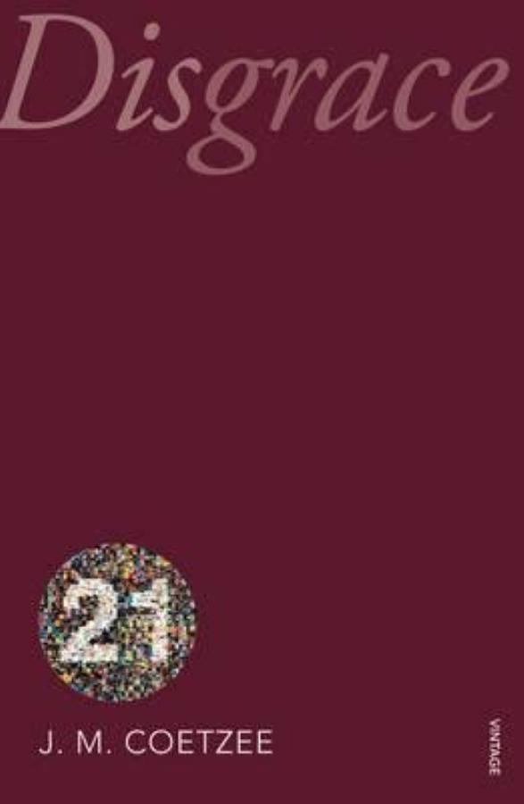](https://books.rob.me.uk/book/1231)
##### J. M. Coetzee
##### austere · systemic · isolation

Winning Coetzee his second Booker Prize, this chilling, unsparing novel captures the volatile, shifting power dynamics of post-Apartheid South Africa. It remains a deeply uncomfortable and essential read, confronting the limits of intellectual arrogance and the inescapable weight of historical racial guilt.

Fleeing a university scandal born of his own entitlement, an arrogant professor retreats to his daughter's rural farm, only to encounter horrific, retaliatory violence. Stripped entirely of his privileged ego, he is forced into a life of absolute subservience and humility in this brutally honest exploration of power and redemption.

##### Fiction, 1999, 220 pages

#### [Waiting for the Barbarians](https://books.rob.me.uk/book/2143)

##### J. M. Coetzee
##### allegorical · torture · imperial

A chilling, timeless allegory of imperial paranoia, Coetzee’s masterpiece dissects how empires invent enemies to justify their own systemic violence and torture. It is a defining text of post-colonial literature, challenging readers to recognize the moral rot at the heart of militarized societies.

Shattering the comfortable life of a frontier magistrate, the arrival of a ruthless state security officer triggers a profound crisis of conscience. Embarking on an agonizing moral awakening, the magistrate faces public humiliation and torture as he attempts to reject the brutal mechanics of the state he once served.

##### Fiction, 1980, 156 pages

#### [Kaddish for an Unborn Child](https://books.rob.me.uk/book/2142)

##### Imre Kertész
##### fragmented · trauma · isolation

A dense, breathless, and agonizing philosophical inquiry, Kertész’s novel explores the permanent, destructive psychological legacy of surviving Auschwitz. It stands as a radical, controversial act of witness, arguing that bringing new life into a post-Holocaust world is a moral impossibility.

Constructed entirely as a single, unbroken stream-of-consciousness paragraph, the narrative is driven by the relentless repetition of the word "No." This claustrophobic monologue tracks the protagonist's systematic dismantling of his marriage and career, turning his life into a living monument of absolute refusal.

##### Fiction, 1990, 120 pages

#### [Fatelessness](https://books.rob.me.uk/book/2141)

##### Imre Kertész
##### clinical · horrific · survival

Offering one of the most chilling perspectives on the Holocaust, Kertész’s Nobel-winning novel is told through the shockingly objective, logical eyes of a fourteen-year-old boy. It disrupts traditional, sentimental narratives of tragedy by demonstrating how easily human beings can adapt to the daily routines of hell.

Tracking the boy’s transit through Auschwitz and Buchenwald, the text focuses obsessively on the bureaucratic mechanics of the camps—from soup distribution to roll calls. Upon liberation, a devastating reality sets in: shaped entirely by the camps, he finds the pity of the outside world completely alienating.

##### Fiction, 1975, 260 pages

#### Lust
##### Elfriede Jelinek
##### visceral · capitalist · oppression

Savage, explicit, and uncompromising, Jelinek’s controversial novel obliterates the boundaries between capitalist consumption and marital sexual violence. It operates as a fierce, avant-garde feminist manifesto, exposing the dark, transactional underbelly of the traditional bourgeois family unit.

Intentionally rejecting conventional narrative flow, the prose unleashes a dense, pun-heavy barrage of language that equates human bodies with factory machinery. Deliberately suppressing standard character development, the book is a brutal demonstration of how patriarchal power structures totally objectify and destroy a woman's agency.

##### Fiction, 1989, 220 pages

#### [The Piano Teacher](https://books.rob.me.uk/book/2144)

##### Elfriede Jelinek
##### claustrophobic · toxic · dynamic

A brilliant, suffocating dissection of Viennese high culture and domestic tyranny, Jelinek’s novel is a cornerstone of radical feminist literature. It shocks and fascinates readers by exposing the violent, repressed sexual deviances hiding behind the rigid pursuit of classical musical perfection.

Utilizing a cold, clinical cadence to map a toxic, co-dependent warfare, the text traps a thirty-eight-year-old piano instructor in an apartment with her overbearing mother. When a younger male student attempts a conventional seduction, he completely fails to navigate the protagonist's dark, masochistic psychological demands, leading to a catastrophic breakdown.

##### Fiction, 1983, 280 pages

#### [The Golden Notebook](https://books.rob.me.uk/book/1478)
[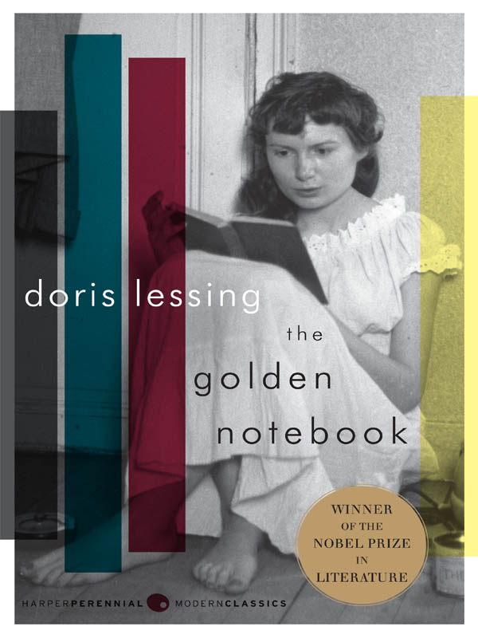](https://books.rob.me.uk/book/1478)
##### Doris Lessing
##### fragmented · feminist · identity

A towering achievement of feminist and modernist literature, Lessing’s complex novel captures the intellectual, political, and sexual anxieties of the mid-twentieth century. It is revered for its fearless dissection of the "free woman," exploring the intense pressures that lead to psychological fragmentation and creative paralysis.

The protagonist keeps four separate colored notebooks to categorize her African past, her communist politics, a fictionalized romance, and her personal diary. Creating a final "Golden Notebook," she painstakingly attempts to merge these fractured identities into a whole, functional self.

##### Fiction, 1962, 640 pages

#### [The Grass is Singing](https://books.rob.me.uk/book/2326)

##### Doris Lessing
##### psychological · racial · decay

A raw, claustrophobic, and highly explosive debut, Lessing’s novel laid bare the suffocating, toxic racism embedded in the colonial culture of Southern Rhodesia. It is a brilliant psychological thriller that exposes how the rigid, unspoken laws of white supremacy ultimately destroy the minds of the oppressors.

Beginning with the shocking murder of a white farmer's wife by her black servant, the story rewinds years to track the agonizing failure of her marriage on an isolated farm. Oppressive heat and financial ruin drive the protagonist to madness, forcing her into a fatal, taboo obsession with the man she commands.

##### Fiction, 1950, 220 pages

#### [Desert](https://books.rob.me.uk/book/2324)

##### J. M. G. Le Clézio
##### mythic · displacement · contrast

A luminous, grandly poetic exploration of the Saharan nomads, Le Clézio’s novel stands as a beautiful, tragic monument to cultures destroyed by colonial expansion. It holds a unique place in global literature for its stark, visual contrast between ancient desert freedom and the polluted alienation of modern European slums.

Weaving two distinct timelines, the book pairs a tragic 1910 migration of Tuareg warriors with the modern journey of Lalla, a young descendant seeking work in Marseille. Rejecting Western commercial success, Lalla's powerful character arc culminates in her choice to return to the silence of the desert to give birth.

##### Fiction, 1980, 350 pages

#### [The Interrogation](https://books.rob.me.uk/book/2318)
##### J. M. G. Le Clézio
##### isolation · erratic · alienation

A radical, avant-garde debut that captured the existential anxieties of the 1960s, Le Clézio’s novel plunges into the fractured mind of a young man who has completely disconnected from human society. It is an unsettling, experimental journey that blurs the lines between philosophical enlightenment and severe mental illness.

Occupying an empty beach house, Adam Pollo—possibly a military deserter or an escaped patient—follows stray dogs and delivers bizarre speeches to crowds. Fragmented journal entries and newspaper clippings chart his deliberate retreat from human language into pure, animalistic sensation.

##### Fiction, 1963, 240 pages

#### [A Bend in the River](https://books.rob.me.uk/book/2140)

##### V. S. Naipaul
##### political · isolation · transition

A bleak, brilliant, and deeply cynical assessment of post-colonial Africa, Naipaul’s novel captures the terrifying chaos of a newly independent nation sliding into dictatorship. It remains a polarizing but essential text, renowned for its unsentimental view of globalization, corruption, and historical displacement.

Buying a shop in a ruined interior town, an East African Indian merchant watches the region become engulfed by radical youth militias and a megalomaniacal president. Highlighting the protagonist's profound alienation, the narrative reveals that survival in a modernizing world requires a ruthless, rootless adaptability to constant betrayal.

##### Fiction, 1979, 280 pages

#### A House for Mr Biswas
##### V. S. Naipaul
##### epic · domestic · independence

A tragicomic, monumental epic of the Caribbean, Naipaul’s masterpiece is a profound exploration of identity, post-colonial displacement, and the universal desire for self-determination. It has secured its place in global literature by turning a seemingly ordinary man's lifelong quest to own a home into a heroic odyssey.

Struggling against the suffocating, collective control of his wife's massive Hindu family, Mr. Biswas utilizes wit, rebellion, and journalism to carve out an independent life. His journey culminates in the bittersweet, hard-won victory of purchasing a deeply flawed house of his own.

##### Fiction, 1961, 560 pages

#### The Caretaker
##### Harold Pinter
##### manipulation · territory · routine

A sharp, claustrophobic masterwork of modern drama, Pinter’s play brilliantly utilizes his signature pauses and ambiguous, repetitive dialogue to create a constant sense of underlying menace. It is a defining exploration of power dynamics, focusing on the desperate, territorial struggles of three damaged men trapped in a junk-filled room.

Taken in by a brain-damaged brother, a manipulative, homeless old man immediately attempts to play two siblings against each other to secure his dominance. The total failure of human communication eventually catches up with him, pushing his luck until he is systematically expelled into the cold.

##### Fiction, 1960, 80 pages

#### [The Birthday Party](https://books.rob.me.uk/book/2145)

##### Harold Pinter
##### menace · claustrophobic · absurdity

A terrifying, darkly funny cornerstone of the "comedy of menace," Pinter’s breakout play masterfully utilizes ambiguity and silence to create an atmosphere of inescapable dread. It remains a thrilling theatrical experience, exploring how institutions use guilt and psychological torture to break down rebellious individuals.

Two suited strangers invade the life of a quiet, lazy boarding house resident, throwing him an aggressive, surreal birthday party. Rapid-fire, nonsensical interrogations strip the protagonist of his glasses, his ability to speak, and ultimately, his independent identity.

##### Fiction, 1957, 90 pages

### Nobel Winners 1990s

#### Beowulf (Translation)
##### Seamus Heaney
##### epic · heroic · cadence

Breathing vibrant new life into the cornerstone of Anglo-Saxon literature, Heaney’s translation bridged the gap between academic study and popular reading. His masterful injection of Irish linguistic rhythms into the ancient text created a version that feels primal, urgent, and deeply human.

Follow the legendary hero through three escalating, blood-soaked monster battles, watching him grow from a boastful young warrior to a wise, self-sacrificing king. Driven by a muscular, percussive energy, this is the definitive edition for anyone wanting to experience the sheer, cinematic thrill of the original oral tradition.

##### Poetry, 1999, 220 pages

#### Death of a Naturalist
##### Seamus Heaney
##### visceral · rural · transition

Bursting with the wet, earthy vitality of rural Northern Ireland, Heaney’s debut collection instantly established him as a major voice in contemporary poetry. It is a beloved, deeply accessible classic that brilliantly captures the visceral transition from childhood innocence to the muddy, complex realities of adulthood.

Incredibly tactile, muscular language brings the physical labor of potato digging, churning butter, and collecting frogspawn to life. Realizing he cannot follow his ancestors into farming, the young poet resolves to use his pen to dig into the rich history of his culture instead.

##### Poetry, 1966, 60 pages

#### [Blindness](https://books.rob.me.uk/book/2337)

##### José Saramago
##### nightmarish · systemic · survival

A terrifying, allegorical masterpiece, Saramago’s Nobel-defining novel explores the rapid, brutal collapse of civilization following an unexplained epidemic of "white blindness." It serves as a grim warning about the fragility of modern social contracts and the animalistic violence hiding just beneath polite society.

Lacking standard punctuation and utilizing dense, unbroken paragraphs, the prose deliberately disorients you to mirror the loss of sight. Following a small band of survivors led by the only woman who retains her vision, this survivalist nightmare tests the absolute limits of human morality in a landscape of filth and terror.

##### Fiction, 1995, 320 pages

#### [The Gospel According to Jesus Christ](https://books.rob.me.uk/book/2136)

##### José Saramago
##### provocative · human · destiny

Fiercely controversial and brilliantly inventive, Saramago’s novel strips away biblical mythology to present Jesus as a flawed, manipulated pawn in a cosmic power game. It is a monumental work of religious skepticism, challenging readers to reexamine the foundational narratives of Western civilization.

Tracking the traditional life of Christ, the story aggressively subverts scripture by burdening Jesus with intense psychological guilt and a rebellious streak against a bloodthirsty God. Realizing on the cross that his death will only spark centuries of holy wars, the protagonist issues a tragic, unforgettable final apology to humanity.

##### Fiction, 1991, 400 pages

#### Miracle Fair
##### Wisława Szymborska
##### observant · philosophical · wonder

Showcasing the playful, ironic brilliance that earned her the Nobel Prize, Szymborska’s poetry elevates the mundane into the miraculous. Her work is a beloved cultural touchstone, famous for rejecting grand political rhetoric in favor of quiet, joyful astonishment at the simple fact of existence.

Often relying on shifting, unexpected perspectives, her verses invite you to view humanity from the viewpoint of a grain of sand, an onion, or a stray cat. Gently dismantling human arrogance, this collection is a comforting, beautiful reminder to appreciate life's fleeting anomalies.

##### Poetry, 1993, 120 pages

#### Calling Out to Yeti
##### Wisława Szymborska
##### witty · ironic · perspective

Marking her definitive break from the constraints of socialist realism, Szymborska’s collection established the sharp, witty, and deeply philosophical voice that would earn her the Nobel Prize. Her poems brilliantly dismantle the grand, terrifying political dogmas of the Cold War by focusing on the quiet, overlooked details of ordinary life.

Startling shifts in perspective allow the reader to explore historical atrocities or grand human ambitions through the eyes of a snowman, an ape, or an ancient stone. This clever use of irony serves as a powerful defense mechanism, protecting the individual mind against totalitarian certainty.

##### Poetry, 1957, 80 pages

#### [Omeros](https://books.rob.me.uk/book/1862)
[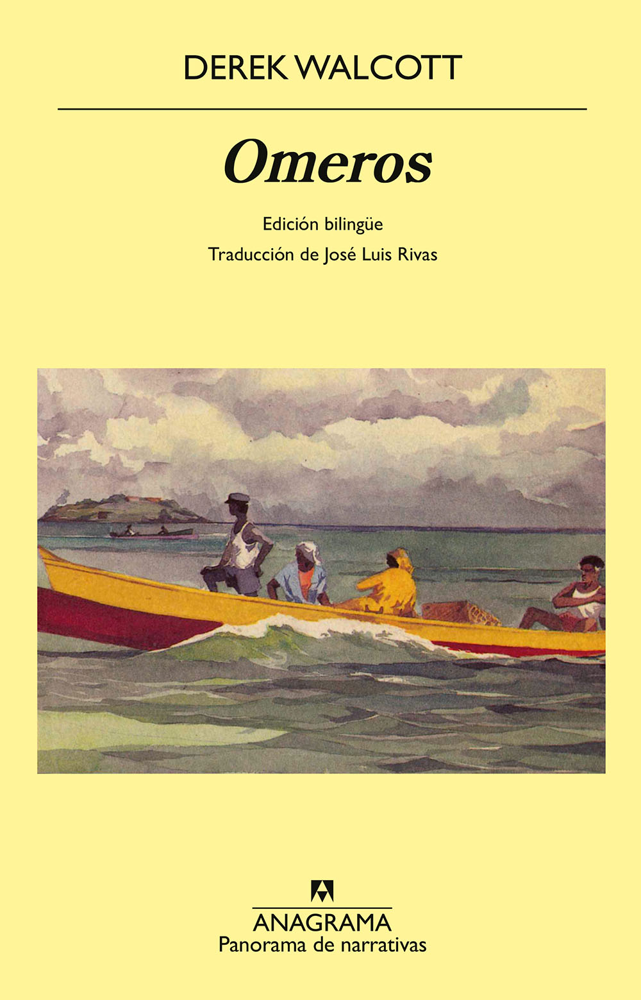](https://books.rob.me.uk/book/1862)
##### Derek Walcott
##### epic · post-colonial · heritage

Widely considered the greatest Caribbean poem ever written, Walcott’s sweeping epic boldly relocates the Homeric myths to the working-class fishing villages of St. Lucia. It is a triumph of post-colonial literature, elevating the struggles of island fishermen and taxi drivers to the level of classical heroes.

Operating through an intricate, rolling rhyme scheme, the verse weaves together local romantic rivalries with the historical traumas of the Middle Passage. Functioning as a massive healing ritual, the poetry allows the characters to reclaim their landscape from the ghosts of colonialism and assert their own majestic identity.

##### Poetry, 1990, 325 pages

#### [Beloved](https://books.rob.me.uk/book/2147)

##### Toni Morrison
##### haunting · trauma · survival

A towering, Pulitzer Prize-winning masterpiece, Morrison’s novel permanently reshaped American literature by forcing the country to confront the visceral, psychological legacy of slavery. Blending historical realism with gothic horror, it stands as a monument to the unbreakable, though deeply scarred, bonds of maternal love.

Operating through a fragmented structure called "rememory," the past constantly and physically interrupts the present timeline. Following the materialization of a murdered infant's ghost in Ohio, a family is forced to violently navigate their deepest traumas before they can claim true emotional freedom.

##### Fiction, 1987, 324 pages

#### [Song of Solomon](https://books.rob.me.uk/book/388)
[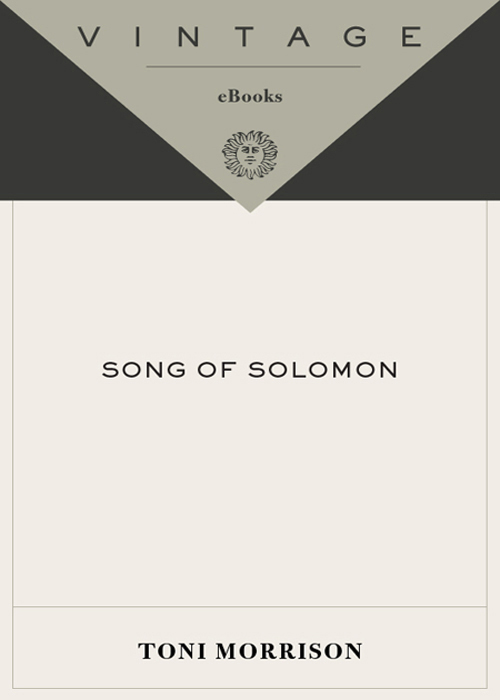](https://books.rob.me.uk/book/388)
##### Toni Morrison
##### flight · mythology · coming of age

A dazzling, mythic triumph, Morrison’s novel blends the gritty realism of mid-century urban America with the soaring magic of African American folklore. It is universally celebrated as a milestone of modern fiction, charting a profound journey from materialistic emptiness to deep cultural reclamation.

Leaving his toxic, wealthy family to hunt for lost gold in Virginia, Milkman Dead embarks on a transformative southern odyssey. Financial greed is quickly replaced by genealogical discovery as he learns to decode the songs and legends of his flying ancestors.

##### Fiction, 1977, 336 pages

#### July's People
##### Nadine Gordimer
##### survival · power · inversion

A prophetic, razor-sharp dystopian narrative written during the height of Apartheid, Gordimer’s novel envisions the violent collapse of white minority rule in South Africa. It remains an incredibly potent psychological thriller, exploring what happens when all legal and economic safety nets suddenly vanish.

Fleeing into the bush to escape a civil war, a wealthy white family survives only through the grace of their black servant, July. The brilliance of the text lies in the rapid, uncomfortable inversion of power dynamics, demonstrating how civilized authority crumbles the moment the family loses control of their resources.

##### Fiction, 1981, 160 pages

#### Burger's Daughter
##### Nadine Gordimer
##### political · identity · isolation

Banned upon its release in South Africa, this complex, deeply intelligent novel captures the heavy burden of inheriting a radical political legacy. It is essential reading for understanding the internal conflicts of white anti-Apartheid activists, balancing the desire for a normal life against the moral necessity of revolution.

Shifting fluidly between Rosa's internal monologues and objective third-person perspectives, the text maps her flight to Europe and her eventual return to face imprisonment. Emphasizing how the state's racial laws permeate every aspect of existence, the story demonstrates that there is no space for true neutrality under an oppressive regime.

##### Fiction, 1979, 360 pages

#### [The Silent Cry](https://books.rob.me.uk/book/1864)
[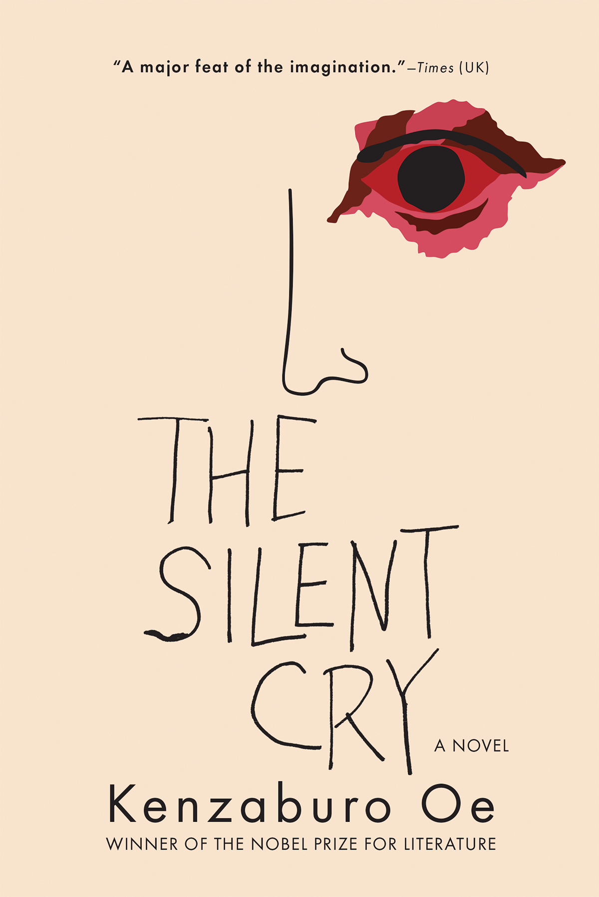](https://books.rob.me.uk/book/1864)
##### Kenzaburō Ōe
##### generational · rebellion · guilt

A dense, intellectually thrilling masterpiece, Ōe’s novel plunges into the dark, violent history of a remote Japanese village, connecting ancient folk myths with the radical student uprisings of the 1960s. It is a profound exploration of inherited trauma, political extremism, and the complex psychological warfare between brothers.

Two siblings return to their ancestral home: a passive, one-eyed scholar and a charismatic radical who organizes the local youth into a violent rebellion against a corporate tycoon. Using the isolated valley as a stage, they tragically reenact a century-old family cycle of rebellion and suicide.

##### Fiction, 1967, 360 pages

#### [A Personal Matter](https://books.rob.me.uk/book/1863)

##### Kenzaburō Ōe
##### crisis · confession · responsibility

A harrowing, fiercely honest descent into the dark night of the soul, Ōe’s semi-autobiographical novel confronts the moral terror of a father whose child is born with a severe brain hernia. It is a shocking, visceral read that unflinchingly explores male egoism, cowardice, and the desire to escape adulthood.

Over a frantic few days, Bird drowns his panic in alcohol and an illicit affair, secretly hoping the hospital will let his infant die. The climax hinges on a sudden, powerful internal pivot; at the brink of destroying his life, he chooses to embrace his agonizing responsibility and forge a path toward genuine maturity.

##### Fiction, 1964, 165 pages

#### The Labyrinth of Solitude
##### Octavio Paz
##### cultural · psychological · identity

A foundational text for understanding the soul of modern Mexico, Paz’s brilliant essay collection uses poetry, history, and anthropology to dissect the national character. It remains an essential, deeply influential exploration of how historical trauma forces a culture to hide behind masks of machismo and fiesta.

Systematically unpacking the psychological legacy of the Spanish Conquest, the Revolution, and the complex relationship with the United States, the analysis is sweeping. It posits that Mexicans are trapped in isolation, using rigid social formalities and explosive, violent celebrations as defense mechanisms to avoid true, vulnerable human connection.

##### Non-fiction, 1950, 230 pages

#### [Cat and Mouse](https://books.rob.me.uk/book/2137)

##### Günter Grass
##### obsession · adolescence · insecurity

A sharp, brilliant novella set against the backdrop of World War II Danzig, Grass’s work explores the tragic, performative nature of adolescent masculinity. It is a compelling psychological portrait of a teenage outcast who uses spectacular, dangerous stunts to distract from his physical deformities and deep insecurities.

Narrated by an obsessed, secretly jealous classmate, the story tracks Mahlke's rise from a bizarre boy diving into sunken ships to a highly decorated tank commander. Highlighting the hollow nature of Nazi military propaganda, his ultimate collapse under the pressure of maintaining a heroic facade is both inevitable and heartbreaking.

##### Fiction, 1961, 140 pages

#### [The Tin Drum](https://books.rob.me.uk/book/2075)

##### Günter Grass
##### grotesque · historical · surrealism

A massive, grotesque, and spectacularly imaginative triumph, Grass’s novel single-handedly reinvented German literature after the Holocaust. It utilizes a fiercely unreliable, stunted narrator to launch a surreal, black-comic assault on the cowardly, everyday citizens who passively allowed Nazism to thrive.

Armed only with a glass-shattering scream and a toy drum, Oskar Matzerath decides at age three to stop growing. His malicious, childlike perspective brilliantly exposes the absurdity and moral decay of adult society during the war and the subsequent economic miracle.

##### Fiction, 1959, 580 pages

#### [Accidental Death of an Anarchist](https://books.rob.me.uk/book/2334)

##### Dario Fo
##### satirical · political · farce

A masterwork of political theater, Fo’s brilliant, fast-paced farce utilizes the slapstick traditions of Commedia dell'arte to expose real-world police corruption in Italy. It remains a globally beloved, high-energy classic that demonstrates the unmatched power of comedy to dismantle authoritarian lies.

A fast-talking "Maniac" infiltrates a police station and impersonates a judge, tricking panicked officers into re-enacting their cover-up of a suspect's death. Constant disguise and escalating absurdity force the audience to confront deadly institutional truths through tears of laughter.

##### Fiction, 1970, 90 pages

### Nobel Winners 1980s

#### [Watermark](https://books.rob.me.uk/book/1854)
##### Joseph Brodsky
##### architectural · watery · aesthetic

A stunning, atmospheric love letter to Venice, Brodsky’s book-length essay merges travelogue with high philosophy. It stands as a pinnacle of aesthetic literature, exploring how the unique intersection of ancient stone and freezing winter water serves as a perfect metaphor for the passage of time.

Rejecting a linear timeline, the author presents a series of brief, impressionistic vignettes based on decades of his own winter visits. Building momentum through precise, gorgeous architectural observations, the essay ultimately argues that art and beauty are humanity's only true defense against mortality.

##### Non-fiction, 1992, 110 pages

#### A Part of Speech
##### Joseph Brodsky
##### exiled · precise · intellectual

Written after his forced expulsion from the Soviet Union, Brodsky’s intense, highly formal collection turns the pain of exile into a brilliant defense of classical Western culture. It is revered for its linguistic mastery, asserting that the architecture of a poem can serve as a permanent homeland.

Complex, rigid rhyming schemes and heavy historical metaphors contrast freezing urban landscapes with the ruins of ancient empires. Actively rejecting sentimentality and self-pity, the poet seeks a cold, objective perfection within the mechanics of language itself.

##### Poetry, 1977, 110 pages

#### The Hive
##### Camilo José Cela
##### collective · urban · survival

A brilliant, panoramic triumph of Spanish realism, Cela’s novel captures the freezing, hungry desperation of Madrid in the immediate aftermath of the Civil War. It is a cinematic, highly innovative text that rejects the idea of a single hero, presenting an entire society paralyzed by fear and poverty.

Hundreds of rapid, fragmented scenes skip between over 300 characters over three days, mimicking the buzzing chaos of a beehive. Focusing on desperate, minor transactions—a borrowed coin, a prostitution arrangement, a police bribe—the plot highlights what it takes to keep the city's inhabitants barely alive.

##### Fiction, 1950, 300 pages

#### The Family of Pascual Duarte
##### Camilo José Cela
##### violent · gritty · fatalistic

A brutal, shocking, and deeply controversial masterpiece, Cela’s debut novel birthed the Spanish literary movement of *tremendismo*. It is a raw, unvarnished plunge into the dark, violent underbelly of rural poverty, exposing the deep psychological scars left on a society immediately following the Spanish Civil War.

A fragmented, desperate confession is written by an uneducated murderer awaiting execution in a prison cell. Tracing a horrific, escalating chain of domestic abuse, dead children, and animal cruelty, it demonstrates how a life devoid of hope inevitably collapses into a fatalistic cycle of murder.

##### Fiction, 1942, 160 pages

#### [Love in the Time of Cholera](https://books.rob.me.uk/book/259)
[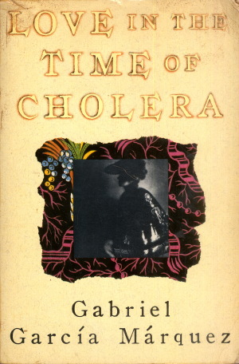](https://books.rob.me.uk/book/259)
##### Gabriel García Márquez
##### romance · patience · devotion

A lush, intoxicating exploration of obsessive love and aging, this beloved classic serves as a brilliant counterpoint to the author's more political works. It has charmed millions with its vivid portrayal of a Caribbean port city and its assertion that romantic passion can outlast decades of rejection and physical decay.

Contrasting the secure, practical marriage of the heroine with the frantic, fifty-year sexual odyssey of her rejected suitor, the story runs on a dual track. The brilliant conclusion replaces youthful infatuation with a profound, quarantined romance aboard a riverboat in the twilight of their lives.

##### Fiction, 1985, 350 pages

#### [One Hundred Years of Solitude](https://books.rob.me.uk/book/158)
[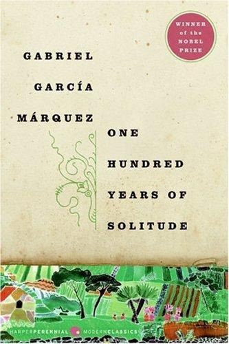](https://books.rob.me.uk/book/158)
##### Gabriel García Márquez
##### magical realism · generational · isolation

Arguably the most influential Latin American novel of the twentieth century, this vibrant, staggering epic introduced the world to the spellbinding mechanics of magical realism. It is a monumental achievement that weaves civil war, supernatural plagues, and deep historical sorrow into the mythical town of Macondo.

Spanning seven generations of the Buendía family, the narrative utilizes a cyclical structure where characters inherit the same names, mistakes, and tragic obsessions. Moving with a hypnotic momentum, the town transitions from a pristine utopia to its ultimate, apocalyptic erasure by a hurricane of wind and memory.

##### Fiction, 1967, 420 pages

#### The Poetry of Jaroslav Seifert
##### Jaroslav Seifert
##### lyrical · sensual · survival

Serving as the gentle, unyielding conscience of the Czech people, Seifert's poetry celebrates the enduring beauty of Prague, women, and nature against the backdrop of totalitarian grayness. His Nobel-winning work remains a beloved testament to the idea that joy and sensual pleasure are powerful forms of political resistance.

Tracing a lifelong evolution from avant-garde experimentation to a clear, deeply accessible lyricism, the verses mature alongside the nation. Relying on conversational tones and intimate memories, the poet strips away ideological rhetoric to defend the fragile, individual miracles of everyday life.

##### Poetry, 1984, 250 pages

#### Death and the King's Horseman
##### Wole Soyinka
##### tragic · colonial · ritual

A monumental work of post-colonial theater, Soyinka’s play brilliantly fuses Yoruba cosmology with the structure of classical Greek tragedy. Based on true events, it provides a profound philosophical look at the catastrophic disruption of indigenous spiritual systems by arrogant British colonial administrators.

Immense tension builds as the King's Horseman prepares for his ritual suicide, a necessary act to maintain the balance of the universe. When colonial authorities intervene to stop the "savage" act, the generational order inverses, forcing the horseman's Western-educated son to take his father's place.

##### Fiction, 1975, 90 pages

#### The Interpreters
##### Wole Soyinka
##### bohemian · identity · post-independence

A vibrant, complex, and highly intellectual snapshot of a newly independent Nigeria, Soyinka’s novel captures the energy and frustration of a generation of Western-educated artists returning home. It is a vital post-colonial text, brimming with jazz, philosophical debates, and fierce critiques of the corrupt new elite.

Aggressively rejecting linear storytelling, the format drifts fluidly through the memories and arguments of a close-knit group of bohemian friends. Their individual struggles to carve out authentic, meaningful lives highlight the sheer difficulty of navigating the hypocrisy of a rapidly modernizing, materialistic society.

##### Fiction, 1965, 250 pages

#### Bells in Winter
##### Czesław Miłosz
##### memory · historical · transcendence

Reflecting on a lifetime of political exile, Miłosz’s late-career collection is a masterpiece of philosophical and theological inquiry. It serves as a vital bridge between the lost, multi-cultural world of pre-war Lithuania and the intellectual landscapes of modern America.

Expansive, multi-part meditations use precise physical imagery—like frozen birds or ancient Bibles—to anchor abstract thoughts on time and redemption. Moving past the anger of the twentieth century, the verses settle into a tone of quiet gratitude and spiritual clarity.

##### Poetry, 1978, 100 pages

#### The Captive Mind
##### Czesław Miłosz
##### intellectual · compromise · totalitarianism

A razor-sharp, indispensable work of political psychology, Miłosz’s essay collection analyzes the seductive, terrifying logic of totalitarian ideologies. Written shortly after his defection, it provides a crucial roadmap for understanding how brilliant intellectuals willingly surrender their freedom to serve oppressive regimes.

Avoiding broad historical summaries, the text focuses on four disguised case studies of real Polish writers who compromised their art for the state. The analysis exposes the practice of *Ketman*—the exhausting psychological act of feigning absolute public loyalty while secretly harboring private doubts to survive.

##### Non-fiction, 1953, 250 pages

#### [Crowds and Power](https://books.rob.me.uk/book/2106)

##### Elias Canetti
##### anthropological · systemic · analysis

A massive, highly original sociological treatise written in the shadow of World War II, Canetti’s life's work attempts to decode the primal mechanics of human mass behavior. It remains a crucial, chilling text for understanding the psychological allure of fascism, demagogues, and the human desire to merge into a violent mob.

Rejecting traditional academic structures, the author organizes theories through a vast array of anthropological examples, tribal rituals, and historical anecdotes. Deconstructing different forms of "crowds"—such as flight, feast, and reversal crowds—it provides a master key for recognizing how leaders manipulate the fear of death.

##### Non-fiction, 1960, 500 pages

#### Auto-da-Fé
##### Elias Canetti
##### intellectual · isolation · madness

A terrifying, incredibly dense, and darkly satirical masterpiece, Canetti’s only novel explores the total psychological disintegration of a brilliant but wildly socially inept scholar. It is a fierce, uncompromising warning against the dangers of intellectual isolation and the refusal to engage with the messy, brutal realities of the physical world.

Obsessed entirely with his massive private library, the protagonist marries his illiterate, manipulative housekeeper, causing his life to spiral out of control. Divided into three distinct phases of collapse, he is exploited by the criminal underworld, leading to a fiery, apocalyptic conclusion.

##### Fiction, 1935, 460 pages

#### [The Inheritors](https://books.rob.me.uk/book/2335)

##### William Golding
##### primitive · evolutionary · conflict

A breathtaking feat of imaginative empathy, Golding’s prehistoric novel completely inverts the traditional narrative of human evolution. By forcing the reader to view the world through the minds of a gentle, doomed family of Neanderthals, it offers a devastating critique of modern humanity's inherent capacity for violence and deception.

A new, technologically advanced species—*Homo sapiens*—arrives with boats, bows, and an aggressive territorial instinct. Limited to a purely sensory perspective, the Neanderthal narrator tragically misinterprets the malice and strategic cruelty of the humans as confusing, magical rituals.

##### Fiction, 1955, 230 pages

#### [Lord of the Flies](https://books.rob.me.uk/book/417)
[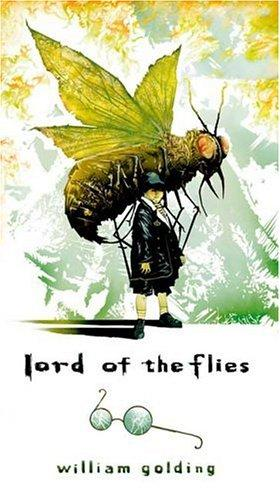](https://books.rob.me.uk/book/417)
##### William Golding
##### survival · savagery · psychology

A terrifying, universally recognized classic, Golding’s novel systematically dismantles the optimistic illusions of human progress and inherent childhood innocence. It remains an essential, gripping staple of literature, arguing that beneath the thin veneer of civilization lies a primal, inescapable drive toward violence and tribalism.

Stranded on an island, a group of polite British schoolboys watch their democratic rules quickly disintegrate in a dark psychological experiment. Iconic symbols—the conch, the glasses, the pig's head—map the rapid, horrifying escalation from playground bullying into ritualistic murder and total savagery.

##### Fiction, 1954, 224 pages

#### The Flanders Road
##### Claude Simon
##### fragmented · memory · trauma

A defining, challenging masterpiece of the French "New Novel" movement, Simon’s work recreates the hallucinatory chaos of the 1940 French cavalry retreat before advancing German tanks. It completely revolutionizes how literature represents the fragmented, non-linear experience of traumatic memory.

Abandoning standard punctuation entirely, the prose flows as a single, massive stream of consciousness from a soldier lying in a POW camp. Anchoring the dizzying prose to recurring visual motifs—like a dead horse in the mud—it demonstrates how combat shatters all sense of time and logical meaning.

##### Fiction, 1960, 320 pages

#### Children of the Alley
##### Naguib Mahfouz
##### allegorical · religious · crisis

A grand, deeply controversial masterpiece that led to the author's attempted assassination, Mahfouz’s novel uses a Cairo neighborhood as a brilliant allegory for the history of human religion. It is a powerful, provocative read that questions the enduring cycle of violence, faith, and the promise of social justice.

Divided into generational stories, the narrative clearly mirrors the lives of Moses, Jesus, Muhammad, and the modern rise of secular science. Each heroic reformer briefly brings peace to the alley, only for their followers to immediately corrupt their teachings and return the neighborhood to gang violence.

##### Fiction, 1959, 550 pages

#### The Cairo Trilogy
##### Naguib Mahfouz
##### generational · patriarchal · transition

An unparalleled, immersive epic of the Arab world, Mahfouz’s massive trilogy chronicles the dramatic transformation of Egypt through the lives of a single, middle-class family. It is a monumental achievement in social realism, tracking the collision between strict Islamic tradition, British colonialism, and modern political radicalism.

Ruling his family with absolute religious terror while secretly indulging in the city's nightlife, a tyrannical patriarch anchors the saga. Tracking the coming-of-age journeys of his children across decades, the story mirrors the nation's chaotic transition into modernity as they embrace communism, nationalism, and science.

##### Fiction, 1956, 1300 pages

### Nobel Winners 1970s

#### [Enemies, A Love Story](https://books.rob.me.uk/book/2102)

##### Isaac Bashevis Singer
##### trauma · complex · chaos

A dark, chaotic, and intensely ironic masterpiece, Singer’s novel portrays the psychological ruins of Holocaust survivors trying to restart their lives in 1940s New York. It is a brilliant, unsettling tragicomedy that explores how profound historical trauma destroys the capacity for stable relationships.

Operating like a frantic farce, the story tracks a ghostwriter simultaneously juggling his current wife, his passionate mistress, and his first wife who miraculously returns from the dead. Driven by a permanent state of survival panic, he systematically sabotages his own life until vanishing entirely.

##### Fiction, 1972, 280 pages

#### [The Magician of Lublin](https://books.rob.me.uk/book/2126)

##### Isaac Bashevis Singer
##### temptation · crisis · redemption

A vibrant, sensual, and deeply philosophical historical novel, Singer’s work captures the bustling energy of late-nineteenth-century Poland through the eyes of a charismatic Jewish escape artist. It explores the thrilling but dangerous tension between traditional religious devotion and the absolute, secular freedom of the modern city.

Juggling multiple mistresses and planning a high-stakes robbery to fund an escape to Italy, the protagonist operates in a state of escalating panic. The total collapse of his arrogant self-confidence results in a dramatic religious conversion, leading him to brick himself into a cell to escape worldly temptation.

##### Fiction, 1960, 240 pages

#### [The Clown](https://books.rob.me.uk/book/2134)

##### Heinrich Böll
##### alienation · hypocrisy · crisis

A bitter, uncompromising assault on the moral hypocrisy of post-war West Germany, Böll’s novel uses the perspective of a failed entertainer to dissect a society built on forgotten guilt. It resonated deeply with a younger generation questioning the sudden wealth and piety of former Nazi sympathizers.

Unfolding almost entirely within the protagonist's apartment over a single evening, a series of phone calls to his estranged, wealthy family drives the plot. His absolute refusal to conform to bourgeois expectations leads him to deliberately choose poverty and social exile over moral compromise.

##### Fiction, 1963, 250 pages

#### [Billiards at Half-Past Nine](https://books.rob.me.uk/book/2135)

##### Heinrich Böll
##### memory · trauma · generational

A highly structured, architectural marvel of post-war German literature, Böll’s novel explores the crushing weight of national guilt across three generations of a single family. It is an intellectually demanding, deeply moral book that examines the complicity of the bourgeois class in the rise and survival of fascism.

Occurring entirely on a single day in 1958, the plot is anchored by a patriarch's daily routine of playing billiards. Fluid flashbacks expand the scope to cover fifty years of history, using the building and destruction of a local abbey as a powerful metaphor for shifting moral compromises.

##### Fiction, 1959, 280 pages

#### [One Day in the Life of Ivan Denisovich](https://books.rob.me.uk/book/440)
[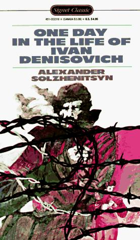](https://books.rob.me.uk/book/440)
##### Aleksandr Solzhenitsyn
##### survival · routines · endurance

A literary earthquake that exposed the horrors of the Soviet Gulag system to the world, Solzhenitsyn’s short novel is a masterpiece of political endurance. It derives its immense power not from grand tragedy, but from its meticulous, understated focus on the dignity of a simple man surviving an ordinary day in hell.

Strictly confined to a single twenty-four-hour period in a freezing Siberian labor camp, the pacing is tight and methodical. The protagonist uses his dedication to physical labor—laying a brick wall perfectly—and small, secret victories as a shield to protect his inner humanity from the state.

##### Fiction, 1962, 160 pages

#### The Days of His Grace
##### Eyvind Johnson
##### tyranny · resistance · history

A sophisticated, deeply intelligent historical novel, Johnson’s work uses the vast empire of Charlemagne as a brilliant allegorical mirror for the totalitarian regimes of the twentieth century. It is a compelling exploration of political survival, charting the complex choices individuals make when their homeland is conquered by absolute power.

Divergent paths await three defeated brothers: one launches a doomed rebellion, one retreats into scholarly isolation, and the youngest climbs the ranks of the Emperor's bureaucracy. The slow, systemic rewriting of history takes center stage, showing how tyranny uses fear and propaganda to erase cultural memory.

##### Fiction, 1960, 320 pages

#### Aniara
##### Harry Martinson
##### sci-fi · cosmic · despair

A breathtaking, prophetic science fiction epic written in verse, Martinson’s masterpiece captures the profound existential terror of the nuclear age. It tells the story of a massive colony ship knocked permanently off course, serving as a chilling, brilliant allegory for humanity's reckless destruction of Earth.

Documenting the slow, decades-long psychological collapse of thousands of passengers across 103 cantos, the pacing is deeply melancholic. A semi-divine artificial intelligence broadcasts comforting memories of Earth, until the machine itself dies of grief after witnessing the home planet's nuclear annihilation.

##### Poetry, 1956, 170 pages

#### The Storm and Other Things
##### Eugenio Montale
##### fragmented · trauma · memory

Written during the darkest years of Fascism and World War II, Montale’s complex, hermetic collection is a profound defense of intellectual freedom and personal memory. It is a highly demanding, rewarding text that seeks to preserve a tiny spark of humanistic light against the overwhelming storms of historical violence.

Functioning as a highly coded, private diary, the verses contrast terrifying images of war—sirens, lightning, and ruins—with the saving grace of a distant, angelic female muse. The inner poetic journey is one of stoic resistance, refusing to surrender to mass political madness by maintaining an absolute artistic integrity.

##### Poetry, 1956, 140 pages

#### Cuttlefish Bones
##### Eugenio Montale
##### rugged · stoic · isolation

A stark, groundbreaking masterpiece of Italian modernism, Montale’s debut collection perfectly captures the harsh, disillusioned reality of the generation that survived World War I. It is a profoundly intellectual, anti-romantic work that finds a strange, stoic comfort in acknowledging the limits of human existence.

Rejecting traditional melody, the verses utilize harsh, rugged consonant sounds that mimic the sun-scorched, rocky coastline of the Mediterranean. Using images of broken glass and dry landscapes, the poems argue that true dignity is found only through facing life's bleakness without comforting illusions.

##### Poetry, 1925, 120 pages

#### [Herzog](https://books.rob.me.uk/book/2330)

##### Saul Bellow
##### intellectual · crisis · chaotic

A brilliant, wildly energetic, and deeply funny masterpiece of American literature, Bellow’s novel captures the spectacular mid-life breakdown of a hyper-educated academic. It remains a beloved classic for its portrait of a mind that tries to solve the messy, painful realities of divorce and betrayal through high philosophy.

Oscillating between traditional third-person storytelling and a frantic stream of unsent letters addressed to famous thinkers, dead relatives, and God, the narrative is relentlessly chaotic. This engine drives Herzog through a week of manic wandering, eventually leading him to exhaust his own intellect and find restorative peace.

##### Fiction, 1964, 340 pages

#### [The Adventures of Augie March](https://books.rob.me.uk/book/2331)

##### Saul Bellow
##### vibrant · identity · coming of age

Bursting with raw, street-level energy and soaring poetic ambition, Bellow’s novel fundamentally rewrote the rhythm of American literature. It is an exuberant, endlessly optimistic epic that celebrates the chaotic, diverse, and relentless hustle of mid-century Chicago.

Reviving the classic picaresque structure, the narrative follows a charismatic, unanchored young man through a dizzying array of jobs—from dog washer to union organizer to eagle trainer. Fiercely independent, Augie refuses to let any of his wealthy, overbearing mentors pin down his fluid identity.

##### Fiction, 1953, 536 pages

#### [Voss](https://books.rob.me.uk/book/2125)

##### Patrick White
##### visionary · obsession · wilderness

A dense, visionary, and deeply psychological epic, White’s masterpiece tracks a doomed nineteenth-century expedition into the infinite, scorching center of the Australian outback. It is a profound exploration of human megalomania, survival, and the spiritual terror of confronting a landscape that cannot be conquered.

Driven by a god-like belief in his own will, an arrogant German explorer leads his party into starvation and mutiny. Tethered to a telepathic, mystical love story with a young woman left behind in Sydney, his journey culminates in the complete, humiliating destruction of his ego.

##### Fiction, 1957, 448 pages

#### The Tree of Man
##### Patrick White
##### epic · pioneer · isolation

A grand, sweeping, and deeply poetic epic, White’s novel elevates the harsh, grueling realities of the Australian pioneer experience into a profound spiritual odyssey. It is a masterpiece of historical fiction that searches for the divine within the quiet, seemingly unremarkable lives of ordinary working people.

Carving a farm out of the virgin wilderness, a young couple survives floods, bushfires, and decades of silent marital isolation as the modern world slowly encroaches. The protagonist's internal, mystical awakening culminates in a beautiful realization of God's presence in the simplest details of the natural world.

##### Fiction, 1955, 500 pages

#### Destruction or Love
##### Vicente Aleixandre
##### surreal · passionate · cosmic

A wildly passionate, surrealist masterpiece of the Spanish Generation of '27, Aleixandre’s collection portrays romantic love as a terrifying, cosmic force of nature. It is an intense, ecstatic reading experience that obliterates the boundaries between human eroticism and the wild, destructive energy of the natural world.

Rejecting logical progression, the free verse operates through a barrage of dreamlike, violent imagery involving tigers, oceans, swords, and fire. Demanding the complete annihilation of the individual ego, the poems argue that true love requires being entirely consumed by the universe.

##### Poetry, 1935, 140 pages

#### Canto General
##### Pablo Neruda
##### epic · revolutionary · heritage

A staggering, monumental achievement of world literature, Neruda’s vast epic attempts to catalog the entire history, geography, and political struggle of the American continent. It is a fiercely passionate, Marxist-inspired defense of the working classes, indigenous peoples, and the natural world against centuries of colonial and corporate exploitation.

Moving from the creation of the continent's flora and fauna through the bloody Spanish conquests to modern labor strikes, fifteen massive sections organize the history. Sweeping, incantatory lists and towering political rage transform the poet into a collective voice for the voiceless dead.

##### Poetry, 1950, 400 pages

#### [Twenty Love Poems and a Song of Despair](https://books.rob.me.uk/book/2105)

##### Pablo Neruda
##### sensual · passionate · melancholic

One of the most famous and widely read poetry collections in the world, Neruda’s youthful masterpiece captures the absolute, devastating intensity of adolescent romance. It remains a universally beloved text, celebrated for its raw, emotional honesty and its breathtaking, sensual descriptions of the natural world.

Cleanly structured into twenty poems charting the ecstatic highs and agonizing lows of a love affair, it is capped by a final, definitive declaration of loss. The verses constantly fuse the female body with the untamed landscapes of Chile, equating physical desire with the vast, uncontrollable forces of the cosmos.

##### Poetry, 1924, 80 pages

#### The Axion Esti
##### Odysseus Elytis
##### mythic · historical · survival

A monumental, symphonic masterpiece of Greek poetry, Elytis’s work blends the ancient mythological heritage of the Aegean with the brutal modern realities of WWII and the Greek Civil War. It is a highly revered cultural text, transforming physical suffering into a radiant, triumphant defense of the human spirit.

Rigorously organized into three sections modeled after Eastern Orthodox liturgy, the verses weave together classical hymns, surrealist imagery, and gritty historical chronicles. This structure gently guides the national consciousness out of the darkness of occupation and into a sun-drenched celebration of freedom.

##### Poetry, 1959, 140 pages

### Nobel Winners 1960s

#### O the Chimneys
##### Nelly Sachs
##### elegiac · visceral · survival

Awarded the Nobel Prize for her ability to articulate the unutterable, Sachs’s poetry collection stands as a towering, elegiac monument to the victims of the Holocaust. Her verses transform the horrific industrial reality of the death camps into profound, mystical symbols of universal suffering.

Intense thematic cycles heavily utilize imagery of dust, smoke, and stars to represent the souls of the murdered. Avoiding narrative storytelling entirely, the verses function as raw, urgent prayers attempting to bridge the gap between human devastation and cosmic silence.

##### Poetry, 1967, 390 pages

#### Mythistorema
##### Giorgos Seferis
##### mythic · fragmented · displacement

A haunting, highly influential collection of modernist poetry, Seferis’s work brilliantly merges the ancient mythological heritage of Greece with the exhausted, displaced reality of the twentieth century. It is a profound exploration of cultural weariness, searching for national identity among broken statues and ruined harbors.

Composed of twenty-four brief poems, the structure directly echoes the books of Homer's *Odyssey*, but presents a journey without a victorious homecoming. Utilizing a collective "we," the verses chart the psychological endurance of a people wandering a barren landscape burdened by their own history.

##### Poetry, 1935, 80 pages

#### The Bridal Canopy
##### Shmuel Yosef Agnon
##### satirical · folklore · community

A rich, whimsical, and deeply affectionate comic masterpiece, Agnon’s novel captures the vanished world of nineteenth-century Hasidic Jewish life in Eastern Europe. It is a brilliant, episodic adventure that parodies traditional religious texts while celebrating the enduring strength of community solidarity and simple faith.

Wandering the countryside with a horse and wagon, a hopelessly pious father searches for dowries for his daughters. A story-within-a-story framework constantly interrupts the journey with local parables, theological debates, and folk legends that illuminate the rich internal life of the villages.

##### Fiction, 1931, 380 pages

#### [East of Eden](https://books.rob.me.uk/book/449)
[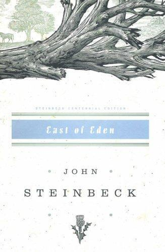](https://books.rob.me.uk/book/449)
##### John Steinbeck
##### generational · destiny · choice

An ambitious, sprawling epic that Steinbeck considered his magnum opus, this novel brilliantly transposes the biblical story of Cain and Abel to the fertile valleys of California. It is a wildly popular, intensely emotional saga that grapples with the terrifying freedom of human choice and the dark legacy of inherited sin.

Weaving together the histories of the practical Hamiltons and the deeply troubled Trask family, the narrative spans decades and features a genuinely chilling sociopathic matriarch. Hinging on the Hebrew word *timshel* ("thou mayest"), the book delivers a powerful argument that every generation has the power to break the cycle of evil.

##### Fiction, 1952, 600 pages

#### [The Grapes of Wrath](https://books.rob.me.uk/book/603)
##### John Steinbeck
##### epic · injustice · community

A towering, Pulitzer-winning epic of American literature, Steinbeck’s novel is a defining, passionate defense of the working class during the Great Depression. It remains a visceral, deeply moving classic that exposes the brutal greed of corporate farming while celebrating the indestructible resilience of the human spirit.

Tracking the Joad family’s desperate migration from the Dust Bowl of Oklahoma to the hostile agricultural camps of California, the journey is heartbreaking. Intimate family details alternate with broad, panoramic "intercalary" chapters that analyze the sweeping economic forces driving the national tragedy.

##### Fiction, 1939, 464 pages

#### And Quiet Flows the Don
##### Mikhail Sholokhov
##### epic · Cossack · warfare

A monumental, sweeping historical epic often compared to *War and Peace*, Sholokhov’s masterpiece captures the brutal devastation of the Don Cossack culture during the Russian Revolution and Civil War. It is a gripping, panoramic tragedy that balances massive military campaigns with intense, deeply personal romantic passions.

An independent, fierce warrior is repeatedly torn between his duty to his wife and his obsessive love for another woman, while being drafted into competing Tsarist and Bolshevik armies. The chaotic, shifting tides of history systematically strip the protagonist of his family, his land, and his moral compass.

##### Fiction, 1928, 1100 pages

#### No Exit
##### Jean-Paul Sartre
##### psychological · claustrophobic · judgment

A razor-sharp, iconic play that perfectly encapsulates the core tenets of existentialism, Sartre’s work remains a staple of modern theater. It is famous for stripping away pitchforks and fire to present a terrifying, modern vision of damnation: being locked in a drawing room forever with people who know your worst secrets.

Trapping three deceased, deeply flawed characters—a coward, an infanticide, and a cruel socialite—in a windowless room with no mirrors and no sleep, the tension is immediate. A vicious cycle of seduction, confession, and betrayal leads to the legendary realization that "Hell is other people," as they become each other's eternal psychological torturers.

##### Fiction, 1944, 90 pages

#### [Nausea](https://books.rob.me.uk/book/1840)
[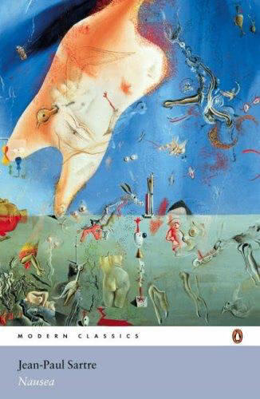](https://books.rob.me.uk/book/1840)
##### Jean-Paul Sartre
##### existential · alienation · urban

The definitive, foundational novel of French existentialism, Sartre’s brilliant psychological diary is a profound, dizzying exploration of absolute human freedom. It is an essential read for understanding mid-century philosophy, capturing the terrifying moment when the comforting illusions of daily life completely evaporate.

An isolated historian is suddenly overwhelmed by a physical sickness caused by his realization that objects exist without any inherent meaning or purpose. Ruthlessly dismantling bourgeois routines, historical research, and romantic love, the diary leaves the protagonist with the heavy responsibility of creating his own destiny.

##### Fiction, 1938, 180 pages

#### [Thousand Cranes](https://books.rob.me.uk/book/2131)

##### Yasunari Kawabata
##### ritual · guilt · desire

A delicate, haunting exploration of desire and inherited sorrow, Kawabata’s novel is a masterpiece of psychological subtlety. It offers a profound, melancholic look at how the unspoken traumas and illicit affairs of the past continue to ensnare the next generation in modernizing Japan.

Deeply entwined with the traditional tea ceremony, the narrative uses ancient, stained ceramics and precise, ritualistic gestures to map the characters' hidden emotional stains. An orphaned young man becomes dangerously entangled with his late father's bitter former mistresses, unable to escape the ghostly web of family guilt.

##### Fiction, 1952, 140 pages

#### [Snow Country](https://books.rob.me.uk/book/2130)

##### Yasunari Kawabata
##### minimalist · isolated · obsession

A masterpiece of Japanese aesthetics, Kawabata’s brief, exquisite novel captures the fleeting, tragic beauty of an unfulfilled romance in a remote hot-spring village. It is celebrated globally for its delicate, impressionistic prose and its profound understanding of emotional distance and artistic detachment.

Making three winter visits to a passionate, doomed rural geisha, a wealthy Tokyo intellectual finds himself unable to fully commit. Striking, minimalist sensory details—the sound of a boiling tea kettle, a face reflected against a dark mountain in a train window—emphasize the cold, insurmountable barrier between the two lovers.

##### Fiction, 1948, 175 pages

#### [The Bridge on the Drina](https://books.rob.me.uk/book/2367)

##### Ivo Andrić
##### generational · historical · endurance

A sweeping, majestic chronicle of the Balkans, Andrić’s Nobel-winning masterpiece uses a single stone bridge as the silent witness to four centuries of turbulent history. It is a monumental work of cultural storytelling, capturing the complex, bloody, and beautiful intersections of Christian, Muslim, and Jewish lives under shifting empires.

Making the bridge itself the protagonist, the structure follows an unyielding monument that survives floods, impalements, and rebellions while generations of humans perish. Episodic novellas track the slow, grinding arrival of modernity, culminating in the bridge's tragic destruction during the outbreak of World War I.

##### Fiction, 1945, 380 pages

#### Exile
##### Saint-John Perse
##### isolated · majestic · displacement

Written after his flight from Nazi-occupied France to an empty American coastline, Perse’s collection is a grand, sweeping meditation on political displacement. It is a towering work of modernist poetry that transforms the deep personal pain of losing one's homeland into a majestic celebration of the enduring power of language.

Long, incantatory, prose-like lines are filled with highly specific geological and botanical vocabulary. The shifting sands, violent storms, and endless waves of the Atlantic serve as powerful metaphors for historical chaos, ultimately declaring that the poet's only true, unconquerable nation is his art.

##### Poetry, 1942, 110 pages

#### Anabasis
##### Saint-John Perse
##### epic · surreal · migration

A grand, dreamlike, and intensely exotic prose poem, Perse’s work conjures the sweeping, primal energy of a nomadic empire conquering the vast Asian steppes. It is a masterpiece of surrealist imagery, celebrated for its unique, rhythmic language and its abstract exploration of human ambition and migration.

Abandoning traditional narrative structure, ten majestic cantos blend the sensory details of military encampments, horsemen, and salt trades. Focusing on an archetypal leader who is never satisfied with building cities, the poet captures a restless, eternal desire to push forward into the unknown.

##### Poetry, 1924, 90 pages

#### [Endgame](https://books.rob.me.uk/book/2133)

##### Samuel Beckett
##### claustrophobic · terminal · routine

A bleak, fiercely uncompromising, and darkly comic masterpiece of absurdist theater, Beckett’s play strips human existence down to its absolute, decaying minimum. It is an essential, challenging text that explores the paralyzing routines and co-dependent relationships we cling to at the end of the world.

Operating within a single, gray, post-apocalyptic room, the interactions function much like the final, inevitable moves of a chess match. A blind, paralyzed master and his resentful servant constantly threaten to leave but never do, highlighting humanity's terrifying inability to let go even when all hope is lost.

##### Fiction, 1957, 90 pages

#### [Waiting for Godot](https://books.rob.me.uk/book/2132)

##### Samuel Beckett
##### minimalist · existential · absurdity

The defining masterpiece of the Theater of the Absurd, Beckett’s play stripped drama down to its barest, most agonizing elements. It is a monumental cultural touchstone that perfectly captures the modern existential condition, blending vaudeville comedy with a profound, terrifying sense of meaninglessness.

Two acts mirror each other almost perfectly to demonstrate a universe where nothing changes and time has stopped. Stranded on a barren road, two tramps invent games, arguments, and jokes to pass the time while waiting for a salvation that never arrives.

##### Fiction, 1953, 110 pages

#### [Men of Maize](https://books.rob.me.uk/book/2129)

##### Miguel Ángel Asturias
##### mythic · surreal · magical realism

A dense, hallucinatory masterpiece that laid the groundwork for magical realism, Asturias’s novel is a fierce defense of Mayan cosmology and indigenous land rights. It is a challenging, deeply rewarding epic that pits the sacred, ancient rhythms of the earth against the destructive greed of modern commercial farming.

Weaving together six interconnected legends, the book tracks a rural rebellion against colonizers who grow corn for profit rather than sustenance. Indigenous myth entirely governs the reality of the jungle, where guerrilla fighters transform into animal spirits and ancient curses shape the physical world.

##### Fiction, 1949, 310 pages

#### El Señor Presidente
##### Miguel Ángel Asturias
##### surreal · paranoia · tyranny

A pioneering, nightmarish triumph of Latin American literature, Asturias’s novel captures the suffocating psychological terror of life under a ruthless dictator. Utilizing a fragmented, surrealist prose style, it perfectly mimics the paranoia and moral decay of a society where the truth is entirely controlled by the state.

Spiraling outward from a single, politically motivated murder, the narrative tracks the dictator's sadistic use of the crime to torture his enemies. Trapping characters in a labyrinth of secret police, informants, and endless betrayals, the story highlights the tragic downfall of a cynical advisor who dares to fall in love.

##### Fiction, 1946, 290 pages

### Nobel Winners 1950s

#### Doctor Zhivago
##### Boris Pasternak
##### epic · romantic · revolution

A sweeping, poetic, and fiercely independent epic, Pasternak’s novel was banned in the Soviet Union for prioritizing individual emotion and artistic freedom over communist ideology. It remains one of the great tragic romances of the twentieth century, capturing the breathtaking landscapes and terrifying chaos of the Russian Revolution.

Across decades of civil war, forced conscriptions, and desperate train journeys into the frozen Ural Mountains, a physician-poet fights to retain his soul. The narrative engine contrasts rigid, brutal political ideologies with the transcendent, untouchable beauty of nature and his profound love for Lara.

##### Fiction, 1957, 560 pages

#### [The Second World War](https://books.rob.me.uk/book/1833)
[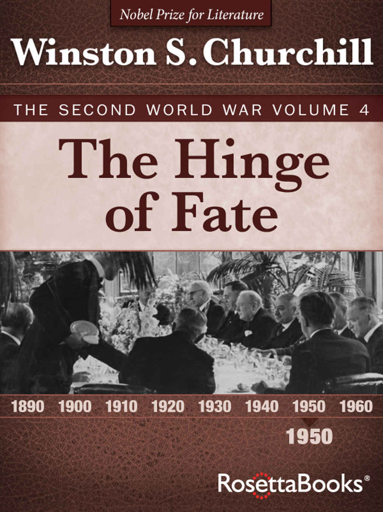](https://books.rob.me.uk/book/1833)
##### Winston Churchill
##### epic · political · military

A colossal, Nobel-winning act of historical documentation, Churchill’s six-volume memoir offers an unparalleled, inside view of the greatest conflict in human history. Written with sweeping, Churchillian rhetoric, it remains an essential text for understanding the grand strategy and immense personal pressures of wartime leadership.

Thousands of primary documents, personal telegrams, and military directives buttress the chronological structure. Focusing on high-level statecraft, the volumes detail the fragile alliances, logistical nightmares, and agonizing moral calculations required to steer a besieged island nation to ultimate victory.

##### Non-fiction, 1948, 4700 pages

#### [The Plague](https://books.rob.me.uk/book/1835)
[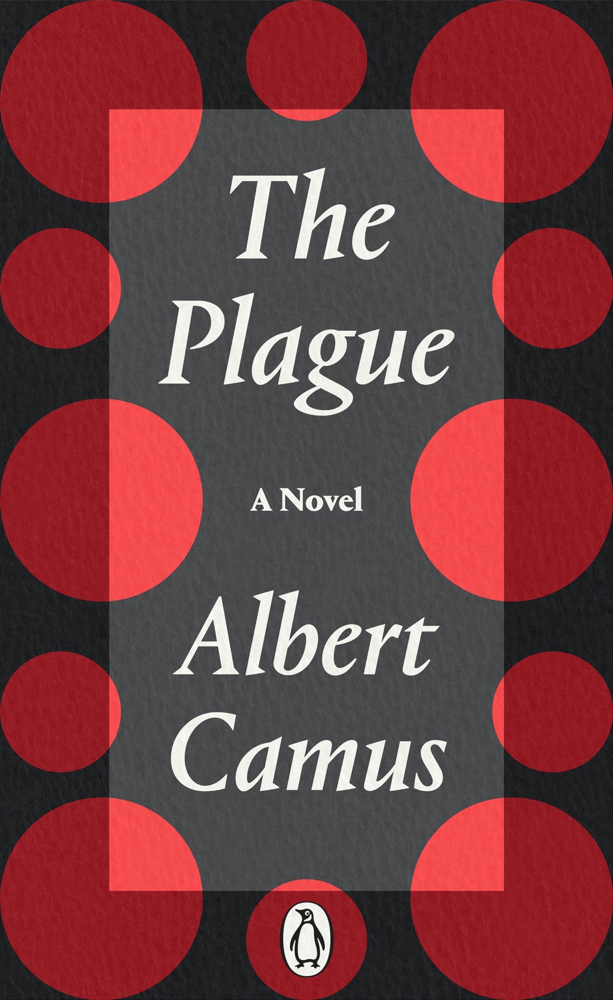](https://books.rob.me.uk/book/1835)
##### Albert Camus
##### quarantine · solidarity · survival

A defining work of existential philosophy disguised as a gripping medical thriller, Camus’s novel captures the terrifying reality of a coastal city locked down by a sudden epidemic. It remains a deeply moving, universally relevant allegory for the human response to fascism, war, and the absurd cruelty of nature.

Tracking the escalating death toll, the sealing of the city gates, and the desperate efforts of volunteer sanitation squads, the tone is calm and clinical. Highlighting the quiet heroism of Dr. Rieux, the story asserts that the only valid response to a meaningless universe is human solidarity and endless resistance against suffering.

##### Fiction, 1947, 300 pages

#### [The Stranger](https://books.rob.me.uk/book/381)
[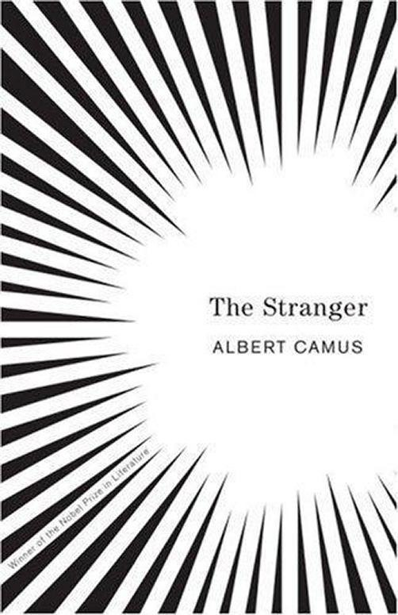](https://books.rob.me.uk/book/381)
##### Albert Camus
##### absurd · detached · alienation

A sleek, revolutionary cornerstone of existential literature, Camus’s brief novel perfectly captures the terrifying absurdity of a universe devoid of inherent meaning. It remains an essential, deeply unsettling read, famous for a protagonist who refuses to lie about his emotions, even if it costs him his life.

Delivered in a flat, sun-drenched, and radically detached prose style, the narrative recounts a casual, unmotivated murder on an Algerian beach. Shifting to the protagonist's trial, the legal system ultimately condemns him not for the murder itself, but for his failure to cry at his mother's funeral.

##### Fiction, 1942, 123 pages

#### [History of Western Philosophy](https://books.rob.me.uk/book/2127)

##### Bertrand Russell
##### intellectual · witty · analytical

A remarkably accessible, comprehensive, and delightfully witty journey through centuries of human thought, Russell’s magnum opus demystifies the great thinkers of the Western world. It is highly prized not just as an encyclopedia, but as a deeply engaging, opinionated narrative that champions rationalism and scientific inquiry.

Meticulously analyzing how specific political and social environments shaped dominant philosophies, the text moves chronologically through history. Sharp logic and dry humor expose the flaws in grand metaphysical systems, acting as a brilliant guide for intellectual self-defense against dogmatic thinking.

##### Non-fiction, 1945, 900 pages

#### Principia Mathematica
##### Bertrand Russell
##### logical · mathematical · foundation

This monumental foundational text utilizes a highly formal, uncompromising system of symbolic logic to derive the core principles of mathematics from pure logic. It serves as an ultimate intellectual monument representing a historic peak of human rationalism and the desire for absolute certainty.

Built from the ground up using specialized symbolic notation to avoid the ambiguities of human language, the work is incredibly complex. Hundreds of pages of meticulous proofs are developed before even defining the number one, aiming to systematically eliminate paradoxes from the foundations of set theory.

##### Non-fiction, 1910, 2000 pages

#### [Barabbas](https://books.rob.me.uk/book/2101)

##### Pär Lagerkvist
##### psychological · faith · doubt

A stark, profound psychological study of the criminal whose life was spared in exchange for the crucifixion of Jesus, Lagerkvist’s novel is a masterpiece of existential literature. It offers a gripping, highly relatable portrait of a man desperate for the comfort of faith, yet fundamentally unable to believe in miracles.

Wandering across decades, from the shadowed alleys of Jerusalem to the brutal, subterranean darkness of the Roman copper mines, Barabbas searches for meaning. Contrasting the peaceful martyrdom of the early Christians with his stubborn skepticism, the narrative tracks a lifelong struggle with the ghost of the man who died in his place.

##### Fiction, 1950, 140 pages

#### [The Dwarf](https://books.rob.me.uk/book/2150)

##### Pär Lagerkvist
##### malicious · political · corruption

This chilling, intense psychological novel utilizes a dark, confessional diary format written by a malicious court dwarf, offering a fascinating, disturbing look at human malice. The atmospheric tone is claustrophobic, decadent, and violent, set within a corrupt Italian Renaissance court filled with assassinations and political conspiracies.

Secret manipulations by the Dwarf help orchestrate poisonings, martial betrayals, and war with neighboring cities. Embodying the hidden, dark impulses of the human subconscious, the narrator exposes the animalistic violence beneath civilized court manners, serving as an unrepentant warning against our destructive nature.

##### Fiction, 1944, 230 pages

#### [The Old Man and the Sea](https://books.rob.me.uk/book/20)
[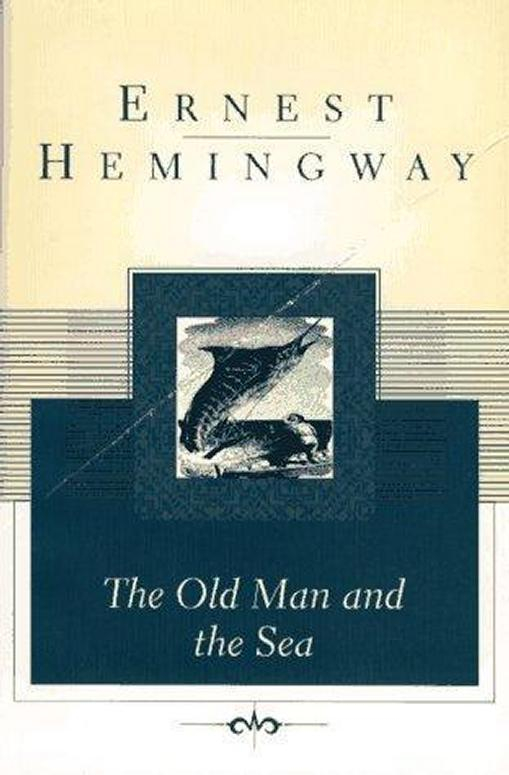](https://books.rob.me.uk/book/20)
##### Ernest Hemingway
##### survival · endurance · dignity

A lean, perfect distillation of his life's themes, Hemingway’s Pulitzer-winning novella is a globally beloved parable of human resilience. It strips away all narrative excess to deliver a profound, deeply moving meditation on grace under pressure and the spiritual nobility of a hard-fought defeat.

An aging, unlucky Cuban fisherman engages in a simple, three-day physical battle with a massive marlin far out in the Gulf Stream. Focusing on the agonizing physical toll of the fight, the story demonstrates that a person can be completely destroyed by nature, yet remain fundamentally undefeated in spirit.

##### Fiction, 1952, 127 pages

#### [A Farewell to Arms](https://books.rob.me.uk/book/166)
[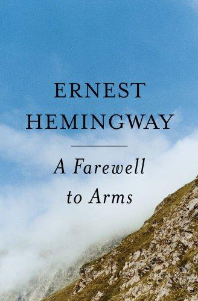](https://books.rob.me.uk/book/166)
##### Ernest Hemingway
##### tragic · cynical · romance

The definitive American novel of World War I, Hemingway’s masterpiece uses his signature sparse, unadorned prose to capture the utter disillusionment of the "Lost Generation." It is a devastating, beautifully written tragedy that strips away all romantic notions of patriotism, military glory, and divine protection.

An American ambulance driver and a British nurse attempt to escape the endless slaughter of the Italian front by deserting to Switzerland. Building toward a heartbreaking realization that institutional violence cares nothing for individual love, it culminates in an unforgettable, bleakly stoic conclusion.

##### Fiction, 1929, 330 pages

#### [Independent People](https://books.rob.me.uk/book/2128)

##### Halldór Laxness
##### survival · stubbornness · isolation

A grand, darkly comic, and deeply moving epic, Laxness’s Nobel-winning novel is the definitive portrait of the Icelandic national character. It is a profound exploration of human endurance, rural poverty, and the tragic, often destructive nature of an extreme obsession with self-reliance.

A stubborn sheep farmer repeatedly refuses help from his community, even as his family starves and dies around him during grueling winters. A bitter conflict with his beloved, independent-minded daughter exposes how his absolute need for financial freedom turns him into a domestic tyrant.

##### Fiction, 1934, 500 pages

#### [Thérèse Desqueyroux](https://books.rob.me.uk/book/1832)
[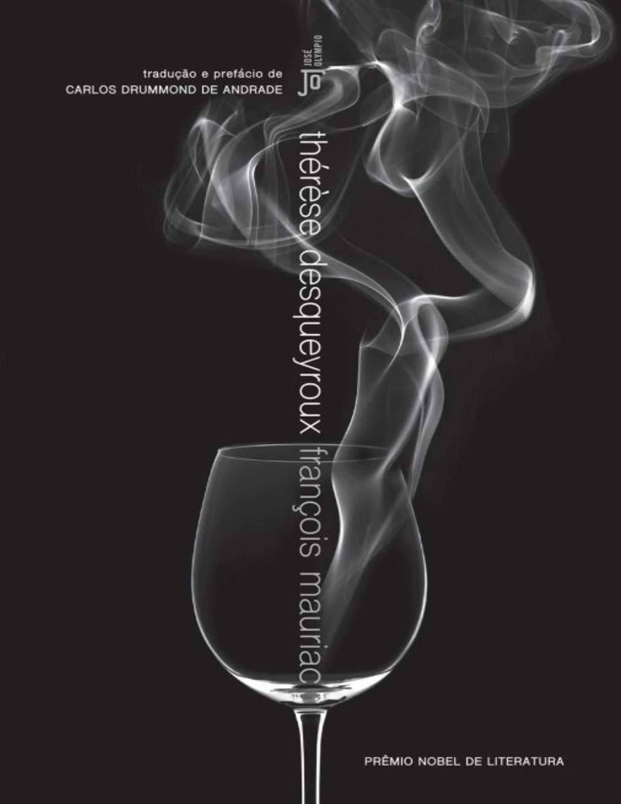](https://books.rob.me.uk/book/1832)
##### François Mauriac
##### suffocating · psychological · rebellion

A dark, intensely claustrophobic psychological thriller, Mauriac’s novel explores the desperation of a brilliant woman trapped within the rigid, suffocating confines of a provincial Catholic marriage. It is a masterful, deeply sympathetic study of isolation and the extreme measures required to escape a life devoid of emotional connection.

Beginning after the protagonist has been acquitted of trying to poison her husband, a long carriage ride home flashes back through the subtle cruelties that drove her to attempted murder. The hypocrisy of her bourgeois family covers up the crime, ultimately trapping her in a prison of permanent exile.

##### Fiction, 1927, 180 pages

#### Platero and I
##### Juan Ramón Jiménez
##### lyrical · pastoral · innocence

This beautiful, deeply poetic prose collection features an exceptionally gentle, lyrical narrative style that chronicles the daily life of a writer and his small donkey in rural Spain. It is a comforting, artistic read that celebrates the simple joys, local tragedies, and deep companionship found in a white-walled Andalusian village.

Avoiding an aggressive plot, brief, impressionistic chapters follow the seasons across a single year. Vivid descriptions of local festivals, changing flowers, children at play, and the poverty of rural outcasts find profound beauty and philosophical comfort within a humble, transient world.

##### Fiction, 1914, 180 pages

#### And Suddenly It's Evening
##### Salvatore Quasimodo
##### hermetic · melancholic · survival

A brilliant, intensely compressed collection of Italian Hermetic poetry, Quasimodo’s work captures the deep existential isolation and trauma of the mid-twentieth century. The collection is famous for its breathtaking brevity, utilizing fragmented, dreamlike imagery to rescue the beauty of the Sicilian landscape from the ruins of war.

Stripping away all rhetorical excess, the verses leave only stark, essential metaphors that demand deep reflection. Moving through themes of exile, lost childhood, and the sudden realization of human mortality, the collection is famously encapsulated by its iconic, three-line title poem.

##### Poetry, 1942, 120 pages

### Nobel Winners 1940s

#### [Four Quartets](https://books.rob.me.uk/book/2120)

##### T. S. Eliot
##### philosophical · spiritual · meditation

The crowning achievement of Eliot’s poetic career, this profoundly beautiful sequence offers a meditative, comforting response to the devastation of World War II. It is a masterpiece of high modernism, exploring the complex intersections of time, memory, and the human search for divine redemption.

Modeled after musical quartets, four long poems are named after specific geographic locations, each associated with a classical element. Repeating motifs and varying rhythms explore how the past, present, and future coexist, guiding the reader toward a state of spiritual stillness amid a chaotic world.

##### Poetry, 1943, 100 pages

#### The Waste Land
##### T. S. Eliot
##### fragmented · disillusioned · modernism

This definitive modernist masterpiece employs a highly fragmented, collage-like poetic style that weaves together multiple languages, historical references, and pop culture snippets to portray a broken post-war world. It rests on its raw expression of generational disillusionment, alienation, and the desperate search for spiritual healing in a mechanical society.

Rejecting linear narrative in favor of cinematic cuts between different voices, times, and landscapes, the poem is structured into five distinct sections. An intricate network of literary references—especially the legend of the Holy Grail—contrasts historical grandeur with modern spiritual emptiness.

##### Poetry, 1922, 60 pages

#### [Steppenwolf](https://books.rob.me.uk/book/1810)
[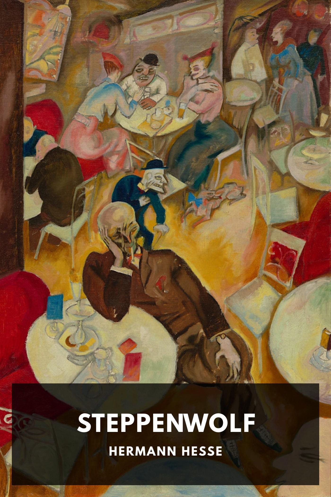](https://books.rob.me.uk/book/1810)
##### Hermann Hesse
##### psychological · surreal · identity

A fierce, hallucinatory plunge into the fractured mind of a middle-aged intellectual, Hesse’s novel became an iconic, defining text for the 1960s counter-culture. It is a radical, highly experimental critique of bourgeois conformity, exploring the terrifying, exhilarating process of destroying one's own ego.

Torn between his polite human nature and the wild instincts of a "wolf of the steppes," a suicidal writer seeks liberation. The climax occurs in a surreal, drug-fueled "Magic Theater," where bizarre, allegorical rooms force him to embrace the chaotic, multifaceted nature of his true identity.

##### Fiction, 1927, 240 pages

#### [Siddhartha](https://books.rob.me.uk/book/829)
[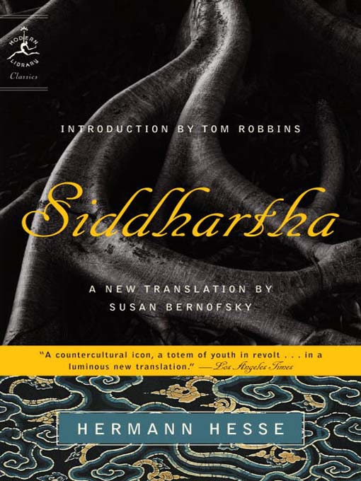](https://books.rob.me.uk/book/829)
##### Hermann Hesse
##### spiritual · journey · coming of age

This beautiful, meditative lyrical novel features a simple, elegant narrative style that follows a young man’s lifelong spiritual quest in ancient India. It is an essential, globally beloved coming-of-age text for adolescents exploring identity, rejecting rigid dogma in favor of personal experience and self-discovery.

Through a series of distinct life choices, the protagonist leaves his wealthy family to become an ascetic, transitions into a wealthy merchant, and finally becomes a humble ferryman. Mirroring a flowing river, the narrative showcases how all aspects of life—both spiritual and material—are interconnected parts of a unified whole.

##### Fiction, 1922, 150 pages

#### [The Counterfeiters](https://books.rob.me.uk/book/1811)
[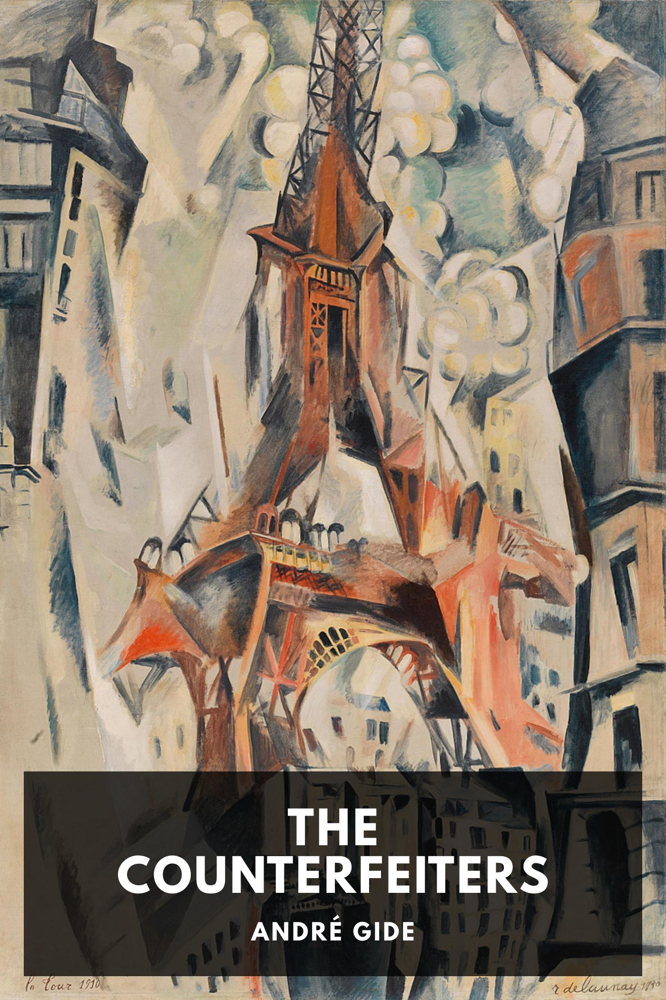](https://books.rob.me.uk/book/1811)
##### André Gide
##### meta-fiction · rebellion · deception

A dazzling, wildly complex feat of early modernist meta-fiction, Gide’s novel shatters traditional storytelling to explore the nature of truth, art, and moral hypocrisy. It is a highly intellectual, avant-garde puzzle that captures the restless, rebellious energy of Parisian youth rejecting the values of their parents.

Featuring a central character who is an author actively writing a book called *The Counterfeiters*, the narrative is incredibly innovative. A dizzying web of stolen diaries, letters, and competing perspectives tracks a group of teenagers entangled in romantic rivalries and an underground counterfeit coin ring.

##### Fiction, 1925, 400 pages

#### [The Immoralist](https://books.rob.me.uk/book/2121)

##### André Gide
##### liberation · egoism · conflict

This intense, provocative psychological novel utilizes a direct, confessional narrative style to explore the dangerous pursuit of absolute personal freedom and physical sensation. A young man rejects social expectations to embrace his true physical impulses, regardless of the cost to others, seeking liberation in sun-baked North Africa.

Catching tuberculosis on his honeymoon, a repressed scholar undergoes a psychological awakening that leads him to value physical vitality above all else. Continuous tension between his duty to his devoted wife and his growing, egoistic desires drives his transformation into a ruthless individualist.

##### Fiction, 1902, 130 pages

#### [As I Lay Dying](https://books.rob.me.uk/book/1812)
[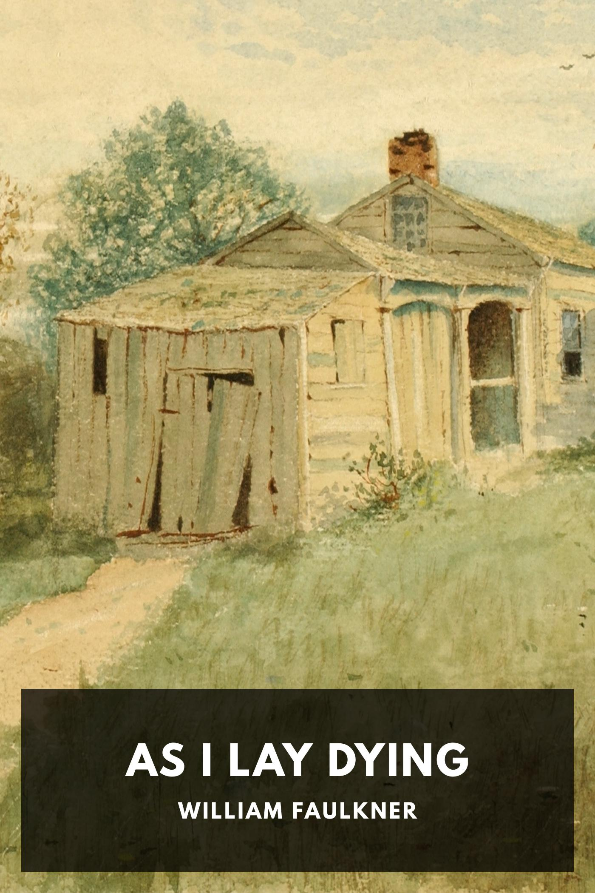](https://books.rob.me.uk/book/1812)
##### William Faulkner
##### multi-perspective · macabre · odyssey

A staggering, experimental triumph of American literature, Faulkner’s dark, tragicomic masterpiece revolutionized the narrative structure of the novel. It is a deeply unsettling, often hilarious exploration of rural poverty, grief, and the hidden, selfish motivations that drive a dysfunctional family during a crisis.

Fifty-nine fragmented interior monologues from fifteen different characters track a disastrous, flood-ravaged journey to bury the family matriarch. Stripping away all romantic illusions of family unity, the rotting corpse's journey reveals secret pregnancies, mental illness, and deep resentments.

##### Fiction, 1930, 250 pages

#### [The Sound and the Fury](https://books.rob.me.uk/book/1764)
[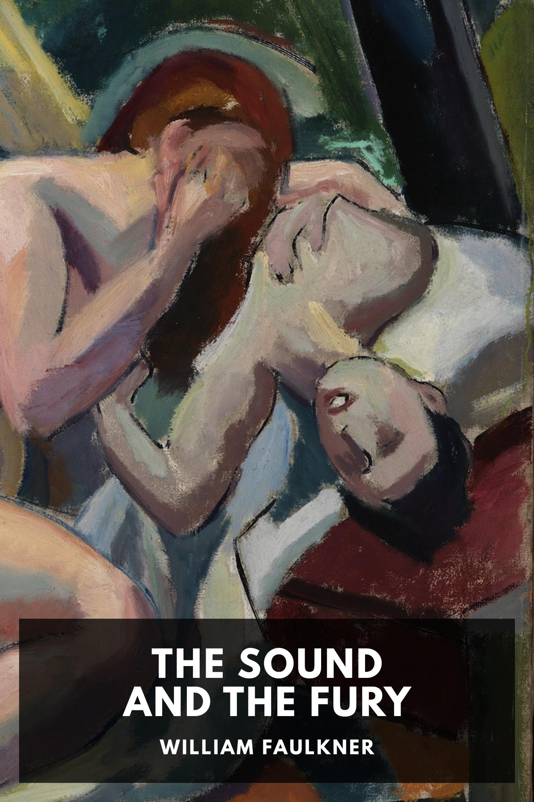](https://books.rob.me.uk/book/1764)
##### William Faulkner
##### fragmented · tragedy · decay

A towering, radical achievement of high modernism, Faulkner’s masterpiece charts the tragic, agonizing moral and financial collapse of an aristocratic Southern family. It is an intensely challenging, immensely rewarding read that brilliantly captures the inescapable, suffocating weight of history and memory.

Rigidly structured into four parts, each utilizes a different stream-of-consciousness perspective, beginning with the fragmented, non-linear thoughts of a mentally disabled brother. Circling endlessly around the loss of the rebellious sister, the reader must actively reconstruct the family's ruin from deeply unreliable narratives.

##### Fiction, 1929, 320 pages

#### Desolación
##### Gabriela Mistral
##### tragic · elegiac · maternal

This powerful, deeply emotional debut poetry collection utilizes a raw, honest narrative style to confront themes of unrequited love, death, and religious faith. It turns private tragedy into universal art, offering a vulnerable, unvarnished expression of intense personal sorrow.

Tracing an emotional journey from romantic betrayal and the suicide of a lover to a deep, protective maternal instinct, the thematic sections are striking. Frozen earth and barren trees serve as natural metaphors for internal devastation, as the speaker channels consuming grief into a compassionate creative voice.

##### Poetry, 1922, 150 pages

#### The Long Journey
##### Johannes V. Jensen
##### mythic · anthropological · epic

This ambitious, multi-volume historical epic features a grand, imaginative narrative style that seeks to retell the history of human civilization from the pre-Ice Age to the discovery of America. Focusing on early human pioneers who invent fire, tools, and navigation, it turns human survival into an inspiring adventure.

Episodic and generational, archetypal figures drive humanity forward through major technological and evolutionary shifts. Environmental challenges—such as the sudden arrival of the Ice Age—force tribes to adapt, tracing how human psychology evolves from primitive, animalistic fear into an adventurous spirit that conquers the globe.

##### Fiction, 1908, 950 pages

### Nobel Winners 1930s

#### The Good Earth
##### Pearl S. Buck
##### agrarian · survival · wealth

A deeply humane, Pulitzer-winning classic, Buck’s novel offered Western readers an unprecedented, empathetic look at the lives of ordinary Chinese peasants. It remains a gripping, universally accessible saga of survival, hard work, and the profound, stabilizing power of land ownership.

Surviving famines, bandit raids, and revolutions, a humble farmer and his resilient wife build a wealthy dynasty from nothing. Sudden urban wealth eventually corrupts the family's original agrarian values, leading the patriarch to abandon the very traditions that saved his life.

##### Fiction, 1931, 320 pages

#### [The Forsyte Saga](https://books.rob.me.uk/book/1807)
[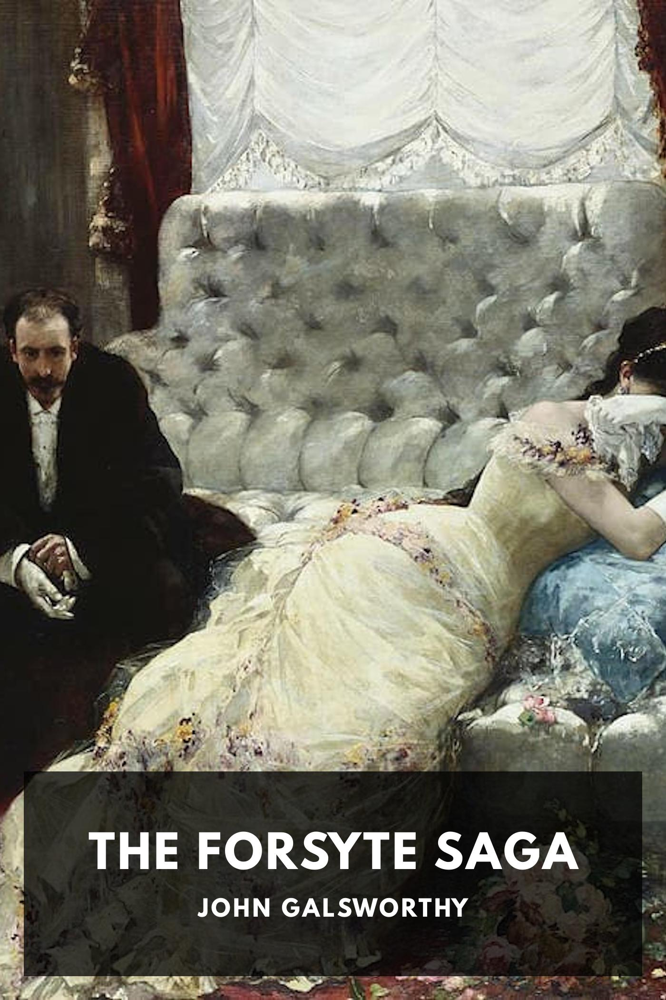](https://books.rob.me.uk/book/1807)
##### John Galsworthy
##### property · obsession · freedom

A sweeping, elegant, and deeply analytical critique of the Victorian and Edwardian upper-middle class, Galsworthy’s monumental trilogy is a staple of British social history. It is a masterful, absorbing family drama that explores the destructive nature of treating art, nature, and human beings as mere financial assets.

Organizing the plot around the building of a house, complex financial wills, and a disastrous marriage, the narrative spans decades. A wealthy solicitor viewing his sensitive wife as property sparks an intense romantic rebellion that fractures the extended family across multiple generations.

##### Fiction, 1922, 850 pages

#### [Babbitt](https://books.rob.me.uk/book/1823)
[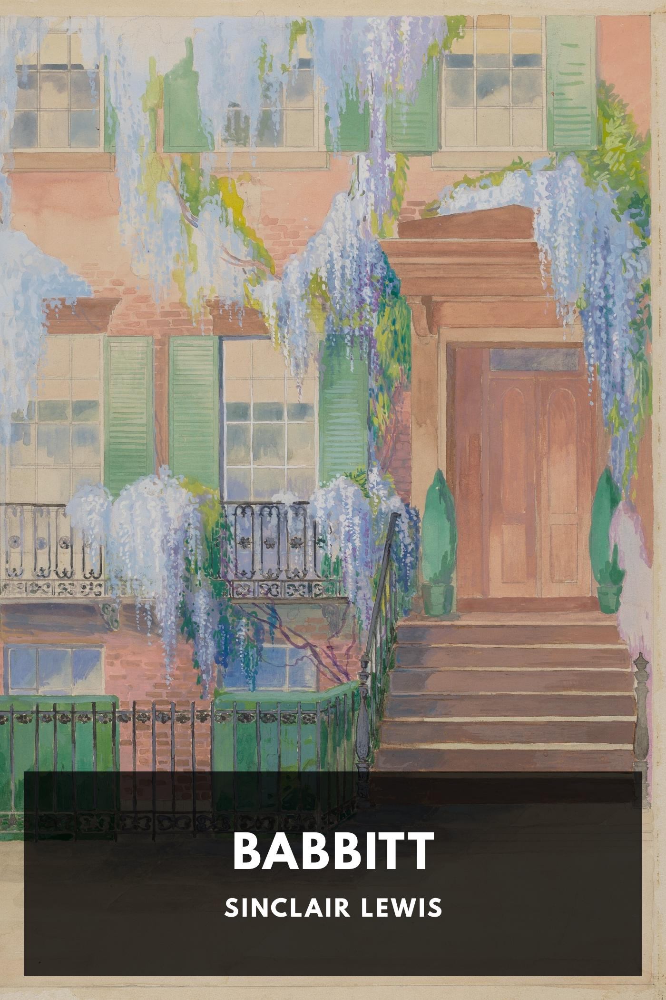](https://books.rob.me.uk/book/1823)
##### Sinclair Lewis
##### consumerism · crisis · conformity

A defining, razor-sharp satire of the American middle class, Lewis’s novel introduced a new archetype into the cultural lexicon: the blindly conforming, materially obsessed businessman. It remains a highly relevant, deeply ironic exploration of the spiritual emptiness that often accompanies spectacular commercial success.

Following the sudden loss of his best friend, a successful real estate broker briefly rebels against his conservative clubs and hypocritical church. The suffocating power of social ostracization quickly crushes his attempts at a bohemian lifestyle, forcing him back into comfortable, tragic conformity.

##### Fiction, 1922, 400 pages

#### [Main Street](https://books.rob.me.uk/book/1822)
[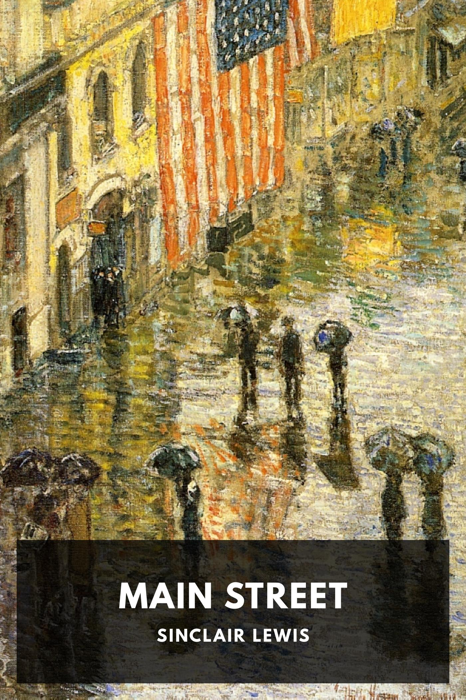](https://books.rob.me.uk/book/1822)
##### Sinclair Lewis
##### satire · conformity · rebellion

This biting social satire utilizes a sharp, observant realistic style to expose the suffocating conformity, cultural superficiality, and narrow-mindedness of small-town life. An idealistic, city-bred young woman marries a country doctor and launches a crusade to bring art and progressive ideas to an unappreciative community.

An escalating series of cultural conflicts pit the heroine against the entrenched, conservative leaders of the town. The subtle, social punishments of gossip and ostracization systematically crush individual eccentricity, forcing her to temper her grand expectations while stubbornly keeping her inner independence alive.

##### Fiction, 1920, 450 pages

#### [Six Characters in Search of an Author](https://books.rob.me.uk/book/1809)
[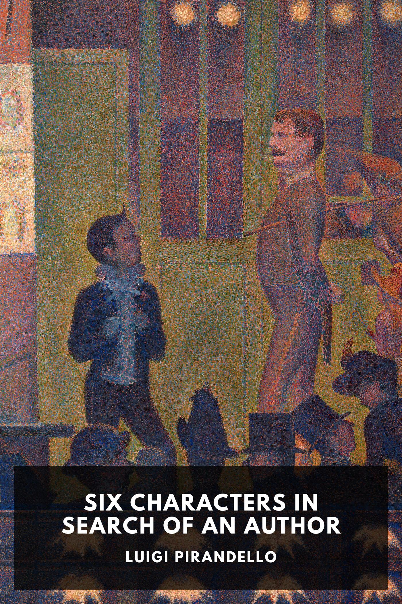](https://books.rob.me.uk/book/1809)
##### Luigi Pirandello
##### metatheatrical · identity · absurdity

This groundbreaking modernist play features a sharp, confrontational narrative style that shatters the boundaries between reality and fiction. It offers an exhilarating intellectual experience with a radical premise: six unfinished, fictional characters interrupt a real-world rehearsal, demanding that their tragic story be properly performed.

A continuous, metatheatrical argument ensues between the fictional characters demanding emotional truth, and the actors offering artificial theatrical conventions. Fragmented family arguments expose secrets of incest, poverty, and accidental death, demonstrating the author's philosophical argument that human identity is unstable and trapped by public perception.

##### Fiction, 1921, 110 pages

#### Dry Valley
##### Ivan Bunin
##### memory · gentry · ruin

This haunting, lyrical novella utilizes a dense, impressionistic prose style that explores the psychological and physical collapse of a minor noble family. It appeals to readers who appreciate gothic atmospheres, exploring inherited family trauma and the tragic obsession of a young servant girl who remains loyal to the family that destroys her.

Rejecting linear time, the story moves fluidly through memories, family legends, and ghostly encounters narrated from a generational distance. The legal and emotional legacies of serfdom continue to poison the minds of both masters and servants, turning innocent devotion into a fatalistic acceptance of a shared curse.

##### Fiction, 1912, 130 pages

#### [The Village](https://books.rob.me.uk/book/1808)
[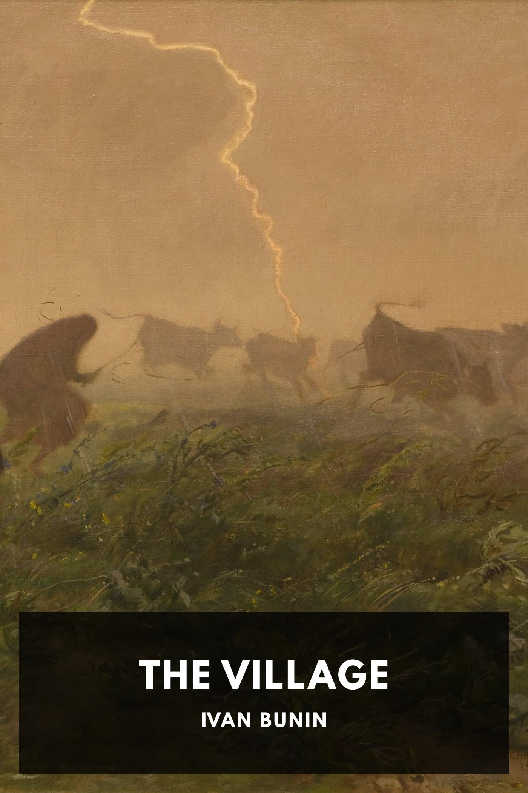](https://books.rob.me.uk/book/1808)
##### Ivan Bunin
##### bleak · rural · decay

This uncompromising, naturalistic novel features a stark, visceral prose style that strips away the romantic mythology of rural Russian life to reveal systemic poverty and ignorance. It is an intense, bleak look at the collapse of rural life before the Russian Revolution, following two brothers—a cynical merchant and a peasant poet.

Rejecting traditional romantic subplots, the story offers an episodic look at rural decay, domestic violence, and economic stagnation. Attempts to reform properties or educate neighbors are systematically crushed by the profound, historical weight of rural inertia and lack of education.

##### Fiction, 1910, 210 pages

#### Arcadia Borealis
##### Erik Axel Karlfeldt
##### pastoral · folklore · rhythm

This vibrant, rhythmic collection of regional poetry utilizes a formal, highly musical style to celebrate the landscape, traditions, and folk characters of rural Sweden. Capturing the wild energy of midsummer festivals and the quiet isolation of northern winters, it champions an untamed wilderness alongside ancient customs.

Structured around seasonal cycles and regional personas, traditional verse structures carry a driving, dance-like tempo. Detailed botanical and agricultural descriptions balance with local myths and Christian imagery, charting a consciousness that finds spiritual fulfillment within the routines of land labor.

##### Poetry, 1901, 160 pages

#### [Long Day's Journey into Night](https://books.rob.me.uk/book/2104)

##### Eugene O'Neill
##### claustrophobic · addiction · resentment

A towering, devastating masterpiece of American theater, O'Neill’s deeply autobiographical play is a searing, unvarnished look at the tragedy of inherited family trauma. It remains a grueling, essential emotional experience, exposing the toxic mix of deep love and bitter resentment that binds a family together in mutual destruction.

Unfolding over a single, fog-bound day in a summer home, four family members unravel under the influence of alcohol and morphine. A relentless cycle of attacks, confessions, and apologies slowly peels back layers of denial to reveal the inescapable ghosts of their shared past.

##### Fiction, 1956, 180 pages

#### [The Iceman Cometh](https://books.rob.me.uk/book/2124)

##### Eugene O'Neill
##### desperation · illusion · tragic

A massive, grueling, and utterly masterful tragedy, O'Neill’s play dives into the dark, alcohol-soaked depths of a New York waterfront saloon in 1912. It is a profound, pessimistic examination of the "pipe dreams"—the vital, necessary lies—that human beings construct to avoid facing the reality of their own failures.

Long, winding monologues fill the time as patrons drink themselves into a stupor, waiting for the arrival of a charismatic salesman known for his wild parties. The devastating twist occurs when the salesman arrives sober, demanding the characters face the truth, a psychological intervention that violently strips them of their will to live.

##### Fiction, 1946, 260 pages

### Nobel Winners 1920s

#### [The Winding Stair and Other Poems](https://books.rob.me.uk/book/2123)

##### W. B. Yeats
##### spiritual · sensual · duality

A lush, musical, and fiercely passionate collection of late-career poetry, this volume serves as the sensual, earthly counterpoint to the intellectual severity of *The Tower*. It is a masterpiece of modernist verse, famously wrestling with the dualities of youth and age, action and contemplation, and the soul and the body.

Frequently employing dialogues and paired poems, the poet debates his own philosophical conflicts from multiple angles. Relying heavily on the symbol of the spiral staircase, the verses boldly choose to embrace the messy, beautiful cycle of human reincarnation over sterile perfection.

##### Poetry, 1933, 130 pages

#### [The Tower](https://books.rob.me.uk/book/2122)

##### W. B. Yeats
##### mystical · aging · mythology

Written during a period of intense civil war and personal health crises, this collection marks the absolute peak of Yeats's high-modernist period. It is a towering cultural artifact, blending Irish mythology, occult philosophy, and fierce political anger into a majestic defense of the enduring power of art.

Driving, intricate meters contrast the physical decay of the poet's aging body with the immortal monuments of intellect. Furiously rejecting the limitations of the physical world, the speaker constructs an eternal sanctuary out of visionary language.

##### Poetry, 1928, 110 pages

#### [The Magic Mountain](https://books.rob.me.uk/book/1742)
[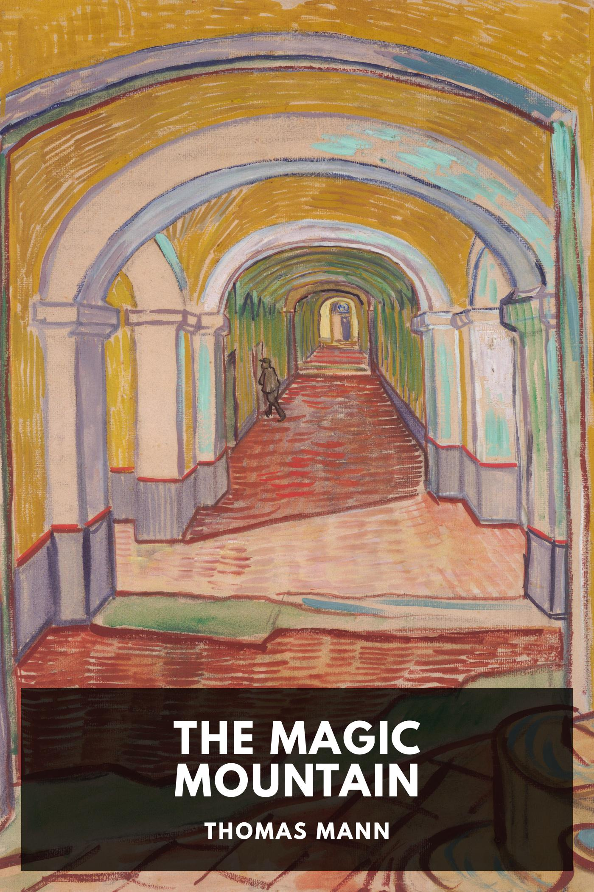](https://books.rob.me.uk/book/1742)
##### Thomas Mann
##### intellectual · isolation · transition

A towering, encyclopedic masterpiece of high modernism, Mann’s novel turns an isolated Swiss tuberculosis sanatorium into a brilliant, ironic microcosm of European civilization on the brink of World War I. It is a deeply philosophical, patient coming-of-age story where the adventures are entirely intellectual.

Visiting his cousin for three weeks, a young engineer is seduced by the timeless, sterile routines of illness, ultimately staying for seven years. Massive, brilliant philosophical debates between patients battle for his soul as society outside hurtles toward disaster.

##### Fiction, 1924, 720 pages

#### [Buddenbrooks](https://books.rob.me.uk/book/1784)
[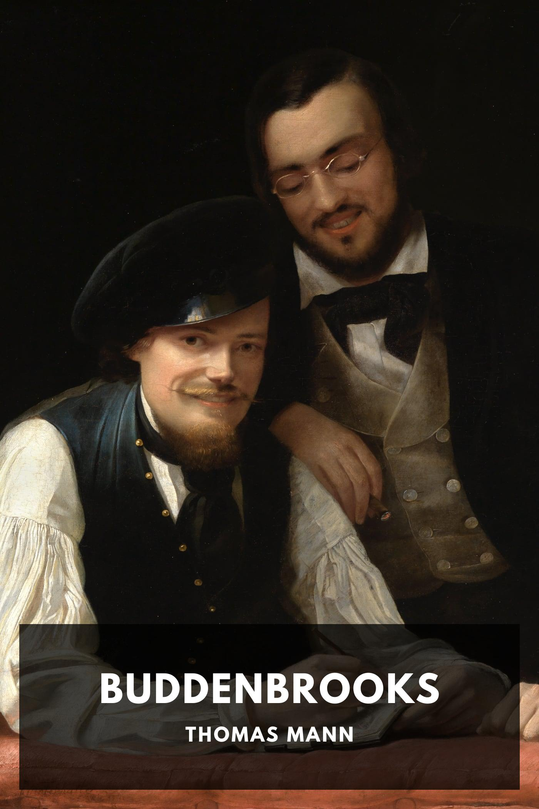](https://books.rob.me.uk/book/1784)
##### Thomas Mann
##### decline · family · bourgeois

This rich, classic family saga utilizes an objective, realistic narrative style seasoned with sharp irony to document the multi-generational decline of a wealthy merchant family. It explores the relatable conflict between family duty and the individual desire for self-expression, shifting from affluent bourgeois security to artistic alienation and financial ruin.

Organized chronologically across four generations, the story details how the hyper-focused commercial drive of the founders slowly erodes into neurological fragility in their descendants. Ledger balances and arranged marriages are weighed against individual happiness, as characters surrender their passions to protect a firm destined to fail.

##### Fiction, 1901, 750 pages

#### [Saint Joan](https://books.rob.me.uk/book/1821)
[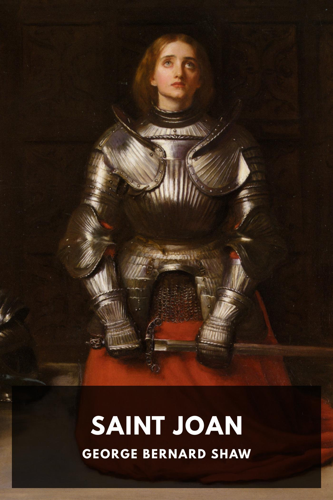](https://books.rob.me.uk/book/1821)
##### George Bernard Shaw
##### provocative · ideological · martyrdom

A brilliant, sharply intellectual subversion of historical myth, Shaw’s play rescues Joan of Arc from both religious sentimentality and romantic tragedy. It is a fierce, highly provocative drama that portrays Joan as an early Protestant rebel and a dangerous, fiercely intelligent threat to the medieval world order.

Replacing traditional battlefield action with extended, dazzling ideological debates, the play pits Joan against the Church, the feudal aristocracy, and emerging nationalism. Her uncompromising individuality demonstrates how entrenched institutions are structurally forced to execute anyone who threatens their systemic authority.

##### Fiction, 1923, 160 pages

#### [Pygmalion](https://books.rob.me.uk/book/1820)
[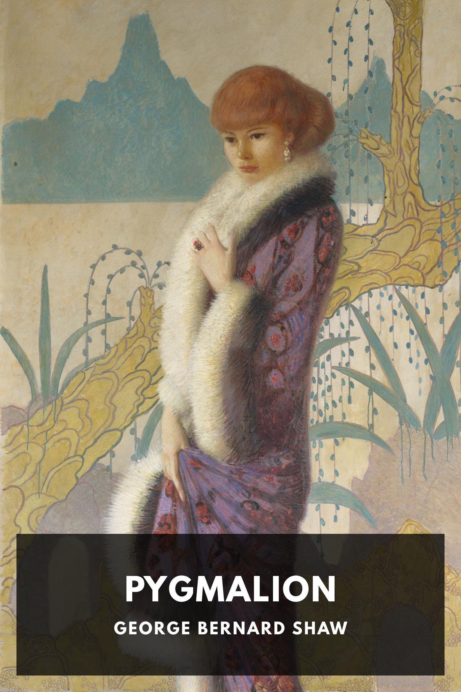](https://books.rob.me.uk/book/1820)
##### George Bernard Shaw
##### witty · class · independence

This sharp, hilarious social comedy features a swift, intellectual dialogue style that skewers class pretension and societal hypocrisy. The transformation of a working-class flower girl into a refined lady becomes a fierce critique of the elite drawing rooms of Edwardian London.

A brilliant but arrogant phonetics professor bets he can pass off a flower girl as a duchess simply by changing her speech. Subverting traditional romance tropes, the heroine develops a fierce self-worth and class consciousness, demanding respect on her own terms and refusing to be a passive experiment.

##### Fiction, 1913, 150 pages

#### [Kristin Lavransdatter](https://books.rob.me.uk/book/2103)

##### Sigrid Undset
##### historical · epic · rebellion

This epic historical trilogy utilizes a sweeping, meticulously detailed narrative style to present the life of a strong-willed woman in fourteenth-century Norway. It captures the physical hardships, political rivalries, and religious devotion of medieval Scandinavia, centered on a passionate heroine who risks her family’s honor to marry the unstable warrior she loves.

Divided into three parts, the plot traces her rebellious youth, her complex marriage and motherhood, and her final years during the Black Death. Grounded in absolute historical accuracy, it maps the laws of land ownership, kinship obligations, and the friction between old pagan beliefs and Catholic theology.

##### Fiction, 1920, 1100 pages

#### Reeds in the Wind
##### Grazia Deledda
##### fatalistic · honor · redemption

This haunting, lyrical novel uses a vivid regionalist narrative style to portray the lives of three impoverished noble sisters in a remote Sardinian village. It explores the struggle to maintain personal dignity and family honor against a backdrop of inexorable economic decline, set within a landscape of windswept hills, ruins, and local spirits.

Anchored by an aging, deeply loyal family servant whose secret past guilt drives his dedication to his mistresses, the story is deeply superstitious. Rigid social hierarchies, unwritten blood codes, and a pervasive belief in fate leave little room for individual freedom on the exhausting journey toward moral penance.

##### Fiction, 1913, 220 pages

#### The Peasants
##### Władysław Reymont
##### visceral · agrarian · community

This massive, visceral epic novel uses a dense, naturalistic narrative style to portray the life of a small Polish village across the span of a single year. It centers on an intense, tragic family drama involving a wealthy patriarch, his rebellious son, and the beautiful, free-spirited young woman they both desire.

Rigidly structured into four parts named after the seasons, the weather dictates the labor, diet, and emotional lives of the entire cast. The communal laws of the village punish individual passion and non-conformity to protect the economic security of the land, crushing individuals who clash with unyielding customs.

##### Fiction, 1909, 900 pages

#### [Growth of the Soil](https://books.rob.me.uk/book/1817)
[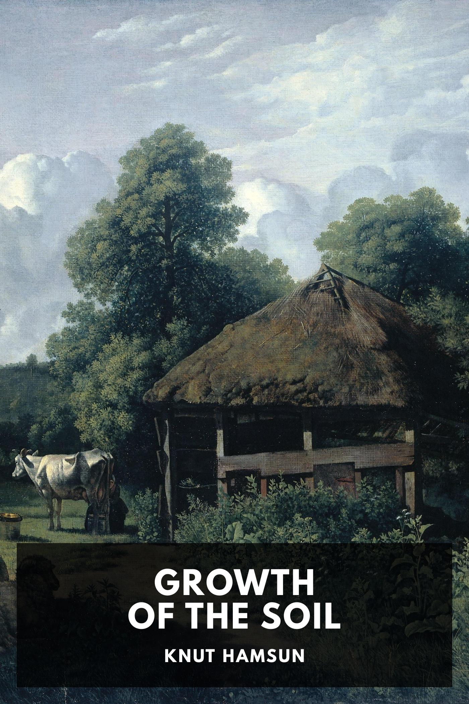](https://books.rob.me.uk/book/1817)
##### Knut Hamsun
##### primitive · isolation · endurance

This monumental, elemental novel employs a deliberate, rhythmic, and simple narrative style that celebrates the bond between human beings and the earth. It offers a grounding, meditative experience that finds survivalist satisfaction in building a life from scratch out of absolute nothingness, relying entirely on physical labor and patience.

Following the steady expansion of a single homestead founded by a mute, rugged pioneer, the plot relies on the slow, rewarding cycles of nature. Corrupting, anxious distractions of the modern industrial towns slowly creep closer to the wilderness, testing characters shaped entirely by the work they perform.

##### Fiction, 1917, 430 pages

#### [Penguin Island](https://books.rob.me.uk/book/1818)
[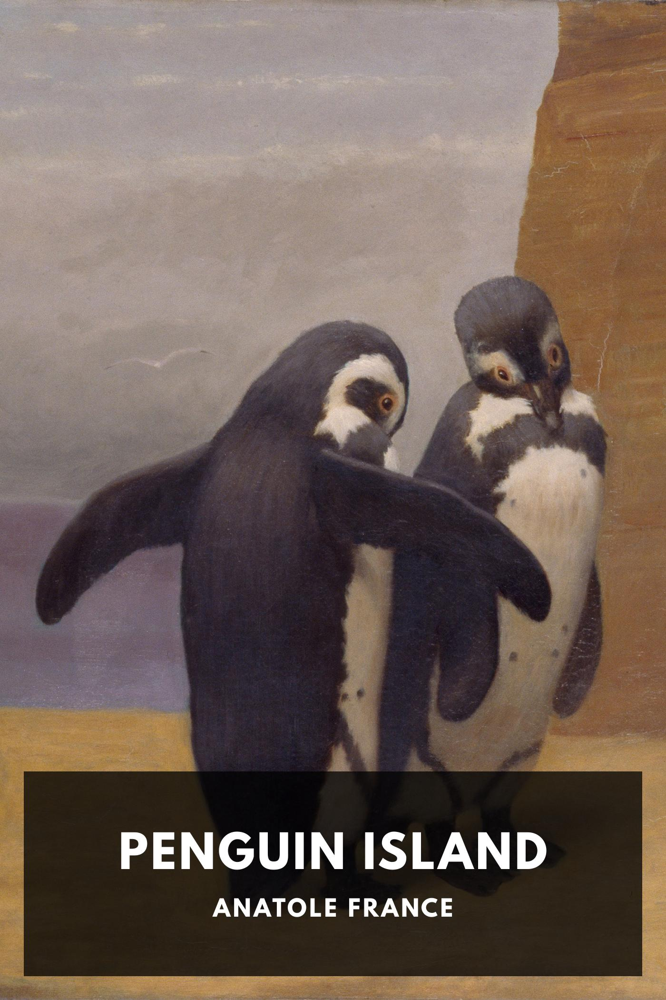](https://books.rob.me.uk/book/1818)
##### Anatole France
##### satirical · cynical · absurdity

This razor-sharp satirical allegory utilizes a witty, mock-heroic narrative style to chart the history of human civilization through a fictional island of birds. It dismantles established national myths, religious superstitions, and political scandals, exposing the absurd foundations of societal power.

Beginning with a senile monk who accidentally baptizes a flock of penguins, heaven is forced to grant them human souls and histories. Systematically recreating historical eras, from the Middle Ages to a hyper-capitalist future, the society evolves from primitive tribalism to an automated, self-destructive modern empire.

##### Fiction, 1908, 290 pages

#### The Red Room
##### Anatole France
##### intellectual · artistic · disillusionment

This clever, cynical satire features an ironic, observant narrative style that takes aim at the pretentious artistic salons, radical political clubs, and corrupt financial networks of la